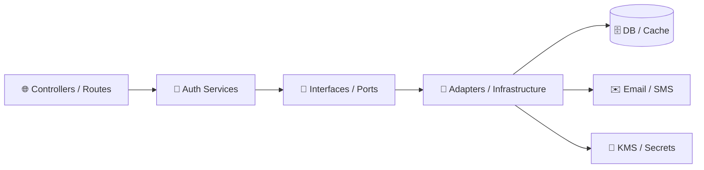
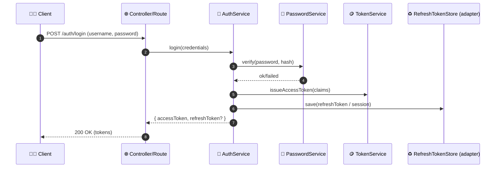
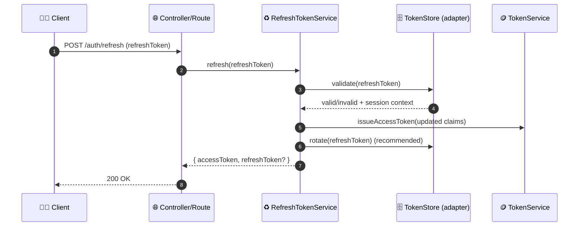
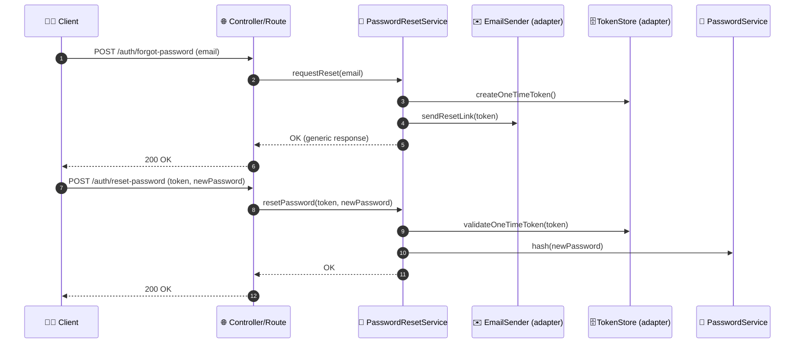

# 🔐 Auth Services (`api/src/auth/services/`)


> **Purpose:** This folder contains the **core authentication + authorization use-cases** for the API.  
> Controllers/routes call into these services; services coordinate **tokens, credentials, roles/permissions, and policy checks** while staying as framework-agnostic and testable as possible. 🧩

---

## 🧭 Quick Navigation

- ⬆️ Back to Auth module: `api/src/auth/`
- 🧪 Tests (typical): `api/src/auth/**/__tests__/` or `api/tests/auth/`
- 🧱 Repositories / persistence (typical): `api/src/**/repository/`
- 🧰 Shared utilities (typical): `api/src/**/utils/`

> If your repo structure differs, keep the **dependency direction** the same: **API layer ➜ Services ➜ Interfaces ➜ Infrastructure**.

---

## ✅ What belongs in `services/`

### Core auth use-cases 🪪
- **Login**: verify credentials, enforce lockout/rate limits, issue access token
- **Token verification**: validate signature + expiry, parse claims
- **Refresh session**: refresh-token flow (rotation recommended)
- **Password security**: hashing + verifying + policy checks
- **Password reset**: one-time reset token → set new password
- **MFA hooks**: challenge/verify for high-privilege accounts
- **Authorization checks**:
  - RBAC (role-based access control)
  - resource ownership checks (e.g., “can user X access field Y?”)
  - operational access levels for sensitive actions (“admin-only”, “system-only”)
- **Service-to-service auth**: internal service token verification (if applicable)

### Cross-cutting concerns (auth-safe) 🧾
- Emit **audit-friendly events** (successful login, failed login, token refresh)  
  ✅ without leaking secrets, raw tokens, or passwords

---

## 🚫 What does NOT belong here

- ❌ HTTP request/response objects (Express/Fastify/Nest/FastAPI/etc.)
- ❌ Direct DB queries / ORM calls (use repositories/adapters)
- ❌ Vendor SDK calls (email/SMS/MFA providers) — those are adapters
- ❌ Reading env vars ad-hoc (inject config instead)
- ❌ Logging secrets (passwords, reset tokens, JWTs, refresh tokens)

---

## 🏗️ Architecture at a glance



### 🔑 Dependency rule
Services should depend on **interfaces**, not concrete frameworks or vendors. This keeps auth logic portable, testable, and replaceable.

---

## 📦 Typical service breakdown (example layout)

> Names vary by stack — this is a **suggested** split that matches our use-cases.

```text
📁 api/src/auth/services/
├── 🔐 auth.service.*              # orchestrates login/logout + high-level flows
├── 🪙 token.service.*             # issue/verify access tokens (JWT)
├── ♻️ refresh-token.service.*      # refresh token lifecycle (rotate, revoke, store)
├── 🔑 password.service.*          # hash/verify + password policy
├── 🧷 password-reset.service.*     # issue + verify one-time reset tokens
├── 🧿 mfa.service.*               # optional MFA flows (challenge/verify)
├── 🛡️ access-control.service.*     # RBAC, ownership checks, access levels
└── 📦 index.*                     # exports (optional)
```

---

## 🧩 Service contracts (recommended conventions)

### Inputs/Outputs 🎛️
- Prefer **explicit DTOs** (data transfer objects) over passing full user objects everywhere.
- Return **typed results**, e.g.:
  - `Result<Success, AuthError>`
  - `{ ok: true, data } | { ok: false, error }`

### Errors 🧯
Define auth-specific error types so callers can map them to HTTP consistently:
- `InvalidCredentials`
- `AccountLocked`
- `MfaRequired`
- `MfaInvalid`
- `TokenExpired`
- `TokenInvalid`
- `Forbidden`
- `NotFound` (careful—avoid user enumeration)
- `RateLimited`

### Sensitive-data policy 🕵️
- Never return password hashes, reset tokens, raw refresh tokens, or internal secrets.
- Logs must never contain secrets. If you must trace, log **event IDs** and safe metadata only.

---

## 🔁 Common flows

### 1) Login 🔓



**Notes 📝**
- Enforce rate-limits / lockout before and/or after password verification.
- If account requires MFA: return `MfaRequired` + challenge metadata (no secrets).

---

### 2) Refresh session ♻️



**Rotation tip ✅**  
Refresh tokens should be **long-lived**, stored securely, and ideally **rotated** to reduce replay risk.

---

### 3) Password reset ✉️



**Anti-enumeration rule 🕶️**  
`forgot-password` should return the same response whether the email exists or not.

---

### 4) Authorization checks 🛡️

Common patterns:
- **RBAC**: `user.roles ⟶ permissions`
- **Ownership**: `resource.ownerId == user.id` (or org-based checks)
- **Operational Access Levels**: some endpoints require elevated levels beyond normal role checks

> Keep these checks centralized (e.g., `AccessControlService`) so policies don’t fragment across controllers.

---

## 🧷 Security & privacy checklist (when changing auth logic)

### Transport & sessions 🌐
- ✅ HTTPS-only for login and token exchange
- ✅ Validate token signature + expiry on every protected request
- ✅ Keep access tokens short-lived; refresh tokens long-lived + protected
- ✅ Prefer HttpOnly cookies for refresh tokens when feasible (stack-dependent)

### Credentials 🔑
- ✅ Strong hashing (bcrypt/Argon2)
- ✅ Rate-limiting + account/IP lockout for repeated failures
- ✅ Password reset uses one-time tokens + expiry
- ✅ MFA for admin/sensitive accounts (recommended)

### Authorization 🛡️
- ✅ Least privilege by default
- ✅ Return `403 Forbidden` when role/ownership checks fail
- ✅ Avoid leaking resource existence through error differences

### Privacy & ethics 🧠
- ✅ Data minimization (store only what you need)
- ✅ Audit for accountability without invasive surveillance
- ✅ Don’t put sensitive personal data into JWT claims unless absolutely required

---

## 🧪 Testing guidance

### Unit tests (fast) ⚡
- Mock repositories/adapters:
  - user repository
  - token store
  - email sender
  - MFA provider
- Test success/failure paths:
  - invalid credentials
  - lockout triggers
  - token expiry
  - refresh rotation
  - forbidden access

### Integration tests (realistic) 🧪
- Verify token middleware/guards + service logic together
- Validate DB constraints around sessions/refresh tokens
- Include replay attempts and rotation behavior

---

## ➕ Adding a new auth service (pattern)

1. 🧩 Define the **use-case** clearly (single responsibility).
2. 📜 Define the **interfaces/ports** needed (repo, token store, email, etc.).
3. 🧪 Write unit tests with fakes/mocks first (or alongside).
4. 🔌 Wire the service into controllers/routes in the outer layer.
5. 🧾 Add audit events (safe metadata only).
6. ✅ Run through the Security & privacy checklist above.

---

## 📚 Design references

- `Kansas Frontier Matrix (KFM) – Comprehensive Technical Documentation.pdf`
- `Introduction to Digital Humanism.pdf`
- `clean-architectures-in-python.pdf`

