# 🔐🧪 Auth Request Fixtures (Tests)


> ⚠️ **Test-only inputs.** Everything under `fixtures/requests/` is meant for automated tests (unit/integration/e2e) — not production code.

---

## 📦 What this folder is

This directory holds **canonical request payloads** used by the Auth test-suite.

Why we keep them here:
- ✅ **Consistency**: the same “login valid” payload can be reused across multiple tests.
- ✅ **Less duplication**: tests stay focused on *behavior* and *assertions*, not retyping JSON.
- ✅ **Readable diffs**: changes to request shapes show up as clean fixture diffs in PRs.

---

## 🗂️ Where this sits in the project

```text
📁 api/
└─ 📁 src/
   └─ 📁 auth/
      └─ 📁 tests/
         └─ 📁 fixtures/
            ├─ 📁 requests/   👈 you are here
            │  └─ 📄 README.md
            └─ 📁 responses/  (if present) expected API outputs for assertions
```

---

## 🧱 Fixture philosophy

### 1) Requests are “inputs” (not test logic)
Fixtures should be:
- **Static** where possible (deterministic values)
- **Minimal** (only required fields unless a test is specifically about optional fields)
- **Scenario-named** (the filename tells you the reason it exists)

### 2) Fixtures should be safe to share
- 🚫 No real emails, API keys, JWT secrets, refresh tokens, or personal data
- ✅ Use reserved domains like `example.com`
- ✅ Use obvious fake values (`"P@ssw0rd!"`, `"000000"`, `"fake-refresh-token"`) unless the test requires realistic constraints

---

## 🏷️ Naming conventions

We prefer filenames that read like **test case titles**.

### ✅ Recommended patterns

| Pattern | Example | Use when |
|---|---|---|
| `<action>.valid.json` | `login.valid.json` | The “happy path” |
| `<action>.missing-<field>.json` | `login.missing-password.json` | Required-field validation |
| `<action>.invalid-<reason>.json` | `register.invalid-email.json` | Format / constraint validation |
| `<action>.edge-<case>.json` | `password-reset.edge-weak-password.json` | Edge cases and boundary tests |
| `<action>.locked.json` / `.disabled.json` | `login.locked.json` | Account-state flows |

### 🧩 Subfolders (optional, if it grows)

If this directory gets large, split by operation:

```text
📁 requests/
├─ 📁 login/
├─ 📁 register/
├─ 📁 tokens/
└─ 📁 password/
```

---

## 🔌 Using fixtures in tests

Below are common usage patterns. Pick the one that matches our test runner + build setup.

### Option A: Import JSON directly (TypeScript)

✅ Works when `tsconfig.json` enables `resolveJsonModule` and `esModuleInterop`.

```ts
import request from "supertest";
import app from "../../app";

// TS/Node will load JSON as an object if configured
import loginValid from "../fixtures/requests/login.valid.json";

it("logs a user in", async () => {
  const res = await request(app)
    .post("/auth/login")
    .send(loginValid)
    .expect(200);

  expect(res.body).toHaveProperty("accessToken");
});
```

### Option B: Read JSON via filesystem (runtime-safe)

✅ Works in any Node test environment.

```ts
import fs from "node:fs";
import path from "node:path";

const fixture = (name: string) =>
  JSON.parse(
    fs.readFileSync(path.join(__dirname, "../fixtures/requests", name), "utf8")
  );

it("rejects invalid credentials", async () => {
  const payload = fixture("login.invalid-password.json");
  // ... send payload
});
```

### Option C: Export a typed fixture index (when using `.ts` fixtures)

✅ Useful if you want types, computed fields, or “template fixtures”.

```ts
// requests/index.ts
export const loginValid = { email: "user@example.com", password: "P@ssw0rd!" } as const;
export const loginMissingPassword = { email: "user@example.com" } as const;
```

---

## 🧾 Canonical auth request shapes (examples)

> These examples are **reference templates**. Only create fixture files for endpoints that exist in our Auth module.

<details>
<summary>📌 Login (JWT access token)</summary>

```json
{
  "email": "user@example.com",
  "password": "P@ssw0rd!"
}
```

**Common variants**
- `login.missing-email.json`
- `login.missing-password.json`
- `login.invalid-password.json`
- `login.locked.json` (if account lockout is implemented)
</details>

<details>
<summary>🔄 Refresh token</summary>

```json
{
  "refreshToken": "fake-refresh-token"
}
```

**Common variants**
- `refresh.missing-refreshToken.json`
- `refresh.expired.json`
- `refresh.revoked.json`
</details>

<details>
<summary>🆕 Register / sign up</summary>

```json
{
  "email": "new.user@example.com",
  "password": "P@ssw0rd!",
  "displayName": "New User"
}
```

**Common variants**
- `register.invalid-email.json`
- `register.weak-password.json`
- `register.duplicate-email.json`
</details>

<details>
<summary>📨 Forgot password</summary>

```json
{
  "email": "user@example.com"
}
```

**Common variants**
- `forgot-password.unknown-email.json`
- `forgot-password.invalid-email.json`
</details>

<details>
<summary>🔁 Reset password (token + new password)</summary>

```json
{
  "token": "fake-reset-token",
  "newPassword": "N3wP@ssw0rd!"
}
```

**Common variants**
- `reset-password.invalid-token.json`
- `reset-password.expired-token.json`
- `reset-password.weak-password.json`
</details>

<details>
<summary>✅ Email verification (token)</summary>

```json
{
  "token": "fake-email-verify-token"
}
```

**Common variants**
- `verify-email.invalid-token.json`
- `verify-email.expired-token.json`
</details>

<details>
<summary>🔐 MFA (if supported)</summary>

```json
{
  "otp": "000000"
}
```

**Common variants**
- `mfa.invalid-otp.json`
- `mfa.expired-otp.json`
</details>

---

## 🧭 How fixtures flow through tests (mental model)

```mermaid
flowchart LR
  A["📄 Fixture JSON/TS"] --> B["🧪 Test Case"]
  B --> C["🌐 HTTP Client (supertest / fetch)"]
  C --> D["🔐 Auth Route / Controller"]
  D --> E["⚙️ Auth Service / Use Case"]
  E --> F["📦 Response"]
  F --> G["✅ Assertions"]
```



---

## ✅ Adding a new request fixture (checklist)

- [ ] Pick a **clear filename** that describes the scenario (see naming rules above)
- [ ] Keep the payload **minimal** (only fields relevant to the test)
- [ ] Avoid secrets / PII (use fake emails + placeholders)
- [ ] If the request needs dynamic values (tokens/ids), prefer:
  - creating a **template fixture** + patching fields in the test, or
  - storing placeholders like `"<<TOKEN>>"` and replacing at runtime
- [ ] If you add many fixtures, consider introducing subfolders (`login/`, `password/`, etc.)
- [ ] Run the full auth test suite after changes ✅

---

## 🧯 Common pitfalls

- **Fixture drift**: the API contract changes but fixtures don’t → tests fail in confusing ways  
  ✅ Fix: update fixtures as part of the same PR that changes request validation.
- **Overstuffed fixtures**: payloads contain fields not required for the test  
  ✅ Fix: keep fixtures focused; create a separate “full payload” fixture if needed.
- **Non-determinism**: random emails/UUIDs cause flaky snapshots or DB collisions  
  ✅ Fix: use stable fake IDs or seeded generators in tests.

---

## 🔗 Related (nearby) fixtures

- 📁 `../responses/` — expected JSON responses (if present)
- 📁 `../headers/` — common auth headers (if present)
- 📁 `../db/` or `../seed/` — deterministic test users / seed data (if present)

---

### 🧠 Tiny rule of thumb

> If a request payload is reused more than **twice**, it probably belongs in `fixtures/requests/`. ✨

