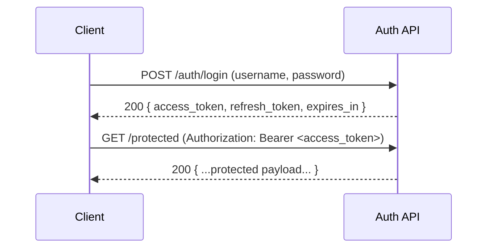

# 🔐 Login Response Fixtures


These fixtures are the **canonical response payloads** for the **Login/Auth** flow.  
They power deterministic tests by making API responses **stable, reviewable, and reusable** ✅

---

## 📁 Folder map

```text
📁 api/
  📁 src/
    📁 auth/
      📁 tests/
        📁 fixtures/
          📁 responses/
            📁 login/
              📄 README.md   👈 you are here
              📄 *.json      ✅ response fixtures (success + error cases)
```

---

## 🎯 What belongs here (and why)

This directory contains **response bodies only** (JSON fixtures) for the login endpoint.

Use these fixtures when tests need to:
- ✅ assert **contract/shape** of the login response
- ✅ verify **status-code ↔ payload** pairing
- ✅ snapshot responses without baking in flaky fields (timestamps, random IDs, real tokens)
- ✅ keep auth tests readable (fixtures become “test vocabulary”)

> [!TIP]
> If your test reads like: “when invalid credentials → return 401 + `invalid_credentials` payload”,  
> you’re using fixtures correctly. 🧠

---

## 🔑 Expected login response contract (high-level)

A successful login response typically includes:
- `access_token` (JWT or equivalent token string)
- `token_type` (usually `"bearer"`)
- `expires_in` (seconds until expiry)  
- optionally: `refresh_token`
- optionally: a minimal `user` object (id / roles / email)

Error responses typically include:
- a stable `error` code (machine-friendly)
- a human `message` (human-friendly)
- optionally: `details` for validation errors

---

## 📦 Fixture naming & organization

Keep fixtures discoverable and intention-revealing.

### ✅ Recommended filename patterns

Pick **one** style and stay consistent:

- **Status-first:** `200.success.json`, `401.invalid-credentials.json`, `429.rate-limited.json`
- **Scenario-first:** `success.200.json`, `invalid-credentials.401.json`, `rate-limited.429.json`

> [!NOTE]
> If your repo already has a fixture naming convention, follow it (and update this README if needed).

---

## 🧩 Suggested fixture inventory

| Scenario 🧪 | Status | Fixture file (suggested) 📄 | Notes |
|---|---:|---|---|
| Successful login | `200` | `200.success.json` | Includes tokens + expiry |
| Invalid credentials | `401` | `401.invalid-credentials.json` | Avoid user enumeration |
| Missing/invalid input | `400` | `400.validation.json` | Field-level errors if used |
| Account disabled / forbidden | `403` | `403.forbidden.json` | Roles/locked account |
| Rate-limited | `429` | `429.rate-limited.json` | Brute-force mitigation |

---

## 🧼 Stability rules (what *must* be deterministic)

### ✅ OK to assert exactly (should be stable)
- keys/shape of the payload
- `token_type`
- `expires_in` (if defined as a constant)
- error `code` / error `message` (if intentionally stable)

### ⚠️ Avoid asserting exactly (often unstable)
- real JWT contents (signature, issued-at, nonce)
- timestamps like `iat`, `exp` inside tokens
- request IDs / correlation IDs (unless stubbed)
- dynamic user IDs (unless fixture data controls it)

> [!IMPORTANT]
> **Never commit real secrets** (real tokens, passwords, API keys).  
> Fixtures must be **synthetic** and safe for public exposure. 🛡️

---

## 🧾 Example payloads (templates)

### ✅ Success (example shape)

```json
{
  "access_token": "jwt.fixture.access.v1",
  "token_type": "bearer",
  "expires_in": 3600,
  "refresh_token": "jwt.fixture.refresh.v1",
  "user": {
    "id": "user_fixture_001",
    "email": "user@example.com",
    "roles": ["user"]
  }
}
```

### ❌ Invalid credentials (example shape)

```json
{
  "error": "invalid_credentials",
  "message": "Invalid username or password."
}
```

### ⏳ Rate limited (example shape)

```json
{
  "error": "rate_limited",
  "message": "Too many login attempts. Please try again later."
}
```

---

## 🔁 Login flow at a glance



---

## 🧪 Using fixtures in tests

<details>
<summary><strong>🐍 Python / Pytest-style example</strong></summary>

```python
from pathlib import Path
import json

FIXTURES_DIR = Path(__file__).parent / "fixtures" / "responses" / "login"

def load_fixture(filename: str) -> dict:
    return json.loads((FIXTURES_DIR / filename).read_text(encoding="utf-8"))

def test_login_success(client):
    expected = load_fixture("200.success.json")

    resp = client.post("/auth/login", json={"username": "demo", "password": "demo"})
    assert resp.status_code == 200
    assert resp.json() == expected
```
</details>

<details>
<summary><strong>🟦 Node / Jest + Supertest-style example</strong></summary>

```ts
import fs from "node:fs";
import path from "node:path";
import request from "supertest";

const FIXTURES_DIR = path.join(__dirname, "fixtures", "responses", "login");

function loadFixture(name: string) {
  return JSON.parse(fs.readFileSync(path.join(FIXTURES_DIR, name), "utf8"));
}

test("login success", async () => {
  const expected = loadFixture("200.success.json");

  const res = await request(app)
    .post("/auth/login")
    .send({ username: "demo", password: "demo" });

  expect(res.status).toBe(200);
  expect(res.body).toEqual(expected);
});
```
</details>

---

## ✅ Definition of Done (DoD) for adding/changing fixtures

- [ ] Fixture filename follows the directory convention
- [ ] Payload is deterministic (no real secrets, no randomness)
- [ ] Error fixtures use stable `error` codes
- [ ] If you added a new scenario, you added/updated a matching test
- [ ] CI passes (unit + integration)
- [ ] README updated if contract or naming changed

---

## 🔗 Related folders

- 🔒 `api/src/auth/` — auth module
- 🧪 `api/src/auth/tests/` — auth test suite
- 🧩 `api/src/auth/tests/fixtures/` — shared test fixtures

