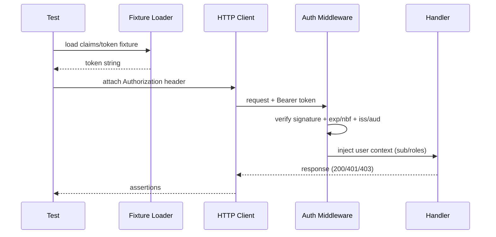

> According to a document from **2025-12-17**, KFM’s repo standards assume **strict CI validation + secret scanning**, so anything that *looks* like a real token must be treated as sensitive—even in tests. [^kfm-ci] [^kfm-doc-date]

# 🔐 Token Fixtures (Auth Tests)


This folder contains **deterministic, synthetic token fixtures** used by `api/src/auth/tests` to validate authentication & authorization behavior.

KFM’s security model is JWT-based: the backend issues **signed JWTs** (containing user identity + roles), with **expiring access tokens** and a **refresh-token mechanism** to keep sessions alive. [^kfm-auth]

---

## 🧭 Quick goals

- ✅ Make auth tests **repeatable** (no flaky time drift / random IDs)
- ✅ Cover both **happy path** and **failure modes**
- ✅ Keep fixtures **safe to commit** (no production secrets; no real users)
- ✅ Keep fixtures **easy to regenerate** when claims/contracts change

---

## 🗂️ Folder intent & recommended layout

> Your repo may have a slightly different layout—this README documents the **intended contract** for what belongs here.

```text
api/src/auth/tests/fixtures/tokens/
├── README.md
├── claims/                       # ✅ Preferred: claim templates (JSON)
│   ├── access__admin.json
│   ├── access__researcher.json
│   ├── access__farmer.json
│   ├── access__missing_role.json
│   └── refresh__valid.json
├── keys/                         # ✅ Test-only signing material (never prod)
│   ├── jwt_test_private.pem      # (if using RS256/ES256)
│   └── jwt_test_public.pem
└── serialized/                   # ⚠ Optional: prebuilt JWT strings (see notes)
    ├── access__expired.jwt
    ├── access__bad_signature.jwt
    └── access__wrong_audience.jwt
```

### Why `claims/` first?
Storing **claim templates** and generating tokens at runtime avoids:
- accidental “secret-like” blobs being committed,
- fixtures expiring over time,
- hard-to-audit differences between tokens.

---

## 🏷️ Naming convention

Use:

`<tokenType>__<scenario>.<ext>`

Examples:
- `access__admin.json`
- `access__expired.jwt`
- `refresh__valid.json`

Where:
- `tokenType` ∈ `access | refresh`
- `scenario` is short, consistent, and test-focused (`admin`, `missing_role`, `wrong_audience`, etc.)
- `ext` is usually `json` (claim templates) or `jwt` (serialized tokens)

---

## 🧪 Scenarios we expect to cover

KFM authorization is role-based (e.g., **admin**, **researcher**, **farmer/user**). [^kfm-roles]

### ✅ Access token scenarios
- `access__admin` — full privileges
- `access__researcher` — read-most, no admin ops
- `access__farmer` — access only to owned resources
- `access__missing_role` — token valid but missing required authorization data
- `access__expired` — `exp` in the past
- `access__nbf_future` — `nbf` not yet valid
- `access__wrong_issuer` — `iss` mismatch
- `access__wrong_audience` — `aud` mismatch
- `access__bad_signature` — signed with the wrong key (or tampered)

### 🔁 Refresh token scenarios
- `refresh__valid` — long-lived, accepted only by refresh endpoint
- `refresh__expired` — old refresh token rejected
- `refresh__wrong_type` — refresh token missing `typ=refresh` (or equivalent marker)

> KFM’s documentation explicitly calls out that refresh tokens are **long-lived**, stored securely, and only sent to the refresh endpoint. [^kfm-auth]

---

## 🧩 Claim conventions (keep stable)

> ⚠️ These are conventions. Align the actual keys (`roles` vs `role`, `scope`, etc.) with the implementation in `api/src/auth`.

| Claim | Purpose | Notes |
|------:|---------|------|
| `sub` | Subject / user id | Use deterministic IDs like `user_test_admin` |
| `roles` | Authorization roles | Ex: `["admin"]`, `["researcher"]` |
| `iss` | Issuer | Must match server config |
| `aud` | Audience | Must match server config |
| `iat` | Issued-at | Use fixed timestamp for determinism |
| `exp` | Expiration | For valid access tokens: set far-future or freeze time in tests |
| `nbf` | Not-before | For “not active yet” tests |
| `jti` | Token id | Use stable string unless you explicitly test rotation/replay |
| `typ` | Token type | Useful for access vs refresh separation |

---

## 🏗️ How tokens are produced in tests

### Option A — ✅ Recommended: generate from `claims/` at test runtime

**Pattern**
1. Load claim JSON
2. Sign with **test-only** key
3. Use as `Authorization: Bearer <token>` header

**JS/TS example (pseudocode)**
```ts
import { readFileSync } from "node:fs";
import path from "node:path";

// Your auth module should expose a "signJwt" helper (preferred),
// so tests don't re-implement signing details.
import { signTestJwt } from "../../helpers/jwtTestUtils";

const claimsPath = path.join(__dirname, "../fixtures/tokens/claims/access__admin.json");
const claims = JSON.parse(readFileSync(claimsPath, "utf8"));

const token = await signTestJwt(claims);

const res = await request(app)
  .get("/api/some/protected/route")
  .set("Authorization", `Bearer ${token}`);
```

**Python example (pseudocode)**
```py
import json
from pathlib import Path

from auth_test_utils import sign_test_jwt

claims = json.loads(Path(".../claims/access__admin.json").read_text())
token = sign_test_jwt(claims)

resp = client.get(
    "/api/some/protected/route",
    headers={"Authorization": f"Bearer {token}"},
)
```

### Option B — ⚠️ Allowed: commit pre-serialized JWTs in `serialized/`

Use this only when you need a token that is **hard/impossible** to represent as “claims + signing key”, e.g.:
- deliberately malformed header/payload segments,
- corrupted base64,
- truncated token,
- signature bytes manipulated.

If you do store serialized tokens:
- Prefer **multiline** or clearly-labeled `.jwt` files to reduce accidental copy/paste into logs.
- Ensure “valid” tokens won’t break later due to real-time expiry (freeze time or set `exp` far in the future).

---

## 🔌 How tests should use these tokens

KFM’s frontend-backend interaction pattern sends the auth token in **headers**; tests should mirror that. [^kfm-auth-headers]

### Typical request shape
```http
GET /api/...
Authorization: Bearer <access-token>
```

### When testing authorization
Keep assertions explicit:
- 401 for missing/invalid token
- 403 for valid token lacking required permissions
- 200 for valid + authorized

Also validate that the backend checks permissions per request (role/privilege mapping). [^kfm-roles]

---

## 🧼 Fixture hygiene rules (non-negotiable)

- **No production keys. Ever.** Use dedicated **test-only** secrets/keys.
- **No real user identifiers** (emails, names, etc.).
- **No long-lived “realistic” tokens** that could be mistaken for prod.
- **Keep tests isolated**: fixtures should not “dirty” shared state and should leave the system clean after each test run. [^fixture-scope]
- **Assume secret scanning** will flag token-like strings—avoid raw JWT blobs unless truly necessary. [^kfm-ci]

---

## ➕ Adding a new token fixture (checklist)

- [ ] Name follows `<type>__<scenario>.<ext>`
- [ ] Claims are deterministic (stable `sub`, `iat`, `jti`)
- [ ] Scenario is *one thing only* (don’t mix “expired + wrong aud”)
- [ ] Add/extend tests that clearly demonstrate expected behavior
- [ ] If you added serialized tokens, confirm they won’t trip governance scans (or update allowlists in tooling **with justification**). [^kfm-ci]

---

## 🗺️ Visual flow (how fixtures hit auth middleware)

> GitHub supports Mermaid diagrams and collapsible sections; we use them to keep docs readable. [^kfm-mermaid-details]



---

## 🧰 Troubleshooting

<details>
  <summary>“My valid token suddenly started failing with 401”</summary>

- Check `exp` (did it expire?) → prefer Option A (runtime generation) or set fixed timestamps.
- Check that test config uses the **test signing key** (not a rotated dev key).
- Check `iss` / `aud` alignment with current auth config.
</details>

<details>
  <summary>“CI secret scanner flagged a token fixture”</summary>

- Prefer switching from `serialized/*.jwt` → `claims/*.json` + runtime signing.
- If you must keep serialized tokens, ensure they are **obviously synthetic** and document why.
- Update any allowlist tooling only with maintainers’ approval and a clear rationale. [^kfm-ci]
</details>

<details>
  <summary>“403 vs 401 confusion in tests”</summary>

- **401 Unauthorized**: missing/invalid token, bad signature, expired, wrong iss/aud.
- **403 Forbidden**: token is valid, but user lacks required role/permission.
</details>

---

## 📚 References (project docs)

[^kfm-doc-date]: Version history includes the 2025-12-17 scaffolding date for the master documentation set. :contentReference[oaicite:0]{index=0}
[^kfm-ci]: KFM CI includes automated **secret scanning** to prevent tokens/keys from being committed. :contentReference[oaicite:1]{index=1}
[^kfm-auth]: KFM uses signed JWTs for session management, with expiration (e.g., 1 hour) and refresh-token flow. :contentReference[oaicite:2]{index=2}
[^kfm-roles]: Example roles & authorization mapping (admin / researcher / farmer-user) and “all APIs require a valid token.” :contentReference[oaicite:3]{index=3}
[^kfm-auth-headers]: KFM describes sending auth tokens via headers from client to backend. :contentReference[oaicite:4]{index=4}
[^fixture-scope]: Fixture scope/cleanup pattern: function-scoped fixtures run per test and clean up afterward to leave a clean state. :contentReference[oaicite:5]{index=5}
[^kfm-mermaid-details]: KFM docs encourage Mermaid diagrams and `<details>/<summary>` blocks for GitHub Markdown. :contentReference[oaicite:6]{index=6}

<!-- Internal workspace file links (non-GitHub) -->
<!-- :contentReference[oaicite:7]{index=7} :contentReference[oaicite:8]{index=8} :contentReference[oaicite:9]{index=9} -->

