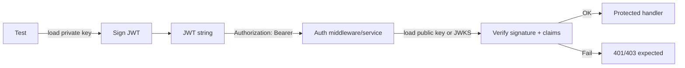

# 🔐 Token Signing Keys (Test Fixtures)


> ⚠️ **Important:** Everything in this folder is a **test fixture**.  
> These keys are committed to the repo intentionally and must be treated as **public**.

---

## 🎯 Purpose

This directory holds deterministic cryptographic keys used by the auth test suite to:

- ✅ **Sign** JWTs for fixtures (access/refresh tokens, service tokens, etc.)
- ✅ **Verify** JWT signatures in middleware/service tests
- ✅ Simulate **key rotation** and `kid` selection (when tests need it)
- ✅ Keep token fixtures **stable** across machines + CI

---

## 📁 Folder Layout

```text
api/src/auth/tests/fixtures/tokens/keys/
├─ README.md
├─ *.pem                 # RSA / EC keys (private + public), PEM format
├─ jwks*.json            # optional: JWKS fixture(s)
└─ *.jwk.json            # optional: individual JWK fixtures (if used)
```

> 🧠 Tip: If your verifier uses JWKS, keep the **public** material in `jwks*.json` and never place real production JWKS here.

---

## 🧪 How Tests Use These Keys

Typical flow:

- **Signing fixtures:** load a private key → create a JWT with expected claims
- **Verifying behavior:** load the matching public key / JWKS → assert:
  - signature is valid / invalid
  - `exp`, `nbf`, `iat` handling is correct
  - required claims (`sub`, roles/permissions, issuer/audience, etc.) are enforced



---

## 🏷️ Naming Conventions (Keep It Boring)

A good convention is one that makes *rotation tests* obvious:

- Prefer filenames that include **algorithm family** + **purpose** + optional **kid**
- If JWT `kid` is used, mirror it in the filename (so future-you can grep quickly)

Examples:

- `rsa_test_kid-0001_private.pem`
- `rsa_test_kid-0001_public.pem`
- `ec_test_kid-0002_private.pem`
- `ec_test_kid-0002_public.pem`
- `jwks.test.json`

---

## ♻️ Regenerating Keys

Regenerate keys only when you **must** (e.g., crypto library expects a new format, or you’re adding a rotation scenario).  
Otherwise, stable keys = stable fixtures ✅

### RSA (RS256) Example

```bash
# 1) Create a private key (PKCS#8 is widely compatible)
openssl genpkey -algorithm RSA -pkeyopt rsa_keygen_bits:2048 -out rsa_test_private.pem

# 2) Derive the public key
openssl pkey -in rsa_test_private.pem -pubout -out rsa_test_public.pem
```

### ECDSA (ES256) Example

```bash
# 1) Create a private key (P-256 curve)
openssl ecparam -genkey -name prime256v1 -noout -out ec_test_private.pem

# 2) Derive the public key
openssl ec -in ec_test_private.pem -pubout -out ec_test_public.pem
```

✅ **CI-friendly rule:** keep these keys **unencrypted** (no passphrase), so tests run non-interactively.

---

## 🔄 Adding a Rotation Scenario (Multiple Keys)

If you need to test rotation:

1. Add a second keypair (new `kid`)
2. Ensure the JWKS fixture contains **both public keys** (old + new)
3. Verify behavior:
   - tokens signed with **new key** succeed
   - tokens signed with **old key** succeed *only if still accepted*
   - tokens signed with **revoked key** fail (optional negative test)

<details>
<summary>🧩 Suggested <code>kid</code> pattern</summary>

| Scenario | `kid` example | Notes |
|---|---|---|
| Current signing key | `test-kid-1` | what sign() uses by default |
| Previous accepted key | `test-kid-0` | verifier still accepts |
| Revoked key | `test-kid-revoked` | keep only if you need negative tests |

</details>

---

## 🧰 Troubleshooting

**“Invalid key format” / “PEM routines” errors**
- Confirm the file is actually PEM and includes the expected header/footer.
- Ensure line endings are **LF** (CRLF can break some parsers).
- If your library requires PKCS#8, regenerate using the RSA example above.

**“kid not found” errors**
- Your verifier is selecting a key by `kid` from JWKS.
- Make sure the token header `kid` matches the JWKS `kid` exactly.

---

## 🛡️ Security Rules (Read Me 🙃)

- 🔓 These keys are **NOT secrets**. Treat as **public**.
- 🚫 Never reuse them in production, staging, or any deployed environment.
- 🧨 Do not commit real private keys here (ever).
- ✅ If you need local dev keys: generate them in a developer-only path and load via environment variables.

---

## ✅ Checklist When Changing Anything Here

- [ ] Regenerate **dependent token fixtures** (if any token strings are committed elsewhere)
- [ ] Update any `kid` references in tests / JWKS fixtures
- [ ] Confirm keys parse cleanly in CI (no prompts, no OS-specific path hacks)
- [ ] Run the full auth test suite (unit + integration)

---

