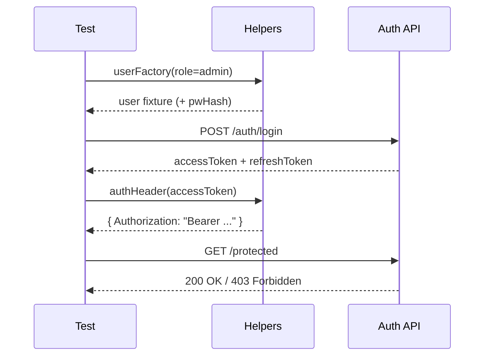

# 🔐 Auth Test Helpers

<p align="center">
  
  
  
</p>

> A small toolbox for writing **clear** auth tests: create users, mint tokens, call endpoints, reset state.  
> Keep it boring ✅ (boring tests are reliable tests).

---

## 🧭 TL;DR

- **Unit tests:** use factories + fakes (no server, no DB).
- **Integration tests:** use request helpers + test DB (and optionally mint tokens directly).
- **Always:** deterministic time + deterministic randomness + no real secrets.

---

## 📍 Location

`api/src/auth/tests/helpers/`

---

## 🗂️ Folder map

```text
📦 api/src/auth/tests/helpers
├─ 📄 README.md              👈 you are here
├─ 📄 index.ts               # recommended: barrel exports
├─ 🧩 users.ts               # userFactory(), roleFactory()
├─ 🧩 tokens.ts              # makeAccessToken(), makeRefreshToken()
├─ 🧩 headers.ts             # authHeader(), jsonHeaders()
├─ 🧩 http.ts                # buildTestClient(), asUser(), request helpers
├─ 🧩 db.ts                  # resetDb(), seedAuth()
├─ 🧩 time.ts                # freezeTime(), withClock()
└─ 🧩 mocks.ts               # mockEmail(), mockMfa(), mockOauth()
```

> If your actual filenames differ, keep the **roles** the same (users/tokens/http/db/time/mocks) so contributors can predict where things live.

---

## 🎯 Design goals

1. **Readability** — tests should read like a story (arrange → act → assert).
2. **Determinism** — no flaky clock, randomness, or external network calls.
3. **Speed** — helpers must not make the suite slow (avoid expensive hashing unless needed).
4. **Single source of truth** — shared mechanics live here (no copy/paste helper code in tests).

---

## ✅ What belongs here?

- 👤 User / session fixtures & factories
- 🪙 JWT builders (access + refresh tokens)
- 🧾 Header builders (`Authorization: Bearer …`)
- 🌐 HTTP test client wrappers (supertest/fetch-style)
- 🧪 DI adapters and mocks (email sender, MFA provider, OAuth provider, etc.)
- 🧊 Time & randomness control (freeze time, seed PRNG)
- 🧹 State cleanup (DB reset, transaction rollback helpers)

---

## 🚫 What does *not* belong here?

- ❌ Test cases themselves (`*.test.ts`)
- ❌ One-off fixtures used in only a single test file (keep them next to the test)
- ❌ Business rules (“admins can do X because…”) — that belongs in production code

---

## 🧰 Helper catalog

| Helper | What it does | Use it when… |
| --- | --- | --- |
| `users.ts` | Creates user fixtures (roles, defaults, passwords) | you need a user in any auth test |
| `tokens.ts` | Builds signed access/refresh tokens | you want auth headers without going through `/login` |
| `headers.ts` | Produces consistent request headers | you want repeatable header formatting |
| `http.ts` | Wraps a test client & common flows | you’re testing endpoints |
| `db.ts` | Seeds & resets auth-related persistence | tests touch the database |
| `time.ts` | Freezes/controls time | testing token expiry, lockouts, OTP windows |
| `mocks.ts` | Mocks external services | flows include email/MFA/OAuth |

---

## 🚀 Usage patterns

### 1) Import from the barrel (recommended)

Maintain an `index.ts` that re-exports helpers:

```ts
// api/src/auth/tests/helpers/index.ts
export * from './users';
export * from './tokens';
export * from './headers';
export * from './http';
export * from './db';
export * from './time';
export * from './mocks';
```

Then tests can do:

```ts
import { userFactory, makeAccessToken, authHeader } from './helpers';
```

---

### 2) Unit-test pattern (no HTTP)

```ts
import { userFactory, fakePasswordHasher, fakeUserRepo } from './helpers';

describe('AuthService', () => {
  it('rejects invalid password', async () => {
    const user = userFactory({ password: 'correct-horse-battery-staple' });

    const auth = makeAuthService({
      userRepo: fakeUserRepo([user]),
      passwordHasher: fakePasswordHasher(),
    });

    await expect(auth.login(user.email, 'wrong')).rejects.toThrow('INVALID_CREDENTIALS');
  });
});
```

✅ Good when you’re testing domain logic (credential checks, lockout thresholds, role mapping).

---

### 3) Integration-test pattern (HTTP + token minting)

```ts
import { buildTestClient, userFactory, makeAccessToken, authHeader } from './helpers';

it('GET /auth/me returns current user', async () => {
  const client = await buildTestClient();

  const user = await client.db.insertUser(userFactory({ role: 'researcher' }));
  const token = makeAccessToken({ userId: user.id, roles: [user.role] });

  const res = await client.get('/auth/me', {
    headers: authHeader(token),
  });

  expect(res.status).toBe(200);
  expect(res.body.id).toBe(user.id);
});
```

✅ Good when you’re testing middleware, routing, serialization, auth guards.

---

### 4) Full login flow (recommended for `/login` tests)

```ts
import { buildTestClient, loginViaApi } from './helpers';

it('POST /auth/login issues access + refresh tokens', async () => {
  const client = await buildTestClient();

  await client.db.insertUser({
    email: 'a@b.com',
    // Use real hashing here only if you want an end-to-end password verification test
    passwordHash: await client.db.hash('p@ssw0rd'),
    role: 'user',
  });

  const { accessToken, refreshToken } = await loginViaApi(client, {
    email: 'a@b.com',
    password: 'p@ssw0rd',
  });

  expect(accessToken).toMatch(/^eyJ/); // JWT header is base64 JSON
  expect(refreshToken).toBeTruthy();
});
```

✅ Good when you’re validating the full auth contract (input validation, hashing, issuance).

---

## 🔐 Token & security notes

KFM auth is JWT-based with **short-lived access tokens** (commonly ~1 hour, configurable) and a **refresh-token mechanism** to keep sessions alive without re-login. Passwords are hashed using a strong algorithm (bcrypt/Argon2). Roles drive authorization checks.

**Implications for test helpers:**

- 🔑 Prefer a **test-only signing key/secret** (never production keys, never shared with dev/prod).
- ⏱️ If tokens embed `iat/exp`, use `time.ts` to freeze time in expiry tests.
- 🧑‍🤝‍🧑 Always mint tokens with explicit roles so authorization tests are self-explanatory.

---

## 🧠 Visual: typical auth test flow



---

## 🧊 Determinism checklist

- [ ] **Seed randomness** (faker/uuid/PRNG) so IDs/snapshots don’t change between runs.
- [ ] **Freeze time** when testing expiry, lockouts, OTP windows.
- [ ] **Reset DB state** between tests (transaction rollback or `resetDb()`).
- [ ] **Avoid external network** calls (mock email/MFA/OAuth).
- [ ] **No real secrets** committed (keys are test fixtures or env vars).

---

## 🧩 Adding a new helper

1. Add a focused module (`<topic>.ts`) with a small, composable API.
2. Export it from `index.ts`.
3. Add/extend a usage snippet in this README (keep docs current ✅).

### Naming conventions

- `*Factory()` → creates fixtures (plain objects)
- `make*Token()` → signs tokens
- `authHeader()` / `jsonHeaders()` → header builders
- `mock*()` → stubs/mocks external dependencies
- `build*Client()` → boots runtime (server/DI/DB)

<details>
  <summary>📌 What counts as “too much” for a helper?</summary>

If a helper starts encoding **policy** (business rules), it’s no longer a helper.  
Helpers should be **mechanics**, not decisions. Put decisions in production code and test them directly.

</details>

---

## 🧯 Troubleshooting

| Symptom | Likely cause | Fix |
| --- | --- | --- |
| `401 Unauthorized` even with a token | Wrong signing key, issuer, audience, or token shape | Ensure `makeAccessToken()` mirrors middleware expectations |
| Flaky expiry/lockout tests | Real clock is used | Freeze time (`freezeTime()`), or inject a test clock |
| Passes locally, fails in CI | Hidden dependency on local env or DB state | Use `.env.test` defaults + `resetDb()`; avoid machine-specific config |
| Slow auth tests | Real bcrypt/Argon2 hashing everywhere | Stub the hasher for unit tests; use real hashing only in dedicated integration tests |

---

## 🔗 Related

- `api/src/auth/` — auth module implementation (middleware, services, routes)
- `api/src/auth/tests/` — auth test suite (unit + integration)
- `docs/` — architecture + security notes (JWT, refresh tokens, roles)

---

🛡️ **Remember:** Auth tests are part of the security perimeter.  
Make them boring, deterministic, and hard to misunderstand.

