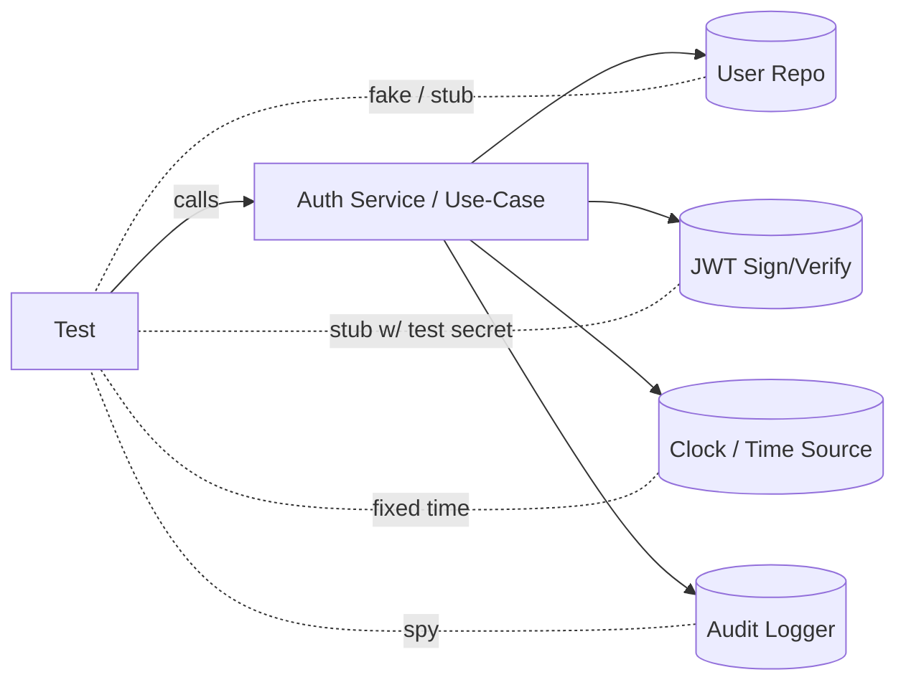

# 🔐 Auth Unit Tests (Unit) — `api/src/auth/tests/unit/`


> 🧪 This folder contains **fast** and **deterministic** unit tests for the Auth module.  
> 🧷 Rule of thumb: if a test needs **a real DB, network, email, or external identity provider**, it **doesn’t belong here**.

---

## 📚 Table of contents
- [🎯 Goals](#-goals)
- [🧩 What belongs in unit tests](#-what-belongs-in-unit-tests)
- [🚀 Running tests](#-running-tests)
- [🗂️ Folder layout](#️-folder-layout)
- [🧠 Unit-test boundary](#-unit-test-boundary)
- [✅ Coverage checklist](#-coverage-checklist)
- [🧰 Test doubles & fixtures](#-test-doubles--fixtures)
- [✍️ Adding a new unit test](#️-adding-a-new-unit-test)
- [🧯 Debugging & flake prevention](#-debugging--flake-prevention)
- [🔐 Security hygiene](#-security-hygiene)
- [🔗 Related project docs](#-related-project-docs)

---

## 🎯 Goals

These unit tests exist to protect our most security-sensitive behaviors:

- ✅ **Credential verification** (password hashing/verification wrappers)
- ✅ **Token issuance & validation** (JWT claims, expiry rules, refresh token behavior if implemented)
- ✅ **Authorization decisions** (roles, permissions, operational access levels)
- ✅ **Account security controls** (lockout thresholds, brute-force protections where present)
- ✅ **Audit logging hooks** (security events recorded without leaking sensitive info)

> [!IMPORTANT]
> Auth is a **governance gate**. If unit tests are flaky or slow, they won’t run often enough—and security regressions slip in.

---

## 🧩 What belongs in unit tests

### ✅ In-scope (unit)
- Pure functions (e.g., claim builders, permission mappers, validation utilities)
- Service/use-case logic (e.g., `AuthService.login()`, `TokenService.issueAccessToken()`)
- “Edge behavior” (e.g., expired token, role mismatch, lockout triggers)
- Any logic where external dependencies can be **faked** or **mocked**

### 🚫 Out-of-scope (not unit)
- Real database reads/writes
- Real HTTP requests (even to localhost)
- OAuth providers / SSO / external identity systems
- Email flows (password reset email delivery)
- End-to-end login through the API router/controller layer

> [!NOTE]
> If you need a test server + test DB + request calls, place it under **integration** tests (not here).

---

## 🚀 Running tests

Because the repo may run auth under different stacks (Node/TS microservice vs Python service), here are **common** patterns. Prefer the command(s) defined in your local `api/` scripts.

<details>
<summary><b>🟦 Node / TypeScript (Jest / Vitest-style)</b></summary>

```bash
# From repo root
cd api

# Run all tests (common)
npm test
# or
pnpm test
# or
yarn test

# Run only Auth unit tests (common patterns)
npm test -- src/auth/tests/unit
pnpm test -- src/auth/tests/unit
yarn test src/auth/tests/unit

# Coverage (common)
npm test -- --coverage
```

</details>

<details>
<summary><b>🟩 Python (pytest-style)</b></summary>

```bash
# From repo root
cd api

# Run unit tests for auth folder
pytest -q src/auth/tests/unit

# Coverage (if configured)
pytest -q --cov=src/auth src/auth/tests/unit
```

</details>

---

## 🗂️ Folder layout

> This is the **recommended** shape (actual filenames may vary). Keep unit tests close to the auth logic they verify.

```text
📁 api/
  📁 src/
    📁 auth/
      📁 tests/
        📁 unit/
          📄 README.md                 👈 you are here
          📁 __fixtures__/             🧪 deterministic test data
          📁 __fakes__/                🎭 in-memory fakes (repos, clock, logger)
          📄 token*.spec.*             🔑 token issuance/validation unit tests
          📄 password*.spec.*          🧂 hashing & verification wrappers
          📄 rbac*.spec.*              🛡️ role/permission mapping + checks
          📄 lockout*.spec.*           🚧 brute-force protections
```

---

## 🧠 Unit-test boundary

Unit tests should exercise the **public entry points** of the auth component and replace external actors with test doubles.



**Key idea:** your test owns the world. Anything nondeterministic must be injected (time, randomness, external I/O).

---

## ✅ Coverage checklist

Use this as a “did we forget something?” punch list ✅

### 🔑 Token logic (JWT / session)
- [ ] Access token includes correct **subject/user id** + **role claims**
- [ ] Token expiry is enforced (expired ⇒ rejected)
- [ ] Invalid signature ⇒ rejected
- [ ] Missing/empty bearer token ⇒ rejected (where middleware/guard is unit-tested)
- [ ] Refresh token behavior (if implemented):
  - [ ] Refresh token is **long-lived** and only accepted at refresh endpoint logic
  - [ ] Refresh rotates correctly (old refresh token invalidated if that’s the chosen policy)

### 🧂 Password & credential security
- [ ] Password hashing wrapper returns a non-plaintext hash
- [ ] Password verify wrapper returns true/false correctly
- [ ] Password complexity validation rules (length/entropy/blocked patterns) behave as expected
- [ ] Password reset token validation (one-time token semantics) behaves as expected (logic-only)

### 🚧 Account protections
- [ ] Failed attempts increment correctly
- [ ] Lockout threshold triggers after N failures
- [ ] Lockout duration (or unlock rules) behave correctly
- [ ] Admin alert/log event emitted for suspicious behavior (if present)

### 🛡️ Authorization (RBAC / ACL / operational access levels)
- [ ] Role → permissions mapping is deterministic and explicit
- [ ] “Admin-only” and “sensitive action” checks deny non-admin roles
- [ ] Resource-ownership checks behave correctly (owner vs non-owner)
- [ ] “Researcher” vs “User/Farmer” differences are enforced (as implemented)

### 🧾 Audit logging
- [ ] Login / logout / permission-change actions trigger audit log calls
- [ ] Audit logs do **not** include secrets (passwords, raw tokens)
- [ ] Audit records include stable identifiers (user id, timestamp, action)

> [!TIP]
> If you add a new auth feature, add a unit test **and** a negative test (deny path). Security logic without deny tests is fragile.

---

## 🧰 Test doubles & fixtures

### 🎭 Recommended test double choices
- **Fake repositories** (in-memory) > heavy mocking  
  - Great for “failed attempts”, “lockout” counters, refresh token storage semantics.
- **Spy logger/audit sink** for “was it called with safe payload?”
- **Fixed clock** for token expiry and lockout windows
- **Test secrets** for token signing (never real secrets)

### 🧪 Fixtures
Keep fixtures:
- small (only the fields you need)
- explicit (no hidden magic)
- deterministic (no random IDs unless pinned)

Suggested pattern:
- `makeUser({ role: "admin" })`
- `makeTokenClaims({ sub: "user-123", roles: ["researcher"] })`
- `makeAuthContext({ userId, roles })`

---

## ✍️ Adding a new unit test

### ✅ Conventions
- Name tests as: `should <expected> when <condition>`
- Use **AAA** pattern: Arrange → Act → Assert
- Avoid testing private helpers directly (test public behavior)

### 🧱 Minimal skeleton (TypeScript-ish)
```ts
describe("TokenService", () => {
  it("should include roles in the JWT when issuing an access token", () => {
    // Arrange
    const clock = fixedClock("2026-01-04T00:00:00Z");
    const tokenService = makeTokenService({ clock, jwtSecret: "test-secret" });

    // Act
    const token = tokenService.issueAccessToken({ userId: "u1", roles: ["admin"] });

    // Assert
    const decoded = tokenService.verifyAccessToken(token);
    expect(decoded.roles).toContain("admin");
  });
});
```

### 🧱 Minimal skeleton (pytest-ish)
```python
def test_issue_token_includes_roles(token_service):
    token = token_service.issue_access_token(user_id="u1", roles=["admin"])
    decoded = token_service.verify_access_token(token)
    assert "admin" in decoded["roles"]
```

---

## 🧯 Debugging & flake prevention

Common flake causes (and fixes):

- ⏱️ **Time-based failures** → inject a fixed clock / freeze time
- 🎲 **Random IDs** → use deterministic IDs in fixtures
- 🔁 **Shared mutable state** → create fresh fakes per test
- 🧵 **Parallel test interference** → avoid global singletons; isolate secrets/config per test run

> [!WARNING]
> Never assert on exact token strings if the signing includes timestamps/iat/jti.  
> Assert on decoded claims instead.

---

## 🔐 Security hygiene

- 🚫 Do **not** hardcode real secrets, API keys, or real tokens
- ✅ Use obviously fake values: `test-secret`, `user-123`, `refresh-test-token`
- 🧼 Ensure logs in tests don’t print credentials or bearer tokens
- 🧪 Prefer “safe sample users” (no real email addresses unless clearly fake: `dev-null@example.com`)

---

## 🔗 Related project docs

- 📘 `docs/MASTER_GUIDE_v13.md` — repo-wide conventions (tests, CI, contracts)
- 🧭 `docs/architecture/` — auth/permissions expectations (if defined)
- 🧾 API contract docs (OpenAPI/GraphQL) — if auth claims impact contracts, update both tests + contract checks

---

### ✅ Definition of Done (DoD) for auth unit tests
- [ ] Test is deterministic (no real time/network/DB)
- [ ] Includes at least one deny/negative case
- [ ] Passes locally and in CI
- [ ] Sensitive values are not logged or committed

