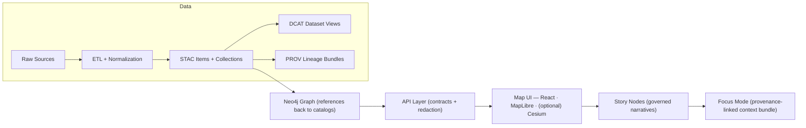

<div align="center">

# 🤝 API Contracts

**Kansas Frontier Matrix (KFM)** — stable, contract-first schemas for **REST + GraphQL + Catalogs** 🌾🗺️


</div>

> [!IMPORTANT]
> **Contracts are the product.** This directory defines the *public* shapes our clients depend on:
> - REST payloads (FastAPI / OpenAPI)
> - GraphQL types & inputs
> - Catalog-compatible JSON (STAC / DCAT / PROV)
> - Cross-cutting primitives (IDs, time, geo, pagination, errors)
>
> Implementation must follow contracts — not the other way around.

---

## 🧭 What lives in `api/src/contracts/`?

Think of this folder as **the API’s “boundary artifacts”** 📦: stable, validated types that bridge:

- 🗄️ **Data & Catalogs** (STAC/DCAT/PROV metadata + links to assets)
- 🧠 **Knowledge Graph** (GraphQL query shapes & graph-ish responses)
- 🗺️ **Maps** (GeoJSON features, tile endpoints, time filtering)
- 🧪 **Modeling & Analytics** (simulation runs, statistical outputs, uncertainty)
- 🔐 **Governance** (classification + redaction envelopes; policy gate hooks)

If a contract changes, it’s a **compatibility event** that must be versioned, reviewed, and tested.

---

## 🧩 Contract layers

| Layer | What it answers | Examples |
|---|---|---|
| 🌐 Transport contracts | “What does the HTTP/GraphQL payload look like?” | request/response bodies, error shapes, pagination |
| 🗺️ Geo & time primitives | “How do we represent space and time consistently?” | bbox, GeoJSON geometry, ISO-8601 time ranges |
| 🧾 Catalog contracts | “How do we publish metadata so others can reuse it?” | STAC Items/Collections, DCAT datasets, PROV bundles |
| 🔐 Policy & redaction | “What can be shown to whom (and at what zoom)?” | classification tags, redaction summaries |
| 🧪 Evidence & analysis | “How do we ship results that are reproducible?” | model run manifests, uncertainty intervals, diagnostics |

---

## 🗂️ Suggested layout (adapt to the repo as it evolves)

> [!NOTE]
> This is a **recommended** structure. If files already exist, keep them — and map them into the categories below.

```text
api/src/contracts/
├─ README.md  ✅ (you are here)
│
├─ _shared/                 # 🔩 cross-cutting primitives
│  ├─ ids.*                 # stable IDs, namespaces
│  ├─ time.*                # ISO-8601, intervals, timelines
│  ├─ units.*               # units + quantities (where applicable)
│  ├─ errors.*              # KfmError + error codes
│  ├─ pagination.*          # cursors / paging envelopes
│  └─ links.*               # link objects, HATEOAS-ish patterns
│
├─ geo/                     # 🌎 space + map delivery
│  ├─ geojson.*             # Feature, FeatureCollection, Geometry
│  ├─ bbox.*                # bbox conventions + validation
│  ├─ tiles.*               # MVT/PMTiles metadata + endpoints
│  └─ tilejson.*            # TileJSON-like metadata (if used)
│
├─ catalog/                 # 🧾 interoperability contracts
│  ├─ stac.*                # STAC Item/Collection (KFM extensions)
│  ├─ dcat.*                # DCAT Dataset JSON-LD (KFM profile)
│  └─ prov.*                # PROV JSON-LD bundles
│
├─ graph/                   # 🧠 knowledge graph interfaces
│  ├─ schema.graphql        # GraphQL schema (or schema fragments)
│  └─ types.*               # shared types used by resolvers
│
├─ analytics/               # 🧪 modeling & statistics outputs
│  ├─ model_run.*           # run manifests, parameters, artifacts
│  ├─ regression.*          # coefficients, metrics, diagnostics
│  └─ timeseries.*          # series, aggregation windows, gaps
│
└─ focus/                   # 🔎 evidence-backed Q&A payloads
   ├─ query.*               # request contract
   └─ response.*            # answer + citations/evidence bundle
```

---

## 🔐 Redaction & policy gates (non-negotiable)

> [!WARNING]
> **Never** let clients “guess” whether something is safe to show.
> - The **API layer** enforces redaction + classification rules.
> - Contracts must be designed so redaction is **explicit and inspectable**, not silent.

### 📛 Classification model (suggested)
Every response (or its `meta`) should be able to carry:

- `classification`: `public | restricted | sensitive`
- `policy_tags`: e.g., `["care:sacred_site", "pii:present", "license:noncommercial"]`
- `redactions[]`: what was hidden/blurred/generalized and why (zoom-based generalization, removal of exact points, etc.)

### 🧰 Policy Pack integration
Policy is expected to be *codified as code* (e.g., OPA/Rego + Conftest). Contracts should expose the minimum fields needed for:
- automated gating in CI,
- runtime enforcement,
- and user-facing transparency (why something was withheld).

---

## 🧾 Standards alignment: STAC + DCAT + PROV

KFM’s contract surface is intentionally interoperable:

- **STAC** describes geospatial assets (items/collections + spatial/temporal extent).
- **DCAT** describes datasets for discovery (title, description, license, distributions).
- **PROV** describes lineage (inputs → process → outputs; agents; timestamps; parameters).

### 🔗 Linkage expectations
Contracts must preserve the “chain of custody”:

- STAC Items should link to **real assets** (files or stable API URLs)
- DCAT should link to STAC and/or download endpoints
- PROV should link **end-to-end** (raw → work → processed) + identify run/config hashes
- Graph entries should reference catalog IDs (not duplicate payloads)

> [!TIP]
> If you’re adding a new endpoint that returns a dataset-like thing, you’re almost certainly also adding:
> ✅ STAC record(s)  
> ✅ a DCAT dataset entry  
> ✅ a PROV activity bundle  
> …and then exposing them via governed API contracts.

---

## 🌎 Geo + time conventions

### 🧭 Spatial primitives
**Default** assumptions for public API payloads:

- GeoJSON for feature geometry (WGS84 / lon-lat)
- `bbox`: `[minLon, minLat, maxLon, maxLat]`
- `datetime` and time ranges are ISO-8601 (UTC unless explicitly offset)

If a contract uses a projected CRS internally (e.g., for routing), it must be explicit in the payload.

### ⏳ Time filtering contracts
Map + catalog endpoints should accept time as:

- a single instant (e.g., `datetime=1936-01-01T00:00:00Z`)
- or an interval (e.g., `datetime=1930-01-01T00:00:00Z/1940-01-01T00:00:00Z`)

Keep semantics consistent across REST and GraphQL.

---

## 🧪 Modeling & analytics contracts (reproducibility-first)

This project treats analysis outputs as first-class evidence artifacts.
Contracts must make results **auditable**:

### ✅ Minimum required metadata for any analysis result
Include (in `meta` or equivalent):

- `run_id` (stable UUID)
- `algorithm` / `model_name`
- `model_version` (SemVer or hash)
- `parameters` (fully serializable)
- `inputs[]` (dataset IDs + catalog references)
- `artifacts[]` (links to generated files, tiles, tables)
- `provenance` (PROV link or embedded PROV summary)
- `uncertainty` (when applicable)

### 📏 Uncertainty is a feature, not a footnote
Whenever results have variability (models, regression, forecasts, Monte Carlo, etc.), contracts should allow:

- confidence / credible intervals
- distributions (summaries + optional samples)
- diagnostics (fit metrics, residual summaries, warnings)

> [!NOTE]
> “1500 ± 50 (95% confidence)” is contract-friendly. “1500” alone is not.

---

## 🧷 Versioning & compatibility rules (SemVer)

### 🔒 What we guarantee
For any contract marked **stable**:
- Additive changes (new optional fields) are OK in minor versions
- Breaking changes require a major version bump
- Deprecations must be explicit

### 🧾 Deprecation pattern (recommended)
- Keep old field(s)
- Add new field(s)
- Mark old as deprecated in docs and (where possible) OpenAPI/GraphQL descriptions
- Provide a migration note

### 🧩 Multi-version support (when needed)
If we must serve two versions in parallel:
- route versioning: `/v1/...` and `/v2/...`
- or media-type versioning: `Accept: application/vnd.kfm.v1+json`

Pick one and apply consistently.

---

## ✅ Contract Definition of Done (DoD) checklist

When adding/changing a contract:

- [ ] Contract updated **before** or alongside implementation
- [ ] Examples included (request + response + error case)
- [ ] Backward compatibility evaluated (SemVer decision recorded)
- [ ] Redaction & classification accounted for
- [ ] Links to STAC/DCAT/PROV included where the payload represents a dataset/artifact
- [ ] Validation exists (schema validation + tests or snapshots)
- [ ] Docs updated (link to the endpoint + intent + constraints)

> [!TIP]
> If you need a template for adding/changing endpoints, use:  
> `docs/templates/TEMPLATE__API_CONTRACT_EXTENSION.md` ✅

---

## 🧰 Common shapes (recommended)

### 🧯 Error contract (REST)
```json
{
  "error": {
    "code": "KFM_NOT_FOUND",
    "message": "Dataset not found.",
    "details": {
      "dataset_id": "kfm:dataset:surficial-geology:v1"
    },
    "hint": "Check the catalog endpoint for available dataset IDs."
  },
  "meta": {
    "request_id": "req_01HV...",
    "generated_at": "2026-01-12T00:00:00Z"
  }
}
```

### 📦 Envelope contract (non-STAC payloads)
Use an envelope when we’re not returning a standard object verbatim:

```json
{
  "data": { "/* domain-specific payload */": true },
  "meta": {
    "api_version": "1.4.0",
    "request_id": "req_01HV...",
    "generated_at": "2026-01-12T00:00:00Z",
    "classification": "public",
    "redactions": [],
    "links": [
      { "rel": "dcat", "href": "/catalog/dcat/datasets/..." },
      { "rel": "prov", "href": "/provenance/runs/..." }
    ]
  }
}
```

### 🗺️ GeoJSON delivery
If returning GeoJSON:
- return **valid** `FeatureCollection`
- keep properties flat and JSON-native where possible
- include `meta` only if you wrap in an envelope (don’t break GeoJSON)

---

## 🧠 GraphQL contracts

GraphQL is for **relationship-heavy** questions:
- people ↔ places ↔ events
- events filtered by time ranges
- connected entities with pagination

GraphQL must still respect:
- classification/redaction
- pagination/limits for expensive queries
- provenance links for evidence-bearing fields

> [!NOTE]
> GraphQL should **mirror the graph**, but not expose internal DB quirks.

---

## 🧭 End-to-end picture (contracts sit in the middle)



---

## 🧪 Contract validation (what CI should enforce)

At minimum, CI should run:

- ✅ schema validation for contract definitions (JSON Schema / Pydantic export)
- ✅ OpenAPI generation and diffing (catch breaking changes)
- ✅ GraphQL schema validation
- ✅ policy checks (FAIR/CARE + sensitive handling)
- ✅ examples/tests that ensure contract outputs still match

> [!TIP]
> Prefer **snapshot tests** for OpenAPI + representative responses.
> Contracts should fail fast if a refactor “accidentally” changes the wire format.

---

## 📚 Design inputs (internal library)

<details>
<summary><strong>Click to expand 📚</strong></summary>

These contracts are shaped by the project’s internal docs + reference library, including:

- 🧭 Master guides & governance:
  - `docs/MASTER_GUIDE_v13.md`
  - `docs/standards/KFM_STAC_PROFILE.md`
  - `docs/standards/KFM_DCAT_PROFILE.md`
  - `docs/standards/KFM_PROV_PROFILE.md`
  - `docs/templates/TEMPLATE__API_CONTRACT_EXTENSION.md`

- 🌟 Roadmap & future proposals:
  - Real-time Watchers (ETag-safe), PMTiles/GeoParquet packaging, federation-ready schemas, Policy Pack (OPA/Rego)

- 🧪 Modeling & statistics:
  - Simulation documentation rigor, uncertainty reporting, experimental design & reproducibility

- 🗺️ GIS & mapping:
  - PostGIS-backed spatial queries, map tiles, responsive UI patterns, WebGL/3D mapping

- 🔐 Security mindset:
  - Treat contracts as an attack surface: validate inputs, avoid data leakage, enforce least privilege

</details>

---

## 🧷 Quick links 🔗

- 📄 Master Guide: `../../../docs/MASTER_GUIDE_v13.md`
- 🧾 Standards:
  - STAC profile: `../../../docs/standards/KFM_STAC_PROFILE.md`
  - DCAT profile: `../../../docs/standards/KFM_DCAT_PROFILE.md`
  - PROV profile: `../../../docs/standards/KFM_PROV_PROFILE.md`
- 🧰 Endpoint template: `../../../docs/templates/TEMPLATE__API_CONTRACT_EXTENSION.md`

---

### ✅ Bottom line

If you’re shipping an endpoint, you’re shipping a **contract**.
Make it stable, governed, testable, and provenance-linked. 🌾🗺️✅
