# 📚 Catalog Contracts (KFM) 🧭🗺️


> **Mission:** KFM’s UI + AI are only as trustworthy as the metadata contracts behind them. This folder defines the **canonical, versioned contracts** that power **Search & Data Discovery**, **map/time navigation**, and **evidence-backed AI answers**.

---

## 🎯 What this folder is for

KFM follows a **contract-first** approach: stable, versioned interfaces (JSON Schemas / OpenAPI / GraphQL) are treated as first-class artifacts so the UI can evolve independently while remaining consistent and trustworthy. :contentReference[oaicite:0]{index=0} :contentReference[oaicite:1]{index=1}

This `catalog` contract package focuses on **Catalog artifacts and transport types**, including:

- 🧾 **Dataset discovery** metadata (summary objects optimized for search UI & API clients)
- 🛰️ **STAC** Collections/Items/Assets for spatial & spatiotemporal layers
- 📦 **DCAT** Datasets/Distributions for dataset cataloging & interoperability
- 🧬 **PROV** lineage (runs, agents, entities, “how did this come to be?”)
- 🔐 **Governance metadata** (classification, sensitivity, sovereignty constraints)
- 🔗 **Cross-links** between STAC ↔ DCAT ↔ PROV so users can always trace *“the map behind the map”* :contentReference[oaicite:2]{index=2}

> [!IMPORTANT]
> **KFM is evidence-first and catalog-driven:** data is not “published” (or trusted by UI/AI) until it has the required catalog artifacts (STAC/DCAT/PROV) and passes validation & policy gates. :contentReference[oaicite:3]{index=3} :contentReference[oaicite:4]{index=4}

---

## 🧾 The “Evidence Triplet” (STAC + DCAT + PROV)

KFM treats each dataset as a **joined triplet** of catalogs (plus assets), which keeps metadata auditable and interoperable:

- **STAC** ✅ spatial/temporal extents + assets
- **DCAT** ✅ discovery + licensing + distribution
- **PROV** ✅ lineage (inputs, tools, outputs, agents)

:contentReference[oaicite:5]{index=5} :contentReference[oaicite:6]{index=6}

```mermaid
flowchart LR
  A[Raw Sources 🌐📥] --> B[Ingestion/Processing ⚙️]
  B --> S[STAC 🛰️]
  B --> D[DCAT 📦]
  B --> P[PROV 🧬]
  S <--> D
  D <--> P
  S <--> P
  S --> API[Catalog API 🚪]
  D --> API
  P --> API
  API --> UI[UI 🗺️ Timeline + Search]
  API --> AI[Focus Mode 🤖 Evidence-backed answers]
```



---

## 🧩 KFM Profiles & Required Extensions

KFM uses base standards (STAC/DCAT/PROV), but enforces **KFM profiles** so catalog artifacts can be reliably joined, filtered, governed, and audited.

### ✅ Required join key: `kfm:dataset_id`
Every STAC Item/Collection and DCAT Dataset must carry a stable dataset identifier so the triplet can be joined. :contentReference[oaicite:7]{index=7}

### ✅ Required governance: `kfm:classification`
Every catalog entity must declare its classification (and related sensitivity/sovereignty metadata) so the platform can:
- control visibility,
- apply geo-obfuscation where needed,
- warn users before download/export,
- and enforce access policies. :contentReference[oaicite:8]{index=8} :contentReference[oaicite:9]{index=9} :contentReference[oaicite:10]{index=10}

### 📌 Versioned profiles
The Data Intake guide calls out versioned KFM profiles, e.g.:
- `KFM-STAC v7.0.0`
- `KFM-DCAT v4.0.0`
- `KFM-PROV v11.0.0` :contentReference[oaicite:11]{index=11}

> [!NOTE]
> Keep profile versions **independent** of API contract versions. Profile versions describe the *data standard extensions*. API contract versions describe the *transport shape* exposed by endpoints.

---

## 🗂️ Suggested layout & naming conventions

> Your folder may already contain a different structure — this is the **target convention** for clarity, reuse, and codegen friendliness.

```text
api/
└─ 📁 src/
   └─ 📜 contracts/
      └─ 🗂️ catalog/
         ├─ 📄 README.md                         # 📘 Catalog contract overview: search shapes + profile overlays + versioning
         ├─ 🧩📄 index.(ts|py)                    # (optional) Barrel exports / module entrypoint for generated types/validators
         ├─ 📐 schemas/
         │  ├─ 🛰️ stac/                           # STAC + KFM-STAC profile schemas (Collections/Items/Assets constraints)
         │  ├─ 🗂️ dcat/                           # DCAT + KFM-DCAT profile schemas (dataset/distribution discovery)
         │  ├─ 🧬 prov/                           # PROV + KFM-PROV profile schemas (lineage bundles + activity shapes)
         │  ├─ 🔎📐🧾 catalog.search.request.schema.json   # Search request contract (filters, paging, sort, facets)
         │  ├─ 📦📐🧾 catalog.search.response.schema.json  # Search response contract (results, cursors, summaries, links)
         │  └─ 🧾📐🧾 catalog.dataset.summary.schema.json  # Dataset summary contract (UI-friendly card metadata + links)
         └─ 🧪 examples/
            ├─ ✅🧾 catalog.search.request.example.json     # Example search request (known-good filters)
            └─ ✅🧾 catalog.dataset.summary.example.json    # Example dataset summary (id/title/license/extents/distributions)
```

### File naming rules ✅
- Use **lowercase** + dots: `catalog.dataset.summary.schema.json`
- Include a stable `$id` inside schemas (recommended):  
  `kfm://contracts/catalog/dataset-summary/1.0.0`
- Prefer **JSON Schema 2020-12** (or a single repo-wide standard)

---

## 🧠 Core contract concepts

### 1) Spatial semantics 🗺️
KFM relies heavily on spatial contracts so the map renderer and spatial queries remain deterministic:

- GeoJSON geometry coordinates use `[lon, lat]`
- `bbox` uses `[west, south, east, north]`
- Default `crs` is typically `EPSG:4326` unless explicitly declared otherwise :contentReference[oaicite:12]{index=12} :contentReference[oaicite:13]{index=13}

### 2) Temporal semantics ⏳
Temporal metadata is required for the UI timeline slider and time-aware search:
- Use ISO 8601 / RFC 3339 timestamps (UTC recommended)
- Dataset-level temporal extent should be explicit (`start`, `end`)
- Time-enabled layers must expose enough metadata to filter correctly in the UI :contentReference[oaicite:14]{index=14}

### 3) Catalog-driven UI & AI trust 🧾🤖
- UI: *“every visualization is linked to its source data and metadata”* and the front-end relies on decoupled REST/GraphQL endpoints. :contentReference[oaicite:15]{index=15}
- AI (Focus Mode): answers must be evidence-backed with citations/provenance, enforced by governance checks. :contentReference[oaicite:16]{index=16}

---

## 🔩 Contract invariants (policy + schema)

These are the invariants that should be enforced by **schema validation** and **policy gates** (OPA/Conftest):

| ✅ Invariant | Where enforced | Why it matters |
|---|---|---|
| `kfm:dataset_id` present in STAC + DCAT | JSON Schema + policy pack | Join key across the evidence triplet :contentReference[oaicite:17]{index=17} |
| `kfm:classification` set for every catalog entity | JSON Schema + policy pack | Access control, safe UI/AI behavior :contentReference[oaicite:18]{index=18} :contentReference[oaicite:19]{index=19} |
| `bbox` order `[W,S,E,N]` and valid ranges | JSON Schema | Prevent broken maps & wrong queries :contentReference[oaicite:20]{index=20} |
| `temporal.start <= temporal.end` | policy pack | Timeline correctness :contentReference[oaicite:21]{index=21} |
| PROV edges complete (`used`, `generated`) | graph/policy validation | Lineage is queryable & auditable :contentReference[oaicite:22]{index=22} |
| “Fail closed” if checks can’t run | CI policy | No silent drift in public catalogs :contentReference[oaicite:23]{index=23} :contentReference[oaicite:24]{index=24} |

> [!IMPORTANT]
> KFM’s roadmap includes a **Policy Pack** (OPA/Rego + Conftest) and CI validation gates so merges fail when required metadata or lineage is missing. :contentReference[oaicite:25]{index=25} :contentReference[oaicite:26]{index=26} :contentReference[oaicite:27]{index=27}

---

## 📦 Key contract shapes (recommended)

> These are **recommended shapes** for the Catalog API transport objects. Align naming with your actual schema files once present.

### 🆔 `DatasetId`
A stable, human-readable identifier (used across STAC/DCAT/PROV). :contentReference[oaicite:28]{index=28}

```json
"kfm.dataset.usgs_historic_topo_ellsworth_1894"
```

### 🔐 `Classification` + `Sensitivity`
KFM uses tagging + governance metadata to prevent harm (e.g., sensitive locations). :contentReference[oaicite:29]{index=29} :contentReference[oaicite:30]{index=30}

```json
{
  "kfm:classification": "public",
  "kfm:sensitivity": {
    "location_obfuscated": false,
    "requires_login": false,
    "cultural_protocols": []
  }
}
```

> [!NOTE]
> Cultural protocols / TK labels / differential access are explicitly called out as a design direction for KFM. :contentReference[oaicite:31]{index=31}

### 🔎 `CatalogSearchRequest` (UI + API)
Designed to support:
- map bounding box filtering,
- timeline/date range filtering,
- keyword/thematic filtering,
- paging/sorting.

```json
{
  "q": "railroad",
  "bbox": [-102.05, 36.99, -94.59, 40.00],
  "datetime": {
    "start": "1860-01-01T00:00:00Z",
    "end": "1900-12-31T23:59:59Z"
  },
  "filters": {
    "themes": ["transportation", "infrastructure"],
    "classification": ["public"]
  },
  "page": { "limit": 25, "cursor": null },
  "sort": ["-relevance", "-updated_at"]
}
```

### 🧾 `CatalogDatasetSummary` (fast UI listing)
A compact object for search results and “dataset cards” in UI:

```json
{
  "dataset_id": "kfm.dataset.usgs_historic_topo_ellsworth_1894",
  "title": "USGS Historical Topographic Map (Ellsworth County, 1894)",
  "description": "Digitized 1894 USGS topographic survey of Ellsworth County, Kansas.",
  "spatial": { "bbox": [-99.5, 38.3, -98.8, 38.9], "crs": "EPSG:4326" },
  "temporal": { "start": "1894-01-01", "end": "1894-12-31" },
  "license": "Public Domain",
  "kfm:classification": "public",
  "links": {
    "dcat_dataset": "/catalog/dcat/datasets/kfm.dataset.usgs_historic_topo_ellsworth_1894",
    "stac_collection": "/catalog/stac/collections/kfm.dataset.usgs_historic_topo_ellsworth_1894",
    "prov_activity": "/catalog/prov/activities/ingest_usgs_historic_topo_1894"
  }
}
```

This mirrors KFM’s emphasis on rich metadata + FAIR/CARE-aware governance in dataset contracts. :contentReference[oaicite:32]{index=32} :contentReference[oaicite:33]{index=33}

---

## 🛰️ STAC contracts (what matters for KFM)

KFM’s geospatial catalog design calls for STAC-like JSON schemas with:
- spatial bbox,
- time range,
- source/provenance info,
- and assets (COGs, GeoJSON, tiles, etc.). :contentReference[oaicite:34]{index=34}

### ✅ KFM-required STAC extensions (minimum)
- `kfm:dataset_id`
- `kfm:classification`
- provenance hooks (link to PROV activity / run manifest) :contentReference[oaicite:35]{index=35} :contentReference[oaicite:36]{index=36}

---

## 📦 DCAT contracts (discovery + interoperability)

DCAT is how KFM exposes datasets to:
- external tools,
- other “Frontier Matrix” deployments,
- and federation scenarios. :contentReference[oaicite:37]{index=37}

KFM’s DCAT should:
- include license + usage constraints,
- point to distributions (download/API endpoints),
- link out to the STAC collection and PROV lineage.

---

## 🧬 PROV contracts (lineage you can query)

KFM uses PROV to make both data lineage and operational history queryable (including CI/devops provenance in future plans). :contentReference[oaicite:38]{index=38}

### 🔍 Run Manifest linkage (deterministic + idempotent)
Additional project ideas describe a `run_manifest.json` capturing:
- `run_id`, `run_time`
- `idempotency_key`
- `canonical_digest` (RFC 8785 canonical JSON + SHA-256)
- input `source_urls`
- tool versions
- summary counts :contentReference[oaicite:39]{index=39}

**Recommendation:** add a `kfm:run_manifest` reference (URL/path + digest) to PROV Activities so every published catalog object can be traced to a deterministic ingestion run.

---

## 🛡️ Sensitivity, safety, and “differential access”

KFM explicitly calls out:
- **location generalization** for sensitive sites (e.g., show a hex/area rather than exact point),
- **access control** for restricted layers,
- and **Indigenous data sovereignty / CARE**-aligned handling. :contentReference[oaicite:40]{index=40} :contentReference[oaicite:41]{index=41}

### Contract guidance ✅
- Never assume everything is public.
- Contracts must carry enough metadata for the UI to:
  - hide, blur, or warn appropriately,
  - and for policy gates to enforce “fail closed.”

---

## 🚦 Validation & CI (what should happen on every PR)

KFM treats dataset metadata “like code” — schema validation is a gate, not a suggestion. :contentReference[oaicite:42]{index=42}

### Recommended pipeline steps
1. ✅ JSON Schema validation for all examples and fixtures
2. ✅ Policy Pack checks (OPA/Rego via Conftest)
3. ✅ Cross-artifact consistency checks (STAC ↔ DCAT ↔ PROV)
4. ✅ Provenance completeness checks (required PROV edges)
5. ✅ (Optional) Signature / OCI artifact verification for packaged data :contentReference[oaicite:43]{index=43}

<details>
<summary>🧪 Example: local schema validation commands (pick your stack)</summary>

```bash
# JS/TS example (Ajv)
npx ajv validate -s api/src/contracts/catalog/schemas/catalog.dataset.summary.schema.json \
  -d api/src/contracts/catalog/examples/catalog.dataset.summary.example.json

# Python example (jsonschema)
python -m jsonschema \
  -i api/src/contracts/catalog/examples/catalog.dataset.summary.example.json \
  api/src/contracts/catalog/schemas/catalog.dataset.summary.schema.json
```
</details>

---

## ➕ Adding or changing a catalog contract (checklist)

✅ **Before you open the PR**
- [ ] Identify the contract you’re changing (and its SemVer version)
- [ ] Confirm which consumers depend on it (UI, AI, ingestion, graph)
- [ ] Decide if change is additive (minor/patch) vs breaking (major)

✅ **In the PR**
- [ ] Update / add the JSON Schema in `schemas/…`
- [ ] Add/update at least one example payload in `examples/…`
- [ ] Add/adjust policy rules (classification, lineage completeness, etc.)
- [ ] Ensure STAC/DCAT/PROV linkage still works (via `kfm:dataset_id`)
- [ ] Update OpenAPI/GraphQL mappings if applicable :contentReference[oaicite:44]{index=44}

✅ **After merge**
- [ ] Publish/record new contract version
- [ ] (Optional) produce PROV record for the change (devops provenance direction) :contentReference[oaicite:45]{index=45}

---

## 🧭 How this connects to the rest of KFM

- 🗺️ **UI**: search, layer browser, timeline slider, provenance surface area (*map behind the map*) :contentReference[oaicite:46]{index=46}  
- 🤖 **Focus Mode**: evidence-backed answers with citations and governance checks :contentReference[oaicite:47]{index=47}  
- ⚙️ **Ingestion**: deterministic/idempotent runs that produce catalog artifacts + lineage :contentReference[oaicite:48]{index=48} :contentReference[oaicite:49]{index=49}  
- 🧠 **Knowledge Graph**: catalog artifacts become queryable nodes/edges (future PR→PROV lineage too) :contentReference[oaicite:50]{index=50}  

---

## 📚 Source docs used (project library)

Top-level KFM docs (directly referenced in this README):

- 📘 Comprehensive Technical Documentation :contentReference[oaicite:51]{index=51}  
- 🧭🤖 AI System Overview (Focus Mode, citations, policy gates) :contentReference[oaicite:52]{index=52}  
- 🏗️ Comprehensive Architecture, Features, and Design (contract-first) :contentReference[oaicite:53]{index=53}  
- 🗺️ Comprehensive UI System Overview (REST/GraphQL decoupling, provenance surfaced) :contentReference[oaicite:54]{index=54}  
- 📚 Data Intake – Technical & Design Guide (evidence triplet, KFM profiles) :contentReference[oaicite:55]{index=55}  
- 💡 Innovative Concepts (cultural protocols, sensitivity-aware handling) :contentReference[oaicite:56]{index=56}  
- 🧪 Additional Project Ideas (run manifests, idempotency, policy pack, OCI+Cosign) :contentReference[oaicite:57]{index=57}  
- 🌟 Latest Ideas & Future Proposals (real-time feeds → STAC/DCAT, W–P–E agents, CI promotion) :contentReference[oaicite:58]{index=58}  

Reference portfolios (embedded libraries used by the project; open in Adobe Reader/Acrobat for full contents):

- 🤖 AI Concepts & more (AI/ML reference library) :contentReference[oaicite:59]{index=59}  
- 🗃️ Data Management portfolio (architectures/governance references) :contentReference[oaicite:60]{index=60}  
- 🧭🛰️ Maps / Virtual Worlds / Geospatial WebGL portfolio (GIS & mapping references) :contentReference[oaicite:61]{index=61}  
- 🧰 Programming Languages & Resources portfolio (engineering references) :contentReference[oaicite:62]{index=62}  

Bonus design/architecture reference:

- 🗺️ Open-Source Geospatial Historical Mapping Hub Design :contentReference[oaicite:63]{index=63}  

---

## ✅ TL;DR (for maintainers)

- Keep contracts **versioned** and **stable**.
- Enforce **`kfm:dataset_id`** + **`kfm:classification`** everywhere.
- Preserve the **Evidence Triplet** (STAC + DCAT + PROV).
- Make **policy gates** and **schema validation** mandatory.
- Optimize catalog objects for **UI search + timeline** and **AI citations**.

🧩 If you’re adding a new dataset type (e.g., real-time GTFS-RT observations), make sure it still produces:
- STAC Items/Collections,
- DCAT Dataset/Distributions,
- PROV lineage (and ideally a run manifest reference). :contentReference[oaicite:64]{index=64} :contentReference[oaicite:65]{index=65}

