# 📥 Ingestion Event Contracts (KFM) ⚙️🧾


> [!NOTE]
> This folder defines **canonical event contracts** for the **KFM ingestion lifecycle** (batch + streaming + AI-assisted ingestion).  
> Events are designed to be **transport-agnostic** (NDJSON telemetry ledger, message bus, webhook, WebSocket/SSE, etc.) while remaining **audit-grade** and **provenance-linked**.

---

## 📌 Location in repo

```text
📁 api/
  📁 src/
    📁 contracts/
      📁 events/
        📁 ingestion/
          ✅ README.md   ← you are here
          📁 v1/         ← (recommended) versioned event schemas
          📁 examples/   ← (recommended) sample payloads / fixtures
```

---

## 🧭 Why ingestion events exist

Ingestion is the **front door** to everything else in KFM:

- 📥 ingest raw bytes (immutably)
- ✅ gatekeep + validate
- 🧼 transform + normalize
- 🛰 publish **STAC/DCAT/PROV** (“evidence triplet”)
- 🕸 ingest catalogs into the knowledge graph
- 🔐 expose everything via governed API (UI never bypasses the API)
- 📊 drive dashboards, alerts, audits, and “what changed?” summaries

**Events are the glue** that makes ingestion:
- observable (telemetry)
- reproducible (run context + manifests)
- governable (policy checks + classifications)
- explainable (provenance references)
- UI-friendly (progress + history)

---

## 🧱 Design principles (non‑negotiables)

✅ **Contract-first:** schemas are source of truth  
✅ **Evidence-first:** “published” means **STAC/DCAT/PROV exists**  
✅ **Provenance-first:** every meaningful output references its lineage  
✅ **Deterministic:** same inputs ⇒ same outputs (stable IDs + stable ordering)  
✅ **Idempotent:** safe to retry / resume without duplication  
✅ **Fail closed:** policy gates block unsafe/invalid publishing  
✅ **No mystery layers:** nothing becomes visible without metadata + provenance  
✅ **Minimal payloads:** events carry **metadata + references**, not raw datasets

---

## 🧰 Event envelope (standard wrapper)

All ingestion events use the same envelope so downstream consumers can parse them generically.

### ✅ Required fields

| Field | Type | Notes |
|------|------|------|
| `spec_version` | string | Schema/version of this envelope (e.g., `"1.0"`) |
| `id` | string | Unique event id (UUID/ULID) |
| `type` | string | Namespaced event type (see catalog below) |
| `time` | string | ISO-8601 timestamp |
| `source` | string | Who emitted it (pipeline/agent/service) |
| `data` | object | Event payload (typed by `type`) |

### 🧩 Strongly recommended fields

| Field | Type | Why it matters |
|------|------|----------------|
| `run_id` | string | Links events across one ingestion run |
| `dataset_id` | string | Canonical dataset identifier |
| `idempotency_key` | string | Exactly-once semantics for logical runs |
| `correlation_id` | string | Trace across systems/requests |
| `causation_id` | string | Points to the triggering event |
| `classification` | string | Governs redaction + access rules |
| `policy` | object | Gate outcomes + violations |
| `artifacts` | object | References (paths/URIs + digests) to manifests/catalogs |

---

## 🪪 Common identifiers & references

### `run_id`
A unique ID for a pipeline execution. Everything in a run should be linkable back to:
- a **Run Manifest** (`data/audits/<run_id>/run_manifest.json`)
- telemetry log entries
- PROV activity

### `dataset_id`
Canonical dataset identifier. Recommended pattern:
- `kfm.<domain>.<source>.<dataset>`  
Example: `kfm.hydro.usgs.nwis.gauges`

### `idempotency_key`
A stable key for the **logical** run. Recommended strategy:
- derive from **canonicalized run manifest** digest (RFC 8785 canonical JSON → SHA-256)
- retries reuse the same key

### `artifacts`
Events should reference artifacts instead of embedding large blobs:

```json
{
  "artifacts": {
    "run_manifest": {
      "uri": "data/audits/run_01H.../run_manifest.json",
      "sha256": "..."
    },
    "telemetry_ndjson": {
      "uri": "data/audits/run_01H.../telemetry.ndjson",
      "sha256": "..."
    },
    "catalogs": {
      "dcat": { "uri": "data/catalogs/dcat/....jsonld", "sha256": "..." },
      "stac": { "uri": "data/stac/....json", "sha256": "..." },
      "prov": { "uri": "data/prov/....jsonld", "sha256": "..." }
    }
  }
}
```

---

## 🧾 Classification (data governance)

Classification is carried on events so consumers can:
- redact fields
- restrict distribution
- enforce “no output less restricted than input”

Recommended values (customize as needed):
- `public`
- `internal`
- `restricted`
- `sovereign` (e.g., Indigenous knowledge governance rules apply)
- `secret` (should generally never be emitted outside internal pipelines)

> [!IMPORTANT]
> **Events must never contain secrets** (tokens, API keys, private credentials).  
> Events should also avoid raw coordinates or raw content if classification disallows it.

---

## 🗺️ Event type catalog

Event types are **namespaced** and grouped by pipeline stage.

### 1) Run lifecycle 🏁

| Type | When emitted | Purpose |
|------|--------------|---------|
| `kfm.ingestion.run.requested` | watcher determines new data exists | create traceable “intent” |
| `kfm.ingestion.run.started` | pipeline begins | mark start time + context |
| `kfm.ingestion.run.completed` | pipeline finished | success/failure + pointers |
| `kfm.ingestion.run.cancelled` | run aborted | human/system cancellation |

### 2) Watchers & triggers 👀⏰

| Type | When emitted | Notes |
|------|--------------|------|
| `kfm.ingestion.watcher.checked` | watcher evaluated source | idempotent “no-op” allowed |
| `kfm.ingestion.watcher.triggered` | watcher fired | includes ETag/Last-Modified checks, trigger kind |

### 3) Fetch & snapshot 🌐📦

| Type | When emitted | Notes |
|------|--------------|------|
| `kfm.ingestion.fetch.started` | before download | include source URLs + strategy |
| `kfm.ingestion.fetch.completed` | after download | includes ingest manifest ref |
| `kfm.ingestion.fetch.failed` | download errors | include retry hints |

### 4) Gatekeeping & policy ✅🛑

| Type | When emitted | Notes |
|------|--------------|------|
| `kfm.ingestion.gate.passed` | basic validation succeeded | checksums + minimal metadata OK |
| `kfm.ingestion.gate.failed` | basic validation failed | fail-closed; list violations |
| `kfm.ingestion.policy.violation` | any policy rule triggered | can be “soft” or “hard” |

### 5) Transform & load 🧼🧭🗄️

| Type | When emitted | Notes |
|------|--------------|------|
| `kfm.ingestion.transform.started` | ETL begins | include intended outputs |
| `kfm.ingestion.transform.completed` | ETL done | include output digests/summaries |
| `kfm.ingestion.load.completed` | DB/file load done | e.g., PostGIS tables updated |
| `kfm.ingestion.transform.failed` | ETL error | include stage + reason |

### 6) Catalog & provenance publishing 🛰️🔗

| Type | When emitted | Notes |
|------|--------------|------|
| `kfm.ingestion.catalog.emitted` | STAC/DCAT written | include artifact refs |
| `kfm.ingestion.prov.emitted` | PROV written | may be bundled with above |
| `kfm.ingestion.publish.ready` | evidence triplet complete | safe for graph ingestion |
| `kfm.ingestion.publish.completed` | publish finished | dataset “officially in platform” |

### 7) Graph ingestion 🕸️🧠

| Type | When emitted | Notes |
|------|--------------|------|
| `kfm.ingestion.graph.started` | before Neo4j import | include batch id |
| `kfm.ingestion.graph.completed` | after import | counts + references |
| `kfm.ingestion.graph.failed` | graph import failed | include diagnostics |

### 8) Streaming / real-time ingestion ⏱️📡

| Type | When emitted | Notes |
|------|--------------|------|
| `kfm.ingestion.stream.window.started` | micro-batch begins | time window + partition |
| `kfm.ingestion.stream.observation.ingested` | per observation or batch | keep payload small |
| `kfm.ingestion.stream.checkpointed` | checkpoint written | supports replay/resume |

### 9) AI-assisted ingestion 🤖📄

| Type | When emitted | Notes |
|------|--------------|------|
| `kfm.ingestion.ai.augmentation.started` | OCR/NLP begins | reference raw docs |
| `kfm.ingestion.ai.augmentation.completed` | extraction done | includes extracted metadata refs |
| `kfm.ingestion.ai.review.required` | human-in-loop needed | flags confidence/risks |

---

## 🧬 Payload shapes (recommended)

### `kfm.ingestion.run.started` (example)

```json
{
  "spec_version": "1.0",
  "id": "evt_01HTY8H3Y6R9J1Y1ZB8P6A5K3M",
  "type": "kfm.ingestion.run.started",
  "time": "2026-01-23T18:42:10Z",
  "source": "kfm://pipelines/usgs_nwis_river_gauges",
  "run_id": "run_01HTY8H0K7G3H3N5X0NQ9S1J8V",
  "dataset_id": "kfm.hydro.usgs.nwis.gauges",
  "idempotency_key": "sha256:4a8f...c1",
  "classification": "public",
  "correlation_id": "corr_01HTY8H0K7G3H3N5X0NQ9S1J8V",
  "data": {
    "pipeline_version": "v1.2.0",
    "trigger": {
      "kind": "cron",
      "schedule": "0 2 * * *",
      "watcher": "usgs_nwis_watcher"
    },
    "run_context": {
      "inputs": [
        { "source_url": "https://example.gov/data.csv", "etag": "\"abc123\"" }
      ],
      "tool_versions": {
        "python": "3.12.2",
        "gdal": "3.8.0"
      }
    }
  }
}
```

### `kfm.ingestion.fetch.completed` (example)

```json
{
  "spec_version": "1.0",
  "id": "evt_01HTY8J7N5FQ3A8H1Y2R4W9B1C",
  "type": "kfm.ingestion.fetch.completed",
  "time": "2026-01-23T18:43:55Z",
  "source": "kfm://pipelines/usgs_nwis_river_gauges",
  "run_id": "run_01HTY8H0K7G3H3N5X0NQ9S1J8V",
  "dataset_id": "kfm.hydro.usgs.nwis.gauges",
  "idempotency_key": "sha256:4a8f...c1",
  "classification": "public",
  "data": {
    "fetched": [
      {
        "path": "data/work/ingestion/tmp/usgs_nwis/data.csv",
        "source_url": "https://example.gov/data.csv",
        "size_bytes": 1839204,
        "sha256": "0c7e...9d",
        "etag": "\"abc123\"",
        "last_modified": "2026-01-23T18:40:00Z"
      }
    ],
    "artifacts": {
      "ingest_manifest": {
        "uri": "data/audits/run_01HTY8H0K7G3H3N5X0NQ9S1J8V/ingest_manifest.json",
        "sha256": "9b11...e2"
      },
      "receipts": [
        {
          "uri": "data/audits/run_01HTY8H0K7G3H3N5X0NQ9S1J8V/receipts/http_0.json",
          "sha256": "d9a0...77"
        }
      ]
    }
  }
}
```

### `kfm.ingestion.gate.failed` (example)

```json
{
  "spec_version": "1.0",
  "id": "evt_01HTY8K2MZVQ0D8XG1P3GJ6T9E",
  "type": "kfm.ingestion.gate.failed",
  "time": "2026-01-23T18:44:11Z",
  "source": "kfm://pipelines/usgs_nwis_river_gauges",
  "run_id": "run_01HTY8H0K7G3H3N5X0NQ9S1J8V",
  "dataset_id": "kfm.hydro.usgs.nwis.gauges",
  "classification": "public",
  "data": {
    "violations": [
      {
        "code": "checksum.mismatch",
        "severity": "error",
        "message": "SHA-256 mismatch for data.csv"
      },
      {
        "code": "metadata.missing.license",
        "severity": "error",
        "message": "source.json missing license field"
      }
    ],
    "policy": { "mode": "fail_closed" }
  }
}
```

---

## 🧾 NDJSON telemetry compatibility

If your implementation stores events as an **append-only telemetry ledger** (recommended), each event becomes one NDJSON line:

```text
{"spec_version":"1.0","id":"evt_...","type":"kfm.ingestion.run.started",...}
{"spec_version":"1.0","id":"evt_...","type":"kfm.ingestion.fetch.completed",...}
{"spec_version":"1.0","id":"evt_...","type":"kfm.ingestion.gate.passed",...}
...
```

> [!TIP]
> NDJSON is “audit-friendly”: easy to stream, grep, parse, and ship to dashboards.

---

## 🔄 Full pipeline flow (mental model)

```mermaid
flowchart LR
  A[👀 Watcher] -->|trigger| B[🌐 Fetch + Snapshot]
  B --> C[✅ Gatekeeping]
  C -->|pass| D[🧼 Transform]
  D --> E[🛰 STAC/DCAT/PROV]
  E --> F[🕸 Graph Ingest]
  F --> G[🔐 API]
  G --> H[🖥️ UI / Focus / Story]
```



**Rule of the road:** no stage skips the one before it. 🧱

---

## 🧪 Adding a new event type (checklist)

1. 🆕 Add schema under `v1/` (recommended filename: `kfm.ingestion.<name>.schema.json`)  
2. 🧷 Add example payload under `examples/`  
3. ✅ Add validation tests (CI should fail if examples don’t validate)  
4. 📌 Document it in **Event type catalog** above  
5. 🔁 If breaking change: add `v2/` instead of modifying `v1/`

> [!IMPORTANT]
> Don’t “just add fields” casually. Event consumers often treat missing/extra fields differently.  
> Prefer **optional fields** + **explicit versioning**.

---

## 🔐 Security & governance notes

- 🧯 **Fail closed** at gates/policy checks when in doubt.
- 🧾 Preserve evidence: artifacts referenced by events should include digests (sha256 recommended).
- 🕵️ Do **not** emit secrets or credential-like strings.
- 🧑‍⚖️ Human-in-loop: any AI-generated metadata that affects public display should be reviewable.
- 🧭 Respect cultural protocols and sovereignty labels (classification must be enforced end-to-end).

---

## 🧠 Typical consumers (who subscribes to these)

- 📊 Observability dashboards (freshness, run health, SLA)
- 🔔 Notifications (failures, stalled pipelines, policy violations)
- 🖥️ UI progress (ingest status, “what changed?”)
- 🕸️ Graph ingest worker (metadata ingestion into Neo4j)
- 🧾 Audit / governance tooling (policy reports, provenance checks)
- 🧵 Narrative Pattern Detection / Pulse Threads (optional downstream)

---

## 📚 Related docs (recommended reading)

- `docs/guides/pipelines/ingestion-guide.md` 📥
- `docs/MASTER_GUIDE_v13.md` 🧭
- `api/scripts/policy/README.md` 🔐
- Metadata profiles: STAC / DCAT / PROV 🛰️🔗

---

## ✅ Glossary (tiny)

- **Ingest Manifest**: what was fetched (files, sizes, checksums, receipts)  
- **Run Manifest**: what was run (IDs, timings, versions, counts, outputs)  
- **Evidence triplet**: STAC + DCAT + PROV required to publish  
- **Idempotency**: safe to rerun without duplicates  
- **Deterministic pipeline**: stable outputs, stable IDs, stable ordering

---

> [!NOTE]
> If you’re implementing a producer/consumer, treat this README as the **contract source of truth**.  
> If you need a new field/event, add it **by schema + examples + tests** (contract-first 🚦).

