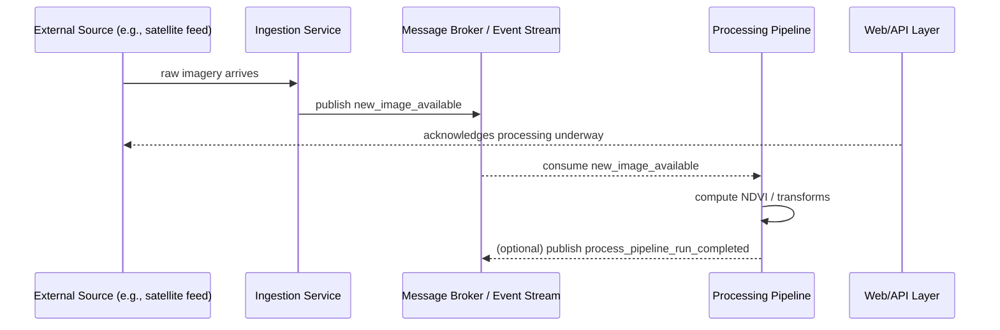
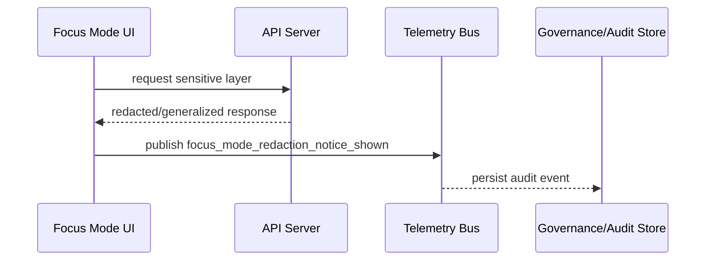

<!--
📄 File: api/src/contracts/events/topics.md
🎯 Purpose: Canonical KFM event topic registry (contract-first)
-->

# 📣 Event Topics Registry (KFM)


> **Single source of truth** for publish/subscribe topic names used by the Kansas Frontier Matrix (KFM) internal event bus.  
> If it’s not listed here, **don’t publish it** — add it here first.

---

## 🗂️ Where this lives

```text
📁 api/
  📁 src/
    📁 contracts/
      📁 events/
        📄 topics.md   ← you are here
```

---

## 🧭 Why topics exist in KFM

KFM uses an event-driven approach to **decouple ingestion, processing, and delivery**. The canonical example is: when a new satellite image arrives, an event like `new_image_available` is published so downstream services (e.g., processing pipelines) can react asynchronously. This improves resilience and avoids blocking the web/API layer waiting for processing to finish.:contentReference[oaicite:0]{index=0}

The internal message broker / data bus is **not public** — only internal components publish/subscribe.:contentReference[oaicite:1]{index=1}

For the UI, KFM may stream updates (e.g., real-time sensor updates) via WebSockets or Server-Sent Events when needed.:contentReference[oaicite:2]{index=2}

> [!IMPORTANT]
> This file is a **contract artifact**. KFM’s v13 governance emphasizes **contract-first** development: contracts (schemas/specs) are first-class and changes trigger strict versioning/compatibility checks.:contentReference[oaicite:3]{index=3}:contentReference[oaicite:4]{index=4}

---

## 🧩 Definitions

- **Topic**: A stable routing key / channel name used to publish and subscribe to events (works across RabbitMQ/Kafka/etc.). KFM explicitly mentions message queues/event streams like RabbitMQ/Kafka (or equivalents).:contentReference[oaicite:5]{index=5}
- **Event**: A message published to a topic that communicates something *already happened* (facts, not commands).
- **Producer**: Component that publishes the event.
- **Consumer**: Component(s) that subscribe and react.
- **Contract-first**: Define topic + schema first; implement second; versioning rules apply.:contentReference[oaicite:6]{index=6}
- **Sensitive / governed**: Any event that might expose sensitive layer usage, redaction behavior, or privacy-relevant interactions must align with audit & redaction expectations.:contentReference[oaicite:7]{index=7}

---

## 🔖 Topic naming rules (KFM-safe + broker-agnostic)

### ✅ Required
1. **`lower_snake_case` only**  
   (Matches documented examples like `new_image_available` and `focus_mode_redaction_notice_shown`.):contentReference[oaicite:8]{index=8}:contentReference[oaicite:9]{index=9}
2. **No dots, slashes, or spaces** (keeps the same name usable across brokers).
3. **Past tense / state change** naming (events represent facts):  
   - ✅ `pipeline_run_completed`  
   - ❌ `run_pipeline_now`
4. **One topic == one schema** (no “overloaded” payload shapes).

### 🧱 Recommended prefixes (for new topics)
To keep the namespace readable at scale, new topics SHOULD start with one of these:
- `ingest_…`
- `process_…`
- `catalog_…`
- `graph_…`
- `ui_…`
- `audit_…`
- `telemetry_…`
- `notify_…`

> [!NOTE]
> Legacy topics that predate this prefix convention (e.g., `new_image_available`) remain valid and MUST NOT be renamed (renames break consumers).:contentReference[oaicite:10]{index=10}

---

## 🧬 Versioning & compatibility rules

KFM’s backend contracts are expected to remain backwards-compatible unless a version bump is declared; contract changes must be tested against known inputs/outputs.:contentReference[oaicite:11]{index=11}

Apply that to events:

### ✅ Non-breaking changes (no new topic name)
Allowed without changing the topic string:
- Adding **optional** fields
- Adding new enum values (if consumers can ignore unknowns)
- Adding new metadata fields in the envelope

### 🚨 Breaking changes (new topic name required)
Create a new topic when you:
- Remove or rename fields
- Change field meanings
- Tighten validation in a way that rejects previously valid payloads

**Convention:** append `_v2`, `_v3`, etc.

Example:  
- `new_image_available` → `new_image_available_v2` (only if breaking)

---

## 📦 Standard event envelope (recommended)

> [!NOTE]
> The project docs emphasize deterministic, logged pipelines and governance/auditability.:contentReference[oaicite:12]{index=12}:contentReference[oaicite:13]{index=13}  
> This envelope is a practical way to carry traceability + governance metadata consistently.

```json
{
  "meta": {
    "event_id": "uuid",
    "topic": "new_image_available",
    "occurred_at": "2026-01-04T00:00:00.000Z",
    "producer": "ingestion-service",
    "schema_version": "1.0.0",
    "trace_id": "uuid-or-w3c-traceparent",
    "classification": "internal | public | sensitive",
    "redaction": {
      "applied": false,
      "reason": null
    }
  },
  "data": {}
}
```

**Security note:** Events should usually contain **references** (dataset IDs, asset IDs, catalog IDs) rather than embedding sensitive payloads directly, especially for Focus Mode and redaction-related telemetry.:contentReference[oaicite:14]{index=14}:contentReference[oaicite:15]{index=15}

---

## 🧾 Topic catalog

### ✅ Source-backed topics (explicitly referenced in KFM project docs)

| Topic | Category | Producer (typical) | Consumers (typical) | What it means | Sensitivity |
|---|---|---|---|---|---|
| `new_image_available` | ingestion | ingestion API / ingest job | processing pipelines | New raw satellite image ingested; downstream services can process asynchronously.:contentReference[oaicite:16]{index=16} | internal |
| `focus_mode_redaction_notice_shown` | audit / telemetry | UI / Focus Mode | governance logging / analytics | A sensitive layer was used in Focus Mode and a redaction notice was shown (telemetry/audit). Supports “who saw what and why.”:contentReference[oaicite:17]{index=17} | sensitive |

---

### 🧩 Proposed topic families (scaffold for implementation)

> [!IMPORTANT]
> These are **not yet source-confirmed topic strings** — they’re a recommended namespace that matches KFM’s described data flow (ingest → process → store/index → serve).:contentReference[oaicite:18]{index=18}

| Topic | Category | Producer | Consumers | Purpose | Notes |
|---|---|---|---|---|---|
| `ingest_raw_data_received` | ingestion | ingestion service | processing scheduler | Generic “raw data arrived” (satellite, CSV, sensor ping). | Prefer per-domain topics once stable. |
| `ingest_soil_measurements_available` | ingestion | ingestion service | soil ETL | Soil measurement batch ingested (CSV/etc.). | Mirrors “new soil measurements” described in flow.:contentReference[oaicite:19]{index=19} |
| `ingest_sensor_ping_received` | ingestion | MQTT listener | realtime processors | Real-time sensor ping received. | KFM mentions MQTT for sensors.:contentReference[oaicite:20]{index=20} |
| `process_pipeline_run_started` | processing | scheduler | observability / UI | A pipeline run started. | Include run_id + inputs hash. |
| `process_pipeline_run_completed` | processing | pipeline worker | catalog + indexers | A pipeline run finished successfully. | Triggers catalog updates. |
| `process_pipeline_run_failed` | processing | pipeline worker | alerts | A pipeline run failed. | Include error codes; no secrets. |
| `catalog_record_updated` | catalogs | catalog builder | API cache / UI | STAC/DCAT/PROV record updated. | Catalogs are machine-validated contracts.:contentReference[oaicite:21]{index=21} |
| `ui_stream_update_available` | UI | API server | websocket/sse gateway | Push a UI update via WS/SSE bridge. | KFM mentions WS/SSE for streaming UI updates.:contentReference[oaicite:22]{index=22} |
| `audit_sensitive_layer_accessed` | audit | API/UI | governance store | Sensitive layer accessed (governed). | Must respect redaction + audit logs expectations.:contentReference[oaicite:23]{index=23} |
| `notify_user_message_queued` | notifications | backend service | notifier | A user-facing notification was queued. | Keep payload minimal. |

---

## 🧪 Example flows

### 1) Satellite image ingestion → async processing

KFM describes publishing an event like `new_image_available` when a new satellite image is ingested; consumers (pipelines) process asynchronously while the API can respond immediately to the user.:contentReference[oaicite:24]{index=24}



### 2) Focus Mode redaction telemetry

KFM governance includes emitting telemetry like `focus_mode_redaction_notice_shown` when a sensitive layer is used and data is withheld/generalized; this supports auditing “who saw what and why.”:contentReference[oaicite:25]{index=25}



---

## ➕ Adding / changing a topic (contract-first workflow)

KFM’s contract-first approach expects you to define contracts before implementation, and to include tests + redaction rules if sensitive.:contentReference[oaicite:26]{index=26}:contentReference[oaicite:27]{index=27}

### ✅ Checklist
- [ ] Add the topic to the appropriate table above (source-backed or proposed → source-backed once implemented)
- [ ] Define a schema for the event payload (recommended path):
  ```text
  api/src/contracts/events/schemas/<topic>.schema.json
  ```
- [ ] Add contract tests to validate producer/consumer behavior (backwards-compat by default).:contentReference[oaicite:28]{index=28}
- [ ] If the event is sensitive:
  - [ ] Add/confirm redaction rules
  - [ ] Ensure UI + API do not leak data and maintain audit logs:contentReference[oaicite:29]{index=29}
- [ ] If breaking: create a new topic with `_v2` suffix (don’t mutate the old one).

---

## 🔗 References (project files)

- KFM event-driven messaging (RabbitMQ/Kafka example, `new_image_available`):contentReference[oaicite:30]{index=30}
- Internal message broker not publicly accessible; internal-only publish/subscribe:contentReference[oaicite:31]{index=31}
- UI streaming updates via WebSockets / Server-Sent Events (when needed):contentReference[oaicite:32]{index=32}
- Contract-first + API backwards-compat expectations + contract testing:contentReference[oaicite:33]{index=33}:contentReference[oaicite:34]{index=34}
- Audit trail telemetry example `focus_mode_redaction_notice_shown`:contentReference[oaicite:35]{index=35}

