# 🖥️ UI Events Contract

> 📍 Path: `api/src/contracts/events/ui`


---

## 🎯 Purpose

This directory defines **contract-first** schemas for **UI-emitted events** in **Kansas Frontier Matrix (KFM)**.

These events are used to:

- 🧾 **Audit & governance**: immutable-ish, reviewable traces of what the UI showed and how users interacted
- 🔎 **Reproducibility**: preserve a “context snapshot” (time range, layers, view) alongside user actions
- 🧠 **Explainable AI UX**: measure and improve Focus Mode transparency (citations clicked, audit panels opened)
- 📡 **Live data UX**: track subscriptions to real-time layers and dashboards
- 📴 **Offline workflows**: understand pack downloads/opens/sync attempts
- 📈 **Analytics**: product insights without leaking sensitive/PII data

> ✅ These are **observations** (what happened), not **commands** (do something).  
> If you’re trying to mutate state (create annotation, edit story, etc.), prefer a command/endpoint contract elsewhere and emit a corresponding UI event here only as telemetry.

---

## 🧭 Where UI events sit in the KFM system

KFM’s UX is intentionally **API-centric** and **provenance-first**:

- UI is decoupled from the backend via **well-defined APIs**
- UI capabilities include:
  - 🗺️ 2D map (MapLibre) + 🌍 3D globe/terrain (Cesium)
  - ⏳ time slider / temporal filters
  - 📖 Story Nodes (guided narratives with map-state steps)
  - 🧠 Focus Mode (AI assistant with citations + auditability)
  - 🧩 layer provenance panels, exports, and attribution surfaces

This folder is the *UI-to-API contract surface* for event logging and governance.

---

## ✅ Design principles

### Contract first
- Every event type has a **strict schema**
- API validates events and **rejects unknown/invalid payloads** (fail-closed mindset)

### Evidence first
- When an event refers to content, it should reference stable IDs (dataset/layer/story/prov) rather than ad-hoc labels
- UI events should help preserve “the map behind the map” by referencing provenance entities where possible

### Privacy first
- **No PII by default**
- **No precise sensitive locations** (generalize spatial context)
- Text inputs (search/focus queries) default to **hash-only** unless explicit consent & classification permit

### Minimal but meaningful
- Emit events that are useful for:
  - governance + reproducibility
  - performance / reliability
  - UX improvement
- Avoid high-volume spam (e.g., per-frame pan events)

---

## 🧱 Event envelope

All UI events MUST conform to a shared envelope so downstream systems can ingest uniformly.

### Envelope schema (conceptual)

```json
{
  "event_id": "01J2... (uuid/ulid)",
  "event_type": "ui.layer.toggled",
  "event_version": 1,
  "occurred_at": "2026-01-23T18:12:45.123Z",

  "actor": {
    "user_id": "user_123 | null",
    "anon_id": "anon_01J2... (stable per device/session)",
    "roles": ["public"],
    "authn": "anonymous | session | oauth"
  },

  "session": {
    "session_id": "sess_01J2...",
    "trace_id": "trace_01J2...",
    "page_id": "page_01J2..."
  },

  "client": {
    "app": "kfm-web",
    "app_version": "1.0.0",
    "platform": "web | ios | android",
    "locale": "en-US",
    "tz": "America/Chicago",
    "online": true
  },

  "privacy": {
    "classification": "public | internal | restricted",
    "pii": false,
    "contains_precise_location": false,
    "redactions": ["coords_to_h3_7", "query_hash_only"]
  },

  "context": {
    "map": {
      "mode": "2d | 3d",
      "viewport": {
        "bbox_wgs84": [-98.5, 37.0, -94.5, 40.0],
        "zoom": 6.8,
        "bearing": 0,
        "pitch": 0
      }
    },
    "time": {
      "mode": "range | instant",
      "start": "1930-01-01",
      "end": "1939-12-31"
    },
    "layers": {
      "active_layer_ids": ["kfm:layer:drought_index:v2"]
    },
    "story": {
      "story_id": "kfm:story:dust-bowl",
      "node_id": "kfm:storynode:dust-bowl:slide-03"
    },
    "provenance": {
      "dcat_dataset_id": "kfm:dcat:usgs:nwis",
      "stac_item_id": "kfm:stac:landsat:LT05_...",
      "prov_activity_id": "kfm:prov:activity:focus_answer:01J2..."
    }
  },

  "payload": { "..." : "event-specific fields" }
}
```

### Required vs optional fields

| Field | Required | Notes |
|------|----------|------|
| `event_id` | ✅ | Globally unique; used for dedupe |
| `event_type` | ✅ | Namespaced string (see naming rules) |
| `event_version` | ✅ | Integer major version |
| `occurred_at` | ✅ | RFC3339 timestamp in UTC |
| `actor.anon_id` | ✅ | Stable anonymous identifier (no PII) |
| `session.session_id` | ✅ | Needed for grouping |
| `client.app`, `client.app_version`, `client.platform` | ✅ | Helps triage issues |
| `privacy` | ✅ | Explicitly declare classification + redactions |
| `context` | ✅ | Required; may be minimal depending on event |
| `payload` | ✅ | Event-specific schema |

---

## 🏷️ Naming & versioning

### Event type format

Use a consistent, grep-friendly namespace:

```
ui.<domain>.<action>
```

Examples:

- `ui.session.started`
- `ui.map.viewport_changed`
- `ui.layer.toggled`
- `ui.timeline.range_changed`
- `ui.story.step_changed`
- `ui.focus.query_submitted`
- `ui.provenance.panel_opened`

### Versioning rules

- **Breaking change** → increment `event_version`
- **Additive optional fields** → allowed if:
  - schema is updated
  - consumers treat fields as optional
  - rollout order is safe (consumer updated before producer in strict validation setups)
- Never silently repurpose a field’s meaning within the same version

✅ Prefer **new fields** over “clever overloading”.

---

## 🔐 Privacy, classification, and redaction

### Hard rules

- 🚫 No names, emails, phone numbers, street addresses, raw IPs
- 🚫 No full user-agent strings unless explicitly approved (high fingerprinting risk)
- 🚫 No precise location when the layer/entity is classified sensitive
- 🚫 No raw Focus Mode prompt text by default (hash-only unless explicit consent)

### Spatial context guidance

- Prefer **coarse** spatial representations:
  - bbox rounded to a coarse precision
  - grid cell IDs (H3 / geohash / quadkey)
  - stable feature/dataset IDs without coordinates
- Set `privacy.contains_precise_location=false` when redactions are applied.

### Text input guidance

For fields like search queries or Focus Mode prompts:

- Default:
  - `query_hash` (sha256 of canonicalized text)
  - `query_len`
  - `language`
- Optional (explicit consent + non-sensitive):
  - `query_text`

> ⚠️ If you store raw text, you MUST set classification appropriately and pass policy checks.

---

## ⛓️ Provenance linking

KFM is built around traceability:

- UI should reference:
  - datasets via **DCAT**
  - spatial assets via **STAC**
  - transformations/answers via **PROV**
- UI events should include the *IDs* needed to reconstruct:
  - what was visible
  - what was asked
  - what evidence was consulted

### Minimal provenance pointers

- `dcat_dataset_id` for layers/datasets
- `stac_item_id` for imagery/time-sliced assets
- `prov_activity_id` for AI answers / transformations
- `story_id` and `node_id` for story steps
- `evidence_manifest_id` (when story evidence manifests exist)

---

## 🗂️ Event catalog

> Tip: keep UI event volume reasonable.  
> Debounce high-frequency interactions and sample performance events.

### 🧑‍🚀 Session and navigation
- `ui.session.started.v1`
- `ui.session.ended.v1`
- `ui.navigation.route_changed.v1`

### 🗺️ Map interactions
- `ui.map.viewport_changed.v1` *(debounced)*
- `ui.map.mode_changed.v1` *(2D ↔ 3D)*
- `ui.map.basemap_changed.v1`
- `ui.map.feature_selected.v1`
- `ui.map.popup_opened.v1`

### 🧱 Layer controls and provenance UX
- `ui.layer.toggled.v1`
- `ui.layer.opacity_changed.v1`
- `ui.layer.filter_changed.v1`
- `ui.layer.legend_opened.v1`
- `ui.provenance.panel_opened.v1`
- `ui.provenance.citation_clicked.v1`

### ⏳ Timeline and time filters
- `ui.timeline.range_changed.v1`
- `ui.timeline.cursor_changed.v1`
- `ui.timeline.playback_changed.v1` *(play/pause/speed)*

### 📖 Story Nodes
- `ui.story.opened.v1`
- `ui.story.step_changed.v1`
- `ui.story.exited.v1`
- `ui.story.evidence_viewed.v1`
- `ui.story.citation_clicked.v1`
- `ui.story.exported.v1`

### 🧠 Focus Mode
- `ui.focus.opened.v1`
- `ui.focus.query_submitted.v1`
- `ui.focus.answer_rendered.v1` *(view event; answer generation is logged server-side)*
- `ui.focus.citation_clicked.v1`
- `ui.focus.audit_panel_opened.v1`
- `ui.focus.feedback_submitted.v1` *(thumbs up/down, correction suggested)*

### 📡 Real-time data and dashboards
- `ui.realtime.layer_requested.v1`
- `ui.realtime.subscription_started.v1`
- `ui.realtime.subscription_stopped.v1`
- `ui.realtime.station_selected.v1`

### 📴 Offline packs and mobile field mode
- `ui.offline.pack_downloaded.v1`
- `ui.offline.pack_opened.v1`
- `ui.offline.sync_attempted.v1`

### 🧭 AR sessions
- `ui.ar.session_started.v1`
- `ui.ar.overlay_toggled.v1`

### 🧵 Pulse Threads and conceptual navigation
- `ui.pulse.feed_opened.v1`
- `ui.pulse.thread_opened.v1`
- `ui.concept.node_selected.v1`

### 🐛 Errors and performance
- `ui.error.client_error.v1`
- `ui.performance.api_latency.v1`
- `ui.performance.tile_load.v1`

---

## 🧪 Examples

### 1) Session started

```json
{
  "event_id": "01J2X9QW4JZ9G8Y0KJ1J3P7G1T",
  "event_type": "ui.session.started",
  "event_version": 1,
  "occurred_at": "2026-01-23T18:12:45.123Z",
  "actor": { "user_id": null, "anon_id": "anon_01J2X9Q...", "roles": ["public"], "authn": "anonymous" },
  "session": { "session_id": "sess_01J2X9Q...", "trace_id": "trace_01J2X9Q...", "page_id": "page_01J2X9Q..." },
  "client": { "app": "kfm-web", "app_version": "1.0.0", "platform": "web", "locale": "en-US", "tz": "America/Chicago", "online": true },
  "privacy": { "classification": "public", "pii": false, "contains_precise_location": false, "redactions": [] },
  "context": { "map": { "mode": "2d", "viewport": { "bbox_wgs84": [-102.0, 36.99, -94.6, 40.0], "zoom": 6.2, "bearing": 0, "pitch": 0 } }, "time": { "mode": "range", "start": null, "end": null }, "layers": { "active_layer_ids": [] } },
  "payload": { "entrypoint": "direct | deep_link | story_link" }
}
```

### 2) Layer toggled

```json
{
  "event_id": "01J2X9R6ZKXH9K4YFZ1Z5M1F5A",
  "event_type": "ui.layer.toggled",
  "event_version": 1,
  "occurred_at": "2026-01-23T18:13:02.008Z",
  "actor": { "user_id": null, "anon_id": "anon_01J2X9Q...", "roles": ["public"], "authn": "anonymous" },
  "session": { "session_id": "sess_01J2X9Q...", "trace_id": "trace_01J2X9Q...", "page_id": "page_01J2X9Q..." },
  "client": { "app": "kfm-web", "app_version": "1.0.0", "platform": "web", "locale": "en-US", "tz": "America/Chicago", "online": true },
  "privacy": { "classification": "public", "pii": false, "contains_precise_location": false, "redactions": ["coords_to_h3_7"] },
  "context": {
    "map": { "mode": "2d", "viewport": { "bbox_wgs84": [-98.5, 37.0, -94.5, 40.0], "zoom": 6.8, "bearing": 0, "pitch": 0 } },
    "time": { "mode": "range", "start": "1930-01-01", "end": "1939-12-31" },
    "layers": { "active_layer_ids": ["kfm:layer:drought_index:v2"] },
    "provenance": { "dcat_dataset_id": "kfm:dcat:drought_index:v2" }
  },
  "payload": {
    "layer_id": "kfm:layer:drought_index:v2",
    "state": "on",
    "trigger": "catalog | story | focus | deep_link"
  }
}
```

### 3) Focus Mode query submitted (hash-only)

```json
{
  "event_id": "01J2X9S5J1Q6B5QW9ZQ1H7S2XW",
  "event_type": "ui.focus.query_submitted",
  "event_version": 1,
  "occurred_at": "2026-01-23T18:14:11.900Z",
  "actor": { "user_id": "user_123", "anon_id": "anon_01J2X9Q...", "roles": ["public"], "authn": "oauth" },
  "session": { "session_id": "sess_01J2X9Q...", "trace_id": "trace_01J2X9S...", "page_id": "page_01J2X9Q..." },
  "client": { "app": "kfm-web", "app_version": "1.0.0", "platform": "web", "locale": "en-US", "tz": "America/Chicago", "online": true },
  "privacy": { "classification": "internal", "pii": false, "contains_precise_location": false, "redactions": ["query_hash_only"] },
  "context": {
    "map": { "mode": "2d", "viewport": { "bbox_wgs84": [-96.9, 38.9, -95.1, 39.2], "zoom": 9.1, "bearing": 0, "pitch": 0 } },
    "time": { "mode": "range", "start": "1930-01-01", "end": "1939-12-31" },
    "layers": { "active_layer_ids": ["kfm:layer:usgs_river_gauges:realtime:v1"] }
  },
  "payload": {
    "query_hash": "sha256:8b1a9953c4611296a827abf8c47804d7",
    "query_len": 64,
    "language": "en",
    "ui_context_attached": true
  }
}
```

---

## 📦 Transport and batching

UI producers SHOULD:

- batch events (e.g., 10–100 at a time)
- retry with exponential backoff
- persist a small local queue (so events survive refresh / brief offline)
- set idempotency keys (batch-level) to prevent duplicates

### Suggested batch payload

```json
{
  "batch_id": "batch_01J2X9T...",
  "sent_at": "2026-01-23T18:14:30.000Z",
  "events": [ /* UIEventEnvelope[] */ ]
}
```

---

## 🛠️ Adding a new UI event

1. 🧩 Define the **payload schema** (new model/schema file)
2. 🏷️ Register the event type + version in the event union/registry
3. ✅ Add validation tests:
   - happy path
   - policy/privacy violations
   - unknown fields (strictness)
4. 🧾 Add one example JSON block to this README
5. 🔁 Add sampling/debounce guidance if it’s high-volume

---

## ✅ Contract checklist

Before merging a new event:

- [ ] Event name follows `ui.<domain>.<action>`
- [ ] `event_version` chosen correctly (breaking vs additive)
- [ ] Payload has no PII and respects classification
- [ ] Spatial context is generalized when needed
- [ ] Provenance pointers are stable IDs (not labels)
- [ ] Example JSON included
- [ ] Tests included and passing

---

## 📚 Glossary

- **DCAT**: dataset metadata catalog references (datasets, distributions, licensing)
- **STAC**: spatiotemporal asset catalog references (imagery, tiles, assets)
- **PROV**: provenance graph references (activities, agents, entities)
- **Story Node**: narrative unit combining markdown content + map state
- **Focus Mode**: AI assistant layer that must cite sources and remain auditable
- **Pulse Thread**: short “live feed” narrative tied to data signals and locations

---

## 🧠 FAQ

### Why do we always include `context`?
Because KFM’s mission is not only “what happened”, but “what was visible/true at the time.” 
Context enables auditing, debugging, and reproducible UX/AI behavior.

### Why hash queries by default?
Free-form text can contain PII and sensitive content. Hashing preserves dedupe + analytics while reducing privacy risk.

### Why strict schemas?
KFM uses “policy as code” and provenance rules; strictness helps prevent silent data leaks and broken analytics.

---

## 🗺️ Quick mental model

```mermaid
sequenceDiagram
  autonumber
  participant UI as 🖥️ UI (React)
  participant API as 🧩 API (FastAPI)
  participant Ledger as 🧾 Governance Ledger
  participant Obs as 📊 Observability

  UI->>API: POST /events/ui (batch)
  API->>API: Validate schema + policy
  API->>Ledger: Append (auditable record)
  API->>Obs: Metrics/Tracing
  API-->>UI: 202 Accepted (or 4xx on invalid)
```



---

