# 🧩 API Contract Examples


This folder is the **canonical home for “real payload” examples** that back our API contracts (OpenAPI / GraphQL / JSON Schema). These examples serve three roles:

- 🧪 **Contract tests fixtures** (known inputs → known outputs)
- 📚 **Documentation samples** (copy/paste payloads for devs & consumers)
- 🧷 **Regression locks** (prevent “silent” breaking changes)

> [!IMPORTANT]
> In this project, **contracts are first-class artifacts**. If you change a contract, you must update examples + tests (or bump the version). Examples are part of the enforcement mechanism.

---

## 🧭 Quick links

- 📄 API change template: `../../../../docs/templates/TEMPLATE__API_CONTRACT_EXTENSION.md`
- 🧱 Master architecture + invariants: `../../../../docs/MASTER_GUIDE_v13.md`
- 🧪 Test suite root (if present): `../../../../tests/`
- 🧬 Shared schemas (if present): `../../../../schemas/`

---

## ✅ What belongs in `examples/`

Put **minimal, realistic, deterministic** samples here:

### ✅ Good examples
- `request.json` payloads for POST/PUT/PATCH
- `response.200.json`, `response.201.json`, etc.
- Error shapes: `response.400.json`, `response.404.json`, `response.422.json`
- Pagination samples (`nextCursor`, `page`, `total`, etc.) if your contract has them
- Geospatial payloads (GeoJSON, bbox) **only if** the contract explicitly includes them
- “Edge case” variants (empty arrays, nullables, optional fields omitted, etc.)

### ❌ Not allowed
- Secrets, tokens, API keys, passwords
- Real personal data / PII
- Unredacted sensitive coordinates (unless governance explicitly permits it)
- Huge blobs (keep examples lean; link to datasets elsewhere)

> [!WARNING]
> CI includes security + sensitive-data scanning in many KFM-style repos. Treat examples like production artifacts: **safe, redacted, deterministic**.

---

## 🗂️ Recommended folder structure & naming

We keep examples discoverable and diff-friendly. Prefer organizing by **API version → feature/domain → endpoint**.

```text
📁 api/
  📁 src/
    📁 contracts/
      📁 examples/
        📄 README.md
        📁 v1/
          📁 layers/
            📁 list/
              📄 response.200.json
              📄 response.401.json
          📁 story_nodes/
            📁 get/
              📄 response.200.json
              📄 response.404.json
          📁 search/
            📁 post/
              📄 request.json
              📄 response.200.json
              📄 response.422.validation_error.json
        📁 v2/
          📁 ... (only when a version bump is declared)
```

### Naming conventions (⚙️ deterministic diffs)
| Pattern | Example | When to use |
|---|---|---|
| `request.json` | `request.json` | Request body fixture |
| `response.<status>.json` | `response.200.json` | “Happy path” response |
| `response.<status>.<reason>.json` | `response.422.validation_error.json` | Error variants |
| `README.md` | per folder | Endpoint-specific notes (optional) |

**Rules of thumb**
- Keep JSON **pretty-printed** (stable diffs).
- Keep property order stable (match schema order if possible).
- Use deterministic IDs (`"id": "demo-123"`) and timestamps (`"2020-01-01T00:00:00Z"`) unless the contract explicitly requires “now”.
- Prefer **one concept per file** (avoid mega examples).

---

## 🧪 How these examples are used (CI / governance gate)

These fixtures are the “known inputs/outputs” used by API contract tests and schema validation.

```mermaid
flowchart LR
  A[📜 Contract Spec<br/>OpenAPI / GraphQL / JSON Schema] --> B[🧾 Examples<br/>request/response fixtures]
  B --> C[🧪 Contract Tests<br/>endpoint behavior]
  A --> D[🔎 Lint + Validation<br/>schema completeness]
  C --> E[🚦 CI Gate]
  D --> E
  E -->|pass| F[✅ Merge / Release]
  E -->|fail| G[⛔ Blocked<br/>fix spec/examples/tests]
```



**Practical impact**
- If a contract changes unexpectedly, examples/tests fail → **merge is blocked**.
- If a change is intentional but breaking, we do a **version bump** and keep old examples under the prior version directory.

---

## 🛠️ Adding or updating examples

### 1) Start from the contract (not the implementation) 🧩
- Update the OpenAPI/GraphQL/Schema definition first.
- Make sure it’s complete (types, required fields, error shapes).

### 2) Add/refresh fixtures in this folder 🧾
For each endpoint you touch, you should usually have:
- ✅ `response.200.json` (or `201`, etc.)
- ✅ at least one error response (e.g., `401`, `404`, `422`)
- ✅ `request.json` if the endpoint accepts a body

### 3) Update contract tests 🧪
- If examples are fixtures for tests, update snapshots/expected payloads accordingly.
- Ensure tests cover the compatibility expectations.

### 4) Run validation locally 🧰
Exact commands vary by repo, but the intent is always:
- ✅ lint the spec (OpenAPI/GraphQL)
- ✅ validate examples against schemas
- ✅ run contract tests

Here are **safe discovery commands** to find the right scripts:
```bash
# from repo root (examples)
npm run
# or, if using pnpm
pnpm -r run | grep -i contract || true
```

---

## 🧷 Compatibility rules (don’t break consumers)

> [!IMPORTANT]
> API contracts must remain backwards-compatible unless a **version bump is declared**.

Typical breaking changes (avoid unless bumping `vN/`):
- Removing a field
- Renaming a field
- Changing types (`string` → `number`)
- Tightening validation (optional → required)
- Changing error shape in a way that breaks client parsing

Non-breaking changes (usually OK):
- Adding new optional fields
- Adding new enum values (⚠️ only if clients can tolerate unknown values)
- Adding new endpoints

---

## 🌎 Geospatial payload tips (only if your contract includes geometry)

If your API returns geometries:
- Prefer **GeoJSON** structures that are easy to validate and test.
- Keep coordinates **small and non-sensitive** in examples.
- If a payload references a real dataset or evidence artifact, link it by **stable ID** (don’t embed huge raw data).

---

## 📌 Mini glossary

- **Contract artifact**: a machine-validated spec that defines an interface (OpenAPI, GraphQL SDL, JSON Schema).
- **Contract-first**: build from the spec; changes trigger versioning + compatibility checks.
- **Examples (fixtures)**: canonical payloads used in tests/docs to pin behavior over time.

---

## ✅ Definition of Done (for changes in this folder)

- [ ] Front-matter present and correct (`title`, `path`, `version`, `last_updated`, `doc_uuid`, etc.)
- [ ] Example JSON is deterministic (no random IDs/timestamps)
- [ ] Examples match the current schema/contract
- [ ] At least one happy-path + one error-path example per touched endpoint
- [ ] No secrets / PII / sensitive coordinates in examples
- [ ] Contract tests updated and passing
- [ ] Links in this README (and any nested README) are not broken

---

## 🧠 Pro-tip: keep endpoint notes close to the fixtures

If an endpoint has tricky behavior (pagination, redaction rules, “preview” flags), add a small `README.md` inside that endpoint’s example folder:

```text
📁 v1/search/post/
  📄 README.md   <-- small notes + gotchas
  📄 request.json
  📄 response.200.json
  📄 response.422.validation_error.json
```

That keeps institutional knowledge next to the artifacts that enforce it. 🧷

