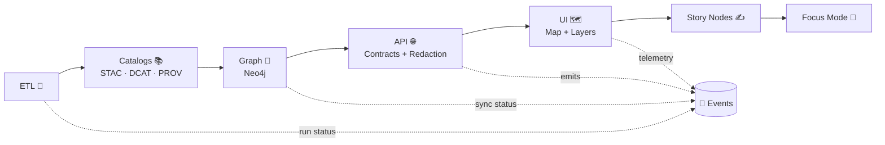

# 📣 Event Contract Examples


> 🧱 These files are **contract fixtures**: treat them like tests.  
> If an example changes, you’re effectively changing what downstream systems *expect*.

---

## 🎯 Purpose

This folder contains **example event payloads** for KFM/Kansas-Matrix-System contracts. They exist to:

- ✅ Document the **canonical shape** of events (what producers emit + consumers rely on)
- ✅ Power **contract tests** / mocks / sample data during local dev
- ✅ Provide **copy/paste-ready** examples for new event types

---

## 🧭 Where Events Fit in the KFM Pipeline

KFM is built on a strict boundary ordering (data → catalogs → graph → API → UI → narrative). Events are the “glue” that announce boundary transitions and audit-sensitive interactions.



---

## 🧱 Non‑Negotiables

### 1) Events are contract artifacts 🧾
Events must be **machine-validated** (schema-backed) and treated as a stable interface between subsystems.

### 2) No breaking changes without a version bump 🔢
If a consumer could break, **create a new version** (e.g., `v2`) instead of mutating `v1`.

### 3) Evidence-first payloads 🔗
Prefer **references** over raw payload dumps:
- link to STAC Items / Collections
- link to DCAT dataset IDs / distributions
- link to PROV bundles / run IDs / commit SHAs

### 4) No data leakage 🛡️
Events are easy to log, replay, and export. Don’t put:
- PII
- secrets
- precise protected locations
- restricted cultural knowledge

When in doubt: emit **a reference + classification**, not the raw data.

### 5) Auditability is a feature ✅
Sensitive interactions should be auditable (e.g., redaction notices shown), without disclosing the sensitive content itself.

---

## 📐 Recommended Event Envelope

This repo does not mandate a specific “industry envelope” — but we **do** require consistent metadata so events can be validated, traced, and audited.

### ✅ Minimal envelope shape

| Field | Type | Required | Why it exists |
|------:|------|:--------:|--------------|
| `meta.event_id` | string (UUID) | ✅ | Idempotency + traceability |
| `meta.event_type` | string | ✅ | Stable routing key (contract identity) |
| `meta.event_version` | string | ✅ | Breaking-change control (`v1`, `v2`, …) |
| `meta.occurred_at` | string (ISO-8601) | ✅ | Ordering + audit |
| `meta.producer` | string | ✅ | Accountability (which subsystem emitted) |
| `meta.trace.correlation_id` | string | ✅ | End-to-end tracing across boundaries |
| `meta.trace.causation_id` | string | ⚪ | “What caused this?” chaining |
| `meta.classification` | object | ✅ | Governance + sovereignty + safety |
| `meta.provenance` | object | ⚪ | Link to PROV/run/commit for evidence-first |
| `meta.links` | object | ⚪ | Pointers to STAC/DCAT/etc. |
| `data` | object | ✅ | Domain-specific payload |

### 🔖 Naming & versioning rules

- **Event type** uses lowercase snake_case (example: `focus_mode_redaction_notice_shown`)
- **Version** is **major-only** in the envelope: `v1`, `v2`  
  - Minor changes should be backwards-compatible
  - Breaking changes → bump major and publish a new schema + new example

---

## 🧪 Example Payloads

> 🧩 These examples are intentionally **small** and **safe**.  
> Use references (`urn:kfm:…`) instead of embedding large or sensitive data.

<details>
<summary>📦 <code>dataset_published</code> <em>(catalog boundary: STAC/DCAT/PROV available)</em></summary>

```json
{
  "meta": {
    "event_id": "2f4b7c3a-7d31-4f86-8b8d-5a5d5e9d3f0e",
    "event_type": "dataset_published",
    "event_version": "v1",
    "occurred_at": "2026-01-04T00:00:00Z",
    "producer": "kfm.pipelines.catalog_publisher",
    "trace": {
      "correlation_id": "9e6b5bb4-4a15-4a15-a9d5-0d5d5b12b1e0",
      "causation_id": "5f7a3e4f-2b12-4b12-9d0a-3fbb8c3a9f21"
    },
    "classification": {
      "sensitivity": "public",
      "care_label": "Public",
      "license": "CC-BY-4.0"
    },
    "provenance": {
      "pipeline_run_id": "run_2026_01_04T000000Z_01",
      "git_sha": "abc123def4567890abc123def4567890abc123de",
      "prov_bundle_id": "urn:kfm:prov:bundle:air-quality:run_2026_01_04T000000Z_01"
    },
    "links": {
      "stac_item": "urn:kfm:stac:item:air-quality:aqs-station:KS-001-0001",
      "dcat_dataset": "urn:kfm:dcat:dataset:air-quality:epa-aqs"
    }
  },
  "data": {
    "dataset_id": "urn:kfm:dataset:air-quality:epa-aqs",
    "dataset_version": "2026.01",
    "published_assets": [
      {
        "kind": "stac_item",
        "id": "urn:kfm:stac:item:air-quality:aqs-station:KS-001-0001"
      }
    ],
    "message": "Catalog boundary artifacts are published; downstream stages may ingest."
  }
}
```

</details>

<details>
<summary>🧠 <code>graph_sync_completed</code> <em>(graph boundary: sync done, references remain in catalogs)</em></summary>

```json
{
  "meta": {
    "event_id": "bd4a1c3e-8df0-4b1c-b7e2-03aa3a1f6b51",
    "event_type": "graph_sync_completed",
    "event_version": "v1",
    "occurred_at": "2026-01-04T00:03:42Z",
    "producer": "kfm.graph.sync",
    "trace": {
      "correlation_id": "9e6b5bb4-4a15-4a15-a9d5-0d5d5b12b1e0",
      "causation_id": "2f4b7c3a-7d31-4f86-8b8d-5a5d5e9d3f0e"
    },
    "classification": {
      "sensitivity": "public",
      "care_label": "Public",
      "license": "CC-BY-4.0"
    },
    "provenance": {
      "pipeline_run_id": "run_2026_01_04T000000Z_01",
      "git_sha": "abc123def4567890abc123def4567890abc123de"
    },
    "links": {
      "stac_item": "urn:kfm:stac:item:air-quality:aqs-station:KS-001-0001",
      "prov_bundle_id": "urn:kfm:prov:bundle:air-quality:run_2026_01_04T000000Z_01"
    }
  },
  "data": {
    "graph_target": "neo4j",
    "ontology_version": "v11",
    "sync_summary": {
      "nodes_written": 1245,
      "edges_written": 4521,
      "warnings": 0,
      "duration_ms": 81234
    },
    "message": "Graph sync completed. Nodes/edges reference catalog identifiers (no raw data embedded)."
  }
}
```

</details>

<details>
<summary>🛡️ <code>focus_mode_redaction_notice_shown</code> <em>(audit/telemetry: sensitive data was withheld)</em></summary>

```json
{
  "meta": {
    "event_id": "8bdf91a7-8f2d-4e7b-a6aa-850a4c0db7f4",
    "event_type": "focus_mode_redaction_notice_shown",
    "event_version": "v1",
    "occurred_at": "2026-01-04T00:12:09Z",
    "producer": "kfm.web.focus_mode",
    "trace": {
      "correlation_id": "d9b2f7cc-8f5a-4db2-9a88-2d5f4d8d2a10",
      "causation_id": "req_9fd14c7a"
    },
    "classification": {
      "sensitivity": "public",
      "care_label": "Public",
      "license": "CC-BY-4.0"
    },
    "links": {
      "story_node_id": "urn:kfm:story_node:land-treaties:example:v1",
      "policy_refs": [
        "docs/governance/SOVEREIGNTY.md",
        "docs/governance/ETHICS.md"
      ]
    }
  },
  "data": {
    "ui_surface": "focus_mode",
    "layer_id": "protected_locations",
    "redaction_applied": true,
    "redaction_reason": "sovereignty_protected_locations",
    "withheld_fields": [
      "geometry.precise",
      "coordinates"
    ],
    "user_visible_notice": "Some location details are withheld or generalized due to sovereignty protections."
  }
}
```

</details>

---

## ✅ Adding a New Event Example

1. **Define/Update the schema first** 🧾  
   Events are contract-first — start with the schema, not the code.

2. **Create an example JSON** in this folder 🧪  
   Keep it small, realistic, and safe.

3. **Include governance + classification metadata** 🛡️  
   Add `meta.classification` at minimum.

4. **Link evidence instead of embedding it** 🔗  
   Prefer STAC/DCAT/PROV IDs, run IDs, commit SHAs.

5. **Run validation locally** 🧰  
   Your example should pass schema validation before PR.

---

## 🔍 Validation (Local)

> Your repo may already have a contract validation script. If not, this is the general idea.

### Option A: Repo script (recommended)
```bash
# Example (adapt to your package manager / scripts):
npm run contracts:validate
```

### Option B: AJV (JSON Schema)
```bash
# Example (adapt paths to your actual schema + example):
npx ajv validate \
  -s api/src/contracts/events/<event_type>/v1.schema.json \
  -d api/src/contracts/examples/events/<event_type>.v1.example.json \
  --strict=true
```

---

## 🛡️ Governance & Sensitive Data Notes

- ✅ Emit *audit signals*, not sensitive payloads.
- ✅ Keep classification consistent across transformations.
- ✅ If something is sensitive, prefer:
  - generalized geometry
  - hashed identifiers
  - references gated by the API boundary
- ✅ Events should help answer: **“who saw what and why”** without disclosing restricted info.

---

## 🔗 Related Docs (Repo Root)

> Paths below assume this repo contains `docs/` at the root (monorepo style).

- 📘 Master Guide (pipeline + contracts): `../../../../../docs/MASTER_GUIDE_v13.md`
- ⚖ Governance root: `../../../../../docs/governance/ROOT_GOVERNANCE.md`
- 🛡️ Sovereignty: `../../../../../docs/governance/SOVEREIGNTY.md`
- 🧭 Ethics: `../../../../../docs/governance/ETHICS.md`
- 📚 Standards profiles: `../../../../../docs/standards/`

