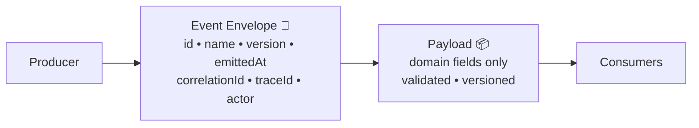

# 📦 Event Payload Contracts

   

> 🎯 This folder is the **single source of truth** for **event payload shapes** used by producers + consumers across the Kansas-Matrix-System.

---

## 🧭 What this folder is for

KFM uses **message queues / event streams** to decouple processes (publish → subscribe) so systems can react asynchronously (ex: data ingestion triggers downstream processing).  
This directory holds the **contracted payload types** that travel inside those events. ✅

### ✅ In scope
- **Payload-only** schemas/types for domain + telemetry events
- **Versioned** payload definitions (v1, v2, …)
- Shared exports so publishers/consumers don’t invent their own shapes

### ❌ Out of scope
- Transport concerns (Kafka topics, RabbitMQ exchanges, routing keys, retries)
- Business logic (no services, DB calls, orchestration)
- UI-only shapes (those belong in UI contracts)

---

## ✉️ Event anatomy

An event is usually split into:

- **Envelope** 📨: metadata for routing, tracing, governance, idempotency  
- **Payload** 📦: domain-specific data for the event

This folder is **payload-only**.



> 🧠 Tip: Keep the envelope stable and push domain evolution into **payload versions**.

---

## 🗂️ Suggested layout

> Use this as the mental model (actual files may vary by module conventions):


```text
📁 api/
└── 📁 src/
    └── 📁 contracts/
        └── 📁 events/
            ├── 📁 envelopes/                    📨 transport-agnostic metadata contracts
            └── 📁 payloads/                     📦 (you are here)
                ├── 📁 ingestion/
                │   └── 🧾 new_image_available.v1.ts
                ├── 📁 telemetry/
                │   └── 🧾 focus_mode_redaction_notice_shown.v1.ts
                ├── 🧾 index.ts                  📦 barrel exports
                └── 📝 README.md                 📘 payloads guide
```
---

## 🏷️ Naming rules

### Event names
Use **snake_case** and describe something that *happened*:

- ✅ `new_image_available`
- ✅ `focus_mode_redaction_notice_shown`
- ✅ `pipeline_run_completed`

### Files
Pick **one** convention and stick to it repo-wide:

**Option A (recommended):**
- `<event_name>.v<major>.ts`
  - `new_image_available.v1.ts`
  - `new_image_available.v2.ts`

**Option B:**
- `<event_name>/v<major>.ts`
  - `new_image_available/v1.ts`

---

## 🔢 Versioning policy

Payload contracts are **API contracts**. Treat them the same way: **don’t break consumers.** 🧱

### ✅ Backwards-compatible changes
These changes **do not** require a major payload version bump:

- Add a **new optional** field
- Add a new enum value (only if consumers are coded defensively)
- Add a new nested optional object
- Clarify docs/comments without changing meaning

### 🚨 Breaking changes
These require **a new major payload version**:

- Remove a field
- Rename a field
- Change a field type (string → number, etc.)
- Make an optional field required
- Change semantics (field means something different now)

#### Compatibility cheat-sheet
| Change | Compatible | What to do |
|---|---:|---|
| Add optional field | ✅ | Keep same major |
| Add required field | ❌ | Create `vNext` |
| Rename field | ❌ | Create `vNext` + migration plan |
| Remove field | ❌ | Create `vNext` |
| Change meaning | ❌ | Create `vNext` + document semantics |

---

## ✅ Contract-first workflow

Payloads are **first-class repo artifacts**. That means:

- Contracts are authored intentionally (not inferred ad-hoc from runtime objects)
- Contract changes must be **versioned** and **validated**
- Contract changes should be **tested against known fixtures**

> 🧪 If your change can’t be expressed as a non-breaking addition, don’t “sneak it in”. Version it.

---

## 🧪 Validation strategy

Even if you have strong typing, consumers may be in different runtimes.  
So we strongly recommend **runtime validation** too:

- 📜 TypeScript types/interfaces for dev ergonomics
- 🧾 JSON Schema or validator layer for runtime enforcement

**Common pattern**
- Payload type in `*.ts`
- Runtime schema in `schemas/...` (if present in repo)
- CI checks ensure schema + payload types stay aligned

---

## ➕ Adding a new payload

### Step-by-step checklist ✅
- [ ] Pick a **domain folder** (`telemetry/`, `ingestion/`, `graph/`, `ui/`, etc.)
- [ ] Choose an event name in **snake_case**
- [ ] Create the versioned payload contract file (`<event>.v1.ts`)
- [ ] Export it from `payloads/index.ts`
- [ ] Add a **sample fixture** (recommended) for producers + consumers
- [ ] Add/extend **runtime validation** (schema/validator) if the repo supports it
- [ ] Add a **contract test** that validates sample payloads against the contract

### Definition of done 🧩
- Payload is versioned
- Payload is documented (field intent + units + timestamp format)
- Payload has at least one sample fixture
- Contract test passes

---

## 🔒 Privacy, redaction, and telemetry events

Some events exist specifically to support governance and auditability (ex: redaction notices).  
When payloads relate to sensitive access:

- ✅ Prefer **IDs / references** (dataset IDs, layer IDs) over raw data
- ✅ Log **what policy happened**, not the protected value
- ✅ Keep payloads minimal and clearly scoped
- ❌ Do not emit secrets, tokens, or raw sensitive fields into events

> 🧯 If you’re unsure whether something is sensitive: treat it as sensitive and keep it out of the payload.

---

## 📚 Examples

<details>
<summary>📦 Example payload: <code>new_image_available.v1</code></summary>

```ts
/**
 * Published when a new raw image enters the ingestion boundary.
 * Keep this payload small: references + timestamps only.
 */
export interface NewImageAvailablePayloadV1 {
  /** Stable ID for the raw asset in storage or catalog */
  imageId: string;

  /** Domain identifier (ex: which dataset collection this belongs to) */
  datasetId: string;

  /** ISO-8601 timestamp for when the image was captured */
  capturedAt: string;

  /** Optional: ingestion run correlation */
  ingestionRunId?: string;
}
```

```json
{
  "imageId": "img_01JABCDEF123",
  "datasetId": "satellite/landsat",
  "capturedAt": "2026-01-04T10:22:11.000Z",
  "ingestionRunId": "run_20260104_001"
}
```
</details>

<details>
<summary>🛰️ Example payload: <code>focus_mode_redaction_notice_shown.v1</code></summary>

```ts
/**
 * Telemetry signal indicating a user-facing redaction occurred.
 * Never include the redacted value. Include reason + references only.
 */
export interface FocusModeRedactionNoticeShownPayloadV1 {
  /** The governed resource that was requested */
  resourceId: string;

  /** What policy action happened (high-level) */
  action: "withheld" | "generalized" | "masked";

  /** Why it happened (policy code or short reason) */
  reasonCode: string;

  /** Optional UI context */
  uiSurface?: "map" | "story" | "focus_mode" | "other";
}
```

```json
{
  "resourceId": "layer:land-treaties:1846-map",
  "action": "generalized",
  "reasonCode": "CARE_SENSITIVE_CONTEXT",
  "uiSurface": "focus_mode"
}
```
</details>

---

## 🔗 Related docs

> Repo paths may differ by package layout — update links if needed.

- 📘 Master Guide: `../../../../../docs/MASTER_GUIDE_v13.md`
- 🧩 API contract template: `../../../../../docs/templates/TEMPLATE__API_CONTRACT_EXTENSION.md`
- 🧾 Schemas directory: `../../../../../schemas/`
- 🏛️ Governance docs: `../../../../../docs/governance/`

---

## 👥 Ownership

- **Primary owners:** API / Platform contracts maintainers 🧰  
- **Review required:** Governance owners for telemetry + redaction-adjacent payloads 🛡️

---
