<!--
📁 Path: api/src/contracts/examples/events/payloads/ingestion/README.md
🎯 Purpose: Canonical example payloads for ingestion-domain events (batch + streaming)
-->

# Ingestion Event Payload Examples 📥


> 🧭 **Evidence-first rule:** If it can’t be traced back to a source + process, it doesn’t ship.

This folder documents **example JSON payloads** for ingestion-related events in the Kansas Frontier Matrix (KFM).  
These examples are intended to be:

- ✅ **copy/paste-ready** for local testing, contract tests, and integrations  
- ✅ **provenance-first** (STAC/DCAT/PROV evidence triplet)  
- ✅ **policy-gated** (schema/license/sensitivity/provenance checks; fail-closed)  
- ✅ **idempotent + auditable** (run manifests + deterministic digests)  
- ✅ **UI-ready** (feeds timeline, layers, dashboards; provenance always visible)

---

## 📚 Contents

- [Why ingestion events exist](#-why-ingestion-events-exist)
- [Folder layout](#-folder-layout)
- [Event envelope](#-event-envelope)
  - [Recommended: CloudEvents](#recommended-cloudevents)
  - [Also supported: NDJSON telemetry line](#also-supported-ndjson-telemetry-line)
- [Common KFM ingestion fields](#-common-kfm-ingestion-fields)
- [Event type catalog](#-event-type-catalog)
- [Payload examples](#-payload-examples)
- [Invariants & policy gates](#-invariants--policy-gates)
- [Consumers & flow](#-consumers--flow)
- [Glossary](#-glossary)
- [Internal references](#-internal-references)

---

## 🧩 Why ingestion events exist

In KFM, ingestion isn’t “a script ran” — it’s a **reproducible, governed publication pipeline**:

- **Raw → Work → Processed** staging (raw is immutable; processed is publishable)
- **Policy gates** at ingestion checkpoints (schema, license, sensitivity, provenance, STAC/DCAT/PROV completeness)
- **Observability**: every run emits append-only telemetry (great for audits + debugging)
- **Provenance is first-class**: the UI + AI (Focus Mode) surface citations & lineage, not black boxes

Events are the glue for:
- 🔔 triggering downstream jobs (graph ingest, tiles rebuild, vector indexing)
- 📈 dashboards & metrics (lag, failure rates, cost/energy telemetry)
- 🗺️ UI real-time overlays (sensor updates, new layers published)
- 🧠 AI retrieval pipelines (index refresh, document extraction completion)

---

## 🗂️ Folder layout

```text
api/
└─ src/
   └─ contracts/
      └─ examples/
         └─ events/
            └─ payloads/
               └─ ingestion/
                  ├─ ✅ README.md   ← you are here
                  ├─ 📄 (optional) run.started.json
                  ├─ 📄 (optional) asset.fetched.json
                  ├─ 📄 (optional) gate.completed.json
                  ├─ 📄 (optional) catalog.published.json
                  ├─ 📄 (optional) graph.upserted.json
                  ├─ 📄 (optional) stream.observation.ingested.json
                  └─ 📄 (optional) run.completed.json
```

> 💡 If you add new example JSON files, keep them **schema-valid** and **stable** (examples are part of the contract surface).

---

## 📦 Event envelope

### Recommended: CloudEvents

We recommend a **CloudEvents v1.0 compatible envelope** (portable across Kafka/NATS/SNS/SQS/Webhooks).

Minimal envelope fields used in these examples:

| Field | Type | Notes |
|------:|------|-------|
| `specversion` | string | `"1.0"` |
| `type` | string | Namespaced event type, e.g. `kfm.ingestion.run.started` |
| `source` | string | Producer service, e.g. `kfm.pipelines.ingest` |
| `id` | string | UUID/ULID |
| `time` | string | RFC3339 UTC |
| `subject` | string | Optional: dataset/asset target |
| `datacontenttype` | string | Usually `application/json` |
| `data` | object | Domain payload |

Optional but recommended:
- `traceparent` (W3C trace context)
- `kfm*` extension attributes (if you need them at the envelope level)

Spec reference (for implementers): `https://cloudevents.io/`

---

### Also supported: NDJSON telemetry line

KFM pipelines often emit an append-only telemetry ledger as **NDJSON** (one JSON object per line).

Two common patterns:

1) ✅ **Store the CloudEvent as-is** (each line is a CloudEvent JSON)  
2) ✅ Wrap it with logging metadata (`level`, `logger`, `msg`, etc.)

Example wrapper shown later in [Telemetry example](#telemetry-example-ndjson).

---

## 🧱 Common KFM ingestion fields

These keys appear in most ingestion events (inside `data`):

### `run`

| Field | Type | Notes |
|------:|------|-------|
| `run_id` | string | Unique run identifier (used across all emitted events) |
| `attempt` | number | Retry counter |
| `config_hash` | string | Hash of the pipeline configuration used |
| `idempotency_key` | string | Deterministic digest for “same inputs + same config” |
| `started_at / ended_at` | string | RFC3339 UTC |
| `manifest` | object | Optional inline run-manifest summary |
| `manifest_ref` | object | Pointer to stored manifest (path + digest) |

### `dataset`

| Field | Type | Notes |
|------:|------|-------|
| `dataset_id` | string | Stable ID (namespaced) |
| `dataset_version` | string | Version (timestamp-based or semantic) |
| `title` | string | Human-friendly label |
| `domain` | string | e.g. `hydrology`, `historical_maps`, `census`, `archeology` |
| `license` | string | MUST be present before publish |
| `sensitivity` | object | Classification + redaction hints |

### `policy`

| Field | Type | Notes |
|------:|------|-------|
| `decision` | string | `pass` / `fail` |
| `checks` | object | Gate-specific boolean checks |
| `violations` | array | Zero or more structured failures |
| `bundle` | object | Policy bundle/version used |

### `evidence`

KFM’s “Evidence Triplet”:

| Field | Type | Notes |
|------:|------|-------|
| `stac` | object | STAC Item/Collection refs |
| `dcat` | object | DCAT Dataset/Distribution refs |
| `prov` | object | W3C PROV bundle refs |

Spec references (for implementers):
- STAC: `https://stacspec.org/`
- DCAT: `https://www.w3.org/TR/vocab-dcat-3/`
- PROV: `https://www.w3.org/TR/prov-overview/`

---

## 🏷️ Event type catalog

Suggested naming: `kfm.<domain>.<noun>.<verb>` (dot-separated)

| Event type | Meaning |
|-----------|---------|
| `kfm.ingestion.run.started` | Pipeline run started (plan + inputs known) |
| `kfm.ingestion.asset.fetched` | A raw asset was fetched and stored immutably |
| `kfm.ingestion.gate.completed` | A policy gate finished (pass/fail + violations) |
| `kfm.ingestion.catalog.published` | STAC/DCAT/PROV published for a dataset version |
| `kfm.ingestion.processed.published` | Processed artifact(s) published (tiles/COGs/parquet/etc.) |
| `kfm.ingestion.graph.upserted` | Knowledge graph + indices updated |
| `kfm.ingestion.stream.observation.ingested` | Real-time/streaming observation ingested |
| `kfm.ingestion.ai.document.extracted` | OCR/NLP extraction completed for a document batch |
| `kfm.ingestion.artifact.published` | OCI artifact pushed + signed (optional distribution mode) |
| `kfm.ingestion.run.completed` | Pipeline completed (summary + pointers) |
| `kfm.ingestion.run.failed` | Pipeline failed (error summary + pointers) |

---

## 🧪 Payload examples

> 🧠 Tip: Keep IDs consistent across the examples when testing end-to-end (same `run_id`, `dataset_id`, etc.).

### 1) Run started ✅

<details>
<summary><strong>📄 CloudEvent: kfm.ingestion.run.started</strong></summary>

```json
{
  "specversion": "1.0",
  "type": "kfm.ingestion.run.started",
  "source": "kfm.pipelines.ingest",
  "id": "6b4b1f54-0a1e-4d7a-9f2d-5c97f05f8d16",
  "time": "2026-01-23T12:30:00Z",
  "subject": "dataset/kfm.ks.hydrology.usgs_nwis.realtime",
  "datacontenttype": "application/json",
  "traceparent": "00-4bf92f3577b34da6a3ce929d0e0e4736-00f067aa0ba902b7-01",
  "data": {
    "run": {
      "run_id": "run_20260123T123000Z_7c9f",
      "attempt": 1,
      "trigger": {
        "kind": "schedule",
        "requested_by": "system",
        "reason": "hourly-refresh"
      },
      "config_hash": "sha256:0e3f88d9f4b6b0e73aa79f1f0f4d1a3b1c2d3e4f5a6b7c8d9e0f112233445566",
      "idempotency_key": "sha256:rfc8785:4d1a3b2c1f9e8d7c6b5a4f33221100ffeeddccbbaa99887766554433221100aa",
      "started_at": "2026-01-23T12:30:00Z"
    },
    "dataset": {
      "dataset_id": "kfm.ks.hydrology.usgs_nwis.realtime",
      "dataset_version": "2026-01-23T12:30:00Z",
      "title": "USGS NWIS Realtime Stations (Kansas)",
      "domain": "hydrology",
      "license": "public-domain",
      "sensitivity": {
        "classification": "public",
        "requires_location_generalization": false
      }
    },
    "plan": {
      "inputs": [
        {
          "kind": "http",
          "uri": "https://example.invalid/usgs/nwis/stations.geojson",
          "expected_content_type": "application/geo+json"
        }
      ],
      "outputs": [
        {
          "kind": "artifact",
          "format": "geojson",
          "stage": "raw"
        },
        {
          "kind": "artifact",
          "format": "geoparquet",
          "stage": "processed"
        },
        {
          "kind": "catalog",
          "formats": ["stac", "dcat", "prov"]
        }
      ]
    }
  }
}
```

</details>

---

### 2) Raw asset fetched 🧾

<details>
<summary><strong>📄 CloudEvent: kfm.ingestion.asset.fetched</strong></summary>

```json
{
  "specversion": "1.0",
  "type": "kfm.ingestion.asset.fetched",
  "source": "kfm.pipelines.ingest.fetcher",
  "id": "f0ac5cf6-94ab-4a5c-9b4e-7ef0b4b1a4c8",
  "time": "2026-01-23T12:30:09Z",
  "subject": "asset/raw/kfm.ks.hydrology.usgs_nwis.realtime/stations.geojson",
  "datacontenttype": "application/json",
  "data": {
    "run": {
      "run_id": "run_20260123T123000Z_7c9f",
      "attempt": 1,
      "config_hash": "sha256:0e3f88d9f4b6b0e73aa79f1f0f4d1a3b1c2d3e4f5a6b7c8d9e0f112233445566"
    },
    "dataset": {
      "dataset_id": "kfm.ks.hydrology.usgs_nwis.realtime",
      "dataset_version": "2026-01-23T12:30:00Z",
      "license": "public-domain",
      "sensitivity": { "classification": "public" }
    },
    "asset": {
      "asset_id": "raw:stations.geojson",
      "source_uri": "https://example.invalid/usgs/nwis/stations.geojson",
      "content_type": "application/geo+json",
      "bytes": 2876543,
      "etag": "\"c19b2f-2bf12d-5f5e100\"",
      "retrieved_at": "2026-01-23T12:30:09Z",
      "checksum": {
        "algo": "sha256",
        "value": "c5c7a9992b1a7b5f3f2caa1a1b2c3d4e5f60718293a4b5c6d7e8f90a1b2c3d4e"
      },
      "storage": {
        "stage": "raw",
        "path": "data/raw/kfm.ks.hydrology.usgs_nwis.realtime/2026-01-23T12-30-00Z/stations.geojson",
        "checksums_file": "data/raw/kfm.ks.hydrology.usgs_nwis.realtime/2026-01-23T12-30-00Z/checksums.sha256"
      }
    },
    "provenance": {
      "activity_id": "prov:activity:fetch:run_20260123T123000Z_7c9f:stations",
      "agent": {
        "kind": "service",
        "id": "kfm.pipelines.ingest.fetcher"
      }
    },
    "metrics": {
      "fetch_ms": 913,
      "retries": 0
    }
  }
}
```

</details>

---

### 3) Policy gate completed (pass/fail) 🛡️

<details>
<summary><strong>📄 CloudEvent: kfm.ingestion.gate.completed (PASS)</strong></summary>

```json
{
  "specversion": "1.0",
  "type": "kfm.ingestion.gate.completed",
  "source": "kfm.pipelines.ingest.gates",
  "id": "c0b6d2c2-7b3a-4a4a-a1d9-3e02c2b8d0f0",
  "time": "2026-01-23T12:30:12Z",
  "subject": "gate/ingestion/minimum-v13",
  "datacontenttype": "application/json",
  "data": {
    "run": {
      "run_id": "run_20260123T123000Z_7c9f",
      "attempt": 1
    },
    "dataset": {
      "dataset_id": "kfm.ks.hydrology.usgs_nwis.realtime",
      "dataset_version": "2026-01-23T12:30:00Z"
    },
    "policy": {
      "decision": "pass",
      "bundle": {
        "name": "kfm.policy.minimum",
        "version": "v13"
      },
      "checks": {
        "schema_valid": true,
        "license_present": true,
        "sensitivity_classified": true,
        "provenance_declared": true,
        "stac_dcat_prov_required_for_publish": true,
        "fair_care_lite": true
      },
      "violations": []
    }
  }
}
```

</details>

<details>
<summary><strong>📄 CloudEvent: kfm.ingestion.gate.completed (FAIL)</strong></summary>

```json
{
  "specversion": "1.0",
  "type": "kfm.ingestion.gate.completed",
  "source": "kfm.pipelines.ingest.gates",
  "id": "2a2c0a4d-77b0-4a5f-b2b1-003db1a9c52f",
  "time": "2026-01-23T12:30:12Z",
  "subject": "gate/ingestion/minimum-v13",
  "datacontenttype": "application/json",
  "data": {
    "run": {
      "run_id": "run_20260123T123000Z_7c9f",
      "attempt": 1
    },
    "dataset": {
      "dataset_id": "kfm.ks.archaeology.sites.private",
      "dataset_version": "2026-01-23T12:30:00Z"
    },
    "policy": {
      "decision": "fail",
      "bundle": {
        "name": "kfm.policy.minimum",
        "version": "v13"
      },
      "checks": {
        "schema_valid": true,
        "license_present": true,
        "sensitivity_classified": true,
        "requires_location_generalization": true,
        "location_generalization_applied": false
      },
      "violations": [
        {
          "code": "SENSITIVE_LOCATION_NOT_GENERALIZED",
          "message": "Dataset marked sensitive but coordinates are still precise.",
          "path": "$.asset.geometry"
        }
      ]
    }
  }
}
```

</details>

---

### 4) Evidence triplet published (STAC/DCAT/PROV) 🧾🧷

<details>
<summary><strong>📄 CloudEvent: kfm.ingestion.catalog.published</strong></summary>

```json
{
  "specversion": "1.0",
  "type": "kfm.ingestion.catalog.published",
  "source": "kfm.catalog.publisher",
  "id": "a7f4a2a1-9b8a-41b7-9c78-0c1f8c9a7b9c",
  "time": "2026-01-23T12:31:05Z",
  "subject": "dataset/kfm.ks.hydrology.usgs_nwis.realtime@2026-01-23T12:30:00Z",
  "datacontenttype": "application/json",
  "data": {
    "run": {
      "run_id": "run_20260123T123000Z_7c9f"
    },
    "dataset": {
      "dataset_id": "kfm.ks.hydrology.usgs_nwis.realtime",
      "dataset_version": "2026-01-23T12:30:00Z",
      "license": "public-domain",
      "sensitivity": { "classification": "public" }
    },
    "evidence": {
      "stac": {
        "collection_id": "kfm.ks.hydrology.usgs_nwis.realtime",
        "items": [
          {
            "item_id": "stac:item:kfm.ks.hydrology.usgs_nwis.realtime:stations:2026-01-23T12:30:00Z",
            "href": "data/catalog/stac/items/hydrology/usgs_nwis/stations_2026-01-23T12-30-00Z.json",
            "digest": "sha256:11aa22bb33cc44dd55ee66ff77889900aabbccddeeff00112233445566778899"
          }
        ]
      },
      "dcat": {
        "dataset_id": "dcat:kfm.ks.hydrology.usgs_nwis.realtime",
        "href": "data/catalog/dcat/kfm.ks.hydrology.usgs_nwis.realtime.jsonld",
        "digest": "sha256:aa00bb11cc22dd33ee44ff556677889900aabbccddeeff001122334455667788"
      },
      "prov": {
        "bundle_id": "prov:bundle:run_20260123T123000Z_7c9f",
        "href": "data/prov/kfm.ks.hydrology.usgs_nwis.realtime/2026-01-23T12-30-00Z.prov.jsonld",
        "digest": "sha256:bb11cc22dd33ee44ff556677889900aabbccddeeff00112233445566778899aa"
      }
    }
  }
}
```

</details>

---

### 5) Processed artifact published 🧱🗺️

<details>
<summary><strong>📄 CloudEvent: kfm.ingestion.processed.published</strong></summary>

```json
{
  "specversion": "1.0",
  "type": "kfm.ingestion.processed.published",
  "source": "kfm.pipelines.ingest.publisher",
  "id": "d0f8a3b1-2aab-44ed-98c5-6f1b3f2a9b0a",
  "time": "2026-01-23T12:31:25Z",
  "subject": "dataset/kfm.ks.hydrology.usgs_nwis.realtime@2026-01-23T12:30:00Z",
  "datacontenttype": "application/json",
  "data": {
    "run": {
      "run_id": "run_20260123T123000Z_7c9f"
    },
    "dataset": {
      "dataset_id": "kfm.ks.hydrology.usgs_nwis.realtime",
      "dataset_version": "2026-01-23T12:30:00Z"
    },
    "artifacts": [
      {
        "stage": "processed",
        "format": "geoparquet",
        "path": "data/processed/kfm.ks.hydrology.usgs_nwis.realtime/2026-01-23T12-30-00Z/stations.parquet",
        "checksum": {
          "algo": "sha256",
          "value": "cc22dd33ee44ff556677889900aabbccddeeff00112233445566778899aabbcc"
        },
        "spatial": {
          "crs": "EPSG:4326",
          "bbox": [-102.05, 36.99, -94.59, 40.00]
        }
      },
      {
        "stage": "processed",
        "format": "pmtiles",
        "path": "data/processed/kfm.ks.hydrology.usgs_nwis.realtime/2026-01-23T12-30-00Z/stations.pmtiles",
        "checksum": {
          "algo": "sha256",
          "value": "dd33ee44ff556677889900aabbccddeeff00112233445566778899aabbccdde0"
        }
      }
    ],
    "evidence_ref": {
      "stac_item_id": "stac:item:kfm.ks.hydrology.usgs_nwis.realtime:stations:2026-01-23T12:30:00Z",
      "prov_bundle_id": "prov:bundle:run_20260123T123000Z_7c9f"
    }
  }
}
```

</details>

---

### 6) Graph upserted (Neo4j + indices) 🕸️

<details>
<summary><strong>📄 CloudEvent: kfm.ingestion.graph.upserted</strong></summary>

```json
{
  "specversion": "1.0",
  "type": "kfm.ingestion.graph.upserted",
  "source": "kfm.graph.ingest",
  "id": "9d3b2b8c-0d2b-4a1d-8b2b-6c0d3b2b8c0d",
  "time": "2026-01-23T12:32:10Z",
  "subject": "dataset/kfm.ks.hydrology.usgs_nwis.realtime@2026-01-23T12:30:00Z",
  "datacontenttype": "application/json",
  "data": {
    "run": {
      "run_id": "run_20260123T123000Z_7c9f"
    },
    "dataset": {
      "dataset_id": "kfm.ks.hydrology.usgs_nwis.realtime",
      "dataset_version": "2026-01-23T12:30:00Z"
    },
    "graph": {
      "job_id": "graph_job_20260123T123210Z_01",
      "mode": "upsert",
      "nodes_upserted": 1842,
      "edges_upserted": 3921,
      "indexes_refreshed": ["place_text", "dataset_catalog", "time_range"],
      "constraints": {
        "no_mystery_nodes": true,
        "evidence_required": true
      }
    },
    "evidence_ref": {
      "dcat_dataset_id": "dcat:kfm.ks.hydrology.usgs_nwis.realtime",
      "prov_bundle_id": "prov:bundle:run_20260123T123000Z_7c9f"
    }
  }
}
```

</details>

---

### 7) Streaming observation ingested 🌊⏱️

<details>
<summary><strong>📄 CloudEvent: kfm.ingestion.stream.observation.ingested</strong></summary>

```json
{
  "specversion": "1.0",
  "type": "kfm.ingestion.stream.observation.ingested",
  "source": "kfm.streaming.watcher",
  "id": "f2c7b4aa-3d53-4f7f-9c4b-ff2e2a1d9b88",
  "time": "2026-01-23T12:33:00Z",
  "subject": "observation/usgs/06892350/2026-01-23T12:33:00Z",
  "datacontenttype": "application/json",
  "data": {
    "run": {
      "run_id": "run_20260123T123000Z_7c9f"
    },
    "dataset": {
      "dataset_id": "kfm.ks.hydrology.usgs_nwis.realtime",
      "dataset_version": "2026-01-23T12:30:00Z",
      "sensitivity": { "classification": "public" }
    },
    "observation": {
      "observation_id": "obs:usgs:06892350:2026-01-23T12:33:00Z",
      "station_id": "06892350",
      "observed_at": "2026-01-23T12:33:00Z",
      "measure": {
        "name": "discharge",
        "value": 120.4,
        "unit": "ft3/s"
      },
      "quality_flags": ["provisional"],
      "geometry": {
        "type": "Point",
        "coordinates": [-95.235, 39.045]
      }
    },
    "provenance": {
      "activity_id": "prov:activity:stream_ingest:obs:usgs:06892350:2026-01-23T12:33:00Z",
      "agent": {
        "kind": "service",
        "id": "kfm.streaming.watcher"
      }
    },
    "idempotency": {
      "dedupe_key": "redis:kfm:obs:usgs:06892350:2026-01-23T12:33:00Z",
      "window": "1m"
    }
  }
}
```

</details>

---

### 8) AI document extraction completed 🧠📄

Use this when ingestion includes OCR/NLP extraction that will later be indexed (graph + semantic search).  
AI outputs **must remain traceable** (inputs, prompts/config hashes, and review flags).

<details>
<summary><strong>📄 CloudEvent: kfm.ingestion.ai.document.extracted</strong></summary>

```json
{
  "specversion": "1.0",
  "type": "kfm.ingestion.ai.document.extracted",
  "source": "kfm.ai.extractor",
  "id": "1c2d3e4f-5566-7788-9900-aabbccddeeff",
  "time": "2026-01-23T12:40:12Z",
  "subject": "document/kfm.archives.letters/box-12/folder-3/doc-009",
  "datacontenttype": "application/json",
  "data": {
    "run": {
      "run_id": "run_20260123T123000Z_7c9f"
    },
    "document": {
      "document_id": "kfm.archives.letters.box12.folder3.doc009",
      "source_path": "data/raw/kfm.archives.letters/box-12/folder-3/doc-009.pdf",
      "page_count": 7,
      "language": ["en"]
    },
    "extraction": {
      "ocr": {
        "engine": "tesseract",
        "confidence_avg": 0.93
      },
      "entities": [
        { "type": "place", "value": "Lawrence", "confidence": 0.88 },
        { "type": "person", "value": "John Brown", "confidence": 0.62 },
        { "type": "date", "value": "1856-05-21", "confidence": 0.91 }
      ],
      "links_suggested": [
        {
          "relation": "mentions",
          "target": "place:kfm.geo.lawrence_ks",
          "confidence": 0.84
        }
      ]
    },
    "ai": {
      "generated": true,
      "requires_human_review": true,
      "model_family": "llm",
      "config_hash": "sha256:7e7a6b6c6d6e6f00112233445566778899aabbccddeeff001122334455667788",
      "prompt_hash": "sha256:abcdef00112233445566778899aabbccddeeff00112233445566778899aabbcc"
    },
    "policy": {
      "decision": "pass",
      "checks": {
        "pii_scan": true,
        "citation_links_present": true,
        "sensitivity_classified": true
      },
      "violations": []
    }
  }
}
```

</details>

---

### 9) OCI artifact published + signed (optional) 📦🔏

Some pipelines may distribute processed datasets as **OCI artifacts** (content-addressed, signed).  
This is especially useful for reproducible distribution, mirroring, and “artifact-as-a-release”.

<details>
<summary><strong>📄 CloudEvent: kfm.ingestion.artifact.published</strong></summary>

```json
{
  "specversion": "1.0",
  "type": "kfm.ingestion.artifact.published",
  "source": "kfm.artifacts.publisher",
  "id": "0d0c0b0a-0908-0706-0504-03020100ffee",
  "time": "2026-01-23T12:45:00Z",
  "subject": "oci/kfm.ks.hydrology.usgs_nwis.realtime@2026-01-23T12:30:00Z",
  "datacontenttype": "application/json",
  "data": {
    "run": { "run_id": "run_20260123T123000Z_7c9f" },
    "dataset": {
      "dataset_id": "kfm.ks.hydrology.usgs_nwis.realtime",
      "dataset_version": "2026-01-23T12:30:00Z"
    },
    "oci": {
      "ref": "ghcr.io/kfm/artifacts/kfm.ks.hydrology.usgs_nwis.realtime:2026-01-23T12-30-00Z",
      "digest": "sha256:1234567890abcdef1234567890abcdef1234567890abcdef1234567890abcdef",
      "signed": true,
      "signature_digest": "sha256:fedcba0987654321fedcba0987654321fedcba0987654321fedcba0987654321",
      "referrers": [
        {
          "kind": "prov-jsonld",
          "digest": "sha256:bb11cc22dd33ee44ff556677889900aabbccddeeff00112233445566778899aa"
        }
      ]
    },
    "evidence_ref": {
      "prov_bundle_id": "prov:bundle:run_20260123T123000Z_7c9f"
    }
  }
}
```

</details>

---

### 10) Run completed 🎉

<details>
<summary><strong>📄 CloudEvent: kfm.ingestion.run.completed</strong></summary>

```json
{
  "specversion": "1.0",
  "type": "kfm.ingestion.run.completed",
  "source": "kfm.pipelines.ingest",
  "id": "e3b0c442-98fc-1c14-9afb-f4c8996fb924",
  "time": "2026-01-23T12:46:10Z",
  "subject": "run/run_20260123T123000Z_7c9f",
  "datacontenttype": "application/json",
  "data": {
    "run": {
      "run_id": "run_20260123T123000Z_7c9f",
      "attempt": 1,
      "started_at": "2026-01-23T12:30:00Z",
      "ended_at": "2026-01-23T12:46:10Z",
      "status": "success",
      "config_hash": "sha256:0e3f88d9f4b6b0e73aa79f1f0f4d1a3b1c2d3e4f5a6b7c8d9e0f112233445566",
      "idempotency_key": "sha256:rfc8785:4d1a3b2c1f9e8d7c6b5a4f33221100ffeeddccbbaa99887766554433221100aa",
      "manifest_ref": {
        "path": "data/audits/run_20260123T123000Z_7c9f/run_manifest.json",
        "digest": "sha256:4d1a3b2c1f9e8d7c6b5a4f33221100ffeeddccbbaa99887766554433221100aa"
      },
      "telemetry_ref": {
        "path": "data/audits/run_20260123T123000Z_7c9f/telemetry.ndjson"
      }
    },
    "dataset": {
      "dataset_id": "kfm.ks.hydrology.usgs_nwis.realtime",
      "dataset_version": "2026-01-23T12:30:00Z"
    },
    "summary": {
      "raw_assets_fetched": 1,
      "processed_artifacts_published": 2,
      "catalogs_published": ["stac", "dcat", "prov"],
      "graph_upserted": true,
      "policy_gates_passed": true
    }
  }
}
```

</details>

---

### Telemetry example (NDJSON)

If using a wrapper line for NDJSON telemetry:

```json
{
  "ts": "2026-01-23T12:31:05Z",
  "level": "info",
  "logger": "kfm.pipelines.ingest",
  "event": {
    "specversion": "1.0",
    "type": "kfm.ingestion.catalog.published",
    "source": "kfm.catalog.publisher",
    "id": "a7f4a2a1-9b8a-41b7-9c78-0c1f8c9a7b9c",
    "time": "2026-01-23T12:31:05Z",
    "subject": "dataset/kfm.ks.hydrology.usgs_nwis.realtime@2026-01-23T12:30:00Z",
    "datacontenttype": "application/json",
    "data": {
      "run": { "run_id": "run_20260123T123000Z_7c9f" },
      "dataset": { "dataset_id": "kfm.ks.hydrology.usgs_nwis.realtime", "dataset_version": "2026-01-23T12:30:00Z" }
    }
  }
}
```

---

## ✅ Invariants & policy gates

KFM is deliberately “strict by default”:

### 🚦 Fail-closed policy gates

If a gate fails, the pipeline **must stop** and the system must not publish partial/broken artifacts.

Minimum gate set (v13-ish baseline):
- ✅ schema validation
- ✅ license presence
- ✅ sensitivity classification (and sensitive handling applied)
- ✅ provenance completeness
- ✅ STAC/DCAT/PROV completeness (required before publish)
- ✅ FAIR/CARE-lite governance checks

### 🧬 Provenance-first publishing rule

**Processed/public layers** are only considered “published” when:
- the data exists in `processed/` (or distributed artifact store), **and**
- the evidence triplet is available (STAC + DCAT + PROV), **and**
- policy gates are green

### 🧱 Pipeline stage ordering

Stages must follow:
1) `raw` (immutable; checksums stored)
2) `work` (scratch/intermediate)
3) `processed` (publishable artifacts)
4) `catalog` (STAC/DCAT/PROV)
5) `graph/index` (Neo4j + search indices)

> 🧠 Why? It prevents “mystery layers” and makes debugging + provenance reconstruction possible.

### 🕵️ Privacy & sensitive data

For sensitive datasets (e.g., protected cultural sites, endangered species, certain personal/safety data):
- Require explicit `sensitivity.classification`
- Apply location generalization/redaction if required
- Enforce access control (don’t leak via events!)
- Consider query auditing / inference-control for derived outputs

---

## 🔄 Consumers & flow

```mermaid
flowchart LR
  A[Sources 🌐] --> B[Ingestion Pipeline 🧪]
  B --> C[(Raw Store 🧊)]
  B --> D[(Work Store 🧰)]
  B --> E[(Processed Store 📦)]
  B --> F[Evidence Triplet 🧾<br/>STAC/DCAT/PROV]
  F --> G[API Layer 🔌]
  G --> H[UI 🗺️ Timeline + Layers]
  G --> I[Focus Mode 🧠 + Citations]

  B --> J[[Event Bus 🔔]]
  J --> K[Graph Ingest 🕸️]
  J --> L[Dashboards 📈]
  J --> M[Realtime UI overlays ⏱️]
  J --> N[Index Refresh 🔎]
```



---

## 📘 Glossary

- **Evidence Triplet**: The set of (STAC + DCAT + PROV) metadata artifacts required to treat a dataset as governed + publishable.
- **Fail-closed**: If a required check fails, do not continue publishing; prevent downstream propagation.
- **Run manifest**: A structured record of inputs, config, versions, and digests used for reproducibility + idempotency.
- **Idempotency key**: Deterministic digest that allows safe retries and “same run” detection.
- **Streaming window**: A dedupe / batching strategy (e.g., 1-minute) to avoid re-ingesting identical observations.

---

## 📎 Internal references

These examples are grounded in the project’s core design docs & supporting research resources:

- 📚 **KFM Data Intake – Technical & Design Guide** (raw/work/processed, gates, telemetry, manifests)
- 🧭 **KFM Architecture, Features, and Design** (policy gates, W-P-E agents, contract-first services)
- 🗺️ **KFM UI System Overview** (timeline, story nodes, real-time dashboards, provenance surfaced)
- 🤖 **KFM AI System Overview** (RAG, graph integration, citations, provenance constraints)
- 🌟 **Latest Ideas & Future Proposals** (OCI distribution, automation, future pipelines)
- 💡 **Innovative Concepts** + **Additional Project Ideas** (digital twins, simulations, AR, advanced distribution)
- 🧱 **Open-Source Geospatial Historical Mapping Hub Design** (COGs, GeoJSON/GeoTIFF, OCR pipelines)
- 🧠 **AI Concepts & more** + **Data Mining Concepts & Applications** (embeddings, cleansing, privacy, auditing)
- 🌍 **Geospatial/WebGL portfolios** (map rendering patterns, virtual worlds, geospatial graphics)
- 🧰 **Programming/Data Management portfolios** (event-driven patterns, data architecture ideas)

---

🛠️ **Maintainer note:** If a downstream system needs additional fields, prefer adding them under `data.extensions` (or a schema-governed sub-object) rather than breaking existing payload shapes.

