# Telemetry Payload Examples 📡


> [!IMPORTANT]
> This folder contains **payload-only** examples for telemetry events.  
> The **event envelope** (e.g., `event_id`, `type`, `time`, `source`, etc.) is defined elsewhere in the contracts layer.  
> Think: **Envelope = routing + identity**, **Payload (this folder) = structured telemetry data**.

---

## 📁 Where you are

```text
📦 api
└── 📁 src
    └── 📁 contracts
        └── 📁 examples
            └── 📁 events
                └── 📁 payloads
                    └── 📁 telemetry
                        └── 📄 README.md   👈 you are here
```

---

## 🎯 What “Telemetry” means in KFM

KFM telemetry is designed to be:

- **Structured** (JSON objects with stable keys)
- **Joinable** (connects to provenance + catalog + graph + UI actions)
- **Governance-aware** (classification, policy outcomes, redaction & approvals)
- **Replay/audit friendly** (run identifiers + config hashes + idempotency keys)
- **Append-only** (no silent rewrites; NDJSON ledgers are encouraged for high-volume lanes)

Telemetry is **not** meant to be:
- a dumping ground for verbose logs
- a place to store dataset content
- a place to store user PII, secrets, or raw sensitive coordinates

> [!NOTE]
> KFM’s design explicitly leans on:
> - **append-only NDJSON** telemetry ledgers for ingestion/streaming 🧾  
> - **run identifiers + configuration hashes** for replay/audit 🔁  
> - **Focus Telemetry** for AI latency + energy/sustainability metrics ⚡🌍  
> - **immutable governance ledger** for AI outputs & key decisions 🧷

---

## 🧭 Telemetry flow (high level)

```mermaid
flowchart LR
  subgraph PIPES["📥 Pipelines - ETL streaming QA"]
    A[🌐 Fetch ingest] --> B[✅ Validate gate]
    B --> C[🧪 Transform]
    C --> D[📦 Publish - STAC DCAT PROV]
  end

  subgraph AI["🧠 AI Focus Mode"]
    F[🔎 Retrieve evidence] --> G[✍️ Generate answer]
    G --> H[🛡️ Governance checks]
  end

  subgraph UIX["🗺️ UI"]
    U[🎛️ Layer toggles] --> V[🧾 Provenance panel]
    V --> W[📤 Exports story nodes]
  end

  A --> T[📡 Telemetry stream]
  B --> T
  C --> T
  D --> T
  F --> T
  G --> T
  H --> T
  U --> T

  T --> X[📊 Dashboards alerts]
  T --> Y[🧾 NDJSON ledgers]
  T --> Z[🔐 Governance audit trail]
```



---

## ✅ Contract goals for telemetry payloads

### 1) Reproducibility & auditability 🔁
Telemetry must contain enough metadata to answer:
- *What ran?* (pipeline/step)
- *With what inputs & config?* (source URLs, config hash)
- *What happened?* (status, counts, errors)
- *Where is the evidence trail?* (links to STAC/DCAT/PROV + manifests)

### 2) Traceability across the whole platform 🧩
Telemetry must support joins across:
- **runs** (pipeline run_id)
- **requests** (correlation_id / trace context)
- **artifacts** (manifest digests, file hashes, OCI digests)
- **knowledge graph** (dataset IDs, prov activity IDs)
- **UI** (session IDs, action context)

### 3) Governance + sustainability baked in ⚖️⚡
Telemetry is a first-class QA output and can be used for:
- policy gates (OPA/Rego/Conftest outcomes)
- redaction events
- sensitive access audits
- energy/carbon metrics & health checks

---

## 🧱 Payload schema (at-a-glance)

> [!TIP]
> These examples follow a **Telemetry v2-style** structure (stable base + `kind`-specific blocks).
> If your implementation uses a different internal shape, keep the *concepts* the same and update examples accordingly.

### Common top-level fields (recommended)

| Field | Type | Why it exists |
|---|---:|---|
| `schema_version` | string | Contract version (SemVer) |
| `kind` | string | Dot-separated event kind (`pipeline.run.completed`, `focus.query`, etc.) |
| `ts` | string | RFC3339 timestamp (UTC preferred) |
| `level` | `"debug" \| "info" \| "warn" \| "error"` | Severity & filtering |
| `message` | string? | Human-readable summary (short!) |
| `run` | object? | Run identity + reproducibility anchors |
| `correlation` | object? | Trace IDs / request IDs / parent chain |
| `actor` | object? | User/service/agent identity (minimized) |
| `target` | object? | What dataset/layer/entity this touches |
| `metrics` | object? | Timings, counts, bytes, energy |
| `policy` | object? | Policy decisions / waivers |
| `provenance` | object? | Pointers to PROV/STAC/DCAT/graph IDs |
| `artifacts` | array? | Run manifests, energy reports, signed bundles |
| `privacy` | object? | Classification + redaction hints |
| `tags` | string[]? | Searchable labels |

---

## 🧷 Common object shapes

### `run` (replay + determinism) 🔁
Recommended fields:
- `run_id` (ULID/UUID)
- `pipeline` (name)
- `step` (optional)
- `env` (`dev`/`staging`/`prod`)
- `commit_sha` (git)
- `config_hash` (hash of config inputs)
- `idempotency_key` (stable digest for “same inputs = same run”)
- `canonical_digest` (RFC8785 canonical JSON hash, when applicable)
- `tool_versions` (version list for reproducibility)

### `correlation` (traceability) 🧵
Recommended fields:
- `correlation_id` (request/session/thread id)
- `trace_id` / `span_id` (OTel-friendly)
- `parent_event_id` (if chained)

### `policy` (gates & governance) ⚖️
Recommended fields:
- `policy_pack` (version/tag)
- `decision` (`pass`/`fail`/`warn`)
- `denies[]` (rule IDs + reasons)
- `waivers[]` (approved exceptions)
- `telemetry_ref` / `energy_report_ref` (when gates require artifacts)

### `privacy` (minimization) 🕶️
Recommended fields:
- `classification` (`public`/`internal`/`restricted`/`sensitive`)
- `contains_pii` (boolean)
- `redactions[]` (what was removed + why)
- `query_handling` (e.g., `hashed`, `redacted`, `stored_with_consent`)

---

## 📦 Example payloads (copy/paste)

> [!NOTE]
> Each example is a **payload only**. Your event envelope should attach this under its `data` field (or equivalent).

---

### 1) `pipeline.run.started` — start of a deterministic pipeline run 🚀

<details>
<summary><strong>Example JSON</strong> (click to expand)</summary>

```json
{
  "schema_version": "2.0.0",
  "kind": "pipeline.run.started",
  "ts": "2026-01-23T18:42:11.123Z",
  "level": "info",
  "message": "Ingest run started",
  "run": {
    "run_id": "01J0M7Q8J7Y7P4B9D1M2ZK0E7A",
    "pipeline": "kfm.ingest.hydrology.river_gauges",
    "env": "staging",
    "commit_sha": "bb86bf1707b50a9d3d43b06896fd387851de92b3",
    "config_hash": "sha256:5a2d0d1b4f59c41b8b8a55f2c9a7f21ed6c93f9f6b1f4a2d6b8e7c1a9d0e1123",
    "idempotency_key": "sha256:2b6d1b7d7c3b3f1c2f33d70d8e6b04e0c1a7e0b9fd31c2c2f7d2bb3a1d5f0a11",
    "canonical_digest": "sha256:2b6d1b7d7c3b3f1c2f33d70d8e6b04e0c1a7e0b9fd31c2c2f7d2bb3a1d5f0a11",
    "tool_versions": [
      "python==3.11.7",
      "gdal==3.8.4",
      "postgis==3.4.2"
    ]
  },
  "correlation": {
    "correlation_id": "req_8d7a3a0d9a9f4b7c",
    "trace_id": "4bf92f3577b34da6a3ce929d0e0e4736",
    "span_id": "00f067aa0ba902b7"
  },
  "target": {
    "domain": "hydrology",
    "dataset_id": "kfm.dataset.hydrology.river_gauges",
    "source_urls": [
      "https://example.usgs.gov/api/river_gauges?state=KS"
    ]
  },
  "privacy": {
    "classification": "public",
    "contains_pii": false
  },
  "metrics": {
    "expected_poll_interval_minutes": 15
  },
  "provenance": {
    "prov_activity_id": "kfm.prov.activity:ingest:01J0M7Q8J7Y7P4B9D1M2ZK0E7A"
  }
}
```

</details>

---

### 2) `pipeline.step` — ingestion gate telemetry (append-only / audit friendly) 🧾✅

This example mirrors the “ingestion gate” concept and is suitable for NDJSON ledgers.

<details>
<summary><strong>Example JSON</strong> (click to expand)</summary>

```json
{
  "schema_version": "2.0.0",
  "kind": "pipeline.step",
  "ts": "2026-01-23T18:42:14.900Z",
  "level": "info",
  "message": "Ingestion gate passed",
  "run": {
    "run_id": "01J0M7Q8J7Y7P4B9D1M2ZK0E7A",
    "pipeline": "kfm.ingest.hydrology.river_gauges",
    "step": "ingestion_gate",
    "env": "staging",
    "commit_sha": "bb86bf1707b50a9d3d43b06896fd387851de92b3",
    "config_hash": "sha256:5a2d0d1b4f59c41b8b8a55f2c9a7f21ed6c93f9f6b1f4a2d6b8e7c1a9d0e1123"
  },
  "target": {
    "dataset_id": "kfm.dataset.hydrology.river_gauges",
    "source": "usgs",
    "stage": "raw"
  },
  "metrics": {
    "duration_ms": 1820,
    "bytes_in": 34912,
    "records_in": 42,
    "checksum_count": 1
  },
  "policy": {
    "decision": "pass",
    "policy_pack": "kfm-policy-pack@v1",
    "denies": []
  },
  "artifacts": [
    {
      "type": "ndjson_telemetry_ref",
      "ref": "data/audits/01J0M7Q8J7Y7P4B9D1M2ZK0E7A/telemetry.ndjson"
    },
    {
      "type": "checksums",
      "ref": "data/raw/hydrology/river_gauges/checksums.sha256"
    }
  ],
  "privacy": {
    "classification": "public",
    "contains_pii": false
  }
}
```

</details>

---

### 3) `pipeline.run.completed` — end of run with counts + energy report ⚡🌍✅

<details>
<summary><strong>Example JSON</strong> (click to expand)</summary>

```json
{
  "schema_version": "2.0.0",
  "kind": "pipeline.run.completed",
  "ts": "2026-01-23T18:42:45.010Z",
  "level": "info",
  "message": "Ingest run completed successfully",
  "run": {
    "run_id": "01J0M7Q8J7Y7P4B9D1M2ZK0E7A",
    "pipeline": "kfm.ingest.hydrology.river_gauges",
    "env": "staging",
    "commit_sha": "bb86bf1707b50a9d3d43b06896fd387851de92b3",
    "config_hash": "sha256:5a2d0d1b4f59c41b8b8a55f2c9a7f21ed6c93f9f6b1f4a2d6b8e7c1a9d0e1123",
    "idempotency_key": "sha256:2b6d1b7d7c3b3f1c2f33d70d8e6b04e0c1a7e0b9fd31c2c2f7d2bb3a1d5f0a11"
  },
  "metrics": {
    "duration_ms": 33887,
    "records_in": 42,
    "records_out": 42,
    "bytes_in": 34912,
    "bytes_out": 8120,
    "warnings": 0,
    "errors": 0,
    "energy_kwh_est": 0.012,
    "carbon_kgco2e_est": 0.004
  },
  "provenance": {
    "prov_bundle_ref": "data/prov/01J0M7Q8J7Y7P4B9D1M2ZK0E7A/prov.json",
    "dcat_dataset_ref": "data/catalog/dcat/hydrology/river_gauges.jsonld",
    "stac_collection_ref": "data/stac/collections/hydrology-river-gauges.json",
    "graph_import_ref": "data/graph/csv/hydrology/river_gauges/"
  },
  "artifacts": [
    {
      "type": "run_manifest",
      "ref": "data/audits/01J0M7Q8J7Y7P4B9D1M2ZK0E7A/run_manifest.json",
      "digest": "sha256:2b6d1b7d7c3b3f1c2f33d70d8e6b04e0c1a7e0b9fd31c2c2f7d2bb3a1d5f0a11"
    },
    {
      "type": "energy_report",
      "ref": "data/audits/01J0M7Q8J7Y7P4B9D1M2ZK0E7A/energy_report.json",
      "digest": "sha256:9a6f4d3a6f02db9a9d2be7d1b32a7f1c44f0c4b4f2e1aef81a09b1c2d3e4f567"
    }
  ],
  "policy": {
    "decision": "pass",
    "policy_pack": "kfm-policy-pack@v1",
    "denies": [],
    "telemetry_ref": "data/audits/01J0M7Q8J7Y7P4B9D1M2ZK0E7A/telemetry.ndjson",
    "energy_report_ref": "data/audits/01J0M7Q8J7Y7P4B9D1M2ZK0E7A/energy_report.json"
  },
  "privacy": {
    "classification": "public",
    "contains_pii": false
  }
}
```

</details>

---

### 4) `stream.checkpoint` — streaming lane telemetry (minimal, NDJSON-friendly) 🌊⏱️

<details>
<summary><strong>Example JSON</strong> (click to expand)</summary>

```json
{
  "schema_version": "2.0.0",
  "kind": "stream.checkpoint",
  "ts": "2026-01-23T18:45:00.000Z",
  "level": "info",
  "message": "Streaming checkpoint committed",
  "run": {
    "run_id": "01J0M7Q8J7Y7P4B9D1M2ZK0E7A",
    "pipeline": "kfm.ingest.hydrology.river_gauges",
    "step": "poll_and_upsert"
  },
  "target": {
    "dataset_id": "kfm.dataset.hydrology.river_gauges",
    "source": "usgs"
  },
  "metrics": {
    "window_minutes": 15,
    "records_in": 42,
    "records_written": 42,
    "anomalies_flagged": 0
  },
  "artifacts": [
    {
      "type": "ndjson_telemetry_ref",
      "ref": "data/audits/01J0M7Q8J7Y7P4B9D1M2ZK0E7A/stream_telemetry.ndjson"
    }
  ],
  "privacy": {
    "classification": "public",
    "contains_pii": false
  }
}
```

</details>

---

### 5) `policy.decision` — governance gate output (fail-closed ready) ⚖️🚫

<details>
<summary><strong>Example JSON</strong> (click to expand)</summary>

```json
{
  "schema_version": "2.0.0",
  "kind": "policy.decision",
  "ts": "2026-01-23T18:42:16.150Z",
  "level": "warn",
  "message": "Policy gate raised warnings (merge allowed with waiver)",
  "run": {
    "run_id": "01J0M7Q8J7Y7P4B9D1M2ZK0E7A",
    "pipeline": "kfm.ingest.hydrology.river_gauges",
    "step": "policy_gate"
  },
  "policy": {
    "policy_pack": "kfm-policy-pack@v1",
    "decision": "warn",
    "denies": [
      {
        "rule_id": "KFM-META-002",
        "severity": "warn",
        "reason": "Missing recommended provider contact field"
      }
    ],
    "waivers": [
      {
        "waiver_id": "waiver_2026_01_23_001",
        "approved_by": "role:maintainer",
        "reason": "Provider contact pending; safe to proceed for staging"
      }
    ]
  },
  "provenance": {
    "dcat_dataset_ref": "data/catalog/dcat/hydrology/river_gauges.jsonld"
  },
  "privacy": {
    "classification": "internal",
    "contains_pii": false
  }
}
```

</details>

---

### 6) `focus.query` — Focus Mode telemetry (latency + energy + governance) 🧠⚡🧾

> [!IMPORTANT]
> Focus telemetry should avoid storing raw user PII.  
> Prefer **hashing** or **redacting** questions unless explicitly allowed by policy.

<details>
<summary><strong>Example JSON</strong> (click to expand)</summary>

```json
{
  "schema_version": "2.0.0",
  "kind": "focus.query",
  "ts": "2026-01-23T19:03:21.442Z",
  "level": "info",
  "message": "Focus query answered with citations",
  "correlation": {
    "correlation_id": "session_9b6b1e3a",
    "trace_id": "0af7651916cd43dd8448eb211c80319c",
    "span_id": "b7ad6b7169203331"
  },
  "actor": {
    "actor_type": "user",
    "actor_id": "user_anon_6c0e",
    "session_id": "session_9b6b1e3a"
  },
  "target": {
    "domain": "hydrology",
    "dataset_ids": [
      "kfm.dataset.hydrology.river_gauges"
    ]
  },
  "privacy": {
    "classification": "internal",
    "contains_pii": false,
    "query_handling": "hashed"
  },
  "focus": {
    "question_hash": "sha256:7a6b5b8f3b1c44f2d9b0a8c2e1f0d1c9a7b6c5d4e3f2a1b0c9d8e7f6a5b4c3d2",
    "retrieval": {
      "sources_considered": 12,
      "sources_cited": 5,
      "graph_query_ms": 94,
      "catalog_lookup_ms": 38
    },
    "model": {
      "name": "kfm-llm",
      "latency_ms": 1120,
      "prompt_tokens": 1320,
      "completion_tokens": 420
    },
    "governance": {
      "decision": "pass",
      "rules_applied": [
        "citations_required",
        "no_sensitive_leakage",
        "prov_chain_intact"
      ],
      "human_review_required": false
    }
  },
  "metrics": {
    "total_latency_ms": 1402,
    "energy_kwh_est": 0.003,
    "carbon_kgco2e_est": 0.001
  },
  "artifacts": [
    {
      "type": "governance_ledger_ref",
      "ref": "data/governance/ledger.ndjson"
    }
  ]
}
```

</details>

---

### 7) `ui.action` — user-visible provenance & UI interactions 🗺️🧭

<details>
<summary><strong>Example JSON</strong> (click to expand)</summary>

```json
{
  "schema_version": "2.0.0",
  "kind": "ui.action",
  "ts": "2026-01-23T19:05:10.200Z",
  "level": "info",
  "message": "Layer toggled and provenance panel opened",
  "correlation": {
    "correlation_id": "session_9b6b1e3a"
  },
  "actor": {
    "actor_type": "user",
    "actor_id": "user_anon_6c0e",
    "session_id": "session_9b6b1e3a"
  },
  "ui": {
    "route": "/map",
    "action": "layer.toggle",
    "layer_id": "kfm.layer.hydrology.river_gauges.latest",
    "provenance_panel_opened": true,
    "viewport": {
      "bbox_wgs84": [
        -97.8,
        38.7,
        -95.2,
        40.1
      ],
      "zoom": 7
    }
  },
  "target": {
    "dataset_id": "kfm.dataset.hydrology.river_gauges"
  },
  "privacy": {
    "classification": "internal",
    "contains_pii": false
  }
}
```

</details>

---

### 8) `wpe.alert` — Watcher–Planner–Executor immutable event record 🤖🛡️

This example reflects the W‑P‑E idea: **Watcher observes → creates signed event record**.

<details>
<summary><strong>Example JSON</strong> (click to expand)</summary>

```json
{
  "schema_version": "2.0.0",
  "kind": "wpe.alert",
  "ts": "2026-01-23T19:10:00.000Z",
  "level": "error",
  "message": "Telemetry health check failed: missing energy report",
  "actor": {
    "actor_type": "agent",
    "actor_id": "kfm.watcher",
    "roles": [
      "observer"
    ]
  },
  "target": {
    "pipeline": "ci.daily.healthcheck",
    "window_hours": 24
  },
  "metrics": {
    "runs_checked": 48,
    "trace_coverage_pct": 97.9,
    "energy_report_coverage_pct": 87.5
  },
  "policy": {
    "decision": "fail",
    "denies": [
      {
        "rule_id": "KFM-TELEM-ENERGY-001",
        "severity": "error",
        "reason": "Energy report coverage below SLO threshold"
      }
    ]
  },
  "artifacts": [
    {
      "type": "telemetry_healthcheck_report",
      "ref": "data/audits/ci/healthcheck/2026-01-23/report.json"
    }
  ],
  "signature": {
    "algo": "ed25519",
    "key_id": "kfm-signing-key-01",
    "sig": "base64:MEUCIQDF...<truncated>...=="
  },
  "privacy": {
    "classification": "internal",
    "contains_pii": false
  }
}
```

</details>

---

## 🧪 Validation expectations (rules of thumb)

### Required (most kinds)
- ✅ `schema_version`, `kind`, `ts`, `level`
- ✅ at least one join key: `run.run_id` **or** `correlation.correlation_id`
- ✅ `privacy.classification` (default to conservative if unknown)

### Strongly recommended
- ✅ `run.commit_sha` and `run.config_hash` for pipelines
- ✅ `idempotency_key` / `canonical_digest` for deterministic run manifests
- ✅ `policy` block when any gate is evaluated
- ✅ `provenance` pointers for publish events (STAC/DCAT/PROV)

### Never allowed 🚫
- secrets (API keys, tokens, passwords)
- unredacted PII unless explicitly permitted by policy + classification
- raw sensitive coordinates (unless policy allows at the given zoom/role)

---

## ⚡ Telemetry + sustainability “health check” expectations

KFM treats telemetry as **first-class QA output**. A common pattern is a scheduled health check ensuring:
- OpenTelemetry traces are present for CI runs (with expected attributes like commit SHA / pipeline name)
- energy/carbon usage is reported for runs/steps
- minimal SLO targets are met (example thresholds: trace coverage ≥ 95%, energy coverage ≥ 90%)

> [!TIP]
> If your CI/pipeline introduces a new step, make sure it emits:
> - a trace span with required attributes
> - a telemetry event that includes an `energy_report_ref` (or similar)

---

## 🧩 Extending telemetry kinds (developer checklist)

When adding a new telemetry kind:

1. **Add/extend schema** (contracts layer) 🧱  
2. **Add at least one example payload** in this folder 🧾  
3. Ensure:
   - stable join keys exist (`run_id` / `correlation_id`)
   - classification + privacy rules are respected
   - provenance pointers exist when outputs are published
4. Update this README’s **Examples** section (link/name + short description)

---

## 📚 Glossary (quick)

- **NDJSON**: newline-delimited JSON (append-only log format) 🧾
- **Run manifest**: structured audit record for a pipeline run (often hashed/canonicalized) 🔁
- **Idempotency key**: stable digest so “same inputs/config = same logical run” ♻️
- **Canonical digest**: hash of canonicalized JSON (e.g., RFC 8785) 🧬
- **Focus Telemetry**: telemetry for AI/analytics operations (latency, energy, governance) 🧠⚡
- **Governance ledger**: append-only signed log of AI outputs & key decisions 🧷
- **STAC / DCAT / PROV**: catalog + lineage standards used across KFM ⛓️

---

## ✅ Minimal “copy me” template 🧷

```json
{
  "schema_version": "2.0.0",
  "kind": "telemetry.kind.here",
  "ts": "2026-01-23T00:00:00.000Z",
  "level": "info",
  "message": "Short human summary",
  "run": {
    "run_id": "01J00000000000000000000000",
    "pipeline": "kfm.pipeline.name"
  },
  "correlation": {
    "correlation_id": "req_or_session_id"
  },
  "privacy": {
    "classification": "internal",
    "contains_pii": false
  },
  "metrics": {}
}
```

