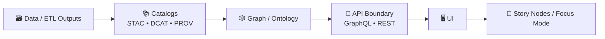

# 🧬 GraphQL Contracts (KFM)


> ✅ **This directory is a contract boundary.** The GraphQL SDL here defines the **public** API surface area.  
> Treat changes like schema migrations: reviewed, versioned, and validated. 🧠

📍 **Path:** `api/src/contracts/graphql/`

---

## 🧭 Why this folder exists

KFM is built around a strict pipeline and boundary contracts. GraphQL is one of those boundaries:

- **The API contract is a first-class artifact** (like schemas/specs): machine-validated, versioned, and implementation-honored.
- **All UI-facing data must go through the governed API layer** (for access control, redaction, classification, and consistency).
- **Evidence-first publishing applies**: data + provenance come *before* graph/UI/narrative usage.

---

## 🗺️ Where GraphQL fits in the pipeline



✨ **Rule of thumb:** If a user can see it, it must be reachable through *this contract* (and enforced by the server).

---

## 📦 What lives here

This folder should contain **GraphQL contract artifacts**, for example:

- `*.graphql` / `*.graphqls` / `*.gql` SDL files
- Custom scalars, directives, shared types
- Optional: “contract test” operations (golden queries/mutations) used to validate stability

### ✅ Typical layout (example)

```text
📦 api/src/contracts/graphql/                      🧬📜 (GraphQL Contract Surface)
├── 📝 README.md                                   👈 you are here
├── 🧩 schema.graphql                               🧭 schema entrypoint (optional pattern)
├── 🧱 scalars.graphql                              🧊 custom/shared scalars (optional pattern)
├── 🏷️ directives.graphql                           🧷 directives (auth, deprecations, governance) (optional pattern)
├── 🧬 types/                                       🧱 domain type modules (SDL)
│   ├── 🗂️ dataset.graphql                           🧾 dataset/catalog domain types
│   ├── 📖 storyNode.graphql                         🧠 narrative + Story Node types
│   └── ➕ ...                                      🧩 additional domain modules
├── 🧪 operations/                                  🧫 contract-test operations (optional pattern)
│   ├── 🔎 queries.graphql                           🧭 golden queries (stability + redaction checks)
│   └── 🧨 mutations.graphql                         🛠️ golden mutations (behavior + permissions)
└── 🧾 snapshots/                                   🧷 schema snapshots (optional pattern)
    ├── 🗺️ schema.printed.graphql                    🧾 printed schema snapshot (optional)
    └── 🧬 schema.introspection.json                 🧪 introspection JSON snapshot (optional)
```

> 📝 **Note:** The *exact* filenames may differ—follow the established layout in this repo. The goal is consistency and a single source of truth.

---

## 🚫 What does **not** belong here

Keep this folder **pure-contract**:

- ❌ Resolvers / controllers / handler code
- ❌ Database / ORM models
- ❌ ETL logic
- ❌ UI fetching logic
- ❌ One-off “quick fields” without provenance/governance review

Implementation belongs in the server/runtime layers; this folder is the *interface*.

---

## 🧱 Contract rules

### 1) Backwards-compatible by default ✅
Prefer **additive** evolution:

- ✅ Add new types
- ✅ Add new optional fields
- ✅ Add new queries/mutations
- ✅ Deprecate before removal (`@deprecated`)

Avoid breaking changes unless you’re doing an explicit **version bump**.

### 2) Breaking changes require a versioned plan 🚨
Breaking changes include:

- ❌ Removing a type/field/input
- ❌ Changing a field type (e.g., `String` → `Int`)
- ❌ Making an optional field required
- ❌ Renaming anything public

If you must break: write a migration plan, keep a deprecation window, and ensure CI/contract checks enforce the transition.

### 3) Contracts must be machine-valid ✅
Minimum expectations:

- SDL must parse and compose cleanly
- Documentation strings should exist on public types/fields
- CI should validate:
  - schema correctness
  - backwards-compatibility (diff)
  - contract tests (known operations → known outputs)

---

## 🔐 Governance, redaction & sovereignty

KFM has strict governance invariants. This contract must **support** them, not bypass them:

- **Classification propagation:** No derived output can be *less restricted* than its inputs.  
- **Redaction is enforced at the API boundary:** If a dataset is sensitive, GraphQL must not expose raw values unless explicitly approved.
- **UI must not be able to “zoom past” redaction:** prefer patterns like:
  - generalized geometries
  - aggregated counts
  - bounding boxes instead of exact points
  - server-enforced filters/thresholds

> 🧭 Design principle: assume anything in the schema could be requested by any client. Expose only what’s safe and governed.

---

## ✍️ SDL authoring conventions

Follow the repo’s established style. If you’re adding new surface area, these are the defaults we aim for:

- **Types:** `PascalCase` (e.g., `StoryNode`)
- **Fields:** `camelCase` (e.g., `publishedAt`)
- **Enums:** `SCREAMING_SNAKE_CASE` values (e.g., `DRAFT`, `PUBLISHED`)
- **Descriptions:** prefer GraphQL `"""triple-quoted docs"""` on all public items
- **IDs:** prefer stable `ID!` over database-specific integers
- **Lists:** avoid unbounded lists; paginate or constrain results
- **Time & space:** geospatial/time series fields should be queryable with constraints (bbox/time-range/limit)

### Deprecation example 🪦

```graphql
type Layer {
  id: ID!
  name: String!

  oldStyleUrl: String @deprecated(reason: "Use styleUrl instead.")
  styleUrl: String
}
```

---

## 🔄 Change workflow

1. **Propose** the contract change in a PR (include intent + consumer impact).
2. **Update SDL** in this folder.
3. **Add/adjust contract tests** (if this repo uses operation-based contract tests).
4. **Update docs/changelogs** for anything public-facing.
5. **Run validation** (schema parse, diff checks, tests).
6. **Review with governance mindset** (redaction/classification/user impact).

📌 For non-trivial changes, use the repo’s **API contract extension** template (if present) to document:
- compatibility impact
- migration strategy
- deprecation window
- governance considerations

---

## ✅ PR checklist (copy into your PR)

- [ ] SDL parses and composes cleanly
- [ ] Change is backwards-compatible **or** includes a versioned breaking-change plan
- [ ] New fields/types have docstrings
- [ ] Pagination/limits exist where needed
- [ ] Governance check: no sensitive leakage (classification + redaction respected)
- [ ] Contract tests updated/added (if used)
- [ ] Downstream impact considered (UI, Story Nodes, Focus Mode)

---

## 🆘 FAQ

### “Where do I implement resolvers?”
In the server implementation layer (not in `contracts/`). This folder defines **what** the API is; resolvers define **how** it is fulfilled.

### “Can the UI call the graph directly for performance?”
No. The API boundary exists to enforce access control, redaction, and schema consistency. If performance is an issue, fix it server-side (caching, paging, batching, materialization), not by bypassing governance.

### “How do I add evidence-backed data to the API?”
First ensure the dataset/evidence is properly cataloged (STAC/DCAT) with PROV lineage, then expose it through the API contract in a governed way.

---

## 🧩 Design reminder

**Contracts are promises.**  
Be conservative, explicit, and governance-forward. 🌾

