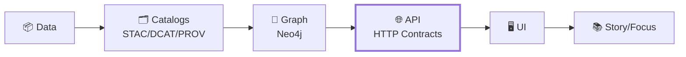

# 🌐 HTTP Contracts (KFM API)


> **TL;DR:** This directory is the **source of truth** for the KFM backend’s **HTTP boundary**.  
> Treat everything here as **contracts** (interfaces), not implementation details. ✅

---

<details>
  <summary><strong>📚 Table of Contents</strong></summary>

- [🎯 Purpose](#-purpose)
- [🧾 What “contract artifact” means in KFM](#-what-contract-artifact-means-in-kfm)
- [🗺️ Where HTTP contracts sit in the KFM pipeline](#️-where-http-contracts-sit-in-the-kfm-pipeline)
- [🗂️ Canonical home and boundary rules](#️-canonical-home-and-boundary-rules)
- [📦 Suggested folder layout](#-suggested-folder-layout)
- [✅ Contract-first workflow](#-contract-first-workflow)
- [🔁 Versioning and compatibility](#-versioning-and-compatibility)
- [🧪 CI checks and contract tests](#-ci-checks-and-contract-tests)
- [🔒 Security, governance, and “no leakage”](#-security-governance-and-no-leakage)
- [🧷 Docs hygiene](#-docs-hygiene)
- [🔗 Related references](#-related-references)
- [👥 Ownership](#-ownership)

</details>

---

## 🎯 Purpose

This folder contains **machine-validated HTTP API contract artifacts**: OpenAPI specifications and related schemas/examples that define **what the API must do**.

In KFM, APIs are expected to be governed by stable interfaces: contract changes are treated as first-class events with strict compatibility and versioning expectations. :contentReference[oaicite:0]{index=0}:contentReference[oaicite:1]{index=1}

---

## 🧾 What “contract artifact” means in KFM

A **contract artifact** is a machine-validated schema/spec that defines an interface (examples include **JSON Schema**, **OpenAPI**, **GraphQL SDL**, or governed **UI configuration**). Implementations must honor the contract — **breaking changes require a version bump**. :contentReference[oaicite:2]{index=2}

> 🧠 **Contract-first** means we start development here: define/adjust contracts *first*, then implement. Any change to contracts should trigger compatibility checks. :contentReference[oaicite:3]{index=3}

---

## 🗺️ Where HTTP contracts sit in the KFM pipeline

KFM enforces a non-negotiable pipeline ordering: **Data → Catalogs → Graph → API → UI → Narrative**. HTTP contracts live at the **API boundary** (the interface between backend services and the UI). :contentReference[oaicite:4]{index=4}



---

## 🗂️ Canonical home and boundary rules

In the v13 layout guidance, **server-side API code lives in one canonical place** (the API layer), and **API contract definitions** (OpenAPI YAML, GraphQL SDL) may live under a `contracts/` subfolder. The UI should not implement its own parallel data-fetch logic—**everything shown to the client should come through the server API**. :contentReference[oaicite:5]{index=5}:contentReference[oaicite:6]{index=6}

> 🧩 **Repo note:** this repository places HTTP contracts at `api/src/contracts/http/`.  
> If you also have other contract roots (e.g., `src/server/contracts/`), prefer **one source of truth** and migrate/align accordingly. :contentReference[oaicite:7]{index=7}

---

## 📦 Suggested folder layout

> This is a recommended layout to keep contracts discoverable and testable. Adjust to match your existing build/lint tooling. 🛠️

```text
📁 api/
└── 📁 src/
    └── 📁 contracts/
        └── 📁 http/
            ├── 📄 README.md                          # 👈 you are here
            ├── 📁 openapi/                           # 📜 OpenAPI specs (versioned)
            │   ├── 📄 openapi.v1.yaml
            │   └── 📄 openapi.v2.yaml
            ├── 📁 schemas/                           # 🧩 JSON Schemas (request/response)
            │   ├── 📄 search.request.schema.json
            │   └── 📄 search.response.schema.json
            ├── 📁 examples/                          # 🧪 human-readable examples
            │   ├── 📄 search.request.example.json
            │   └── 📄 search.response.example.json
            └── 📁 fixtures/                          # 🔬 contract-test fixtures (known inputs/outputs)
                └── 📄 search.case-01.json
```


---

## ✅ Contract-first workflow

Use the API contract extension template for additions/changes to endpoints:  
`docs/templates/TEMPLATE__API_CONTRACT_EXTENSION.md`:contentReference[oaicite:8]{index=8}:contentReference[oaicite:9]{index=9}

### 🧱 Adding a new endpoint (typical flow)

- [ ] **Update the contract first**
  - [ ] Add/modify OpenAPI path + request/response shapes
  - [ ] Add/modify JSON Schemas as needed
- [ ] **Add/Update contract tests**
  - [ ] Ensure known inputs produce expected outputs (fixtures)
- [ ] **Implement**
  - [ ] Controllers/handlers conform to the contract
- [ ] **Verify**
  - [ ] Lint schemas/specs
  - [ ] Run contract tests locally (or via CI)

This matches the KFM expectation that APIs are governed by contracts and validated by tests. :contentReference[oaicite:10]{index=10}

### 🧪 Example OpenAPI snippet (illustrative)

```yaml
# openapi.v1.yaml (example only)
openapi: 3.0.3
info:
  title: KFM API
  version: "1.0.0"
paths:
  /v1/health:
    get:
      summary: Health check
      responses:
        "200":
          description: OK
```

---

## 🔁 Versioning and compatibility

**Default stance:** treat the API contract as **backwards-compatible** unless you explicitly introduce a new version. Contract changes should be validated by contract tests with known inputs/outputs. :contentReference[oaicite:11]{index=11}

Breaking changes require a **version bump** and typically a **new versioned endpoint path** (e.g. introduce `v2` while keeping `v1` until an announced sunset). The OpenAPI definition is treated as the contract reference point. :contentReference[oaicite:12]{index=12}

### ✅ Compatibility quick guide (practical)

| Change type | Usually safe? | Notes |
|---|---:|---|
| Add a new endpoint | ✅ | Doesn’t break callers |
| Add an **optional** response field | ✅ | Additive change (preferred) |
| Add a new **optional** request field | ✅ | Prefer defaults + docs |
| Tighten validation rules | ⚠️ | Can break existing clients depending on inputs |
| Remove/rename a field | ❌ | Requires new version (v2) |
| Change field type/meaning | ❌ | Requires new version (v2) |

> ⚖️ System rule: breaking any internal contract can trigger a governance review or a version increment expectation. :contentReference[oaicite:13]{index=13}

---

## 🧪 CI checks and contract tests

KFM’s CI expectations include:
- Running **API contract tests** to confirm endpoints respond as expected for known inputs
- Linting **OpenAPI/GraphQL schemas** for completeness
- Requiring backward compatibility (or updating tests alongside the change)
- Blocking merges if contract tests fail unexpectedly :contentReference[oaicite:14]{index=14}

> 🔬 Practical takeaway: if you change the contract, you should also change the **contract tests + fixtures** so behavior remains explicit and governed. :contentReference[oaicite:15]{index=15}

### 🧰 Suggested local commands (example placeholders)

```bash
# Wire these to your repo’s actual scripts.
# Examples:
# - OpenAPI linting
# - Schema validation
# - Contract test suite

npm run lint:openapi
npm run test:contracts
```

---

## 🔒 Security, governance, and “no leakage”

Beyond correctness, KFM expects automated checks that help prevent accidental exposure:
- secret scanning
- PII/sensitive content checks
- sensitive location checks
- classification consistency checks (don’t “downgrade” sensitive outputs without approved handling) :contentReference[oaicite:16]{index=16}

Even though some of these are enforced elsewhere in the pipeline, **HTTP responses are part of what the UI can show**, so contracts should be designed with governance/sensitivity in mind. :contentReference[oaicite:17]{index=17}

---

## 🧷 Docs hygiene

If/when contract documentation is promoted into governed docs, KFM’s doc guidance expects:
- YAML front-matter for governance metadata
- “evidence-first” citations for factual claims :contentReference[oaicite:18]{index=18}:contentReference[oaicite:19]{index=19}

---

## 🔗 Related references

- 🧾 API change template: `docs/templates/TEMPLATE__API_CONTRACT_EXTENSION.md`:contentReference[oaicite:20]{index=20}
- 🧱 Architecture blueprints:
  - `docs/architecture/KFM_REDESIGN_BLUEPRINT_v13.md`:contentReference[oaicite:21]{index=21}
  - `docs/architecture/KFM_NEXT_STAGES_BLUEPRINT.md`:contentReference[oaicite:22]{index=22}
  - `docs/architecture/KFM_VISION_FULL_ARCHITECTURE.md`:contentReference[oaicite:23]{index=23}
- ⚖ Governance & guardrails:
  - `docs/governance/ROOT_GOVERNANCE.md`:contentReference[oaicite:24]{index=24}
  - `docs/governance/ETHICS.md`:contentReference[oaicite:25]{index=25}
  - `docs/governance/SOVEREIGNTY.md`:contentReference[oaicite:26]{index=26}

---

## 👥 Ownership

Per the Master Guide artifact map, the **API team** owns the “API contract extension template” and is the expected steward for endpoint changes. :contentReference[oaicite:27]{index=27}

