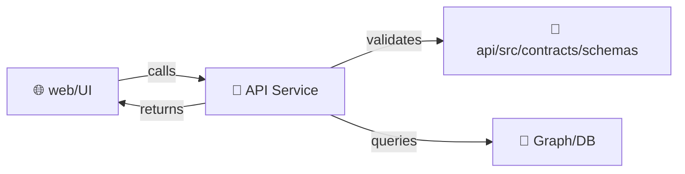

# 📜 API Contract Schemas


This folder is the **source of truth** for the API’s **machine-validated contracts** — the schemas that define what the API *accepts* and what it *returns*.

These schemas are treated as **first-class artifacts**: development begins here, and changes to contracts are governed, versioned, and tested. ✅

---

## 🎯 Why this exists

KFM is intentionally **contract-first** and **evidence-first**:

- **Contract-first** → schemas + API specs are the starting point, and changes trigger strict compatibility checks.  
- **Evidence-first** → API responses should make it easy to trace returned data back to governed evidence (e.g., catalog/provenance IDs) when applicable.

If you’re touching an endpoint, you should expect to touch its contract. 🧩

---

## 🧭 What belongs here (and what doesn’t)

✅ **Belongs here**
- Request body schemas (POST/PUT/PATCH payloads)
- Response payload schemas (including pagination envelopes)
- Shared primitives (IDs, ISO dates, bounding boxes, coordinate arrays, etc.)
- Error shapes (standard error envelope / problem details)
- Telemetry/event payload schemas (if emitted by the API runtime)

🚫 **Does NOT belong here**
- Database table/ORM schemas (those are persistence concerns)
- Neo4j ontology/graph constraints (live with the graph subsystem)
- STAC/DCAT/PROV/story-node schemas (those are repo-level governed schemas under `schemas/`)

> 🔗 If you’re changing metadata catalogs (STAC/DCAT/PROV) or narrative schemas (Story Nodes), you probably want the repo-level `schemas/` directory, not this API-local folder.

---

## 🗂️ Suggested layout

> This is the intended pattern (adjust subfolders to match what already exists in this repo).

```text
api/
└── src/
    └── contracts/
        └── schemas/
            ├── 📄 README.md
            ├── 📁 common/                 # shared primitives (ids, dates, paging, geometry)
            ├── 📁 requests/               # request payload schemas
            ├── 📁 responses/              # response payload schemas
            ├── 📁 errors/                 # standard error envelopes
            └── 📁 telemetry/              # API event payload schemas (optional)
```

---

## 🧱 Contract rules (non-negotiable)

### 1) Prefer additive change ✅
If you need to evolve a schema:
- ✅ add optional fields  
- ✅ widen `enum` carefully (if clients can tolerate new values)
- ✅ add new schema versions instead of breaking old ones

Avoid:
- 🚫 renaming fields
- 🚫 changing types (string → number, object → array)
- 🚫 making optional fields required
- 🚫 removing existing fields

### 2) Contracts must be versioned 🕰️
Breaking changes must be handled by:
- a **version bump** (endpoint or schema version), **and**
- corresponding test/spec updates.

A simple rule of thumb:
- **v1 → v1.1**: backward-compatible additions  
- **v1 → v2**: breaking change

### 3) Schemas must be strict by default 🔒
Use:
- `additionalProperties: false` for objects (unless intentionally open-ended)
- explicit `required` lists
- strong formats (`date`, `date-time`, etc.) where supported by your validator

---

## 🔁 How contracts connect to the rest of KFM

KFM enforces a “no leapfrogging” pipeline:

- **ETL → catalogs → graph → API → UI → narrative**

This means:
- the **UI should only rely on what the API contract guarantees** (no hidden assumptions)
- the **API is the boundary** that translates governed evidence into user-facing responses
- contract changes should be treated like governance changes (review + tests)

### 📈 (Optional) contract flow diagram



---

## ✅ Contributor checklist

When adding/changing an endpoint contract:

- [ ] Add or update schema file(s) in this folder
- [ ] Ensure schema is **backwards-compatible** (or create a versioned schema)
- [ ] Update the API spec (OpenAPI/GraphQL) *if applicable*
- [ ] Add/adjust **contract tests** for request/response expectations
- [ ] Run the schema validator + contract test suite locally
- [ ] Confirm no sensitive data is exposed (classification/redaction rules)

> 🧪 CI should fail if a schema is invalid or if an endpoint no longer matches its contract.

---

## 🧪 Example schema pattern

### 📄 `requests/example.request.v1.schema.json`

```json
{
  "$schema": "https://json-schema.org/draft/2020-12/schema",
  "$id": "kfm://api/contracts/schemas/requests/example-request/v1",
  "title": "ExampleRequestV1",
  "type": "object",
  "additionalProperties": false,
  "required": ["fieldId", "date"],
  "properties": {
    "fieldId": {
      "type": "string",
      "minLength": 1,
      "description": "Stable entity identifier (do not reuse across domains)."
    },
    "date": {
      "type": "string",
      "format": "date",
      "description": "ISO-8601 date (YYYY-MM-DD)."
    },
    "provenance": {
      "type": "object",
      "additionalProperties": false,
      "description": "Optional pointers to governed evidence artifacts used to compute the response.",
      "properties": {
        "stac_item_ids": { "type": "array", "items": { "type": "string" } },
        "dcat_dataset_ids": { "type": "array", "items": { "type": "string" } },
        "prov_bundle_ids": { "type": "array", "items": { "type": "string" } }
      }
    }
  }
}
```

---

## 🧰 Example runtime validation

> Use whatever validator your API runtime is standardized on. Below are **reference patterns**.

### Node/AJV-style (example)

```ts
import Ajv from "ajv";
import addFormats from "ajv-formats";

import exampleRequestV1 from "./requests/example.request.v1.schema.json";

const ajv = addFormats(
  new Ajv({
    allErrors: true,
    strict: true
  })
);

const validate = ajv.compile(exampleRequestV1);

export function assertExampleRequestV1(payload: unknown) {
  if (!validate(payload)) {
    // Prefer a standardized error envelope schema under `errors/`
    throw new Error(ajv.errorsText(validate.errors));
  }
}
```

### Python/jsonschema-style (example)

```py
from jsonschema import Draft202012Validator
from .requests.example_request_v1 import schema as example_request_v1

def assert_example_request_v1(payload: dict):
    Draft202012Validator(example_request_v1).validate(payload)
```

---

## ⚖️ Governance + safety notes

- **No silent breaking changes.** If it breaks clients, it must version-bump.
- **No sensitive leakage.** Contracts should not “accidentally allow” sensitive geometry, precise coordinates, or restricted attributes unless explicitly governed.
- Prefer schemas that make **auditing easy**:
  - consistent `request_id` / `trace_id` fields (if your API uses them)
  - optional `provenance` pointers in responses where evidence lineage matters

---

## 🔗 Related docs (repo)

- 📘 `../../../../docs/MASTER_GUIDE_v13.md`
- 🧩 `../../../../docs/templates/TEMPLATE__API_CONTRACT_EXTENSION.md`
- 🗃️ `../../../../schemas/` (STAC/DCAT/PROV/story-node/UI/telemetry schemas)

---

## 🧠 Quick glossary

- **Contract artifact**: a machine-validated schema/spec defining an interface (JSON Schema, OpenAPI, GraphQL SDL, UI config).
- **Evidence artifact**: a governed data product registered in catalogs with provenance before being used by UI/narrative.
- **Contract-first**: development starts from contracts; changes require versioning + compatibility checks.

---

### ✅ Definition of done (for changes in this folder)

A PR touching `api/src/contracts/schemas/` is “done” when:

- schemas validate locally and in CI  
- contract tests cover the change  
- backward compatibility is preserved **or** versioning strategy is explicit  
- governance/sensitivity implications are documented (when relevant)  

🧱 If in doubt: treat schema changes as *API boundary governance changes*.

