# 🧩 Domain Schemas (API Contracts)


> [!IMPORTANT]
> This folder is **contract-first**: the schema is the **source of truth** for shapes crossing the API boundary. Any change here must be versioned and validated. :contentReference[oaicite:0]{index=0}:contentReference[oaicite:1]{index=1}

---

## ⚡ TL;DR

- ✅ **Put domain shapes here** (entities + value objects your API returns/accepts).
- ✅ **Version schemas** (no breaking changes without a version bump).
- ✅ **Reference evidence + provenance** (IDs pointing to catalog/graph artifacts, not “mystery blobs”).
- ✅ **CI must validate** schemas and API behavior (contract tests). :contentReference[oaicite:2]{index=2}:contentReference[oaicite:3]{index=3}

---

## 📌 What this directory is

This directory contains **domain-level schema contracts** that define the canonical JSON shapes for KFM/Kansas-Matrix domain objects—think core concepts like:

- land plots  
- soil samples  
- climate records  
- sensor readings  
- user profiles  

These examples are explicitly called out as **Domain Entities (Core Layer)** in the project architecture. :contentReference[oaicite:4]{index=4}

In KFM language, these are **contract artifacts**: machine-validated schemas/specs that define an interface (e.g., JSON Schema, OpenAPI, GraphQL SDL). They must be versioned and honored—**no breaking changes without a version bump**. :contentReference[oaicite:5]{index=5}

---

## 🧭 How this fits the KFM pipeline

KFM enforces a **non-negotiable ordering** of stages, with **contracts at each boundary**. The API stage is explicitly a gate for **contracts + redaction**. :contentReference[oaicite:6]{index=6}:contentReference[oaicite:7]{index=7}

```mermaid
flowchart LR
  A[Data / ETL] --> B[Catalogs: STAC · DCAT · PROV]
  B --> C[Neo4j Graph]
  C --> D[API Layer ✅ contracts + redaction]
  D --> E[UI]
  E --> F[Story Nodes / Focus Mode]
```



- The Master Guide defines the boundary chain (data → catalogs → graph → API → UI → narrative). :contentReference[oaicite:8]{index=8}
- It also emphasizes provenance-first publishing (STAC/DCAT/PROV) and contract-first workflows. :contentReference[oaicite:9]{index=9}

---

## 🧱 Clean Architecture alignment (why “domain” matters)

KFM’s architecture is layered and intentionally keeps **core logic independent** of frameworks. The rules are:

- inner layers stay free of infrastructure concerns
- “talk inwards with simple data, talk outwards through interfaces” :contentReference[oaicite:10]{index=10}:contentReference[oaicite:11]{index=11}

Domain schemas help enforce that discipline at the API boundary by keeping payloads:

- **framework-neutral**
- **stable**
- **explicitly versioned**
- **testable in isolation**

---

## 🗂️ Suggested layout inside `domain/`

> [!NOTE]
> The exact subfolders may evolve—what matters is keeping this folder the **single canonical home** for API-facing domain shapes (avoid drift/duplicates). :contentReference[oaicite:12]{index=12}

```text
📁 api/
└── 📁 src/
    └── 📁 contracts/
        └── 📁 schemas/
            └── 📁 domain/
                ├── 📄 README.md
                ├── 📁 entities/           # “things” (SoilSample, LandPlot, ClimateRecord…)
                ├── 📁 value-objects/      # reusable sub-shapes (GeoPoint, DateRange, UnitValue…)
                ├── 📁 relationships/      # graph-friendly references (EntityRef, CatalogRef…)
                └── 📁 _shared/            # common fields (IDs, timestamps, provenance pointers)
```

---

## 🧾 What belongs here (and what doesn’t)

### ✅ Belongs here
- Domain **entities** and **value objects** (the “language” of the system).
- Shapes used across many endpoints (shared request/response objects).
- Reference objects used to point to catalogs and graph nodes (IDs, not blobs). :contentReference[oaicite:13]{index=13}

### ❌ Does **not** belong here
- Database tables / ORM models (storage-specific concerns).
- UI-only config or view models.
- Raw STAC/DCAT/PROV schemas (those belong in their own standards/schema areas).  
  KFM treats STAC/DCAT/PROV as separate “catalog contracts” validated against profiles. :contentReference[oaicite:14]{index=14}:contentReference[oaicite:15]{index=15}

---

## 🔗 Provenance-first design rule

KFM is designed so that:

- metadata catalogs (STAC/DCAT/PROV) exist **before** narrative/UI usage, and  
- the graph should store **references** to catalog entries rather than duplicating bulky data. :contentReference[oaicite:16]{index=16}

**Practical implication for domain schemas:**  
Prefer fields that reference evidence by stable identifiers, for example:

- `stac_item_id` / `stac_collection_id`
- `dcat_dataset_id`
- `prov_activity_id` / `prov_entity_id`
- `graph_node_id`

This keeps API payloads light, traceable, and consistent with the “graph references catalogs” expectation. :contentReference[oaicite:17]{index=17}

---

## 🕵️ Sensitivity, classification, and redaction

The API layer is explicitly where **contracts + redaction** are enforced. :contentReference[oaicite:18]{index=18}

Also, any evidence artifact shown in the UI must be exposed via governed APIs so redaction/classification rules can be applied—**no direct UI bypass**. :contentReference[oaicite:19]{index=19}

**Domain schema implication:**  
If an object can be sensitive, add explicit fields for classification and handling (even if optional), e.g.:

- `classification`
- `sensitivity`
- `care_label`
- `redaction_reason` (when applicable)

> Keep the rules in code + governance docs; keep the *signals* in the schema so downstream consumers can’t “pretend they didn’t know.”

---

## 🔁 Versioning & compatibility rules (SemVer mindset)

KFM requires **strict versioning** for contract artifacts and APIs:

- contracts must be versioned and honored (no breaking changes without a version bump) :contentReference[oaicite:20]{index=20}
- breaking API changes require versioned endpoints or negotiation strategies; OpenAPI is the contract :contentReference[oaicite:21]{index=21}

### Recommended “what counts as breaking?”
| Change | Example | Breaking? | Suggested action |
|---|---|---:|---|
| Add optional field | `confidence_score?: number` | ❌ | Minor/patch |
| Add new enum value | `"source": "usgs" \| "noaa" \| "kfm"` | ⚠️ depends | Prefer minor + careful client comms |
| Make optional → required | `prov_activity_id` becomes required | ✅ | Major schema version |
| Remove field | delete `legacy_id` | ✅ | Major schema version |
| Change type/meaning | `id: string` → `id: number` | ✅ | Major schema version |

---

## 🧪 Validation & CI expectations

KFM’s CI gates explicitly include:

- **JSON Schema validation** (structured outputs validated against schemas) :contentReference[oaicite:22]{index=22}
- **API contract tests** (endpoints must respond as expected against known inputs/outputs; OpenAPI/GraphQL linted) :contentReference[oaicite:23]{index=23}
- PRs failing these checks should be blocked. :contentReference[oaicite:24]{index=24}

> [!TIP]
> Treat schema validation failures as “contract regressions,” not “lint noise.” Fix the payloads *or* explicitly evolve the schema with versioning.

---

## ➕ Adding a new domain schema (workflow)

1. **Name the schema** after the domain concept (entity/value object).
2. **Define it as a contract artifact first** (schema before implementation). :contentReference[oaicite:25]{index=25}:contentReference[oaicite:26]{index=26}
3. Include:
   - clear `title` + `description`
   - required vs optional fields
   - provenance pointers when the object represents evidence (catalog/graph refs) :contentReference[oaicite:27]{index=27}
4. Add/extend **contract tests** for endpoints that return/accept it. :contentReference[oaicite:28]{index=28}
5. If you’re adding/changing endpoints, use the **API contract extension template** referenced by the Master Guide. :contentReference[oaicite:29]{index=29}

---

## 🧪 Example (illustrative): `SoilSample` (domain entity)

> [!NOTE]
> Soil samples are explicitly listed as a domain entity example in the architecture docs. :contentReference[oaicite:30]{index=30}

```json
{
  "$id": "kfm://schemas/domain/entities/SoilSample/v1",
  "title": "SoilSample",
  "description": "A soil sample observation captured at a location and time, with provenance pointers to evidence artifacts.",
  "type": "object",
  "additionalProperties": false,
  "required": ["id", "observed_at", "location", "measurements"],
  "properties": {
    "id": { "type": "string", "description": "Stable identifier for this soil sample." },
    "observed_at": { "type": "string", "format": "date-time" },
    "location": {
      "type": "object",
      "additionalProperties": false,
      "required": ["lat", "lon"],
      "properties": {
        "lat": { "type": "number" },
        "lon": { "type": "number" }
      }
    },
    "measurements": {
      "type": "object",
      "additionalProperties": false,
      "properties": {
        "moisture_value": { "type": "number" },
        "moisture_unit": { "type": "string", "enum": ["%"] }
      }
    },
    "provenance": {
      "type": "object",
      "additionalProperties": false,
      "properties": {
        "stac_item_id": { "type": "string" },
        "dcat_dataset_id": { "type": "string" },
        "prov_activity_id": { "type": "string" },
        "graph_node_id": { "type": "string" }
      }
    }
  }
}
```

This example demonstrates the design intent:
- domain-level shape (framework-neutral)
- provenance pointers rather than embedding “everything” (aligns with graph→catalog reference expectations) :contentReference[oaicite:31]{index=31}

---

## ✅ Definition of Done (for a new/updated domain schema)

- [ ] Schema is written/updated **before** implementation (contract-first). :contentReference[oaicite:32]{index=32}
- [ ] No breaking changes without a version bump. :contentReference[oaicite:33]{index=33}
- [ ] Provenance pointers added where relevant (catalog/graph references). :contentReference[oaicite:34]{index=34}
- [ ] JSON Schema validation passes in CI. :contentReference[oaicite:35]{index=35}
- [ ] API contract tests updated/added for affected endpoints. :contentReference[oaicite:36]{index=36}
- [ ] Sensitivity/redaction considerations documented if the data can be sensitive. :contentReference[oaicite:37]{index=37}:contentReference[oaicite:38]{index=38}

---

## 📚 Reference breadcrumbs (why we’re doing this)

- **Contract-first + “contract artifact” definition** (versioned, machine-validated, no breaking changes without bump) :contentReference[oaicite:39]{index=39}
- **Pipeline ordering & API as contract/redaction gate** :contentReference[oaicite:40]{index=40}:contentReference[oaicite:41]{index=41}
- **Graph references catalogs (don’t duplicate bulky data)** :contentReference[oaicite:42]{index=42}
- **CI gates: JSON Schema validation + API contract tests** :contentReference[oaicite:43]{index=43}
- **Clean architecture + layered separation for domain entities** :contentReference[oaicite:44]{index=44}:contentReference[oaicite:45]{index=45}

