# 📥 API Request Schemas (Contracts)  


> **This folder is the canonical home for inbound API request validation.**  
> Every endpoint input (body/query/path/header) should be defined and validated **here** so the API remains stable, testable, and governed.

---

## 🧭 Why this exists

KFM follows a **contract-first** approach: schemas and API contracts are first-class repo artifacts, and changing them should trigger strict compatibility + test checks. ✅  
This directory holds the **request side** of that contract: everything the outside world is allowed to send into the API.

At a high level:

- 🛡️ **API boundary rule:** clients should not bypass the API boundary to reach internal systems.
- 🧪 **CI enforcement:** request/response behavior is contract-tested; changes must remain compatible (or be versioned).
- 🧬 **Governance:** sovereignty/classification and sensitive data handling must be enforced **at the boundary**, not “by convention”.

---

## 🗂️ Where you are


```text
api/src/contracts/schemas/requests/
├── 📁 _shared/                 # reusable fragments (pagination, time ranges, etc.)
├── 📁 auth/                    # auth-related requests
├── 📁 fields/                  # field operations (geo, crop, irrigation, etc.)
├── 📁 simulation/              # simulation runs, scenarios, constraints
└── 📄 README.md                # ← you are here
```

Quick links (if present):
- ⬆️ Contracts root: `../../README.md`
- ⬆️ Schemas root: `../README.md`

---

## ✅ What belongs in `requests/`

Request schemas that define **what callers may send**:

- **Body payloads** (POST/PUT/PATCH)
- **Query params** (GET filters, pagination, bounding boxes, etc.)
- **Path params** (IDs, slugs)
- **Headers** (if you validate custom headers)
- **Request envelopes** (if the API uses a standard wrapper like `meta`, `context`, `trace`, etc.)

> 📌 Tip: If your framework splits request parts (params/query/body), keep them as separate schemas and optionally provide a composed “request contract” export for the endpoint.

---

## 🚫 What does *not* belong here

- ❌ Internal domain models (use-case inputs, entity definitions)
- ❌ Database models / ORM types
- ❌ ETL / pipeline configs
- ❌ UI-only forms/types (unless the UI imports these contract types intentionally)
- ❌ “Loose” types that are not runtime-validated (contracts must be enforceable)

---

## 🧱 Conventions (naming + structure)

### File naming 🗃️
Pick one style and stick to it (follow whatever already exists in this repo):

- `ThingCreate.request.ts` / `.js` / `.json`
- `createThing.request.schema.ts`
- `thing-create.request.schema.json`

**Goal:** Make it obvious this is an inbound request contract.

### Export naming 🧾
Use clear, stable exports:

- `CreateThingRequestSchema` (runtime validator)
- `CreateThingRequest` (type/interface inferred from schema if applicable)

### Schema composition 🧩
Prefer small reusable building blocks for common patterns:

- `Id` (UUID/ULID)
- Pagination (`limit`, `cursor`, `page`)
- Sorting (`sortBy`, `order`)
- Geospatial filters (`bbox`, `geometry`, `zoom`, `resolution`)
- Time windows (`start`, `end`)

If you have a shared folder upstream (e.g. `../shared/`), put reusable pieces there and import them here.

---

## 🔍 Validation rules of thumb

These are “default safe” choices for contract-grade request schemas:

- ✅ **Reject unknown fields** (prevents accidental “shadow parameters”)
- ✅ **Bound everything**: string lengths, array sizes, numeric ranges
- ✅ **Be explicit** about `optional` vs `nullable`
- ✅ **Avoid implicit defaults** that depend on “now” or randomness (keep things deterministic)
- ✅ **Normalize** carefully (e.g., trim strings) *only if the API guarantees it*
- ✅ **Prefer stable identifiers** over raw object blobs when referencing governed data (e.g., dataset IDs instead of embedding raw data)

---

## 🔁 Backwards compatibility & versioning

Request schema changes are API contract changes. Treat them as such:

### Safe (usually non-breaking) ✅
- Adding an **optional** field
- Widening allowed values in a way that doesn’t change meaning
- Increasing max limits (careful with performance/security)

### Breaking (requires explicit versioning or compatibility plan) ⚠️
- Renaming/removing fields
- Tightening validation (e.g., lowering max length, disallowing values previously accepted)
- Changing types (`string` → `number`, etc.)
- Changing semantics of a field without changing its name

> 🧪 Any contract change should come with updated/added contract tests, and (where applicable) an API contract change doc (see the API contract extension template in `docs/templates/`).

---

## 🛡️ Governance & safety guardrails (KFM-specific)

Because KFM has sovereignty + classification propagation, request schemas must *not* allow bypasses:

- 🧷 **No “downgrade knobs”**: don’t accept inputs like `forcePublic=true` or `ignoreRedaction=true` unless they are strictly role-gated and audited.
- 🗺️ **Sensitive locations:** if accepting coordinates/geometry, ensure:
  - precision/zoom/resolution controls can’t be used to infer protected sites
  - bounded areas (bbox) are size-limited
  - any “include raw geometry” capability is permissioned + logged
- 🧾 **Provenance-first posture:** inputs that reference datasets/artifacts should prefer **cataloged IDs** (STAC/DCAT/PROV identifiers) rather than raw file paths or arbitrary payload injection.

---

## 🧪 Testing expectations (CI contract tests)

Request schemas are not “just types” — they are enforceable contracts.

When adding/modifying a request schema, ensure:

- ✅ contract tests cover valid + invalid requests
- ✅ error responses for invalid requests are consistent (400/422, structured error payload, etc.)
- ✅ OpenAPI/GraphQL (if generated/linted) remains complete and consistent

---

## 🛠️ How to add a new request schema

1) **Create the schema file** in this folder (or a domain subfolder if you use domains).  
2) **Define strict validation** (bounds, formats, unknown-field behavior).  
3) **Export it** in a stable way (and update any barrel/index exports if the repo uses them).  
4) **Wire it into the route handler** so the API enforces it at runtime.  
5) **Add contract tests** for:
   - happy path ✅
   - missing required fields ❌
   - wrong types ❌
   - boundary cases (max/min, empty arrays, etc.) ⚠️  
6) **If the change affects an existing endpoint**, document/version it per policy.

---

## ✨ Example patterns

<details>
<summary><strong>Example A — TypeScript runtime schema (library-agnostic pattern)</strong></summary>

```ts
// CreateWidget.request.ts
// NOTE: Use the repo’s chosen schema library (Zod/AJV/Joi/etc).
// The important part is: runtime validation + stable export names.

export const CreateWidgetRequestSchema = /* schema builder */({
  name: /* string with min/max */,
  kind: /* enum */,
  tags: /* array of bounded strings */,
  // ...
  // enforce: unknown keys rejected, sizes bounded, formats validated
});

export type CreateWidgetRequest = /* infer type from schema */;
```
</details>

<details>
<summary><strong>Example B — Split request parts (params + query + body)</strong></summary>

```ts
export const WidgetIdParamsSchema = /* { widgetId: IdSchema } */;
export const WidgetListQuerySchema = /* { limit, cursor, sortBy } */;
export const UpdateWidgetBodySchema = /* { name?: string, tags?: string[] } */;

// Optional: compose for readability/documentation
export const UpdateWidgetRequestSchema = {
  params: WidgetIdParamsSchema,
  query: WidgetListQuerySchema,
  body: UpdateWidgetBodySchema,
};
```
</details>

---

## ✅ Definition of Done checklist

- [ ] Schema exists under `requests/` and matches endpoint intent 🎯 
- [ ] Unknown fields policy is explicit (reject by default) 🔒  
- [ ] Bounds exist for strings/arrays/numbers 📏 
- [ ] Sensitive inputs (esp. geo/time) are constrained + reviewed 🗺️  
- [ ] Route enforces validation at runtime 🛡️  
- [ ] Contract tests updated/added 🧪  
- [ ] Compatibility impact evaluated (versioning if needed) 🔁 
- [ ] Any required governance notes captured (docs/templates) 🧾  

---

## 🧩 Visual: request flow at the boundary

```mermaid
flowchart LR
  UI[🌐 Client / web] -->|HTTP request| API[🛡️ API boundary]
  API -->|validate ✅| Schema[📥 Request Schema]
  Schema --> Handler[🧩 Route/Resolver]
  Handler --> Core[🏗️ Use-cases / domain]
  Core --> API
  API -->|response contract| UI
```



---

## 🔗 Related governance + standards (repo references)

- `docs/MASTER_GUIDE_v13.md` 🧭 (contract-first + API boundary principles)
- `docs/templates/TEMPLATE__API_CONTRACT_EXTENSION.md` 🧾 (how to add/change endpoints)
- `docs/governance/` 🛡️ (sovereignty, classification, review gates)

> If you’re unsure whether an input is sensitive (PII, precise location, restricted data), treat it as sensitive by default and loop in governance review. ✅

