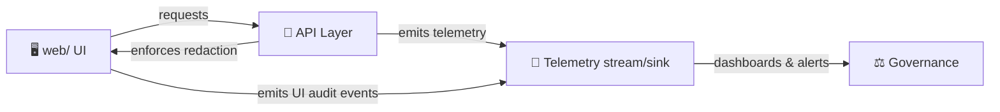

# 📡 Telemetry Schemas (API Contracts)


> **Context (KFM v13):** Telemetry is an explicit governance tool in KFM—used to log sensitive access, redactions, and policy blocks—so compliance can be monitored in near-real time. :contentReference[oaicite:0]{index=0}

---

## 🧭 Overview

This folder contains **contract-first** schemas for telemetry emitted by KFM components (API, pipelines, UI). Telemetry is not “just logging” — it’s **machine-validated evidence** that supports governance and auditability.

KFM’s Master Guide highlights telemetry-driven governance, including signals for:
- when **sensitive data is accessed**
- when **redactions occur**
- when **publication is blocked** by policy:contentReference[oaicite:1]{index=1}

It also explicitly frames telemetry as **audit trails** so we can answer “who saw what and why” — e.g., emitting an event like `focus_mode_redaction_notice_shown` when data is withheld or generalized.:contentReference[oaicite:2]{index=2}

> ✅ **Why schemas?** KFM CI can validate “telemetry or UI configuration JSON” when schemas are defined—meaning schema drift is a build-breaker, not a surprise in production.:contentReference[oaicite:3]{index=3}

---

## 🧠 Contract-first rule (non-negotiable)

KFM adopts **contract-first** development: schemas and API contracts are *first-class repo artifacts* and changes require strict compatibility discipline.:contentReference[oaicite:4]{index=4}

Implication for this directory:

- ✅ **Define/extend telemetry event schemas first**
- ✅ Update producers/consumers second
- ✅ Treat breaking changes as a *versioned evolution* (not a “quick tweak”)

---

## 🗂️ Directory Layout

> This is the **recommended** structure for this folder. If you add new schemas/events, keep the layout predictable and “one canonical home” (avoid duplicates elsewhere).

```text
api/
└── src/
    └── contracts/
        └── schemas/
            └── telemetry/
                ├── README.md
                ├── 📄 telemetry.event-envelope.schema.json      # ✅ base event wrapper (required)
                ├── 📄 telemetry.actor.schema.json               # shared actor/agent identity
                ├── 📄 telemetry.classification.schema.json      # sensitivity + CARE label + jurisdiction
                ├── 📄 telemetry.context.schema.json             # request/session/trace correlation
                ├── 📁 events/                                   # event-specific payload schemas
                │   ├── 📄 focus_mode_redaction_notice_shown.v1.schema.json
                │   ├── 📄 sensitive_data_accessed.v1.schema.json
                │   ├── 📄 redaction_applied.v1.schema.json
                │   ├── 📄 publication_blocked.v1.schema.json
                │   └── 📄 ... (additive)
                └── 📁 examples/
                    ├── 📄 focus_mode_redaction_notice_shown.v1.json
                    ├── 📄 sensitive_data_accessed.v1.json
                    └── 📄 ...
```

---

## 📦 What the schemas are for

Telemetry schemas exist to ensure:

1. **Auditability & trust**
   - Telemetry is part of governance auditing and transparency (“who saw what and why”).:contentReference[oaicite:5]{index=5}

2. **Safety & sovereignty**
   - Telemetry must respect classification propagation: no artifact may become *less restricted than its inputs*.:contentReference[oaicite:6]{index=6}

3. **Contract stability**
   - CI is expected to enforce schema validity and block incompatible changes.:contentReference[oaicite:7]{index=7}:contentReference[oaicite:8]{index=8}

---

## 🧩 Event Model

### 1) Event envelope (stable wrapper)

All telemetry events should share an envelope so storage, dashboards, and governance tooling can rely on consistent metadata.

**Strongly recommended envelope fields:**
- `event_name` — snake_case event identifier (e.g., `focus_mode_redaction_notice_shown`)
- `event_version` — integer or semver-like string (e.g., `1`, `"1.0"`)
- `event_id` — UUID (dedupe + traceability)
- `occurred_at` — when it happened (ISO 8601)
- `emitted_at` — when it was emitted (ISO 8601)
- `source` — which subsystem emitted (`api`, `web`, `pipeline`, `worker`, etc.)
- `actor` — who/what triggered it (user/service)
- `classification` — governance labels (sensitivity, CARE label, jurisdiction)
- `context` — correlation IDs (request/session/trace)
- `payload` — event-specific data

> 💡 Rationale: Governance telemetry focuses on “who/what/why,” and the Master Guide’s audit-trail guidance implies we must capture enough metadata to reconstruct decisions without leaking restricted content.:contentReference[oaicite:9]{index=9}

### 2) Event payload (schema per event type)

Each `event_name + event_version` has its own payload schema in `events/`.

Rule of thumb:
- **Envelope stays stable** (rarely changes)
- **Payload evolves** (versioned and additive where possible)

---

## 🔍 Core governance telemetry events

These are the **minimum** governance-oriented events implied by project docs:

| Event name | Why it exists | Evidence in project docs |
|---|---|---|
| `sensitive_data_accessed` | Track when sensitive layers/data are accessed for compliance monitoring | Telemetry logs for “sensitive data is accessed”:contentReference[oaicite:10]{index=10} |
| `redaction_applied` | Capture that redaction occurred, including *why* (policy) | Telemetry logs for “redactions occur”:contentReference[oaicite:11]{index=11} |
| `publication_blocked` | Explain why publishing was blocked (policy gate) | Telemetry logs for “publication is blocked by a policy”:contentReference[oaicite:12]{index=12} |
| `focus_mode_redaction_notice_shown` | UI/Focus Mode emits audit signal when data is withheld/generalized | Explicit example event name in audit trails:contentReference[oaicite:13]{index=13} |

---

## 🌾 Operational / ingestion telemetry (sensor streams)

KFM’s architecture explicitly includes streaming sensor ingestion (e.g., moisture readings), where an ingestion service validates and timestamps incoming data (MQTT or HTTP POST).:contentReference[oaicite:14]{index=14}

If this API ingests such data, consider event types like:
- `sensor_reading_ingested`
- `sensor_reading_rejected` (validation failure, out-of-range, etc.)
- `ingestion_backpressure` (queue pressure / latency)

> ⚠️ NOTE: Sensor readings can be sensitive depending on location/community context—so classification fields in telemetry matter.

---

## 🔐 Governance & safety rules for telemetry

### Don’t leak restricted info through telemetry
Telemetry is *not* a loophole around redaction.

- ✅ Prefer stable identifiers over raw values (e.g., `dataset_id`, `layer_id`, `policy_id`)
- ✅ If you must include location, store **generalized** geometry (or bounding boxes) consistent with redaction rules
- ✅ Avoid PII entirely unless explicitly approved and classified

This aligns with the project’s sovereignty/classification propagation invariant: outputs must not be less restricted than inputs.:contentReference[oaicite:15]{index=15}

### Emit at the API boundary (preferred)
KFM explicitly enforces the “API boundary rule”: the UI should not bypass governance controls; all access goes through the API layer, where redaction and access controls apply.:contentReference[oaicite:16]{index=16}

Telemetry critical to governance should generally be emitted from:
- API request handling (authorization, filtering, redaction decisions)
- Publication workflows (policy gates)
- Focus Mode rendering decisions (audit trails)

---

## ✅ Validation & CI expectations

### JSON Schema validation is a build gate
KFM’s CI explicitly validates structured outputs, and calls out telemetry JSON as a target if schemas exist.:contentReference[oaicite:17]{index=17}

**Therefore:**
- Treat schema updates like code changes
- Include example payloads (`examples/`) for each event schema
- Add/extend contract tests that validate example events against schemas

### Markdown governance for this README
KFM documentation standards include:
- YAML front-matter on governed docs:contentReference[oaicite:18]{index=18}
- Front-matter fields like title/version/status/doc_uuid/etc.:contentReference[oaicite:19]{index=19}

This README includes front-matter to align with that model.

---

## 🧷 Versioning strategy (recommended)

Because telemetry is contract-first, treat versions intentionally:

- **Patch**: doc fixes, examples, clarifications (no schema change)
- **Minor**: additive schema fields (backwards compatible)
- **Major**: breaking changes (rename fields, change types, require new fields)

Event-specific payload schemas should be versioned in filename, e.g.:
- `publication_blocked.v1.schema.json`
- `publication_blocked.v2.schema.json` (breaking evolution)

---

## 🧪 Examples

<details>
<summary>🧾 Example — <code>focus_mode_redaction_notice_shown</code> (v1)</summary>

```json
{
  "event_name": "focus_mode_redaction_notice_shown",
  "event_version": 1,
  "event_id": "4d5d7b3b-7d4b-47d1-9a2a-5e6b0f2d9b8a",
  "occurred_at": "2026-01-05T12:34:56.789Z",
  "emitted_at": "2026-01-05T12:34:56.900Z",
  "source": "web",
  "actor": {
    "actor_type": "user",
    "actor_id": "usr_123"
  },
  "classification": {
    "care_label": "Public",
    "sensitivity": "public",
    "jurisdiction": "US"
  },
  "context": {
    "request_id": "req_abc",
    "session_id": "sess_xyz",
    "trace_id": "trace_001"
  },
  "payload": {
    "layer_id": "layer_sensitive_sites",
    "redaction_mode": "generalized",
    "policy_id": "policy_focus_mode_sensitive_locations",
    "reason": "Sensitive layer requested at disallowed precision"
  }
}
```

**Why this exists:** the Master Guide calls out this exact event name as an example of a telemetry audit signal for redaction notices.:contentReference[oaicite:20]{index=20}

</details>

<details>
<summary>🌡️ Example — <code>sensor_reading_ingested</code> (v1)</summary>

```json
{
  "event_name": "sensor_reading_ingested",
  "event_version": 1,
  "event_id": "f1b7e2d8-9c9f-4b6c-9d4d-0e4b1a17bdb1",
  "occurred_at": "2026-01-05T13:00:00.000Z",
  "emitted_at": "2026-01-05T13:00:00.050Z",
  "source": "api",
  "actor": {
    "actor_type": "service",
    "actor_id": "iot_ingestion"
  },
  "classification": {
    "care_label": "Public",
    "sensitivity": "public",
    "jurisdiction": "US"
  },
  "context": {
    "request_id": "req_ingest_001",
    "trace_id": "trace_ingest_001"
  },
  "payload": {
    "sensor_id": "sensor_ks_0091",
    "measurement": "soil_moisture",
    "value": 0.23,
    "unit": "m3/m3",
    "ingest_transport": "mqtt"
  }
}
```

**Why this fits KFM:** the platform supports streaming sensor ingest (e.g., moisture readings), validating and timestamping incoming data.:contentReference[oaicite:21]{index=21}

</details>

---

## 🛠️ Adding a new telemetry event

1. **Pick the event name**
   - snake_case
   - make it explicit (what happened, not “something_changed”)

2. **Create a payload schema**
   - `events/<event_name>.v<major>.schema.json`
   - keep envelope fields shared (don’t fork the envelope)

3. **Add at least one example payload**
   - `examples/<event_name>.v<major>.json`
   - examples should pass schema validation in CI:contentReference[oaicite:22]{index=22}

4. **Check governance**
   - Does the payload leak sensitive info?
   - Does it carry classification / CARE label appropriately?:contentReference[oaicite:23]{index=23}

5. **If this event is part of an API change**
   - Use the API contract extension workflow/template referenced by the Master Guide.:contentReference[oaicite:24]{index=24}

---

## 🗺️ Telemetry flow (mental model)



> The API boundary rule exists specifically to centralize access controls and redaction at the API layer—telemetry should align with that enforcement boundary.:contentReference[oaicite:25]{index=25}

---

## 📚 References (project files)

- Master Guide v13 (Markdown Guide / structure & CI gates) :contentReference[oaicite:26]{index=26}  
  (Contract-first, telemetry governance, CI schema validation):contentReference[oaicite:27]{index=27}:contentReference[oaicite:28]{index=28}:contentReference[oaicite:29]{index=29}

- KFM Comprehensive Technical Documentation & Markdown Guide :contentReference[oaicite:30]{index=30}  
  (Governed YAML front-matter fields; sensor ingest patterns):contentReference[oaicite:31]{index=31}:contentReference[oaicite:32]{index=32}

---

## ✅ Definition of Done (for changes in this folder)

- [ ] New/updated schemas are **backwards compatible** *or* versioned clearly (v2, etc.):contentReference[oaicite:33]{index=33}
- [ ] Each event schema has at least one example JSON that validates in CI:contentReference[oaicite:34]{index=34}
- [ ] Governance fields (classification / CARE label) are included where needed:contentReference[oaicite:35]{index=35}
- [ ] No restricted/PII data is leaked through telemetry payloads
- [ ] README updated (schema index + event catalog)

