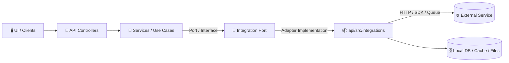

# 🧩 Integrations (`api/src/integrations`)

> 📌 **According to a document from 2026-01-02**, KFM follows a layered “Interfaces & Adapters” approach: core logic talks outward **through interfaces**, and the infrastructure layer provides **plug-and-play** implementations for external APIs/services (e.g., Google Earth Engine). This folder is where those adapters live. :contentReference[oaicite:0]{index=0}:contentReference[oaicite:1]{index=1}

---

## 📚 Table of Contents

- [🎯 Purpose](#-purpose)
- [🧠 Architecture fit](#-architecture-fit)
- [✅ What belongs here vs 🚫 what doesn’t](#-what-belongs-here-vs--what-doesnt)
- [📦 Recommended folder layout](#-recommended-folder-layout)
- [🗺️ Integration catalog](#️-integration-catalog)
- [🔐 Configuration & secrets](#-configuration--secrets)
- [🛡️ Resilience & reliability](#️-resilience--reliability)
- [🧾 Data locality rule](#-data-locality-rule)
- [📈 Observability](#-observability)
- [🧪 Testing strategy](#-testing-strategy)
- [➕ Adding a new integration](#-adding-a-new-integration)
- [🧰 Templates](#-templates)
- [🧯 Troubleshooting](#-troubleshooting)
- [📎 References](#-references)

---

## 🎯 Purpose

This directory contains **integration adapters** used by the API and service layers to communicate with:

- 🌍 **External geospatial services** (e.g., GeoServer WMS/WFS, tile services) :contentReference[oaicite:2]{index=2}
- ☁️ **Cloud GIS & analytics** (e.g., **Google Earth Engine** as data source/compute engine) :contentReference[oaicite:3]{index=3}
- 🛰️ **External data APIs** (e.g., NASA/USDA data endpoints) :contentReference[oaicite:4]{index=4}
- 🧠 **Internal microservices** (e.g., geospatial rendering, ML inference servers) :contentReference[oaicite:5]{index=5}
- 📨 **Queues / messaging** patterns (HTTP/HTTPS, message queues; networking stays at the edges) :contentReference[oaicite:6]{index=6}

> 💡 **Rule of thumb:** Integrations translate **protocols + auth + upstream quirks** into **clean, predictable outputs** for the rest of the system.

---

## 🧠 Architecture fit

KFM’s architecture emphasizes:
- **Layered separation** (domain vs infrastructure),
- **Single responsibility** (one adapter per external system),
- **Dependency direction** (inner layers don’t depend on outer),
- **Interfaces and abstraction** (swap vendors/frameworks with minimal impact). :contentReference[oaicite:7]{index=7}

### 🔁 Flow (high level)



> 🧭 The “networking details are confined to the edges” idea is intentional—use cases call **interfaces**, and adapters do the network work. :contentReference[oaicite:8]{index=8}

---

## ✅ What belongs here vs 🚫 what doesn’t

### ✅ Belongs here
- 🔑 Auth + token refresh (OAuth, API keys, service accounts)
- 🌐 HTTP/gRPC clients, SDK wrappers, queue publishers/consumers
- 🧱 DTOs (upstream request/response types), mappers, serializers
- ⏱️ Timeouts, retries/backoff, pagination helpers
- 🚦 Rate limit handling (429), circuit breaker hooks
- 🧪 Mocks/stubs for tests + contract fixtures
- 📄 Integration-specific README (per provider) if needed

### 🚫 Does **not** belong here
- 🧠 Business rules / policy decisions (“if drought risk > X then…”)
- 🗄️ Domain repositories (DB access patterns) unless explicitly a cache layer
- 🧾 HTTP route handlers / controllers
- 📊 Heavy analytics logic (that belongs in services/pipelines)

---

## 📦 Recommended folder layout

Use one folder per upstream system. Keep shared primitives in `_shared/`.

```text
api/src/integrations/
├── 📄 README.md                # you are here
├── 📁 _shared/
│   ├── 📄 errors.*             # shared IntegrationError taxonomy
│   ├── 📄 http.*               # shared HTTP client factory (timeouts, retry)
│   └── 📄 telemetry.*          # shared tracing/log helpers
├── 📁 geoserver/
│   ├── 📄 client.*             # WMS/WFS/WMTS client wrapper
│   ├── 📄 config.*             # env parsing + validation
│   ├── 📄 mappers.*            # upstream → internal DTO mapping
│   ├── 📄 types.*              # upstream DTOs
│   └── 📄 index.*              # exported surface
├── 📁 gee/
│   ├── 📄 client.*             # Earth Engine wrapper
│   ├── 📄 exports.*            # helpers for exporting / polling tasks
│   └── 📄 index.*
└── 📁 nasa_power/              # example external data API
    └── ...
```

> 🧼 **Naming convention:** lowercase + underscores for provider folders (`nasa_power`, `usda`, `gee`, etc.). Keep filenames boring and consistent.

---

## 🗺️ Integration catalog

> ✅ Maintain this table as you add integrations. It becomes the “map” of the perimeter.

| Integration 📌 | What it’s for 🎯 | Upstream type 🌐 | Auth 🔐 | Notes 📝 |
|---|---|---|---|---|
| `geoserver` | Serve GIS layers (WMS/WFS/WMTS/tiles) | HTTP | Basic/OAuth/Proxy | Common for map overlays :contentReference[oaicite:9]{index=9} |
| `gee` | Remote sensing data + compute engine | SDK/HTTP | Google auth | Used as data source + analytics :contentReference[oaicite:10]{index=10} |
| `nasa_power` | Solar/radiation / met data | HTTP | API key (varies) | Example external API :contentReference[oaicite:11]{index=11} |
| `ml_inference` | Model prediction service | HTTP/gRPC | Internal | May be TorchServe/TensorFlow Serving etc :contentReference[oaicite:12]{index=12} |

---

## 🔐 Configuration & secrets

### ✅ Principles
- **No secrets in code.** Ever.
- Prefer **env vars** for runtime configuration, validated at startup.
- For containerized deploys, use **secret management** (e.g., Docker Secrets) for API keys/passwords. :contentReference[oaicite:13]{index=13}
- For local dev, use `.env` files and Compose overrides. :contentReference[oaicite:14]{index=14}

### 🧾 Suggested env var naming
Use a predictable prefix:

- `INTEGRATION_GEOSERVER_BASE_URL`
- `INTEGRATION_GEOSERVER_USERNAME`
- `INTEGRATION_GEOSERVER_PASSWORD`
- `INTEGRATION_GEE_PROJECT`
- `INTEGRATION_GEE_CREDENTIALS_JSON` (or a file path)

> 🔍 If you’re using Docker Compose: build args + environment variables are recommended for flexibility, with `.env` files for environment-specific values. :contentReference[oaicite:15]{index=15}

---

## 🛡️ Resilience & reliability

KFM expects the web/API layer to be robust and scalable; networking is an edge concern and typically uses **standard protocols** (HTTP/HTTPS, and possibly MQTT/AMQP where relevant). :contentReference[oaicite:16]{index=16}

### ✅ Required behaviors for integration clients
- ⏱️ **Timeouts** (connect + read)
- 🔁 **Retries** for transient failures (timeouts, 5xx, 429) with backoff + jitter
- 🚦 **Rate limit handling** (respect Retry-After if present)
- 🧵 **Idempotency** (avoid double submits for POST/trigger endpoints)
- 📚 **Pagination** helpers (stream results)
- 🧠 **Circuit breaker hooks** (optional but recommended)

> 🧩 Keep adapters **stateless** where possible; stateless services scale well behind load balancers. :contentReference[oaicite:17]{index=17}

---

## 🧾 Data locality rule

When KFM uses external services (like GEE), we treat them as part of the pipeline **but store results locally after retrieval** for consistency and offline capability. :contentReference[oaicite:18]{index=18}

### ✅ Implication for integrations
- Integrations should return data in a form that can be **persisted** (DB/object storage/files).
- Prefer returning:
  - `metadata + reference (URI/asset-id)` for big rasters
  - `normalized DTOs` for timeseries / tables
- Avoid “live-only” coupling where the UI depends on upstream availability for historical results.

---

## 📈 Observability

### 🧩 Minimum expectations
- 🧾 **Structured logs** (include integration name + request_id/correlation_id)
- ⏲️ **Latency metrics** per upstream route
- 🚨 **Error classification** (auth, timeout, upstream 5xx, rate-limit, validation)
- 🧵 **Tracing** where supported (propagate trace headers)

### 🔒 Logging safety
- Never log secrets (tokens, Authorization headers, full credential blobs).
- Scrub PII and limit payload logging to debug-only.

---

## 🧪 Testing strategy

### ✅ What to test
- **Unit tests:** mapping logic, auth header creation, pagination logic
- **Contract tests:** validate upstream response shapes against fixtures/schemas
- **Integration tests:** hit sandbox/staging endpoints (or record/replay) when possible

### 🐳 Docker Compose–friendly testing
If your integration tests need supporting services, Compose is a good fit:
- View logs: `docker-compose logs`
- Rebuild/recreate: `docker-compose up -d --build`
- Validate config: `docker-compose config` :contentReference[oaicite:19]{index=19}

> 🧯 Compose troubleshooting commands should be part of your integration test runbook. :contentReference[oaicite:20]{index=20}

---

## ➕ Adding a new integration

### ✅ Checklist (PR-ready)
- [ ] Create a new folder: `api/src/integrations/<provider>/`
- [ ] Add `config.*` (env parsing + validation)
- [ ] Add `client.*` (network boundary only)
- [ ] Add `types.*` and `mappers.*` (upstream ↔ internal DTOs)
- [ ] Add typed errors (map upstream errors → `IntegrationError`)
- [ ] Add tests (unit + at least one contract fixture)
- [ ] Wire it into DI / service layer via an **interface/port**
- [ ] Update the [Integration catalog](#️-integration-catalog)

> 🧠 Architecture reminder: use cases call **interfaces**; adapters implement them. This keeps core logic independent and replaceable. :contentReference[oaicite:21]{index=21}:contentReference[oaicite:22]{index=22}

---

## 🧰 Templates

<details>
<summary>📦 Integration skeleton (language-agnostic)</summary>

```text
integrations/<provider>/
├── config.*        # reads env + validates
├── client.*        # low-level HTTP/SDK wrapper
├── types.*         # upstream DTOs
├── mappers.*       # upstream → internal DTO mapping
├── errors.*        # IntegrationError mapping
├── index.*         # export the public API for the provider
└── __tests__/      # unit/contract tests
```

</details>

<details>
<summary>🧯 Error taxonomy suggestion</summary>

```ts
// pseudo-types (adapt to your language)
type IntegrationErrorKind =
  | "AUTH"
  | "RATE_LIMIT"
  | "TIMEOUT"
  | "UPSTREAM"
  | "BAD_RESPONSE"
  | "INVALID_REQUEST";

class IntegrationError extends Error {
  kind: IntegrationErrorKind;
  provider: string;
  status?: number;          // upstream HTTP status when applicable
  retryable: boolean;       // used by retry/backoff policy
  correlationId?: string;   // request id / trace id
}
```

</details>

---

## 🧯 Troubleshooting

### 🧩 Common failure modes
- 🔐 **401/403** → bad creds, expired token, wrong scopes
- 🚦 **429** → rate limits (add backoff + jitter; cache where possible)
- ⏱️ **Timeouts** → missing timeouts or too-aggressive payloads
- 🧾 **Schema drift** → upstream changed response shape; update contract fixtures

### 🐳 Docker Compose triage commands
- `docker-compose logs` (inspect integration-dependent services)
- `docker-compose up -d --build` (rebuild and restart)
- `docker-compose config` (confirm env + compose resolution) :contentReference[oaicite:23]{index=23}

### 🔒 Container security reminders (when integrations run in containers)
- Run as **non-root users** when possible. :contentReference[oaicite:24]{index=24}
- Use **secret management** (e.g., Docker secrets). :contentReference[oaicite:25]{index=25}
- Consider **network segmentation** to isolate upstream-facing components. :contentReference[oaicite:26]{index=26}

---

## 📎 References

- 📘 **Kansas Frontier Matrix (KFM) – Comprehensive Technical Documentation** :contentReference[oaicite:27]{index=27}  
  - Layering, interfaces/adapters, infrastructure responsibilities, API microservices, and Earth Engine / GeoServer integration notes. :contentReference[oaicite:28]{index=28}:contentReference[oaicite:29]{index=29}:contentReference[oaicite:30]{index=30}

- 🐳 **Introduction to Docker** :contentReference[oaicite:31]{index=31}  
  - Compose troubleshooting commands and security practices (non-root, secrets, segmentation). :contentReference[oaicite:32]{index=32}:contentReference[oaicite:33]{index=33}:contentReference[oaicite:34]{index=34}

