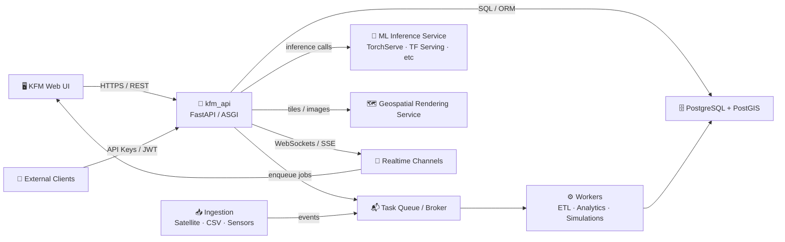

# 🌾 KFM API (`kfm_api`)


> **`kfm_api` is the backend API boundary for the Kansas Frontier Matrix (KFM)** — exposing REST endpoints for geospatial + timeseries queries, simulation runs (async jobs), data ingestion/upload, and real‑time updates for sensor streams & long-running tasks. 🚜📡

---

## 🧭 What lives in this folder?

This directory (`api/src/kfm_api/`) contains the **API-layer code** responsible for:

- 🌐 **HTTP/HTTPS REST API** for the KFM web UI + external integrations
- 🧾 **OpenAPI (Swagger) docs** support (FastAPI-first design)
- 🔐 **Authentication & Authorization** (JWT bearer tokens + role checks)
- 🧰 **Orchestration** of microservices / task queues for long-running workloads
- 📡 **Real-time updates** via WebSockets or SSE for sensor streams + job progress
- 🧪 **Contract + integration testing hooks** (keep the boundary reliable)

---

## 🚦 Quick links (in-repo)

- 📚 `docs/MASTER_GUIDE_v13.md` — master doc map & workflow
- 🧩 `docs/templates/TEMPLATE__API_CONTRACT_EXTENSION.md` — contract-first extension template
- 🧠 `docs/KFM_MARKDOWN_WORK_PROTOCOL.md` — documentation workflow protocol
- 🧱 (v13 canonical) `src/server/contracts/` — **API contract source of truth**
- 🗺️ KFM backend design background: `Kansas Frontier Matrix (KFM) – Comprehensive Technical Documentation.pdf`

> [!NOTE]
> Repo layouts evolve. If this package is being migrated toward the v13 layout, treat `api/src/kfm_api/` as the *runtime package*, and `src/server/contracts/` as the *authoritative contract* location.

---

## 🏗️ Architecture at a glance



Core idea: **keep domain logic and infrastructure details separated** (Clean/Hexagonal architecture style). API routes should be thin; orchestration lives in services/use-cases; adapters live at the edges. 🧩

---

## 🧱 Package layout (recommended)

Your exact tree may differ, but this is the intended “clean boundary” structure:

```text
📦 api/src/kfm_api
├─ 🧠 app/ or main.py               # FastAPI app factory / ASGI entrypoint
├─ 🧭 routers/                      # HTTP route modules (thin)
│  ├─ field.py                      # /api/field/* (timeseries, summaries)
│  ├─ climate.py                    # /api/field/*/climate
│  ├─ simulation.py                 # /api/simulation/*
│  ├─ data.py                       # /api/data/* (uploads/exports)
│  └─ health.py                     # /health, /ready (if present)
├─ 🧾 schemas/                      # Pydantic models (request/response)
├─ 🔐 auth/                         # JWT verification, RBAC helpers, deps
├─ 🧰 services/                     # Orchestration / use-case services
├─ 🗄️ repository/                   # DB access layer (PostGIS/SQL/ORM)
├─ 📦 integrations/                 # External API clients (NOAA, GEE, etc.)
├─ 📡 realtime/                     # WebSocket/SSE manager + topics
├─ 🧵 tasks/                        # Background job definitions (queue)
├─ ⚙️ config/                       # settings loader (env-based)
└─ 🧪 tests/                        # unit + contract + integration tests
```

> [!TIP]
> If you’re unsure where something belongs:  
> ✅ *Routers = HTTP shape* • ✅ *Services = business orchestration* • ✅ *Repo = persistence* • ✅ *Integrations = external calls*.

---

## 🧩 API surface (high-level)

The KFM backend supports a REST API that typically includes flows like:

### 🌿 Field & timeseries
- `GET /api/field/{field_id}/timeseries?var=ndvi` → NDVI time series for a field  
- `GET /api/field/{field_id}/climate?start=YYYY-MM-DD&end=YYYY-MM-DD` → climate slice for a field

### 🧪 Simulation runs (async job model)
- `POST /api/simulation/run` → validates + enqueues a simulation, returns a `job_id`
- `GET /api/simulation/{job_id}/status` → job progress/result availability

### 📤 Data ingestion / admin
- `POST /api/data/upload` → upload datasets (CSV/GeoJSON/GeoTIFF, etc.)
- (optional) secured admin endpoints → retrain models, refresh caches, re-index, etc.

> [!IMPORTANT]
> Treat endpoints and schemas as **contracts**. Changes must be reflected in the OpenAPI contract and compatibility rules.

---

## 🔁 Async jobs: how it should behave

Long-running work (simulations, big ETL, heavy analysis) should follow a predictable pattern:

1. ✅ API receives request → auth + input validation
2. 📬 API enqueues a background task (or triggers a microservice)
3. 🧾 API returns **job ID** immediately (non-blocking)
4. 🔍 Client uses:
   - polling: `GET /api/simulation/{job_id}/status`
   - realtime: WebSocket/SSE progress channel (preferred for UX)

```bash
# Example flow (adjust host/port):
curl -X POST "http://localhost:8000/api/simulation/run" \
  -H "Authorization: Bearer <JWT>" \
  -H "Content-Type: application/json" \
  -d '{"scenario":"baseline","field_id":12,"start":"2025-03-01","end":"2025-09-30"}'
```

---

## 📡 Real-time updates (WebSockets / SSE)

KFM supports push-based updates for:

- 📟 **sensor streams** (dashboard updates without refresh)
- 🧪 **job progress** for simulations/analytics

Example topics (conceptual):
- `sensor_updates_field_12`
- `simulation_progress_<job_id>`

> [!NOTE]
> The exact WS/SSE URL depends on implementation. Search for WebSocket/SSE route definitions inside `realtime/` or router modules.

---

## 🔐 Authentication & Authorization

The backend uses token-based authentication (commonly **JWT**):

- Requests include `Authorization: Bearer <token>`
- Token is verified per request (signature + expiry)
- Authorization is role/resource based (RBAC + ownership checks)
  - 👤 normal users: read + run analyses for allowed fields
  - 🧑‍🔬 researchers/admin: broader access (uploads, system-wide runs)
  - 🛡️ sensitive operations: “admin-only” operational access levels

```bash
curl "http://localhost:8000/api/field/10/timeseries?var=ndvi" \
  -H "Authorization: Bearer <JWT>"
```

**Expected failures**
- `401 Unauthorized` → missing/invalid token
- `403 Forbidden` → valid token, but not allowed for that resource/action

---

## 🗂️ Formats & interoperability

KFM is designed to interoperate with external systems:

- ✅ **JSON** (default)
- 🧾 **CSV** (bulk export)
- 🗺️ **GeoJSON** (vector geospatial)
- 🧊 **GeoTIFF / imagery / tiles** (raster layers, map tile delivery)
- 🌦️ Climate datasets may be delivered via standards like NetCDF (when applicable)

> [!TIP]
> Prefer standards-first outputs (GeoJSON/GeoTIFF/NetCDF) so downstream GIS and research tooling “just works”.

---

## 📈 Logging, monitoring, and health checks

Expected observability behavior:

- 🧾 Per request logs: method, endpoint, user id (if auth), params, status code, latency
- 🧯 Error logs: stack traces internally + safe error IDs returned to clients
- 🧵 Task logs: start/finish markers, retries, and failure reasons
- ❤️ Health endpoints: `/health` (and optionally `/ready`) for uptime monitoring

> [!NOTE]
> Health checks are used by monitors (Pingdom-like), load balancers, and orchestration systems.

---

## 🧪 Testing

Minimum testing tiers we aim for:

- ✅ **Unit tests** for pure logic (services/use-cases)
- 🔌 **Integration tests** for DB + queue + external adapters (mocked where needed)
- 🧾 **Contract tests** to ensure implementation matches OpenAPI schemas

Suggested commands (adapt to repo tooling):
```bash
pytest
# or
python -m pytest
```

---

## 🧩 Contract-first workflow (non-negotiable)

Per the project docs, we use **contract-first discipline**:

- ✅ **Define/extend the API contract first**
- ✅ Implement handlers to match the contract
- ✅ Add/adjust tests to enforce compatibility
- 🚫 Do not ship silent breaking changes

Contract locations (depending on repo versioning):
- v13 canonical: `src/server/contracts/`
- legacy/packaged: `api/src/kfm_api/contracts/`

When you add or change an endpoint:
1. 🧾 Update the OpenAPI contract
2. 🧪 Add tests (contract + behavior)
3. 🔁 Ensure backward compatibility (or bump version)

---

## 🚀 Running locally (common patterns)

Because repo tooling may differ, here are the typical approaches:

### 🐍 Virtualenv (pip)
```bash
python -m venv .venv
source .venv/bin/activate
pip install -U pip
pip install -r requirements.txt
```

### ▶️ Start the API server (FastAPI)
```bash
# Pick the one that matches the codebase:
uvicorn kfm_api.main:app --reload --host 0.0.0.0 --port 8000
# or
uvicorn kfm_api.app:app --reload --host 0.0.0.0 --port 8000
```

Then open:
- Swagger UI: `http://localhost:8000/docs`
- ReDoc: `http://localhost:8000/redoc`

> [!TIP]
> If you’re unsure of the entrypoint, search for `FastAPI(` in `api/src/kfm_api/` and locate the exported `app`.

---

## 🧯 Troubleshooting

- **401 / 403** → verify token, claims, and resource ownership checks
- **Slow endpoints** → check DB indexes, query plans, and caching/materialized views
- **Jobs stuck** → check broker/worker health + task retries + queue depth
- **WebSockets unstable** → validate subscriber cleanup + rate limits + max connections

---

## 🧠 Design principles (quick checklist)

- 🧼 Keep routes thin (validation + response shaping only)
- 🔌 Integrations through adapters (don’t leak vendor SDKs into core logic)
- 🧱 Stable contracts (OpenAPI is the source of truth)
- 🧵 Async by default for heavy workloads
- 📡 Push updates when user experience benefits (sensor dashboards, progress)
- 🔐 Security-first: least privilege, audited admin actions, no secret leakage

---

## 📌 Ownership

- Folder: `api/src/kfm_api/`
- Role: **API boundary + orchestration layer** for Kansas Frontier Matrix
- Audience: backend devs, integrators, and internal platform maintainers 🛠️

---
