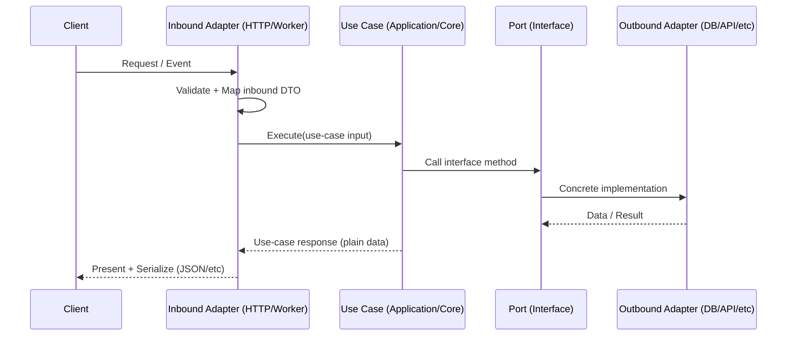

# 🧩 `kfm_api` — Adapters


> 📍 Location: `api/src/kfm_api/adapters/`  
> 🧠 TL;DR: **Adapters are the “edge” glue** — they translate between the outside world (HTTP, DBs, external services, queues, devices) and KFM’s inner use cases.

---

## ✨ Why this folder exists

KFM is designed so that *business logic stays stable* while frameworks and vendors can change.

Adapters make that possible by:
- translating inbound inputs (HTTP requests, job payloads, CLI args) into **use-case-friendly** data
- calling use cases
- translating outbound results into **delivery formats** (JSON responses, DB writes, messages, tiles, files, etc.)
- keeping external concerns (auth middleware, request parsing, SQL drivers, SDK clients) **out of the core**

> [!TIP]
> If you feel tempted to put “just a little business rule” in an adapter… that’s usually a sign the rule belongs in a use case. Keep adapters *thin* and *replaceable*.

---

## 🧭 The “Golden Rules” (read this before coding here)

### ✅ 1) Dependency direction: *point inwards*
Adapters may import/use inner layers (entities / use cases / ports), but inner layers must **never** import adapter code.

### ✅ 2) “Translate at the edges”
- External types stay outside (framework Request/Response objects, ORM models, SDK objects).
- Inner layers get simple structures (dicts, dataclasses, entities) and interfaces (“ports”).

### ✅ 3) One adapter, one job
Aim for **single responsibility** per module/class:
- one DB adapter per backing store
- one client adapter per external service
- one inbound adapter per delivery mechanism (HTTP/CLI/worker)

### ✅ 4) If you *must* bend the rules… document it loudly
Performance/latency constraints sometimes force pragmatic exceptions. If you break the clean boundaries, leave a **giant warning** and rationale so future refactors don’t accidentally entrench the shortcut.

---

## 🧱 What belongs here (✅) vs what doesn’t (🚫)

| ✅ Put it in `adapters/` | 🚫 Keep it out of `adapters/` |
|---|---|
| HTTP routing/controllers, request/response schemas | Core business logic / domain rules |
| DB repository implementations (e.g., Postgres/PostGIS) | Use case orchestration logic |
| External API clients (e.g., remote sensing services) | Domain entities/models definitions |
| Message queue producers/consumers | Anything that should be framework-agnostic |
| Serialization & presentation mapping | Heavy compute pipelines (should be separate services/jobs) |

---

## 🔌 Adapter types (common patterns)

### 🟦 Inbound adapters (a.k.a. “primary adapters”)
Inbound adapters **receive** a request/event and invoke a use case.

Examples:
- 🌐 HTTP controllers (REST/JSON)
- 🧵 Worker/consumer handlers (queue messages)
- 🧑‍💻 CLI commands (dev tooling)
- ⏰ Scheduled jobs / cron entrypoints

### 🟩 Outbound adapters (a.k.a. “secondary adapters”)
Outbound adapters **implement ports** that use cases depend on.

Examples:
- 🗄️ repositories (Postgres/PostGIS, files, object storage)
- 🛰️ remote sensing / imagery clients
- 🔔 notifications (email/webhook/SMS)
- 🧵 queues/event buses
- 📦 caching layers

---

## 🗂️ Suggested package structure

> [!NOTE]
> This is a *recommended* organizing scheme. Match the real repo conventions first, then refine.

```text
🧩 adapters/
├─ 🟦 inbound/
│  ├─ 🌐 http/
│  │  ├─ routers/          # route definitions
│  │  ├─ schemas/          # request/response DTOs
│  │  ├─ deps.py           # dependency wiring for handlers
│  │  └─ mappers.py        # dto <-> use-case mapping
│  └─ 🧵 workers/
│     ├─ consumers/
│     └─ handlers/
├─ 🟩 outbound/
│  ├─ 🗄️ db/
│  │  ├─ postgis/          # repository implementations
│  │  └─ migrations/       # (if owned by API layer)
│  ├─ 🛰️ remote_sensing/
│  ├─ 🔔 notifications/
│  └─ 🧵 messaging/
└─ 🧰 common/
   ├─ errors.py            # adapter-level exception mapping
   ├─ logging.py           # structured logging helpers
   └─ telemetry.py         # metrics/tracing helpers
```

---

## 🔁 Typical request flow (how adapters should behave)



---

## 🧰 How to add a new adapter (checklist)

### ✅ Step-by-step
1. **Identify the port** (interface) needed by a use case (e.g., `SoilDataRepository`, `MapPresenter`, `ImageryServiceClient`).
2. **Implement the adapter** here (DB client, HTTP client, queue publisher, etc.) as the concrete class for that port.
3. **Do mapping at the boundary**:
   - request schema → use-case input
   - use-case output → response schema
4. **Wire it up** in the composition root (app startup / DI container / dependency providers).
5. **Test it**:
   - unit tests: mapping + error translation
   - integration tests: real external dependency (optional but recommended)

### ✅ Quick quality gates
- [ ] No framework types leak into use cases (Requests, Responses, ORM models, SDK objects).
- [ ] Adapter code contains **no business rules** beyond translation/validation.
- [ ] Timeouts/retries are explicit for network calls.
- [ ] Errors are mapped into a consistent API error contract.
- [ ] Logs/metrics exist at boundaries (request start/end, external call latency, failures).

---

## 🧪 Testing strategy (practical and reliable)

### 🧪 Unit tests (fast)
- test DTO validation
- test mapping logic (DTO ↔ domain / use-case)
- test error translation (e.g., DB integrity error → `409`, timeout → `504`)

### 🧫 Integration tests (slower, high confidence)
- run against a real Postgres/PostGIS container
- run against a local/mock external service
- validate migrations + repository behavior

> [!TIP]
> Use-case tests should be able to run with **dummy implementations** of ports — adapters shouldn’t be required for core correctness tests.

---

## 🧯 Error handling & observability

Adapters are where “messy reality” shows up:
- partial failures
- network timeouts
- schema drift
- corrupted payloads

Recommended approach:
- 🎯 normalize errors into a small set of **domain-friendly** failure types
- 🧾 log with request IDs / correlation IDs
- ⏱️ track latency for external calls
- 🚦 avoid retry storms (bounded retries + backoff)

---

## 🔐 Security & deployment notes (edge concerns live here)
Common adapter responsibilities include:
- enforcing HTTPS-only assumptions (at the edge / ingress)
- validating authentication tokens
- applying rate limits
- sanitizing inbound data (never trust clients)

Also, the web/API layer should remain as stateless as possible so it can scale horizontally behind a load balancer.

---

## 📚 Further reading (project-aligned)
- 📄 *Kansas Frontier Matrix (KFM) – Comprehensive Technical Documentation*
- 📄 *Clean Architectures in Python*

---