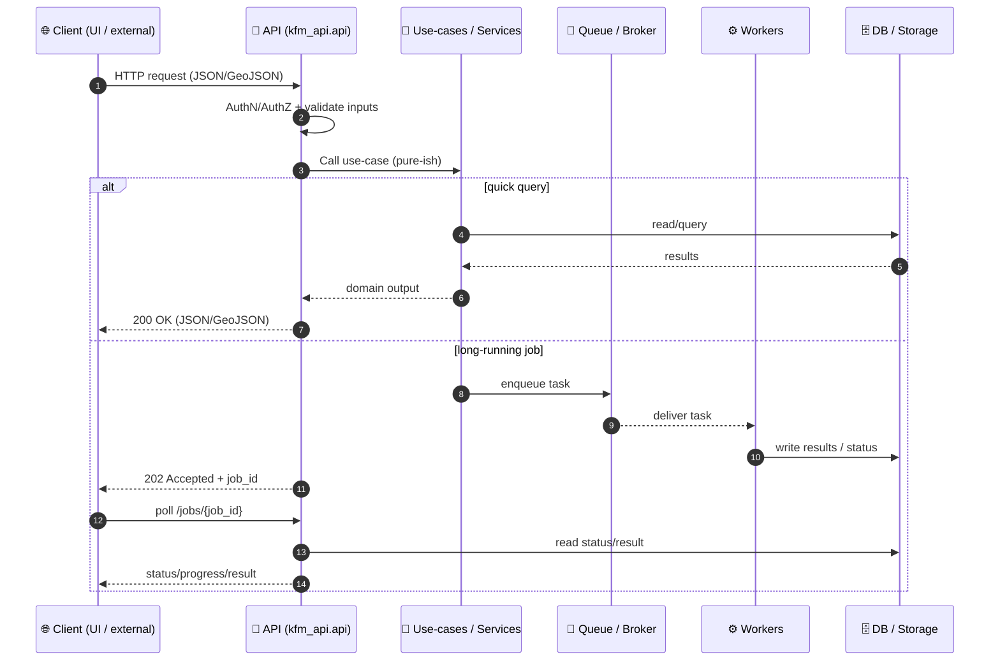

<div align="center">

# 🚀 KFM API — `kfm_api.api`

**HTTP boundary + adapters for the Kansas Frontier Matrix (KFM)** 🧭🌾  
📍 **Path:** `api/src/kfm_api/api/README.md`

<!-- Badges (feel free to tweak to match repo realities) -->


</div>

---

## 🔗 Quick Links

- ⚡ **Run locally** → [Quickstart](#-quickstart)
- 📜 **API docs** → [OpenAPI & Docs](#-openapi--docs)
- 🧩 **Add an endpoint** → [Adding an Endpoint](#-adding-an-endpoint)
- 🧪 **Tests** → [Testing](#-testing)
- 🔐 **Security** → [Security Checklist](#-security-checklist)
- 🧯 **Help** → [Troubleshooting](#-troubleshooting)

<details>
<summary><strong>🧭 Table of Contents</strong> (click to expand)</summary>

- [🎯 Purpose](#-purpose)
- [🧠 Where this fits in KFM architecture](#-where-this-fits-in-kfm-architecture)
- [🧱 Responsibilities](#-responsibilities)
- [🗂️ Suggested module layout](#️-suggested-module-layout)
- [🧬 Request lifecycle](#-request-lifecycle)
- [⚡ Quickstart](#-quickstart)
- [📜 OpenAPI & Docs](#-openapi--docs)
- [📡 Endpoint patterns & examples](#-endpoint-patterns--examples)
- [🧩 Adding an Endpoint](#-adding-an-endpoint)
- [🧪 Testing](#-testing)
- [🔐 Security Checklist](#-security-checklist)
- [📈 Observability](#-observability)
- [🧯 Troubleshooting](#-troubleshooting)

</details>

---

## 🎯 Purpose

This directory is the **API boundary** for KFM:

- 🚪 Defines **HTTP routes** (REST endpoints)
- ✅ Handles **request validation** (schemas), **serialization**, and **errors**
- 🔐 Enforces **authentication & authorization** (JWT + roles / access levels)
- 🔁 Orchestrates **long-running jobs** (enqueue → return `job_id` → poll or push updates)
- 🧩 Calls inward into **use-cases/services** and outward into **adapters** (DB, queue, ML, etc.)

> 💡 Design intent: keep business rules out of here. This layer should be thin, predictable, and testable.

---

## 🧠 Where this fits in KFM architecture

KFM is designed with a **layered / clean-architecture mindset**:

- 🧠 **Inner layers**: domain entities + use cases (policy)
- 🔌 **Outer layers**: web/API framework, DB drivers, message queues (implementation details)

✅ This folder lives in the **outer layer**. It should “talk inward” using simple data and stable interfaces.

---

## 🧱 Responsibilities

| Concern | Owned here? | Notes |
|---|:---:|---|
| HTTP routing & controllers | ✅ | Routers/endpoints live here |
| Input validation & response schemas | ✅ | Prefer explicit schemas per endpoint |
| AuthN/AuthZ (JWT, roles, access levels) | ✅ | Centralize with dependencies/middleware |
| Business rules & domain policy | ❌ | Must live in use-cases / core |
| Database schema/migrations | ❌ | Keep DB details out of route handlers |
| Background tasks / job orchestration | ✅ | Submit jobs + return IDs + expose status |
| Real-time updates (WebSocket/SSE) | ⚠️ | Only if product needs it |

---

## 🗂️ Suggested module layout

> 🧩 If you’re creating new files/modules under `kfm_api.api`, here’s a **recommended** structure (adapt to the actual repo):

```text
api/src/kfm_api/api/
├── 📄 README.md
├── 🧩 app.py                  # FastAPI app instance + wiring
├── 🔁 routes/                 # APIRouter modules (grouped by domain)
│   ├── 🌾 field.py            # /api/field/* (time series, layers)
│   ├── 🧪 simulation.py       # /api/simulation/* (run, status)
│   └── 📦 data.py             # /api/data/* (upload, ingest)
├── 🧾 schemas/                # Request/response models (Pydantic)
│   ├── ✅ common.py           # shared models (ErrorResponse, JobRef, etc.)
│   ├── 🌾 field.py
│   └── 🧪 simulation.py
├── 🔐 deps.py                 # dependency injection (auth, db session, services)
├── 🧯 errors.py               # error normalization (HTTPException mapping)
└── 🛰️ middleware/             # request_id, logging, auth hooks
    ├── 🧾 request_id.py
    └── 🧷 logging.py
```

---

## 🧬 Request lifecycle



---

## ⚡ Quickstart

> ✅ These commands are **templates**. The entrypoint (`...:app`) and dependency tool (pip/poetry) depend on the repo setup.

<details>
<summary><strong>🐍 Option A — venv + pip</strong></summary>

```bash
python -m venv .venv
source .venv/bin/activate

# install deps (examples)
pip install -r requirements.txt
# or editable install
pip install -e .

# run dev server (adjust module:path)
python -m uvicorn kfm_api.api.app:app --reload --host 0.0.0.0 --port 8000
```

</details>

<details>
<summary><strong>📦 Option B — Poetry</strong></summary>

```bash
poetry install
poetry run uvicorn kfm_api.api.app:app --reload --port 8000
```

</details>

<details>
<summary><strong>🐳 Option C — Docker</strong></summary>

```bash
# Typical pattern (adjust to your compose/service names)
docker compose up --build api
```

</details>

---

## 📜 OpenAPI & Docs

If running locally at `http://localhost:8000`:

- 🧾 Swagger UI: `GET /docs`
- 📘 ReDoc: `GET /redoc`
- 📦 OpenAPI JSON: `GET /openapi.json`

> 🧠 Rule of thumb: if it isn’t in OpenAPI, it doesn’t exist.

---

## 📡 Endpoint patterns & examples

### 🌾 Data query pattern (fast)
- **Use when** data is already indexed/precomputed and returns quickly
- **Result**: `200 OK` with JSON/GeoJSON payload

```bash
# Example (timeseries query)
curl "http://localhost:8000/api/field/10/timeseries?var=ndvi"
```

### 🧪 Simulation / heavy analysis pattern (async)
- **Use when** compute is expensive (model runs, bulk processing, raster ops, ML inference)
- **Result**: `202 Accepted` + `{ "job_id": "..." }`

```bash
# Run a simulation (example)
curl -X POST "http://localhost:8000/api/simulation/run" \
  -H "Content-Type: application/json" \
  -d '{
    "field_id": 10,
    "model": "drought-risk",
    "parameters": {"horizon_days": 30}
  }'
```

Then poll:

```bash
curl "http://localhost:8000/api/jobs/<job_id>"
```

### 📦 Ingestion / upload pattern
```bash
curl -X POST "http://localhost:8000/api/data/upload" \
  -F "file=@./data/new_soil_measurements.csv" \
  -F "dataset=soils"
```

> 💡 Tip: uploads should be validated, stored safely, and processed asynchronously when they trigger downstream pipelines.

---

## 🧩 Adding an Endpoint

### ✅ Checklist (contract-first + clean wiring)

1. 🧾 **Define/extend the contract**
   - Add/change the endpoint in the repo’s API contract (OpenAPI, schema, or governed template).
2. 🧬 **Add request/response schemas**
   - Create Pydantic models in `schemas/` (keep them small & explicit).
3. 🚪 **Implement the router**
   - Keep handlers thin: validate → authorize → call use-case → return response.
4. 🧠 **Call the use-case/service**
   - No business logic in the router; no raw SQL in the handler (unless your architecture explicitly allows it).
5. 🧪 **Add tests**
   - Unit tests for schema + use-case behavior; integration tests for route.
6. 🔐 **Enforce access**
   - Roles/ownership checks (e.g., field ownership constraints).
7. 📈 **Instrument**
   - Log request_id, capture errors consistently, expose metrics where appropriate.

### 🧷 Minimal FastAPI router example

```python
from fastapi import APIRouter, Depends
from .schemas.field import FieldTimeseriesResponse
from .deps import require_user

router = APIRouter(prefix="/api/field", tags=["field"])

@router.get("/{field_id}/timeseries", response_model=FieldTimeseriesResponse)
def get_timeseries(field_id: int, var: str, user=Depends(require_user)):
    # ✅ authorize + validate (var choices, ownership, etc.)
    # 🧠 delegate to use-case/service
    return {"field_id": field_id, "var": var, "points": []}
```

---

## 🧪 Testing

<details>
<summary><strong>🧪 Common patterns</strong></summary>

- ✅ **Schema tests**: validate constraints + default behavior
- ✅ **Route tests**: use `TestClient` / `httpx` against the FastAPI app
- ✅ **Contract checks**: ensure OpenAPI stays in sync with behavior
- ✅ **Auth tests**: “no token” → 401, “wrong role” → 403, “wrong ownership” → 403

</details>

```bash
# typical
pytest -q
```

---

## 🔐 Security Checklist

- 🔑 **JWT verification** on every request (signature + expiry)
- 🧾 **Role-based access control (RBAC)** for privileged endpoints
- 🧑‍🌾 **Resource ownership checks** (e.g., field belongs to user/org)
- 🧯 **Rate-limit** authentication endpoints (login, token refresh)
- 🧪 **Input validation** to prevent injection & unsafe file handling
- 🛰️ **Internal service auth** (service tokens / private network)

> 🔒 “Admin-only” routes should be obvious, isolated, and heavily logged.

---

## 📈 Observability

- 🧾 **Structured logs** (include `request_id`, user_id, route, latency)
- 📊 **Metrics** (request duration, queue depth, job success/failure)
- 🧵 **Tracing** (optional): correlate API → worker → DB calls
- 🚨 **Alerting**: auth failures spikes, job error spikes, DB latency

---

## 🧯 Troubleshooting

### “Docs don’t load”
- ✅ Confirm server is up
- ✅ Check `GET /openapi.json` returns valid JSON

### “Job never finishes”
- ✅ Ensure worker is running
- ✅ Check message broker connectivity
- ✅ Inspect job status table/collection + logs

### “403 Forbidden on field queries”
- ✅ Confirm ownership/role logic
- ✅ Check token claims (roles / org / access level)

---

<div align="center">

### 🌾 Built for clarity, safety, and scalability ✅  
<a href="#-quick-links">⬆️ Back to top</a>

</div>