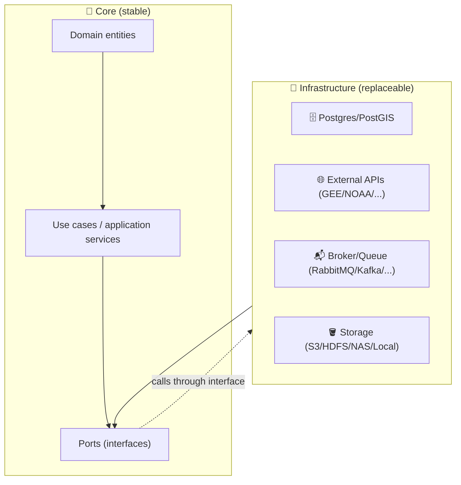

# 🧱 `kfm_api.infrastructure`


> 🎯 **Mission:** The Infrastructure layer is where **real-world I/O** lives — databases, external APIs, queues, file storage, and OS/runtime details.  
> 🧩 **Design goal:** Keep this layer **swappable** so core logic stays stable even if we replace PostGIS, swap the web framework, or change external providers.

---

## 🧭 Quick navigation

- [What belongs here](#-what-belongs-here)
- [What does *not* belong here](#-what-does-not-belong-here)
- [Architecture rules](#-architecture-rules)
- [Suggested package layout](#-suggested-package-layout)
- [Common infrastructure concerns](#-common-infrastructure-concerns)
  - [🗄️ Persistence](#️-persistence)
  - [🌐 External APIs](#-external-apis)
  - [📬 Messaging & background work](#-messaging--background-work)
  - [🪣 File/data storage](#-filedata-storage)
  - [📈 Observability](#-observability)
  - [🔐 Security](#-security)
- [Add a new adapter (step-by-step)](#-add-a-new-adapter-step-by-step)
- [Testing strategy](#-testing-strategy)
- [Local dev tips](#-local-dev-tips)
- [Conventions](#-conventions)
- [📚 Sources & further reading](#-sources--further-reading)

---

## ✅ What belongs here

Infrastructure is the **outermost** layer where we implement the “ports” (interfaces) defined closer to the core.

Typical contents include:

- 🗄️ **Database access**
  - repository implementations (e.g., Postgres/PostGIS-backed repositories)
  - connection/session management, pooling
  - migrations (if co-located)
- 🌐 **External integrations**
  - remote sensing providers (e.g., Google Earth Engine), weather APIs (e.g., NOAA), etc.
  - client adapters, auth, retries, rate limiting
- 📬 **Messaging / async workloads**
  - publishing events, consuming queues, task runners
- 🪣 **Object/file storage**
  - S3-like buckets, HDFS/NAS mounts, local filesystem adapters
- 📈 **Observability glue**
  - logging sinks, metrics emitters, traces, health checks
- 🧰 **Operational scripts (when kept in-repo)**
  - backup scripts, maintenance jobs, smoke checks

---

## 🚫 What does *not* belong here

Keep infrastructure “dumb” and I/O-focused:

- ❌ Core business rules / domain policies  
- ❌ Use-case orchestration (that belongs in the application/service layer)  
- ❌ Web framework request/response shaping logic *unless* it’s purely an adapter/controller boundary  
- ❌ “Smart” computations that don’t require I/O (put those in domain/application)

> 💡 Rule of thumb: If you can unit-test it without a DB, network, disk, or clock — it probably doesn’t belong here.

---

## 🧠 Architecture rules

### Dependency direction ✅
- **Inner layers must not import infrastructure.**  
- Infrastructure **may import** domain/application/ports to implement them.

### Interfaces first 🔌
- Define abstractions (ports) in the inner layers (e.g., `application/ports/*`).
- Implement them here (e.g., `infrastructure/persistence/*`, `infrastructure/clients/*`).

### Swapability 🧩
- We want to be able to replace:
  - DB backend (PostGIS → something else)
  - API framework (FastAPI ↔ Flask)
  - external provider (Weather provider A → B)
- …by swapping implementations, **not rewriting use cases**.

---

## 🗺️ Suggested package layout

> ⚠️ This is a **recommended** map. Adjust names to match the actual repo conventions.

```text
📦 kfm_api/
  ├─ 🧠 domain/                     # entities, value objects (no framework imports)
  ├─ ⚙️ application/                # use cases, services, ports/interfaces
  ├─ 🧱 infrastructure/             # 👈 you are here
  │  ├─ ⚙️ config/                  # env parsing, settings, secrets wiring
  │  ├─ 🗄️ persistence/             # db engine/session + migrations
  │  ├─ 📦 repositories/            # repo implementations (PostGIS, etc.)
  │  ├─ 🌐 clients/                 # external API adapters (GEE, NOAA, etc.)
  │  ├─ 📬 messaging/               # queue/event bus adapters
  │  ├─ 🪣 storage/                 # object storage/filesystem adapters
  │  ├─ 📈 observability/           # logging/metrics/tracing
  │  └─ 🧰 scripts/                 # ops scripts (optional)
  └─ 🧑‍💻 api/                       # web layer: routes/controllers + DI composition root
```

---

## 🧱 How the layers talk (mini diagram)



---

## 🔌 Common infrastructure concerns

### 🗄️ Persistence

**Primary job:** implement repositories using a DB engine (commonly **PostgreSQL + PostGIS** for geospatial work).

Practical guidance:
- ✅ Prefer database-side spatial operations + spatial indexes for “many geometry ops” (avoid slow Python loops).
- ✅ Keep ORM/SQL models *inside* infra and map to domain entities/DTOs at the boundary.
- ✅ Be explicit about transactions and isolation where needed.

**Good boundary:**  
Use cases call something like `SoilDataRepository.get_profile(field_id)` — they should not know whether that’s PostGIS, files, or a mock.

---

### 🌐 External APIs

This is where:
- auth flows live (service accounts, API keys, OAuth)
- retries/backoff live
- timeouts live
- circuit breakers / rate limits live

**Avoid leaking vendor-specific shapes** into core layers:
- parse & normalize response → return domain-friendly data structures
- keep raw JSON / SDK types inside the adapter

---

### 📬 Messaging & background work

KFM-style workflows often include:
- long-running jobs (satellite imagery processing, model training)
- event-driven ingestion (new data available → fire event → pipeline runs)

Infrastructure here may implement:
- job queue publishers
- worker consumers
- “enqueue task” adapters that use cases can call via interfaces

---

### 🪣 File/data storage

Large unstructured datasets (imagery, time-series dumps, intermediate artifacts) typically belong in:
- object storage (S3 compatible)
- shared storage (NAS)
- data lake (HDFS-like)

Infra should expose a **minimal storage port** (e.g., `put_object`, `get_object`, `list_prefix`) instead of scattering bucket logic everywhere.

---

### 📈 Observability

Infrastructure is the right place to standardize:
- structured logging (request-id, correlation-id)
- metrics emission (latency, error counts, queue depth)
- tracing (span propagation across service boundaries)

> 🧩 Tip: Make observability a “thin wrapper” so swapping tooling doesn’t touch use cases.

---

### 🔐 Security

Even though security is cross-cutting, infra typically owns:
- secret loading (env vars, secret manager clients)
- TLS verification defaults, secure HTTP client config
- network segmentation assumptions (public API tier vs private DB tier)
- credential scoping (least privilege for DB/API tokens)

---

## ➕ Add a new adapter (step-by-step)

### 1) Define a port (interface) in the inner layer 🔌
Example (shape only; adapt to project conventions):

```python
# kfm_api/application/ports/soil_data_repository.py
from typing import Protocol

class SoilDataRepository(Protocol):
    def get_profile(self, field_id: str) -> dict: ...
```

### 2) Implement it here in infrastructure 🧱
```python
# kfm_api/infrastructure/repositories/postgis_soil_data_repository.py
class PostgisSoilDataRepository:
    def __init__(self, session):
        self._session = session

    def get_profile(self, field_id: str) -> dict:
        # SQL / ORM query here (keep PostGIS details in this file)
        ...
```

### 3) Wire it in the composition root 🧩
Usually this is in the API layer (`kfm_api/api/...`) where dependency injection happens:

```python
# kfm_api/api/deps.py (example)
def get_soil_repo() -> SoilDataRepository:
    return PostgisSoilDataRepository(session=get_db_session())
```

### 4) Add tests ✅
- unit tests: use case + fake/mock port
- integration tests: infra adapter + real DB/container

---

## 🧪 Testing strategy

### ✅ Unit tests (fast)
- test use cases with in-memory fakes
- do **not** require DB/network

### 🧫 Integration tests (real dependencies)
- spin up Postgres/PostGIS via containers
- test repository implementations, migrations, and adapters
- keep tests hermetic (each test suite owns its DB schema/state)

> 🧠 If a test requires Docker to pass, label it clearly (`integration`, `e2e`) so CI can run it intentionally.

---

## 🧰 Local dev tips

<details>
<summary>🐳 Docker-first local dependencies (recommended)</summary>

Even if your Python runs on your host machine, it’s common to run infra dependencies in containers:

- `db` (Postgres + PostGIS)
- `redis` (cache / queue backend)
- `broker` (RabbitMQ/Kafka) — if your workflow needs it

**Pattern:** define a `docker-compose.yml` at repo root (or in an `/infra` folder), then:

```bash
docker compose up -d db redis
```

</details>

<details>
<summary>🧪 Fast feedback loop</summary>

- Keep adapters small and composable  
- Fail fast on misconfiguration (missing env vars, unreachable providers)  
- Prefer explicit timeouts and meaningful error mapping at boundaries

</details>

---

## 📏 Conventions

- 📁 Put adapters in the most specific folder possible (`repositories/`, `clients/`, `messaging/`, …)
- 🧾 Name implementations with their tech:
  - `postgis_*_repository.py`
  - `gee_*_client.py`
  - `rabbitmq_*_publisher.py`
- 🧼 Keep “impedance mismatch” mapping **inside infra**:
  - SQL rows → domain entities
  - SDK objects → normalized DTOs
- 🧨 Never raise HTTP-framework exceptions from infrastructure (map infra errors to app-layer errors)

---

## 📚 Sources & further reading

These project docs informed how we treat the infrastructure layer and its boundaries:

- 📄 **Kansas Frontier Matrix (KFM) – Comprehensive Technical Documentation** (clean architecture layers, infra responsibilities, API + deployment patterns)
- 📘 **Clean Architectures in Python** (ports/adapters mindset & decoupling patterns)
- 🐳 **Introduction to Docker** (container-first workflows and service composition)
- 🧠 **python-geospatial-analysis-cookbook** (PostGIS-centric approaches for geospatial workloads)
- 🧰 **Command Line Kung Fu** (shell scripting conventions for ops automation)

---