# 🧩 Middleware (api/src/middleware)


> **Middleware = our API’s “plumbing”** 🚰  
> Authentication, RBAC, rate limits, validation, CORS, logging/metrics, geospatial content negotiation, and error handling live here — **not business logic**.

---

## 🧭 Why this folder exists

Middleware gives us a single place to enforce **system-wide guarantees**:

- 🔐 **Security defaults** (JWT auth, roles, brute-force defenses)
- 🧾 **Auditable behavior** (request IDs + structured logs)
- 🧪 **Validated inputs/outputs** (machine-checkable schemas/profiles)
- 🗺️ **Geospatial correctness** (GeoJSON conventions, CRS rules, caching)
- 🧯 **Safe failure** (consistent errors, no leaks, no stack traces in prod)

These expectations are directly aligned with KFM’s backend/security posture and “don’t pretend precision you don’t have” principles.:contentReference[oaicite:0]{index=0}:contentReference[oaicite:1]{index=1}

---

## 🗂️ Folder map (recommended)

```text
📦 api/
 └─ 📂 src/
    └─ 📂 middleware/
       ├─ 📄 README.md          👈 you are here
       ├─ 📄 index.ts           (barrel exports)
       ├─ 📂 context/           (requestId, trace context, per-request state)
       ├─ 📂 security/          (cors, headers, rateLimit, csrf if needed)
       ├─ 📂 auth/              (jwt auth, sessions, api keys)
       ├─ 📂 rbac/              (role/permission checks)
       ├─ 📂 validate/          (schema validation + coercion)
       ├─ 📂 geo/               (GeoJSON/KML/tiles negotiation, CRS rules)
       ├─ 📂 cache/             (etag, cache-control, response caching)
       ├─ 📂 observability/     (logger, metrics, audit)
       └─ 📂 errors/            (notFound, errorHandler)
```

> ✅ If your middleware needs shared helpers (e.g., `getRequestId(req)`), put them in `middleware/context/*` rather than duplicating across modules.

---

## ✅ What belongs here (and what doesn’t)

| ✅ Belongs in middleware | ❌ Does **not** belong in middleware |
|---|---|
| Parsing, validation, coercion, content negotiation | Domain rules (“is this trail historically valid?”) |
| Authn/authz (JWT, roles, permissions) | Database queries to “decide” business outcomes |
| Rate limiting, anti-abuse checks | Heavy computations / model execution |
| Observability (request IDs, structured logs, metrics) | Rendering UI, building map layers, analytics |
| Normalizing errors & response envelopes | “Smart” retry loops that hide failures |

This matches KFM’s layered architecture guidance: outer layers handle formatting/HTTP; domain stays framework-agnostic and returns plain data structures.:contentReference[oaicite:2]{index=2}

---

## 📌 Non‑negotiable rules (source‑backed)

### 1) Order is behavior ✅
Express middleware runs **in the order you register it**; it can modify `req`, `res`, terminate the request, or call `next()` to continue.:contentReference[oaicite:3]{index=3}

- Example: set **CORS** *before* your routers to ensure the headers are present on route responses.:contentReference[oaicite:4]{index=4}
- A “catch-all” `notFound` should be **late**, after routes.:contentReference[oaicite:5]{index=5}

### 2) Error middleware is special 🧯
Express error handlers have the signature `(err, req, res, next)` and are typically registered **after** routes (and after `notFound` if you use it).:contentReference[oaicite:6]{index=6}

Also: **not every missing route is an error**. A 404 often goes through a normal middleware, not the error handler.:contentReference[oaicite:7]{index=7}

### 3) Security assumptions are explicit 🔐
KFM backend expectations include:
- **Token-based authentication (JWT)** for protected endpoints
- **Role-based access control** for authorization
- **Rate limiting** login attempts + **account lockout** after repeated failures:contentReference[oaicite:8]{index=8}

### 4) “No false precision” (especially for analytics) 🎯
KFM explicitly calls out avoiding **false precision** and requiring that assumptions/uncertainties are clearly stated when presenting results.:contentReference[oaicite:9]{index=9}

For simulation / modeling outputs, the NASA-grade guide recommends reporting **verification/validation**, and **uncertainty quantification** rather than a single point value when uncertainty is known.:contentReference[oaicite:10]{index=10}:contentReference[oaicite:11]{index=11}

### 5) Contract discipline: machine-validated outputs 🤖
The project’s documentation guidance emphasizes that outputs should be **machine-validated against schemas/profiles** and that no dataset should be accepted without valid metadata. :contentReference[oaicite:12]{index=12}

---

## 🔁 Request lifecycle (mental model)

```mermaid
flowchart TD
  A["Incoming request"] --> B["🧩 Context (request_id, trace)"]
  B --> C["🛡️ Security (CORS, trusted host, headers)"]
  C --> D["📦 Parsing + content negotiation"]
  D --> E["🧯 Abuse controls (rate limits, payload limits)"]
  E --> F["🔐 Auth + RBAC gates"]
  F --> G["✅ Validation gateways"]
  G --> H["🧭 Router / endpoint handler"]
  H --> I["📤 Response shaping (envelope, cache headers)"]
  I --> J["🕳️ Not Found (404)"]
  J --> K["💥 Exception translation (safe errors)"]
  K --> L["Outgoing response"]
```



---

## 🧱 Recommended middleware order (practical default)

> Tune as needed, but treat this as the “safe baseline”.

1. 🧩 `requestId()` / `context()`  
2. 🛡️ `securityHeaders()` + `cors()`  
3. 📦 `bodyParser()` / `contentTypeGuard()`  
4. 🧯 `rateLimit()` (global/IP)  
5. 🔐 `authJwt()` (if endpoint requires)  
6. 🧑‍⚖️ `rbac()` (roles/permissions)  
7. ✅ `validateRequest(schema)`  
8. 🧭 Routes  
9. 🕳️ `notFound()`  
10. 💥 `errorHandler()` (last)

This matches Express’s “order matters” behavior and error middleware expectations.:contentReference[oaicite:13]{index=13}:contentReference[oaicite:14]{index=14}

---

## 🧰 Middleware catalog (what we typically need)

> Use this as a menu. Don’t implement everything at once.

| Category | Middleware | Purpose | Notes |
|---|---|---|---|
| 🧩 Context | `requestId` | Correlate logs/metrics and client issues | Always on |
| 🛡️ Security | `cors` | Frontend + map tile clients | Must run before routers:contentReference[oaicite:15]{index=15} |
| 🛡️ Security | `securityHeaders` | Baseline headers | Helmet-style |
| 🔐 Auth | `authJwt` | Verify token; attach principal | JWT expected for protected endpoints:contentReference[oaicite:16]{index=16} |
| 🧑‍⚖️ RBAC | `requireRole/permission` | Enforce access policy | Role-based access control expected:contentReference[oaicite:17]{index=17} |
| 🧯 Anti-abuse | `rateLimit` | Throttle & lockout patterns | Login rate limit + lockout expected:contentReference[oaicite:18]{index=18} |
| ✅ Validation | `validateRequest` | Schema-validate input | Machine validation is a core project rule:contentReference[oaicite:19]{index=19} |
| 🗺️ Geo | `geoNegotiation` | `Accept` / `Content-Type` for GeoJSON/KML/tiles | Design doc expects GeoJSON + other formats:contentReference[oaicite:20]{index=20} |
| 🗺️ Geo | `crsGuard` | Enforce CRS conventions (EPSG:4326) | Web map defaults: WGS84:contentReference[oaicite:21]{index=21} |
| 🧾 Observability | `httpLogger` | Structured logs (method, endpoint, user, status, duration) | Logging fields suggested in KFM docs:contentReference[oaicite:22]{index=22} |
| 🧯 Errors | `notFound` | 404 handler | Often a normal middleware:contentReference[oaicite:23]{index=23} |
| 🧯 Errors | `errorHandler` | Consistent error envelope | Must be last:contentReference[oaicite:24]{index=24} |

---

## 🧩 Implementation conventions (practical + consistent)

### 📛 Naming
- Prefer `*.middleware.ts` (or `.js`), with a **named export**:
  - `export const requestId = () => (req, res, next) => { … }`
- Put shared types in `middleware/_types.ts` (or `middleware/types.ts`) if needed.

### 🧪 Type signatures (Express)
```ts
// Standard middleware
(req, res, next) => void | Promise<void>

// Error middleware (MUST be 4 args)
(err, req, res, next) => void | Promise<void>
```

### 🧯 Always-safe async
**Never** write an async middleware that can reject without being caught. Use a wrapper:

```ts
export const asyncMw =
  (fn) =>
  (req, res, next) =>
    Promise.resolve(fn(req, res, next)).catch(next);
```

### 🧱 Respect clean boundaries
Middleware can:
- parse/validate/normalize
- attach `req.context`
- enforce auth
- set headers

Middleware should **not**:
- query DB to compute domain rules
- call core simulation/modeling code
- do heavy geoprocessing

KFM clean-architecture guidance: outer layers format for HTTP; core domain stays clean.:contentReference[oaicite:25]{index=25}

---

## 🗺️ Geospatial specifics (KFM-flavored)

The mapping hub design expects:
- **Vector data** in **GeoJSON** (for shapes/boundaries/features)
- **Raster data** in GeoTIFF / COG
- **Catalog + provenance** using a STAC-like JSON schema approach:contentReference[oaicite:26]{index=26}

### ✅ CRS rule of thumb
For web mapping pipelines, store/serve in **WGS84 (EPSG:4326)**, and keep conversions explicit.:contentReference[oaicite:27]{index=27}

### 🧩 PostGIS ↔ GeoJSON helpers (common patterns)
PostGIS supports turning geometries into GeoJSON via `ST_AsGeoJSON` and the reverse via `ST_GeomFromGeoJSON` — useful for adapters and tests.:contentReference[oaicite:28]{index=28}

---

## 🧾 Observability requirements (baseline)

### 🔎 Structured request logs
KFM recommends capturing items like:
- method, endpoint, user, status, response time
- access logs and dashboards for monitoring:contentReference[oaicite:29]{index=29}

> 🔐 **Never log secrets.** Mask tokens, passwords, API keys, cookies, and full PII.

### 🧷 Correlation IDs
- Always attach a `requestId` and include it in:
  - response headers (e.g., `x-request-id`)
  - log lines
  - error envelopes

---

## 💥 Error model (recommended envelope)

> Keep client behavior predictable.

```json
{
  "error": {
    "code": "AUTH_INVALID_TOKEN",
    "message": "Invalid or expired token.",
    "requestId": "01J...XYZ",
    "details": { "hint": "Re-authenticate." }
  }
}
```

### 🧯 Error classes
Prefer a single “typed” error:
- `status` (HTTP)
- `code` (stable string)
- `expose` (whether message is safe)
- `details` (structured)

---

## 🧪 Testing checklist (middleware-focused)

- ✅ Unit test “happy path”
- ✅ Unit test “stop the chain” (middleware ends response)
- ✅ Unit test “calls next(err)” (error flows to handler)
- ✅ Integration test ordering (CORS before routes, error handler last):contentReference[oaicite:30]{index=30}:contentReference[oaicite:31]{index=31}
- ✅ Snapshot test error envelope

---

## 🛠️ Debugging tips (CLI power) 🥷

- `curl -i` to inspect headers (CORS, cache-control, request-id)
- `jq` to format/inspect error payloads
- `time` to spot middleware performance regressions
- Capture a requestId and grep logs by it

> See also: **Command Line Kung Fu** (project PDF) for shell one-liners and scripting patterns.

---

## 🧩 “Adding a new middleware” PR checklist ✅

- [ ] Placed in the right subfolder (security/auth/geo/validate/obs/errors)
- [ ] Has tests (including failure mode)
- [ ] Documents order constraints (“must run before routes”, etc.)
- [ ] Does not leak secrets into logs
- [ ] Follows machine-validation rules if it touches inputs/outputs:contentReference[oaicite:32]{index=32}

---

## 📚 Project references (the docs this README is grounded in)

> Expand to see the full knowledge base 📚✨

<details>
<summary><strong>🧠 System + Governance</strong></summary>

- Kansas Frontier Matrix (KFM) – Comprehensive Technical Documentation 📘 :contentReference[oaicite:33]{index=33}
- MARKDOWN_GUIDE_v13 (project docs & conventions) 🧾 
- Introduction to Digital Humanism 🌐 :contentReference[oaicite:35]{index=35}
- Introduction to Docker 🐳 :contentReference[oaicite:36]{index=36}
- Clean Architectures in Python 🧱 :contentReference[oaicite:37]{index=37}

</details>

<details>
<summary><strong>🗺️ Geospatial + Mapping</strong></summary>

- Kansas-Frontier-Matrix: Open-Source Geospatial Historical Mapping Hub Design 🗺️ :contentReference[oaicite:38]{index=38}
- Python Geospatial Analysis Cookbook 🧭 :contentReference[oaicite:39]{index=39}
- Geoprocessing with Python 🐍 :contentReference[oaicite:40]{index=40}
- GIS Basics 📍 :contentReference[oaicite:41]{index=41}
- Cloud-Based Remote Sensing with Google Earth Engine ☁️🛰️ :contentReference[oaicite:42]{index=42}
- Google Earth Engine Applications 🛰️ :contentReference[oaicite:43]{index=43}
- Google Maps JavaScript API Cookbook 🧩 :contentReference[oaicite:44]{index=44}
- Google Maps API Succinctly (project PDF) 🗺️ *(not indexed for filecite in this run)*
- Making Maps: A Visual Guide to Map Design for GIS (project PDF) 🎨 *(not indexed for filecite in this run)*

</details>

<details>
<summary><strong>🧪 Modeling, Simulation, Statistics</strong></summary>

- Scientific Modeling and Simulation: A Comprehensive NASA-Grade Guide 🚀 :contentReference[oaicite:45]{index=45}
- Scientific Method / Research / Master Coder Protocol 📜 :contentReference[oaicite:46]{index=46}
- Understanding Statistics & Experimental Design 📊 :contentReference[oaicite:47]{index=47}
- Statistics Done Wrong ⚠️ :contentReference[oaicite:48]{index=48}
- Regression Analysis with Python 📈 :contentReference[oaicite:49]{index=49}
- Bayesian Computational Methods 🎲 :contentReference[oaicite:50]{index=50}
- Graphical Data Analysis with R 📉 :contentReference[oaicite:51]{index=51}
- Data Science & Machine Learning (Mathematical & Statistical Methods) 🧮 :contentReference[oaicite:52]{index=52}
- MATLAB Programming for Engineers 🧰 :contentReference[oaicite:53]{index=53}

</details>

<details>
<summary><strong>🤖 AI / ML / Agents</strong></summary>

- AI Foundations of Computational Agents (3rd Ed.) 🤖 :contentReference[oaicite:54]{index=54}
- Deep Learning in Python — Prerequisites 🧠 :contentReference[oaicite:55]{index=55}
- Artificial Neural Networks: An Introduction 🧬 :contentReference[oaicite:56]{index=56}
- Data Mining: Concepts & Applications ⛏️ :contentReference[oaicite:57]{index=57}
- Principles of Biological Autonomy 🧫 :contentReference[oaicite:58]{index=58}

</details>

<details>
<summary><strong>🗄️ Databases, Scale, Web</strong></summary>

- PostgreSQL Notes for Professionals 🐘 :contentReference[oaicite:59]{index=59}
- MySQL Notes for Professionals 🐬 :contentReference[oaicite:60]{index=60}
- Scalable Data Management for Future Hardware ⚙️ :contentReference[oaicite:61]{index=61}
- Node.js Notes for Professionals 🟩 :contentReference[oaicite:62]{index=62}
- Implementing Programming Languages (Compilers/Interpreters) 🧠 :contentReference[oaicite:63]{index=63}
- Responsive Web Design with HTML5 & CSS3 📱 :contentReference[oaicite:64]{index=64}

</details>

<details>
<summary><strong>🎨 Visualization + Graphics</strong></summary>

- WebGL Programming Guide 🌐✨ :contentReference[oaicite:65]{index=65}
- Computer Graphics using Java 2D & 3D 🎨 :contentReference[oaicite:66]{index=66}
- Spectral Geometry of Graphs 🕸️ :contentReference[oaicite:67]{index=67}
- Generalized Topology Optimization for Structural Design 🏗️ :contentReference[oaicite:68]{index=68}

</details>

---

### 🧭 Related project convention note
The broader project docs emphasize a single canonical API surface (and avoiding duplicate API folders). If this repo’s API is packaged under `api/`, treat `api/src` as the local “server entry” equivalent and keep **middleware** here focused on cross-cutting behavior, not routes or domain logic.:contentReference[oaicite:69]{index=69}


