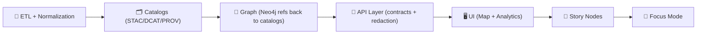

# 🧭 API Routers


This folder contains the **router modules** that define the **contracted, governed API surface** for the Kansas Frontier Matrix (KFM): HTTP endpoints, real-time channels (WebSocket/SSE), and data export interfaces.

> **Routers are adapters, not brains.**  
> They translate **network requests** ➜ into **use-case/service calls**, while enforcing 🔐 auth, 🧾 contracts (OpenAPI), 🧼 validation, 🏷️ classification/redaction, and 📈 observability.

---

## 🗺️ How routers fit the KFM pipeline (non-negotiable)



**Golden rules:**
- ✅ **Pipeline ordering is absolute** — each stage consumes only the previous stage’s formal outputs.  
- ✅ **API boundary rule** — the UI must never query Neo4j directly; all access goes through the governed API boundary.  
- ✅ **Sovereignty + classification propagation** — outputs cannot be less restricted than inputs; redaction/generalization must be enforced end-to-end.

---

## 📌 What’s in a router (and what isn’t)

### ✅ Router responsibilities
- 🔐 **Authentication & authorization** (token verification, role checks, operational access levels)
- 🧾 **Contract adherence** (request/response schemas, OpenAPI completeness)
- 🧼 **Input validation + safe defaults** (type checking, bounds, pagination)
- 🧯 **Error shaping** (consistent status codes; safe error payloads)
- 🏷️ **Governance enforcement** (redaction, classification labels, sensitivity handling)
- 📈 **Observability hooks** (structured logs, request timing, correlation IDs)

### ❌ Not allowed in routers
- 🧠 Business logic (should live in services / use-cases)
- 🗄️ Direct DB/graph “ad-hoc” querying (go through repositories / service layer)
- 🧪 Heavy computation (enqueue background work instead)
- 🧨 Any bypass of redaction/classification rules (ever)

---

## 🧩 Typical router domains in KFM

Common domain router groupings:
- 🌾 **Fields** (boundaries, attributes, timeseries)
- 🧪 **Simulations** (run/status/results)
- 🧠 **Graph** (governed knowledge queries)
- 📤 **Ingest / Upload** (promotions, submissions, validation)
- 🛰️ **Realtime** (WS/SSE feeds for sensors & long jobs)
- 🩺 **Health** (liveness/readiness)

---

## 📁 Suggested directory layout (with lines + right-side descriptions)

> `(py|ts)` means **Python or TypeScript** depending on the service implementation.  
> Keep `v1/` contract-stable; introduce `v2/` only for breaking changes.

```text
📁 api/
├─ 📁 src/
│  └─ 📁 routers/
│     └─ 📁 v1/
│        ├─ 📄 README.md                 │ 📘 v1 router docs + rules (you are here)
│        ├─ 📄 router.(py|ts)            │ 🧩 v1 aggregate router (mounts all v1 routes)
│        ├─ 📄 health.(py|ts)            │ 🩺 liveness/readiness (monitors + deployments)
│        ├─ 📄 auth.(py|ts)              │ 🔐 auth endpoints + permission gates (no business logic)
│        └─ 📁 endpoints/                │ 🧭 optional: group routes by resource/domain
│           ├─ 📄 fields.(py|ts)         │ 🌾 field resources (query + export boundary)
│           ├─ 📄 simulations.(py|ts)    │ 🧪 simulations (start/status/results; async-friendly)
│           └─ 📄 graph.(py|ts)          │ 🧠 governed graph queries (no “direct UI → graph”)
```

---

## 🔌 Router registration pattern

**One mount point per version**, one aggregator per version.

- `routers/v1/router.(py|ts)` mounts:
  - `health.(py|ts)`
  - `auth.(py|ts)`
  - `endpoints/fields.(py|ts)` (etc.)
- App entrypoint (e.g., `main.(py|ts)`) mounts:
  - `routers/v1/router.(py|ts)` at `/api/v1`
  - future `routers/v2/router.(py|ts)` at `/api/v2`

> ✅ This keeps route visibility auditable and makes contract changes deliberate.

---

## 🧾 Contract-first: schemas, OpenAPI, versioning

### Versioning rules (router-facing)
- 🧱 **No breaking changes** without a new version folder (`v2/`, `v3/`, …).
- 🧾 The **OpenAPI definition is the contract**; treat it like a public API.
- 🧩 Prefer **additive** changes (new endpoints, optional fields, optional params).

**Breaking change examples (requires `v2/`):**
- Removing/renaming fields
- Changing types (string → number)
- Changing default behavior in a way clients rely on

---

## 🔐 Security & governance checklist (routers MUST enforce)

### Authentication & authorization
- 🔐 Verify token validity + expiry
- 🚫 Return **403** for forbidden access (not 404 “hiding” unless explicitly required)
- 🧱 Keep role checks consistent (one shared dependency/middleware pattern)

### Redaction + classification
- 🏷️ Attach classification labels to responses where required
- 🧼 Redact/generalize outputs when policy demands
- ⛔ Never downgrade sensitivity through routing

---

## ⚡ Real-time & long-running work patterns

### Realtime (WS/SSE)
Use realtime channels for:
- 📡 sensor streams
- 🧭 long-running job progress
- 🗺️ live dashboard updates

### Long-running HTTP
If it can run “longer than a request should”:
- 📬 enqueue work
- 🧾 return `job_id`
- 🔁 poll `/status` **or** push progress via WS/SSE

---

## 📈 Logging & monitoring expectations

Routers should emit:
- 🧷 request ID / correlation ID
- ⏱️ duration
- 🔐 caller identity (when available)
- ✅ status code + safe error shape (no internals leaked)

`/health` should exist and be stable for monitors.

---

## 🧪 Testing & CI gates (routers are not exempt)

Minimum expectations when adding/changing routes:
- ✅ unit tests for validation + error shaping
- ✅ integration tests (spin server, call endpoint)
- ✅ contract tests (OpenAPI schema + examples)
- ✅ governance checks (classification/redaction + no sensitive leaks)

---

## 🛠️ Add a new router / endpoint (step-by-step)

### 1) Define the contract first 🧾
- request + response schemas
- error shape
- versioning decision (additive vs breaking)

### 2) Implement a thin router 🧠➡️🧰
- validate
- authorize
- call service/use-case
- return typed response

### 3) Add tests 🧪
- unit + integration + contract

### 4) Register it 🧩
- mount in `v1/router.(py|ts)`

---

## 🧱 Code skeletons (copy/paste starters)

<details>
<summary><strong>🐍 FastAPI router skeleton</strong></summary>

```python
from fastapi import APIRouter, Depends, HTTPException

router = APIRouter(prefix="/api/v1/field", tags=["fields"])

def require_user():
    ...

@router.get("/{field_id}/timeseries")
async def get_timeseries(field_id: int, var: str, user=Depends(require_user)):
    # 1) authorize (403 on forbidden)
    # 2) validate inputs
    # 3) call service/use-case
    # 4) return typed payload
    raise HTTPException(status_code=501, detail="Implement me")
```
</details>

<details>
<summary><strong>🟩 Node/Express note (if applicable)</strong></summary>

If some KFM-adjacent services are implemented in TypeScript, keep the same boundary rule:

- `router.ts` stays thin (validation/auth/shape)
- `service.ts` owns orchestration + business rules
- repositories/adapters own IO (DB/queue/external)
</details>

---

## ✅ PR checklist for router changes

- [ ] Contract-first: schema + OpenAPI updated 🧾
- [ ] Versioning respected (breaking ⇒ new `vN/`) 🧱
- [ ] AuthZ enforced (403 for forbidden) 🔐
- [ ] Redaction/classification enforced 🏷️
- [ ] Logging/telemetry emitted 📈
- [ ] Tests updated (unit + integration + contract) 🧪

---

## 📚 References (project sources)

- 📘 KFM Master Guide / invariants (pipeline ordering, API boundary, governance)
- 📗 KFM Technical Documentation (API layer, auth, realtime patterns)
- 🧾 OpenAPI / schema contracts (service-local)
- 🧪 Contract test suite (service-local)
