# 🧭 API Routers

This folder contains the **router modules** that define the **contracted, governed API surface** for the Kansas Frontier Matrix (KFM): HTTP endpoints, real-time channels (WebSocket/SSE), and data export interfaces.

> **Routers are adapters, not brains.**  
> They translate **network requests** ➜ into **use-case/service calls**, while enforcing 🔐 auth, 🧾 contracts (OpenAPI), 🧼 validation, 🏷️ classification/redaction, and 📈 observability.  
> The “keep routers thin” rule is aligned with KFM’s clean/layered architecture guidance (“talk inwards with simple data, talk outwards through interfaces”).:contentReference[oaicite:0]{index=0}

---

## 🗺️ How routers fit the KFM pipeline (non‑negotiable)



```mermaid
flowchart LR
  A["🧱 ETL + Normalization"] --> B["🗂️ Catalogs (STAC/DCAT/PROV)"]
  B --> C["🧠 Graph (Neo4j refs back to catalogs)"]
  C --> D["🧭 API Layer (contracts + redaction)"]
  D --> E["🖥️ UI (Map + Analytics)"]
  E --> F["📖 Story Nodes"]
  F --> G["🎯 Focus Mode"]
```

**Golden rules:**
- ✅ **Pipeline ordering is absolute** — each stage consumes only the previous stage’s formal outputs.  
- ✅ **API boundary rule** — the UI must never query Neo4j directly; all access goes through the governed API boundary.  
- ✅ **Sovereignty + classification propagation** — outputs cannot be less restricted than inputs; redaction/generalization must be enforced end‑to‑end.  
These are core v13 invariants and must not regress.:contentReference[oaicite:1]{index=1}

---

## 📌 What’s in a router (and what isn’t)

### ✅ Router responsibilities
- 🔐 **Authentication & authorization** (token verification, role checks, operational access levels)
- 🧾 **Contract adherence** (request/response schemas, OpenAPI completeness)
- 🧼 **Input validation + safe defaults** (type checking, bounds, pagination)
- 🧯 **Error shaping** (consistent status codes; safe error payloads)
- 🏷️ **Governance enforcement** (redaction, classification labels, sensitivity handling)
- 📈 **Observability hooks** (structured logs, request timing, correlation IDs)

> KFM auth/role expectations include verifying tokens, returning **403** on forbidden access, supporting “admin only” operations via access levels, and using framework support (e.g., FastAPI DI) to keep it systematic.:contentReference[oaicite:2]{index=2}

### ❌ Not allowed in routers
- 🧠 Business logic (should live in services / use-cases)
- 🗄️ Direct DB/graph “ad-hoc” querying (go through repositories / service layer)
- 🧪 Heavy computation (enqueue background work instead)
- 🧨 Any bypass of redaction/classification rules (ever)

---

## 🧩 Typical router domains in KFM

KFM’s backend exposes a set of APIs serving the UI and external integrations; it may be a modular monolith or microservices depending on scaling needs.:contentReference[oaicite:3]{index=3}

Examples referenced in KFM docs include:
- `GET /api/field/{field_id}/timeseries?var=ndvi` (data query)
- `POST /api/simulation/run` (start a scenario)
- `POST /api/data/upload` (ingest/update data)
…and long-running jobs returning a **job ID** for polling.:contentReference[oaicite:4]{index=4}

> **FastAPI note:** KFM highlights FastAPI for automatic OpenAPI documentation + async support for IO-bound concurrency.:contentReference[oaicite:5]{index=5}

---

## 📁 Suggested directory layout (keep it boring)

> Your exact files may differ — this is the **intended shape** for a clean router layer.

```text
📦 api/
└─ 🧠 src/
   ├─ 🧭 routers/
   │  ├─ 🩺 health.py
   │  ├─ 🔐 auth.py
   │  ├─ 🌾 fields.py
   │  ├─ 🧪 simulation.py
   │  ├─ 📤 data_upload.py
   │  ├─ 🛰️ realtime_ws.py
   │  └─ 🧩 __init__.py
   ├─ 🧾 schemas/          # Pydantic / DTOs (request + response models)
   ├─ 🧰 services/         # orchestration + business rules
   ├─ 🗄️ repositories/     # DB/graph access abstractions
   ├─ 🧱 middleware/       # auth, logging, CORS, rate limiting
   └─ 🧪 tests/            # unit + integration + contract tests
```

---

## 🔌 Router registration pattern

Each router should be **imported and included** by the app entrypoint (commonly `api/src/main.py` or similar) to produce one coherent OpenAPI contract.

> Keep registration centralized so route visibility is auditable and contract changes are deliberate (contract-first).:contentReference[oaicite:6]{index=6}

---

## 🧾 Contract-first: schemas, OpenAPI, versioning

KFM treats schemas + API contracts as **first-class artifacts**; changes trigger strict compatibility/versioning checks.:contentReference[oaicite:7]{index=7}

### Versioning rules (router-facing)
- 🧱 **No breaking changes** without a version bump or new versioned path.
- 🧾 The **OpenAPI definition is the contract**; breaking it means incrementing the version and coordinating clients.:contentReference[oaicite:8]{index=8}

**Practical guidance:**
- Prefer additive changes (new fields, new optional params).
- If you must break:
  - Introduce `/v2/...` (or equivalent) and keep `/v1/...` until sunset.
  - Update contract tests + docs in the same PR.

---

## 🔐 Security & governance checklist (routers MUST enforce)

### Authentication & authorization
- Validate token signature + expiry, use hashed passwords (bcrypt) if local auth, rate-limit login attempts, and enforce role checks per endpoint.:contentReference[oaicite:9]{index=9}
- Enforce **403 Forbidden** when the user lacks access to the resource, and support “admin only” operations via operational access levels.:contentReference[oaicite:10]{index=10}
- For internal calls (e.g., API ➜ ML service), use secure networks and/or service tokens.:contentReference[oaicite:11]{index=11}

### Redaction + classification
- Evidence/artifacts shown in UI must be exposed **via governed APIs** so redaction/classification can be enforced; direct UI access is not allowed.:contentReference[oaicite:12]{index=12}
- Classification must not be downgraded through processing; sensitive outputs must be filtered/labeled accordingly.:contentReference[oaicite:13]{index=13}

---

## ⚡ Real-time & long-running work patterns

KFM supports real-time updates for sensor streams and progress updates for long-running tasks via WebSocket/SSE; clients can subscribe to topics (example: `sensor_updates_field_12`).:contentReference[oaicite:14]{index=14}

**Router guidance:**
- Use WebSocket only where it pays off (resource-heavy; avoid infinite fan-out).
- Prefer:
  - 🔁 polling endpoints for low-frequency updates  
  - 🛰️ WebSocket/SSE for high-frequency dashboards + progress bars  
- If a request is heavy: enqueue → return job ID → poll or push progress updates.:contentReference[oaicite:15]{index=15}:contentReference[oaicite:16]{index=16}

---

## 📦 Output formats & interoperability

- Default response is **JSON**.
- For bulk/geospatial, KFM may return **CSV**, **GeoJSON**, or **binary images** (e.g., map tiles).:contentReference[oaicite:17]{index=17}
- Consider content negotiation or explicit export endpoints for large downloads.:contentReference[oaicite:18]{index=18}

---

## 📈 Logging & monitoring expectations

Backend services should log request method/endpoint, user id (when available), params, status, and timing; errors should log stack traces internally while avoiding leaking internals to clients, and return an error ID for support.:contentReference[oaicite:19]{index=19}

Also, expect a `/health` endpoint to be called by monitors/uptime checks.:contentReference[oaicite:20]{index=20}

---

## 🧪 Testing & CI gates (routers are not exempt)

KFM’s CI expects strong gates, including:
- ✅ docs front-matter + link validation
- ✅ schema validation (STAC/DCAT/PROV, etc.)
- ✅ graph integrity tests
- ✅ **API contract tests** (build + run endpoint contract expectations; lint OpenAPI/GraphQL completeness):contentReference[oaicite:21]{index=21}
- ✅ security & governance scans (secret scanning, PII scan, sensitive location checks, classification consistency):contentReference[oaicite:22]{index=22}

> Bottom line: if you add/change an endpoint, you must update **schemas + tests** or CI blocks the merge.:contentReference[oaicite:23]{index=23}

---

## 🛠️ Add a new router / endpoint (step-by-step)

### 1) Define the contract first 🧾
- Request/response models (Pydantic) + error shape
- Versioning plan (additive vs breaking)
- Update OpenAPI tags/summary/description

### 2) Implement a thin router 🧠➡️🧰
- Validate inputs at the boundary
- Enforce auth/role/access levels
- Call a service/use-case function
- Return typed response models only

### 3) Handle async + jobs ⚙️
- If it can run > a few seconds:
  - enqueue a task
  - return job ID
  - expose status + progress (poll or WS)

### 4) Add tests 🧪
- Unit tests for request parsing & error cases
- Integration tests (spin up test server, hit endpoint)
- Contract tests (OpenAPI compliance + expected outputs)

### 5) Governance pass 🏷️
- Redaction/classification rules covered
- No sensitive data leak
- Logs safe + useful

---

## 🧱 Code skeletons (copy/paste starters)

<details>
<summary><strong>🐍 FastAPI router skeleton</strong></summary>

```python
from fastapi import APIRouter, Depends, HTTPException

router = APIRouter(prefix="/api/field", tags=["fields"])

# Example dependency (implement in your auth layer)
def require_user():
    ...

@router.get("/{field_id}/timeseries")
async def get_timeseries(field_id: int, var: str, user=Depends(require_user)):
    """
    Example shape inspired by: GET /api/field/{field_id}/timeseries?var=ndvi
    """
    # 1) authorize user (403 on forbidden)
    # 2) validate var / bounds / paging
    # 3) call service layer
    # 4) return typed payload (JSON by default)
    raise HTTPException(status_code=501, detail="Implement me")
```

</details>

<details>
<summary><strong>🟩 Node/Express microservice note (if applicable)</strong></summary>

KFM may implement some auxiliary services (e.g., rendering) in **Node.js or Python** depending on the task/environment.:contentReference[oaicite:24]{index=24}

A common Node structure is:
- `routes/` (HTTP mappings) ➜ `controllers/` (validation + orchestration) ➜ `services/` (DB queries / heavy logic).:contentReference[oaicite:25]{index=25}

</details>

---

## ✅ PR checklist for router changes

- [ ] Contract-first: request/response schema updated; OpenAPI reflects change:contentReference[oaicite:26]{index=26}
- [ ] No breaking changes without version strategy:contentReference[oaicite:27]{index=27}
- [ ] Auth + role checks present; returns 403 when forbidden:contentReference[oaicite:28]{index=28}
- [ ] Redaction/classification propagation enforced:contentReference[oaicite:29]{index=29}
- [ ] Evidence artifacts exposed only via governed APIs:contentReference[oaicite:30]{index=30}
- [ ] Logging added (safe + structured); no internal leaks:contentReference[oaicite:31]{index=31}
- [ ] Tests: unit + integration + contract (CI passes):contentReference[oaicite:32]{index=32}

---

## 📚 References (project sources)

- KFM Master Guide v13 invariants: pipeline ordering, API boundary, sovereignty/classification:contentReference[oaicite:33]{index=33}
- Contract-first definition + artifact expectations:contentReference[oaicite:34]{index=34}
- CI gates: API contract tests + security/governance scans:contentReference[oaicite:35]{index=35}:contentReference[oaicite:36]{index=36}
- Evidence artifacts must be served via governed APIs:contentReference[oaicite:37]{index=37}
- KFM API layer overview + example endpoints + job ID pattern + FastAPI rationale:contentReference[oaicite:38]{index=38}
- Auth/role checks, operational access levels, WebSocket/SSE patterns, output formats:contentReference[oaicite:39]{index=39}
- Logging + monitoring (/health, safe error handling):contentReference[oaicite:40]{index=40}
- Clean architecture boundary guidance (“talk inwards…”):contentReference[oaicite:41]{index=41}

