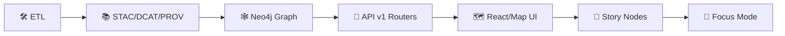

# 🧭 API Routers — v1


> ✅ **Purpose:** This folder contains the **versioned HTTP routing layer** for **API v1**.  
> v1 routes are considered **stable contracts**: prefer additive changes; avoid breaking changes; use **v2** for breaking updates.

---

## 🧠 What lives here

This directory (`api/src/routers/v1/`) is the **transport boundary** between:
- 🌐 **HTTP** (paths, query params, headers, bodies, status codes)
- 🧩 **Application logic** (use-cases/services)
- 📦 **Contracts** (OpenAPI/GraphQL + contract tests)

Routers should be **thin** and **boring**:
- validate ✅
- authenticate/authorize 🔐
- call the right use-case 🧱
- translate result → response 📤
- map errors → consistent API error shape 🧯

---

## 🗺️ Where v1 sits in the KFM pipeline

KFM is built as a governed pipeline. **APIs are downstream of data → catalogs → graph**, and upstream of the UI and narrative layers.



**Rule of thumb:** the API should **serve evidence**, not invent it.

---

## 📁 Suggested structure (example)

> This is a *recommended* layout — adapt to your framework (FastAPI, Flask, Express, etc.) and existing repo conventions.

```text
📁 api/
  📁 src/
    📁 routers/
      📁 v1/
        📄 README.md
        📄 router.(py|ts)          # v1 aggregate router
        📄 health.(py|ts)
        📄 auth.(py|ts)
        📁 endpoints/              # optional: group by resource
          📄 fields.(py|ts)
          📄 simulations.(py|ts)
          📄 graph.(py|ts)
```

---

## 🧷 Non‑negotiables for v1

### 1) 🧾 Contract-first
- v1 routes must match the **API contract** (OpenAPI/GraphQL).
- Contract changes should be accompanied by **contract tests** (known inputs/outputs).

### 2) 🧱 Backwards compatibility
- **Don’t break clients** without a version bump.
- Add new fields/endpoints ✅  
- Remove/rename/change semantics ❌ → create **v2**

### 3) 🧬 Evidence-first outputs
When possible, include:
- provenance identifiers (dataset IDs, run IDs, STAC/DCAT references)
- timestamps and version identifiers
- uncertainty/assumptions metadata when relevant  
  (avoid “false precision” in the interface)

---

## 🧩 Router responsibilities

| Concern | Router owns it? | Notes |
|---|---:|---|
| URL shape + HTTP verbs | ✅ | `/api/v1/...` paths, REST semantics |
| Input parsing + validation | ✅ | query/path/body validation |
| AuthN/AuthZ | ✅ | JWT verification + role checks |
| Calling use-cases/services | ✅ | keep business logic out of router |
| Response formatting | ✅ | JSON shape, paging envelopes, etc. |
| DB queries / heavy compute | ⚠️ | prefer adapters/services; offload long jobs |
| OpenAPI tags/descriptions | ✅ | keep docs accurate + useful |

---

## 🔐 Security expectations (AuthN / AuthZ)

Common expectations for KFM-like deployments:
- 🔑 **JWT** bearer tokens for sessions
- 👥 **Role-based access** (e.g., `admin`, `researcher`, `farmer/user`)
- 🧰 request-scoped permission checks (ACL/role mapping)
- 🧂 secure password hashing (bcrypt/Argon2) and defense against brute force

**Router-level guidance**
- Enforce auth **before** touching protected resources.
- Return **401** (unauthenticated) vs **403** (authenticated but forbidden) correctly.
- Never leak private field details or restricted geographies via error messages.

---

## ⏳ Long-running work (jobs, simulations, async)

Some API calls (e.g., model runs, large geoprocessing, external calls) should not block request/response.

**Recommended pattern**
1. validate + authorize
2. enqueue job (task queue / worker / microservice)
3. return `job_id`
4. provide a status endpoint (`GET /api/v1/jobs/{job_id}`)

---

## 🧨 Error handling and response shape

Keep errors consistent across v1.

### ✅ Suggested error envelope

```json
{
  "error": {
    "code": "VALIDATION_ERROR",
    "message": "Query parameter 'var' is required.",
    "request_id": "req_01J...",
    "details": {
      "field": "var"
    }
  }
}
```

### ✅ Suggested status mapping

- `400` Bad Request → malformed input
- `401` Unauthorized → missing/invalid auth token
- `403` Forbidden → valid token, insufficient permissions
- `404` Not Found → resource doesn’t exist (or is hidden)
- `409` Conflict → state conflict (e.g., already running)
- `422` Unprocessable Entity → semantically invalid input (framework-dependent)
- `500` Internal Error → unhandled server failures (never leak internals)

---

## 🧪 Testing checklist

- ✅ Contract tests: known request → known response
- ✅ Authorization tests: role permutations
- ✅ Input validation tests: required params, bounds, types
- ✅ “No data leakage” tests: redaction rules hold under filtering/zooming
- ✅ Integration tests (happy path + failure modes)

---

## 🛠️ Adding a new v1 endpoint

Use this checklist to keep additions clean and governed:

- [ ] Define/confirm route path under `/api/v1`
- [ ] Add router module (or extend existing resource router)
- [ ] Add request/response models (typed schemas)
- [ ] Add OpenAPI/GraphQL contract updates (or ensure auto-generated docs reflect reality)
- [ ] Add contract test(s) with stable fixtures
- [ ] Add auth + role checks (if not public)
- [ ] Add observability (request_id, structured logs)
- [ ] Confirm no breaking changes to existing v1 behaviors

---

## 🧷 Versioning rules for v1 → v2

**Create a new major version** when:
- removing/renaming fields or endpoints
- changing meaning/units/semantics of existing fields
- changing auth requirements or permissions in a breaking way
- changing pagination defaults that alter client assumptions

**Deprecations**
- Keep `v1` alive long enough for clients to migrate.
- Prefer additive “soft deprecations” (new fields, new endpoints) over destructive edits.

---

## 📚 Related docs (recommended reading)

- 📘 `docs/MASTER_GUIDE_v13.md` — contracts, versioning, canonical subsystem placement
- 🧾 OpenAPI contract (wherever your service keeps it — often `contracts/` or `openapi/`)
- 🔐 Security & roles overview (backend auth/authorization doc)
- 🧱 Architecture blueprint / ADRs (`docs/architecture/`)

---

## 🧩 Examples

<details>
<summary><strong>🐍 FastAPI-style router (example)</strong></summary>

```python
from fastapi import APIRouter, Depends
from .deps import require_user, require_role

router = APIRouter(prefix="/api/v1", tags=["v1"])

@router.get("/field/{field_id}/timeseries")
def get_timeseries(field_id: str, var: str, user=Depends(require_user)):
    # validate var, authorize access to field_id, call use-case, return JSON
    return {"field_id": field_id, "var": var, "series": []}

@router.post("/simulation/run")
def run_simulation(payload: dict, user=Depends(require_role("researcher"))):
    # enqueue job, return job id
    return {"job_id": "job_123"}
```

</details>

<details>
<summary><strong>🟩 Express-style router (example)</strong></summary>

```js
import { Router } from "express";
import { requireUser } from "../middleware/auth.js";

export const v1 = Router();

v1.get("/field/:fieldId/timeseries", requireUser, async (req, res) => {
  const { fieldId } = req.params;
  const { var: variable } = req.query;
  res.json({ fieldId, var: variable, series: [] });
});
```

</details>

