# 🧩 Services (Use Cases) — `api/src/services`

-blue)


> **What lives here:** the *application logic* of KFM — small, focused “use cases” that orchestrate domain entities, repositories, and external adapters **without** being coupled to HTTP frameworks, database engines, or UI details.

---

## 📌 TL;DR rules (print this in your brain 🧠)

> [!IMPORTANT]
> **Services own workflows. Controllers own HTTP. Repositories/adapters own I/O.**

- ✅ **Do** keep services **framework-agnostic** (no Express/Fastify/Flask imports).
- ✅ **Do** “talk outwards through interfaces” (repositories/adapters), not direct SQL/HTTP clients.
- ✅ **Do** return **plain data structures / DTOs** that controllers can serialize.
- 🚫 **Don’t** import `routes/`, `controllers/`, or request/response objects from the web layer.
- 🚫 **Don’t** embed API-version decisions here (versioning happens at the contract + controller boundary).
- 🚫 **Don’t** leak persistence models (ORM rows) across boundaries.

---

## 🗺️ Where services sit (dependency direction)

```mermaid
flowchart LR
  UI["🖥️ UI (web)"] -->|HTTP/GraphQL| C["🌐 Controllers / Routes"]
  C --> S["🧩 Services (Use Cases)"]
  S -->|interfaces / ports| R["📚 Repositories (Ports)"]
  S -->|interfaces / ports| A["🔌 External Adapters (Ports)"]
  R --> DB["🗄️ DB / PostGIS / Files"]
  A --> EXT["☁️ External APIs (GEE, remote sensing, queues, etc.)"]
```



> [!NOTE]
> Services are *inside* the “policy” zone. Everything that is “how we talk to X” belongs in adapters/infrastructure.

---

## ✅ What belongs in `api/src/services`

### 🎯 Typical responsibilities
- **Use case orchestration**: combine multiple reads/writes + computations into a single workflow.
- **Business rules**: eligibility checks, domain decisions, gating logic, permissions at the *use-case* level.
- **Validation (domain-level)**: validate *meaning* (not HTTP shapes) and fail fast with typed errors.
- **Mapping**: translate repo/adapters outputs into **DTOs** that match API contract expectations.
- **Job orchestration**: trigger long-running or heavy work via a **queue/worker interface** (don’t do the network call here if it’s an infra concern).
- **Governance hooks**: enforce redaction/classification rules before anything becomes “servable” (services can call policy modules, but should not own HTTP redaction mechanics).

---

## 🚫 What does *not* belong here

### 🧯 Keep these out of the service layer
- HTTP request/response handling (status codes, headers, cookies, middleware)
- Web framework objects (Express `req/res`, Fastify reply, etc.)
- Direct DB queries / ORM sessions / raw SQL strings
- Direct calls to 3rd-party SDKs (put behind an adapter)
- Logging that depends on the framework lifecycle (services can log, but keep it generic + testable)
- UI formatting / chart prep / map rendering

---

## 🔒 Import & dependency rules

> [!IMPORTANT]
> **Dependency direction is inward.** Outer layers may depend on services; services must not depend on outer layers.

✅ Services may import:
- `models/` or domain entities
- `types/` / DTO schemas
- repository interfaces (ports)
- adapter interfaces (ports)
- “pure” utils (date math, parsing, small helpers)

🚫 Services must not import:
- controllers / routes / middleware
- infrastructure implementations (DB clients, SDK clients) **unless** they are behind an interface
- UI-related code

---

## 📁 Suggested structure (feature-first)

> [!TIP]
> Prefer **feature folders** over a “big services file”.

```text
api/src/services/
├─ 📁 auth/
│  ├─ 🧩 auth.service.ts
│  ├─ 🧾 auth.types.ts
│  ├─ 🧯 auth.errors.ts
│  └─ 🧪 auth.service.test.ts
├─ 📁 layers/
│  ├─ 🧩 layers.service.ts
│  ├─ 🧾 layers.types.ts
│  ├─ 🧯 layers.errors.ts
│  └─ 🧪 layers.service.test.ts
├─ 📁 catalogs/
│  ├─ 🧩 catalogs.service.ts
│  ├─ 🧾 catalogs.types.ts
│  └─ 🧪 catalogs.service.test.ts
├─ 📁 _shared/
│  ├─ 🧯 errors.ts
│  ├─ 🧱 result.ts
│  └─ 🧪 fakes/
└─ 🧩 index.ts
```

---

## 🧱 Service contract: inputs, outputs, errors

### 🧾 Inputs
- Use **typed inputs** (DTOs) that represent *meaning*, not HTTP shape.
- If validation fails, throw/return a **typed domain/service error**.

### 📦 Outputs
- Return **plain objects** that can be serialized (no DB sessions, no class instances that hide state).
- Prefer stable shapes aligned to contract artifacts (OpenAPI/GraphQL).

### 🧯 Errors
> [!NOTE]
> Services don’t decide HTTP status codes. They decide **failure types**. Mapping to HTTP happens in controllers.

Recommended pattern:
- `ValidationError` (bad input meaning)
- `NotFoundError` (missing resource)
- `ConflictError` (state conflict / concurrency)
- `PolicyDeniedError` (governance/redaction/authorization)
- `ExternalDependencyError` (adapter failures)
- `UnexpectedError` (catch-all, should be rare)

---

## 🛠️ Service template (TypeScript-ish)

```ts
// api/src/services/layers/layers.service.ts

export interface LayerRepository {
  getLayerById(id: string): Promise<LayerRecord | null>;
  listLayers(opts: { limit: number; offset: number }): Promise<LayerRecord[]>;
}

export type LayerDTO = {
  id: string;
  title: string;
  stacItemId?: string; // prefer references to catalog artifacts
  classification?: "public" | "restricted" | "confidential";
};

export class LayersService {
  constructor(
    private readonly repo: LayerRepository,
    private readonly policy: { assertCanReadLayer(layer: LayerRecord): void },
  ) {}

  async getLayer(id: string): Promise<LayerDTO> {
    if (!id?.trim()) throw new ValidationError("layerId is required");

    const layer = await this.repo.getLayerById(id);
    if (!layer) throw new NotFoundError("Layer not found");

    this.policy.assertCanReadLayer(layer);

    return {
      id: layer.id,
      title: layer.title,
      stacItemId: layer.stacItemId,
      classification: layer.classification,
    };
  }
}
```

---

## 🧪 Testing services

### ✅ Unit tests (preferred default)
- Use **fake repos/adapters** (in-memory) to test workflow logic.
- Assert outputs and typed error behavior.
- Avoid network and DB in unit tests.

```ts
// api/src/services/layers/layers.service.test.ts

test("getLayer returns DTO", async () => {
  const repo = new FakeLayerRepo({ "layer-1": { id: "layer-1", title: "NDVI", classification: "public" } });
  const policy = { assertCanReadLayer: () => undefined };

  const svc = new LayersService(repo, policy);
  const dto = await svc.getLayer("layer-1");

  expect(dto).toMatchObject({ id: "layer-1", title: "NDVI" });
});

test("getLayer rejects empty id", async () => {
  const svc = new LayersService(new FakeLayerRepo({}), { assertCanReadLayer: () => undefined });
  await expect(svc.getLayer("")).rejects.toThrow(ValidationError);
});
```

### 🔗 Contract tests (service-adjacent)
If a service change impacts output shape, it must be reflected in:
- the **OpenAPI/GraphQL contract artifacts**
- the **contract tests** that validate expected responses

> [!IMPORTANT]
> If contract tests fail, treat it as a breaking change until proven otherwise.

---

## 🧭 Adding a new service (happy path checklist)

1) **Define/extend the API contract** 🧾  
   - Add endpoint/schema changes via the contract-first workflow.

2) Create the service folder 📁 
   - `api/src/services/<feature>/...`

3) Define ports (interfaces) 🔌  
   - repository port(s) and adapter port(s)

4) Implement the use case 🧩  
   - orchestration + domain validation + policy enforcement  
   - return DTOs (plain objects)

5) Add tests 🧪  
   - unit tests (service-level)  
   - update/extend contract tests if outputs changed

6) Wire in controllers 🌐 
   - controllers call services and map service errors to HTTP

---

## 🧾 Governance & provenance expectations (KFM-flavored)

> [!IMPORTANT]
> If a service returns or exposes “evidence artifacts” (derived outputs, AI outputs, processed layers), ensure results are **traceable** (e.g., via catalog/provenance references) and **governed** (classification/redaction).

Practical guidance:
- Prefer returning **IDs/links to catalog records** (STAC/DCAT/PROV references) instead of embedding bulky artifacts.
- Apply **classification rules** before returning anything “public”.
- If a service triggers creation of new derived artifacts, ensure the pipeline path produces the required metadata before the UI can see it.

---

## 🔍 Review checklist (PR gate) ✅

- [ ] Service remains **framework-agnostic**
- [ ] No controller/route imports
- [ ] External I/O is behind an adapter interface
- [ ] DTO outputs are stable + aligned to contracts
- [ ] Unit tests cover happy + failure paths
- [ ] Contract tests updated if response shapes changed
- [ ] Governance/redaction rules enforced where relevant

---

## 🧷 Useful links (repo-relative)

- 📘 Master guide (architecture + invariants): `../../../docs/MASTER_GUIDE_v13.md`
- 🧾 API contract extension template: `../../../docs/templates/TEMPLATE__API_CONTRACT_EXTENSION.md`
- 🧱 Architecture docs: `../../../docs/architecture/`

> [!NOTE]
> If any of these paths don’t exist in your current branch, align them to the repo’s canonical documentation layout (one source of truth per subsystem).

