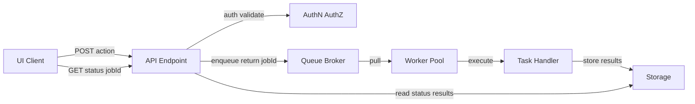

# 🧩 Background Tasks (api/src/tasks)


This folder defines **background jobs** (a.k.a. tasks) that run **outside** the request/response path.

They exist so the API can **authenticate + validate**, then **enqueue work**, return a **jobId**, and let the client **poll for status/results** without blocking the web server. ✅

---

## 🎯 What belongs here

- ✅ Long-running compute (simulation, ML retrain, geoprocessing)
- ✅ IO-heavy work (batch imports, external API pulls, large file transforms)
- ✅ Event-driven handlers (react to new data arrivals / internal events)
- ✅ Fan-out/fan-in orchestration (split work, aggregate outputs)
- ✅ Task status + progress reporting hooks

## 🚫 What should NOT belong here

- ❌ HTTP request routing / controllers (API layer concern)
- ❌ UI formatting (frontend concern)
- ❌ One-off scripts with no operational contract (put in `/scripts` or `/tools`)
- ❌ Tiny synchronous work that should finish inside the request (<~100ms)

---

## 🔁 Task lifecycle

> Mermaid note: this diagram avoids emojis + parentheses in labels to reduce GitHub/Mermaid parsing issues.



### 🧯 Plain-text fallback (always works)

```text
UI/Client -> API -> auth/validate -> queue -> worker -> task -> storage
UI/Client -> API -> status/results -> storage
```

---

## 📦 Task contract

Every task should read like a product: **name, version, inputs, outputs, and behavior**.

### Required metadata

- **name**: stable identifier (example: `simulation.run`)
- **version**: bump when *meaning* or *output schema* changes
- **input**: JSON-serializable payload (validated before enqueue)
- **output**: stored result payload OR a pointer (object key / URL)
- **status**: `PENDING | RUNNING | SUCCEEDED | FAILED | CANCELLED`
- **progress** (optional): `0..100`
- **timestamps**: created/started/finished (recommended)

### Operational guarantees ✅

- **Idempotent where possible**
- **Retry-safe** (no double-charging, no duplicate writes)
- **Deterministic** given the same inputs + same version
- **Observable**: logs include `jobId`, `taskName`, `taskVersion`

---

## 🗂️ Suggested layout

> Adjust to match the real codebase — the goal is consistent boundaries and discoverability.

📁 `api/src/tasks/`  
- 📄 `README.md` (this file)  
- 🧰 `registry.py` (task registration + routing)  
- 🧾 `schemas/` (input/output validation models)  
- 🧠 `handlers/` (task implementations)  
- 🧪 `tests/` (unit + integration tests)  
- 🧱 `adapters/` (queue/db/object-store wrappers, if needed)

---

## 📨 Enqueue pattern (pseudo-code)

### API layer

```python
# API controller/service layer
payload = validate_request(body)          # schema + domain validation
job_id = tasks.enqueue(
    name="simulation.run",
    payload=payload,
    requested_by=user.id,
)
return {"jobId": job_id}
```

### Worker side

```python
def simulation_run(job_id: str, payload: dict) -> None:
    tasks.mark_running(job_id)

    result = run_simulation(payload)

    tasks.store_result(job_id, result)
    tasks.mark_succeeded(job_id)
```

### Status polling

```python
# API layer
status = tasks.get_status(job_id)
# optionally: include result pointer if SUCCEEDED
return status
```

---

## 🕒 Scheduling vs queuing

Use **queuing** when work is triggered by:
- a user action (button click / API call),
- an internal event (new data arrived),
- a webhook or external integration.

Use **scheduling** when work runs on a cadence (hourly/daily/weekly):
- ingestion refresh,
- backfills,
- maintenance tasks,
- periodic evaluation / retraining checks.

**Rule of thumb**
- 🕰️ Simple cadence: cron
- 🛫 DAGs with dependencies + monitoring: Airflow (or equivalent)

---

## 🧷 Reliability patterns (do these by default)

### 🔁 Retries + backoff
- Prefer bounded retries with **exponential backoff**
- Classify failures:
  - transient (retry): timeouts, 5xx, network flake
  - permanent (fail fast): schema mismatch, forbidden, invalid inputs

### 🧬 Idempotency + dedup
- Introduce a **dedup key** when tasks can be triggered multiple times
- Prefer **upsert** semantics for data writes where appropriate
- Make re-runs safe (no duplicated outputs)

### 🧾 Lineage (traceability)
- Persist enough metadata so you can answer:
  - “What input produced this output?”
  - “Which job run generated this dataset/layer?”

---

## 📡 Observability checklist

- [ ] Every log line includes: `jobId`, `taskName`, `taskVersion`
- [ ] Progress updates are throttled (don’t spam DB/queue)
- [ ] Errors store both:
  - human-readable message
  - machine-readable code/category
- [ ] Timeouts are explicit per task
- [ ] “Poison pill” inputs are quarantined (don’t retry forever)

---

## 🧠 Common task types in KFM-style systems

### 🌾 Simulation runs
- long-running, heavy compute
- output: summary metrics + artifacts

### 🛰️ Geospatial processing
- raster/vector transforms
- tiling, aggregation, indexing
- output: layers + metadata

### 🤖 ML retraining / batch inference
- scheduled or manual triggers
- output: model registry entries + evaluation artifacts

---

## ✅ Adding a new task (quick recipe)

1. 🧾 Define input/output schema (`schemas/`)
2. 🧠 Implement handler (`handlers/`)
3. 🧰 Register it (`registry.py`)
4. 🧪 Add tests (`tests/`)
5. 📝 Document it here:
   - name + version
   - payload example
   - expected outputs
   - retry + idempotency notes

---

## 🧭 Next docs to add (recommended)

- `api/src/tasks/CONTRIBUTING.md` (local runner, test strategy, conventions)
- `api/src/tasks/ERRORS.md` (canonical error codes + retry categories)
- `api/src/tasks/STATUS.md` (status machine + transitions)
