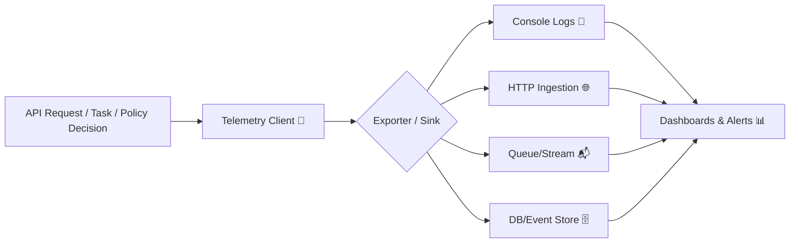

---

# Telemetry 📡


> **Telemetry** is KFM’s *system nervous system*: structured events that let us understand **usage**, **performance**, **errors**, and **governance/audit posture**—without leaking sensitive content.

---

## 🎯 Responsibilities

This module is responsible for emitting **structured telemetry events** from the API layer, including:

- 🌐 **API request telemetry** (method, route, user context, status code, duration)
- 🧯 **Error telemetry** (internal stack trace + externally-shareable `error_id`)
- ⚙️ **Background job/task telemetry** (started / finished / failed)
- 💓 **Health & uptime signals** (`/health` style probes, readiness markers)
- 🛡️ **Governance telemetry** (sensitive data access, redaction, policy blocks)

> **Non-goals** ❌  
> - Replacing the logging framework (telemetry *uses* logging, it doesn’t *become* logging)  
> - Storing raw request bodies or secrets  
> - Building dashboards (we emit signals; observability tooling reads them)

---

## 🧠 Design Principles (KFM-aligned)

- ✅ **Contract-first / schema-first**: events are validated against schemas before they leave the process.
- ✅ **Deterministic + reproducible**: stable event naming, stable fields, stable semantics.
- ✅ **Privacy-by-default**: redact or hash sensitive fields at the source.
- ✅ **Composable sinks**: console, HTTP, queue/stream, DB—swap without changing business logic.
- ✅ **Governance-aware**: telemetry is also an accountability layer (not just ops).

---

## 🗂️ Suggested Module Layout

> This is the target shape for a clean, maintainable telemetry package. Adjust names/extensions to match the API stack (Python/FastAPI or Node/TS).

```text
📁 api/src/telemetry/
├── 📄 README.md
├── 📄 index.(py|ts)                 # public entrypoint
├── 📄 types.(py|ts)                 # event types, enums, shared models
├── 📄 client.(py|ts)                # TelemetryClient + default implementation
├── 📄 context.(py|ts)               # request/task correlation context
├── 📁 middleware/
│   ├── 📄 http.(py|ts)              # request/response/error hooks
│   ├── 📄 websocket.(py|ts)         # optional streaming instrumentation
│   └── 📄 auth.(py|ts)              # authz denied / token failures, etc.
├── 📁 exporters/
│   ├── 📄 console.(py|ts)           # JSON lines to stdout
│   ├── 📄 http.(py|ts)              # POST to ingestion endpoint
│   ├── 📄 queue.(py|ts)             # publish to broker/stream
│   └── 📄 db.(py|ts)                # persist to DB (optional)
└── 📁 __tests__/
   ├── 📄 schema_validation.*        # event conforms to schema
   └── 📄 redaction_rules.*          # ensures secrets never leak
```

---

## 🧾 Event Model

Telemetry events should be **machine-parseable**, **schema-validated**, and **safe to store**.

### ✅ Recommended envelope

| Field | Type | Required | Notes |
|------|------|----------|------|
| `event_id` | `uuid` | ✅ | Unique per event |
| `event_type` | `string` | ✅ | Dot-delimited (`api.request`, `governance.redaction`) |
| `ts` | `string` (ISO-8601) | ✅ | Timestamp at emission |
| `severity` | `debug/info/warn/error` | ✅ | Used for alerting & filtering |
| `service` | `string` | ✅ | e.g., `api`, `worker`, `ingestion` |
| `env` | `string` | ✅ | `local` / `staging` / `prod` |
| `actor` | `object` | ➖ | User/service identity (NO raw secrets) |
| `correlation` | `object` | ➖ | `request_id`, `trace_id`, `job_id` |
| `resource` | `object` | ➖ | dataset/prov/stac/graph identifiers (preferred over raw payloads) |
| `payload` | `object` | ✅ | Event-specific fields |
| `redaction` | `object` | ➖ | What was removed/hashed (for audit) |

### 🧷 Naming conventions

- Use **lowercase** dot-delimited types: `api.request`, `task.failed`, `governance.policy_blocked`
- Prefer **stable semantics** over implementation details (don’t embed framework names)
- If you must change meaning → **version the schema** (see below)

---

## 🧭 Event Taxonomy

### 🌐 API & HTTP
- `api.request` — request received
- `api.response` — response sent
- `api.error` — exception handler fired; includes `error_id`

### ⚙️ Tasks / Workers
- `task.started` — a job begins
- `task.completed` — a job finishes successfully
- `task.failed` — a job fails (include failure class + safe message)

### 🛡️ Governance / Audit (FAIR+CARE-aware)
- `governance.sensitive_access` — protected/sensitive asset was accessed
- `governance.redaction_applied` — response was filtered/redacted
- `governance.publication_blocked` — policy prevented publish/export
- `governance.classification_changed` — classification boundary changed (flag-worthy)

### 💓 Health & Ops
- `health.probe` — `/health` check invoked
- `perf.slow_query` — query exceeded threshold (no raw SQL with secrets)

> Tip ✨: Keep the taxonomy small. Prefer **event_type + payload details** over exploding event types.

---

## 🧱 Schemas & Contracts

Telemetry is **contracted**. That means:

- Telemetry schemas live in the repo’s `schemas/` area (alongside STAC/DCAT/PROV/UI).  
- Telemetry JSON (and UI config JSON) is expected to be validated when schemas exist.  
- Contract changes should be versioned & compatibility-checked.

### 📁 Suggested schema structure

```text
📁 schemas/
└── 📁 telemetry/
    ├── 📄 telemetry_event.schema.json
    ├── 📄 api_request.schema.json
    ├── 📄 api_error.schema.json
    ├── 📄 task_lifecycle.schema.json
    └── 📄 governance_events.schema.json
```

---

## 🧩 Integration Points

### 1) HTTP middleware (FastAPI-style example)

```python
# PSEUDOCODE — adapt to your stack
@app.middleware("http")
async def telemetry_http(request, call_next):
    request_id = get_or_create_request_id(request)
    t0 = now_ms()

    telemetry.emit(
        event_type="api.request",
        severity="info",
        correlation={"request_id": request_id},
        payload={
            "method": request.method,
            "path": request.url.path,
            # avoid full querystring if it contains sensitive params
        },
        actor=safe_actor_from_request(request),
    )

    try:
        response = await call_next(request)
        telemetry.emit(
            event_type="api.response",
            severity="info",
            correlation={"request_id": request_id},
            payload={
                "status_code": response.status_code,
                "duration_ms": now_ms() - t0,
            },
        )
        return response

    except Exception as e:
        error_id = generate_error_id()
        telemetry.emit(
            event_type="api.error",
            severity="error",
            correlation={"request_id": request_id, "error_id": error_id},
            payload=safe_error_payload(e),
        )
        raise
```

### 2) Task lifecycle wrapper (worker/job runner)

```python
# PSEUDOCODE
def run_task(job_id: str, fn):
    telemetry.emit("task.started", correlation={"job_id": job_id}, payload={})
    try:
        result = fn()
        telemetry.emit("task.completed", correlation={"job_id": job_id}, payload={})
        return result
    except Exception as e:
        telemetry.emit("task.failed", correlation={"job_id": job_id}, payload=safe_error_payload(e))
        raise
```

### 3) Governance hooks (redaction + policy enforcement)

When the API layer:
- redacts/filters a response,
- blocks a publish/export,
- detects protected coordinates / sensitive layers,

…emit governance events with **resource references** (dataset IDs, STAC item IDs, PROV bundle IDs) rather than raw payloads.

---

## 🔐 Security & Privacy Guardrails

### ✅ Always do
- Hash IP/user-agent if needed (or store coarse aggregates)
- Redact: `Authorization`, cookies, tokens, API keys, credentials
- Prefer **IDs** (`dataset_id`, `stac_item_id`, `prov_bundle_id`) over raw values
- Include `redaction` metadata so we can prove filtering happened

### ❌ Never do
- Store raw JWTs, API keys, session cookies
- Log full request/response bodies by default
- Emit precise protected coordinates when sovereignty rules apply

---

## ⚙️ Configuration (recommended)

> Names may vary by implementation—keep them predictable and environment-driven.

| Variable | Example | Meaning |
|---|---|---|
| `TELEMETRY_ENABLED` | `true` | Master switch |
| `TELEMETRY_SINK` | `console` | `console` \| `http` \| `queue` \| `db` |
| `TELEMETRY_SAMPLE_RATE` | `1.0` | Sampling for high-volume events |
| `TELEMETRY_REDACT_KEYS` | `authorization,cookie` | Comma-separated redaction keys |
| `TELEMETRY_ENDPOINT` | `http://telemetry:4318` | Ingestion endpoint (if HTTP sink) |
| `TELEMETRY_QUEUE_TOPIC` | `kfm.telemetry` | Topic/stream name (if queue sink) |

---

## 🧪 Definition of Done (for telemetry changes)

Use this checklist whenever you add or modify telemetry:

- [ ] Event has a **schema** (or extends an existing one)
- [ ] Emission is **safe-by-default** (redaction in place)
- [ ] Includes **correlation** fields (`request_id` / `job_id` / `trace_id`)
- [ ] Includes **resource references** instead of raw sensitive data
- [ ] Tests cover: schema validity ✅ + redaction ✅
- [ ] README updated (taxonomy + examples) 📝

---

## 📚 Examples

<details>
<summary><strong>🌐 api.request</strong></summary>

```json
{
  "event_id": "d6e6d8ae-6bb0-4f1a-b7e5-0b67b9bd1b5a",
  "event_type": "api.request",
  "ts": "2026-01-02T12:34:56Z",
  "severity": "info",
  "service": "api",
  "env": "staging",
  "actor": { "user_id": "user_123", "org_id": "org_ksu" },
  "correlation": { "request_id": "req_8f2a..." },
  "payload": {
    "method": "GET",
    "path": "/api/field/42/timeseries",
    "status_intent": "read"
  }
}
```

</details>

<details>
<summary><strong>🛡️ governance.redaction_applied</strong></summary>

```json
{
  "event_id": "6d1a0b12-3c41-4f3b-a222-2f0c4a3e9b4c",
  "event_type": "governance.redaction_applied",
  "ts": "2026-01-02T12:35:01Z",
  "severity": "warn",
  "service": "api",
  "env": "prod",
  "actor": { "user_id": "user_123" },
  "correlation": { "request_id": "req_8f2a..." },
  "resource": {
    "dataset_id": "dcat:air-quality:pm25:v3",
    "stac_item_id": "stac:item:pm25:2025-06-01"
  },
  "payload": {
    "rule_id": "SOVEREIGNTY_COORDINATE_GENERALIZATION",
    "fields_redacted": ["geometry.coordinates"]
  },
  "redaction": { "mode": "generalize", "precision": "coarse" }
}
```

</details>

---

## 🗺️ Where Telemetry Sits (high-level)



---

## 🔗 Related (KFM mental model)

- Telemetry aligns with the **contract-first** and **governed pipeline** approach: schemas + validation gates first, then implementation.
- API telemetry should support both **operational debugging** and **governance/audit review**.

---

## 🧭 Maintainer Notes

If you’re unsure whether something belongs in telemetry:

✅ If it helps answer: *“What happened, to whom, when, and under what policy?”* → **log it (safely)**  
❌ If it risks leaking raw sensitive content → **reference IDs + record a governance event instead**

