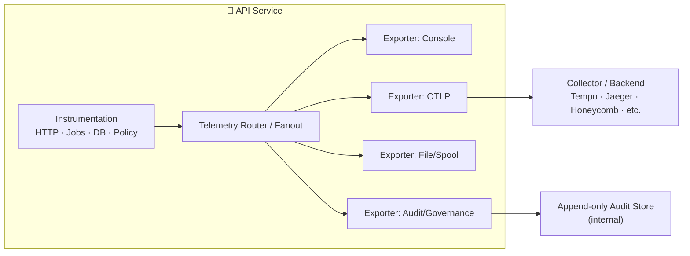

# 🛰️ Telemetry Exporters


> 📍 **Location:** `api/src/telemetry/exporters/`  
> 🎯 **Goal:** Provide **pluggable, governance-aware sinks** for KFM telemetry signals (logs, metrics, traces, audit events).

---

## ✨ Why exporters exist

Telemetry in KFM is **not only “ops visibility.”** It’s also part of **governance visibility**:
- 🧰 **Observability**: diagnose errors, performance, capacity
- 🧭 **Governance signals**: track sensitive access, redactions, policy blocks, and other compliance events
- 🧾 **Auditability**: build a defensible trail of *what happened*, *who triggered it*, and *what was returned*

---

## 🧠 What belongs in this folder

✅ Put **exporters** here:
- A “sink” that receives events and sends them somewhere (stdout, OTLP collector, file spool, queue, DB, SIEM, etc.)
- Exporters that **filter**, **batch**, **retry**, **redact**, or **route** telemetry

🚫 Don’t put these here:
- Business logic (domain rules, dataset logic, authorization rules)
- API handlers/middleware (instrumentation lives higher up; exporters are downstream sinks)
- Data redaction rules themselves (exporters *consume* already-sanitized fields; if they must redact again, it should be minimal + defensive)

---

## 🧩 Mental model



---

## 📡 Signals we typically export

The broader KFM docs describe baseline backend logging/monitoring expectations like:
- per-request logging (method, endpoint, user id if present, parameters, status, latency)
- error logging with stack traces + returning an error-id to the client
- background tasks logging start/finish + failures
- `/health` endpoint checks + task queue watchdogs
- performance metrics and slow-query-style diagnostics  
(These are **exactly** the kinds of signals this folder exists to export.)

### 🧱 Signal types (recommended)
| Signal | Purpose | Examples |
|---|---|---|
| 🪵 Logs | Debug & audit context | request logs, error logs, task logs |
| 📈 Metrics | SLOs, dashboards | request latency, error rate, queue depth |
| 🧵 Traces | Distributed request path | API → DB → worker → external services |
| 🔐 Governance/Audit events | Compliance & sovereignty | sensitive access, redactions, policy blocks |

---

## 📜 Exporter contract (recommended)

Exporters should be **small**, **predictable**, and **safe**.

### ✅ Required behaviors
- **Non-blocking** on the hot path (use buffering/async flushing)
- **Fail-safe**: exporter failures should *not* crash the service
- **Backpressure-aware**: bounded queues, overflow strategy (drop, sample, spool)
- **Deterministic routing**: given the same config + inputs, routing should be consistent
- **Governance-aware**: never downgrade sensitivity; don’t leak PII or protected locations

### 🧾 Suggested TypeScript interface (example)
> Adjust to match the project’s actual types, but keep the shape similar.

```ts
export type TelemetrySignal = "log" | "metric" | "trace" | "audit";

export interface TelemetryEventEnvelope {
  ts: string;                 // ISO timestamp
  signal: TelemetrySignal;    // log | metric | trace | audit
  name: string;               // e.g. "http.request", "policy.redaction"
  severity?: "debug" | "info" | "warn" | "error";
  traceId?: string;
  spanId?: string;

  // Governance / classification: keep explicit
  classification?: "public" | "internal" | "restricted";
  sovereigntyTags?: string[]; // e.g. ["indigenous-sensitive", "sacred-site"]
  redacted?: boolean;

  // Minimal identity (prefer hashed / opaque)
  actor?: { kind: "user" | "service"; id?: string; idHash?: string };

  // Event payload (MUST be sanitized before export)
  attributes: Record<string, unknown>;
}

export interface TelemetryExporter {
  readonly name: string;
  start?(): Promise<void> | void;
  export(batch: TelemetryEventEnvelope[]): Promise<void> | void;
  shutdown?(): Promise<void> | void;
}
```

---

## 🔐 Governance & safety rules (non-negotiable)

> ⚠️ **Telemetry can become a data leak** if we’re careless. Exporters must enforce “safety by default.”

### ✅ Hard rules
- **No raw secrets** (tokens, API keys, auth headers, cookies) — ever.
- **No full request bodies** unless explicitly allowed and sanitized.
- **User identifiers** should be **opaque or hashed** unless the sink is an internal, access-controlled audit store.
- **Sensitive locations** must be **generalized** if they are protected by sovereignty/classification rules.
- **Classification propagation**: output cannot be less restricted than inputs.

### 🧭 Telemetry-driven governance (recommended)
In the v13 direction, telemetry should support governance by emitting events like:
- `data.access.sensitive` (when protected data is accessed)
- `policy.redaction.applied` (when redaction occurs)
- `policy.blocked` (when publication or access is blocked by policy)
- `export.denied` (when an export request is refused)

These become dashboardable signals for compliance review (FAIR/CARE & sovereignty monitoring).

---

## ⚙️ Configuration expectations

Exporter selection should be **config-driven**, ideally through environment variables (and/or a typed config file).

### 🧪 Typical knobs (examples)
> The authoritative list should live in the repo’s config layer / `.env.example`.

- `TELEMETRY_ENABLED=true|false`
- `TELEMETRY_EXPORTERS=console,otlp,audit`
- `TELEMETRY_LOG_LEVEL=info`
- `OTLP_ENDPOINT=http://otel-collector:4317`
- `OTLP_HEADERS=...`
- `AUDIT_SINK=append-only|db|queue`
- `EXPORTER_BUFFER_MAX=5000`
- `EXPORTER_FLUSH_INTERVAL_MS=2000`

📌 Helpful links (repo-relative):
- `.env.example`: `../../../../.env.example`
- telemetry schemas (if present): `../../../../schemas/telemetry/`
- governance docs: `../../../../docs/governance/`

---

## 🧰 Adding a new exporter (contributor checklist)

### ✅ Steps
1. 📄 Create a new exporter module (one file per exporter)
   - Example naming: `otlp.exporter.ts`, `console.exporter.ts`, `audit.exporter.ts`
2. 🧱 Implement the exporter interface
3. 🧭 Register it in the exporter registry/router (fanout)
4. 🧪 Add tests
   - serialization/shape test (event envelope)
   - redaction safety test (no secrets, no raw PII)
   - backpressure test (bounded buffer works)
5. 📝 Update this README with the new exporter entry
6. 🧾 If telemetry schemas exist, update `schemas/telemetry/` and ensure CI validation passes

### ✅ Definition of Done (DoD)
- [ ] Exporter does **not** block request latency
- [ ] Exporter does **not** crash the service on failure
- [ ] Exporter respects **classification & redaction**
- [ ] Exporter has tests for **format + safety**
- [ ] Exporter is documented (purpose, config, failure modes)

---

## 🧪 Local development tips

- 🧯 Prefer a **console exporter** locally (fast feedback).
- 🧵 If using tracing locally, pair the OTLP exporter with a local collector.
- 🧾 If testing audit flows, ensure the sink is local + access-controlled (avoid sending audit payloads to third-party services).

<details>
<summary>🔎 Example: minimal event envelope (JSON)</summary>

```json
{
  "ts": "2026-01-04T12:34:56.789Z",
  "signal": "audit",
  "name": "policy.redaction.applied",
  "severity": "info",
  "classification": "restricted",
  "sovereigntyTags": ["indigenous-sensitive"],
  "redacted": true,
  "traceId": "4bf92f3577b34da6a3ce929d0e0e4736",
  "actor": { "kind": "user", "idHash": "sha256:..." },
  "attributes": {
    "endpoint": "/api/layers/land-treaties",
    "redactionRule": "blur_points_within_radius",
    "reason": "protected-location",
    "outputPrecision": "county"
  }
}
```

</details>

---

## 📚 References (project docs)

- 🧭 Master Guide (pipeline + governance direction): `../../../../docs/MASTER_GUIDE_v13.md`
- ⚖️ Governance root: `../../../../docs/governance/ROOT_GOVERNANCE.md`
- 🧾 Sovereignty: `../../../../docs/governance/SOVEREIGNTY.md`
- 📐 Telemetry schemas (if present): `../../../../schemas/telemetry/`

---

## 🗂️ Folder sketch

```text
📦 api/
└── 🧩 src/
    └── 🛰️ telemetry/
        ├── 📤 exporters/
        │   ├── 📘 README.md              # 👈 you are here
        │   ├── 🚚 <exporter>.ts          # one exporter per file (telemetry sink)
        │   └── 🧭 index.ts               # exporter registry / exports
        └── 🧰 ...                        # instrumentation, router, types, config
```


