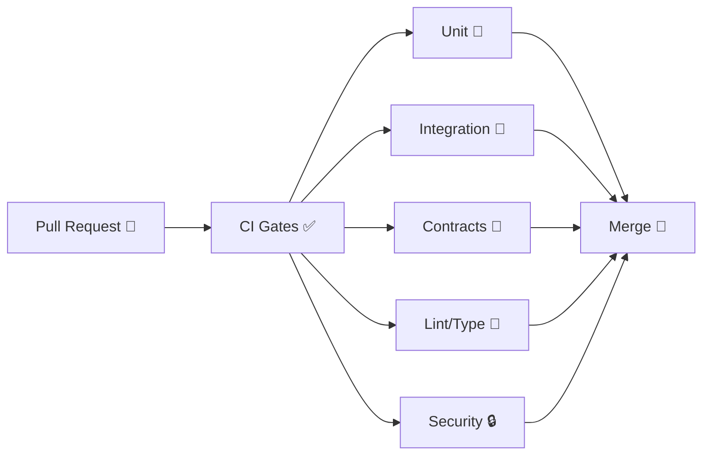

# 🧪 API Test Suite (KFM)

✅ **Unit** • 🧩 **Integration** • 📜 **Contract** • 🔐 **Security-aware**  
📍 **Location:** `api/src/tests/`

> [!NOTE]
> This folder is the quality gate for the **Kansas Frontier Matrix (KFM) API**: correctness, contract stability, and safe evolution.  
> CI expects tests + contracts to stay green before merges 🚦

---

## 🚀 Quickstart

### ✅ Install dependencies
Pick the path that matches how this API package is configured:

**Option A — Node/TypeScript API**
```bash
cd api
npm ci
```

**Option B — Python API**
```bash
cd api
python -m venv .venv
source .venv/bin/activate
pip install -r requirements.txt
```

### ▶️ Run all tests
```bash
# Node/TS
npm test

# Python
pytest
```

### 🎯 Run a subset (fast iteration)
```bash
# Node/TS (pattern varies by runner; start here)
npm test -- <pattern-or-path>

# Python
pytest -k "<pattern>" -q
```

### 📊 Coverage
```bash
# Node/TS
npm test -- --coverage

# Python
pytest --cov
```

---

## 🗂️ Folder map (what goes where)

```text
api/src/tests/
├── 📁 unit/          # ⚡ fast, isolated (no network, no DB)
├── 📁 integration/   # 🧩 adapters together (DB/graph/filesystem/etc.)
├── 📁 contracts/     # 📜 OpenAPI / GraphQL contract tests + schema checks
├── 📁 fixtures/      # 🧪 tiny synthetic datasets (NO PII / secrets)
└── 📁 helpers/       # 🧰 factories, mocks, test clients, seeders, fake clocks
```

> [!IMPORTANT]
> Keep tests **deterministic** 🧊  
> ✅ Seed randomness • ✅ freeze time • ✅ avoid external networks • ✅ clean up side-effects

---

## 🧱 Test types we expect

### ⚡ 1) Unit tests (default)
**Goal:** validate core logic in isolation.

- ✅ test one function/class/use-case at a time  
- ✅ mock external IO (DB, HTTP, filesystem, queues)  
- ✅ no web server boot required  
- ✅ milliseconds, deterministic

**Best targets:** domain rules, validators, mappers, filters, service-level decisions.

---

### 🧩 2) Integration tests
**Goal:** validate wiring between layers and real adapters.

Examples:
- HTTP handler ↔ controller ↔ service  
- service ↔ repository adapter ↔ database  
- API ↔ graph adapter (if present)

> [!TIP]
> Prefer an **ephemeral** environment (Docker) so integration tests run the same locally and in CI 🐳

---

### 📜 3) Contract tests (KFM-critical)
KFM is contract-first for backend services:

- 📘 publish an **OpenAPI spec** and/or **GraphQL schema**
- 🧪 run contract tests against **known inputs**
- 🔒 prevent accidental breaking changes

If the API must change shape:
- ✅ keep it backwards compatible, **or**
- 🔖 declare a version bump and update contracts + tests intentionally

📌 **Where contracts usually live:**  
- `api/src/server/contracts/` (or your service’s equivalent)

---

### 🌐 4) End-to-end tests (optional / keep small)
**Goal:** validate a full vertical slice (client → API → persistence).

- 🐢 slow & brittle by nature  
- ✅ keep count low; prefer nightly or targeted CI jobs

---

## 🧠 Architecture-aware testing (Clean Architecture vibes)
KFM follows a layered approach where inner logic is framework-agnostic:

- 🧠 “talk inwards with simple data”
- 🔌 “talk outwards through interfaces”

**Testing implications:**
- ✅ Unit tests target inner layers (entities/use-cases/services) without starting the server
- ✅ Use **dummy/fake repositories** that implement interfaces for isolation
- 🧩 Integration tests validate outer adapters (DB drivers, HTTP stack, graph clients, external APIs)

---

## 🔐 CI gates (why this folder matters)
CI treats “green” as a merge requirement 🚦:

- 🧪 test suite (unit + integration where configured)
- 🧹 linting + type checks
- 📜 API contract tests + schema linting (OpenAPI/GraphQL)
- 🧾 schema validation for structured outputs (when applicable)
- 🔒 secret scanning + PII/sensitive content scans



---

## 🧰 Local test environment

### Option A: “unit-only” 🏎️
No services required. Use this for tight dev loops.

### Option B: “integration-ready” 🧩 (recommended)
If integration tests depend on DB/graph/etc., start the repo’s containers (if present):

```bash
# from /api (adjust compose filename/path as needed)
docker compose up -d
```

Then run integration tests:

```bash
# Node/TS: example pattern (depends on your runner config)
npm test -- --testPathPattern=integration

# Python: example marker pattern (depends on your pytest config)
pytest -m integration
```

> [!NOTE]
> Integration tests should be **hermetic** 🧪  
> ✅ Create their own data • ✅ Clean up • ✅ Never point at dev/prod resources

---

## ✍️ Conventions

### 🧷 Naming
Follow the existing convention in this repo (examples):
- Node/TS: `*.spec.ts` or `*.test.ts`
- Python: `test_*.py`

### 🧪 Fixtures
- ✅ keep fixture data tiny (one screenful)
- ✅ synthetic only (no real users, no real coordinates, no secrets)
- ✅ prefer factories when combinations explode

### 🧊 Determinism
- ✅ set random seeds
- ✅ freeze time (fake clock)
- ✅ avoid non-deterministic ordering (sort before asserting)

---

## ✅ Adding a new endpoint checklist

When you add/change an endpoint:
- [ ] 📜 update OpenAPI/GraphQL contract (if applicable)
- [ ] 🧪 add unit tests for business logic + validation
- [ ] 🧩 add integration tests for persistence/auth/graph interactions (if applicable)
- [ ] 📦 add/update fixtures (synthetic, minimal)
- [ ] 🔐 ensure no secrets/PII were introduced
- [ ] ✅ run tests + linters locally before pushing

---

## 🧯 Troubleshooting

<details>
<summary>🧩 “Connection refused” / DB not available</summary>

- Start containers (`docker compose up -d`)  
- Confirm your test env vars point to the **test** DB (not dev/prod)  
- Re-run with verbose logging (see your runner’s debug flags)

</details>

<details>
<summary>🎲 Flaky tests</summary>

- Freeze time (fake clock)  
- Seed randomness  
- Avoid global mutable state  
- Ensure teardown always runs (`afterEach` / fixtures / finally)

</details>

<details>
<summary>📜 Contract test failures after an API change</summary>

- If backwards-compatible: fix implementation until tests pass ✅  
- If breaking: version bump + update contract + update tests intentionally 🔖

</details>

---

## ✅ Definition of Done
A change is “done” when:

- ✅ tests are green locally **and** in CI  
- 📜 contract tests match the published API behavior  
- 🔐 no secrets/PII/sensitive data are introduced  
- 🧊 results are reproducible (same inputs → same outputs)

🧠 If in doubt: add the test. Future-you will thank you 😄

