# API Contract Tests 🧪📜


> **Purpose:** This folder contains **contract tests** that protect the *API boundary* by verifying our implementation stays faithful to the published contract (OpenAPI / GraphQL) and remains backwards-compatible unless we deliberately version-bump. 🚦

---

## 🧭 Quick Links

- 📘 Master Guide (v13): **`/docs/MASTER_GUIDE_v13.md`**
- 🧩 API Contract Extension Template: **`/docs/templates/TEMPLATE__API_CONTRACT_EXTENSION.md`**
- 📜 API Contracts (expected): **`/api/src/**/contracts/`** *(or the canonical server contracts directory if the repo is v13-aligned)*

---

## ✅ What “Contract Tests” Mean Here

Contract tests are **not** unit tests and **not** performance tests.

They answer one question:

> “Given the contract we published, does the API still behave exactly like we promised?” 🤝

### This folder focuses on:
- ✅ **Schema linting** (OpenAPI / GraphQL validity & completeness)
- ✅ **Endpoint behavior verification** using **known inputs → expected outputs**
- ✅ **Backward compatibility checks** (no breaking changes without versioning)
- ✅ **Error-shape guarantees** (status codes + error body contracts)
- 🔒 *(Optional but recommended)* **Redaction/classification invariants** for sensitive fields

---

## 🧠 Why This Exists (KFM Contract-First)

KFM is designed around **contract-first + evidence-first** boundaries. The API layer is one of those non-negotiable boundaries—**downstream clients (UI, Story Nodes, tools) rely on stable contracts**.

```mermaid
flowchart LR
  Contract["📜 OpenAPI / GraphQL Contract"] --> Impl["🧩 API Implementation"]
  Impl --> Tests["🧪 Contract Tests"]
  Contract --> Tests
  Tests -->|pass ✅| Merge["🚀 Merge / Release"]
  Tests -->|fail ❌| Block["⛔ CI Blocks PR"]
```



---

## ▶️ Running Contract Tests Locally

> These commands are intentionally “boring” and repeatable. Keep them deterministic. 🧊

### Option A: Run the folder directly (most common)
```bash
pytest -q api/src/tests/contracts
```

### Option B: If your project uses Poetry
```bash
poetry run pytest -q api/src/tests/contracts
```

### Option C: If tests target a running API instance (black-box mode)
Set a base URL (the exact env var name depends on how the tests are written—use what the test helpers expect):

```bash
export KFM_API_BASE_URL="http://localhost:8000"
pytest -q api/src/tests/contracts
```

> ✅ Prefer **in-process** tests (FastAPI `TestClient` style) when possible to keep CI fast and stable.  
> ✅ Use **running-service** mode only when the contract test explicitly needs it.

---

## 🧱 Suggested Folder Layout

This folder can evolve, but keep contract tests **grouped by contract type and API surface**.

```text
📁 api/src/tests/contracts/
├── 📄 README.md
├── 📁 openapi/                 # spec linting + schema-level checks
│   ├── test_openapi_lint.py
│   └── test_openapi_examples.py
├── 📁 endpoints/               # endpoint-by-endpoint “known I/O” contract checks
│   ├── test_field_timeseries_contract.py
│   └── test_simulation_run_contract.py
├── 📁 fixtures/                # stable inputs (requests) + stable expected outputs
│   ├── requests/
│   └── responses/
└── 📁 snapshots/               # optional: snapshot files if you use snapshot testing
```

> ✨ If you don’t use snapshots in this repo, delete the `snapshots/` concept entirely—don’t keep dead patterns around.

---

## 🧪 What Each Contract Test Should Assert

### Required assertions ✅
- **HTTP status code** is correct for success and common failures
- **Response body shape** matches the contract schema (types, required fields, nesting)
- **Error contract** is stable (e.g., `{ code, message, details }`)
- **Headers that matter** (content-type, caching, pagination, request-id, etc.)
- **Backward compatibility**:
  - existing fields remain
  - semantics remain
  - newly added fields are optional unless versioned

### Recommended assertions ⭐
- **OpenAPI examples** are valid and reflect reality
- **Auth/role behavior** is stable (401 vs 403 vs 404 patterns)
- **Pagination invariants**:
  - stable parameter names
  - consistent next/prev semantics
  - deterministic ordering

### Avoid in contract tests 🚫
- load/perf benchmarking
- calling real external services
- random data without seeds
- non-deterministic timestamps/UUIDs without normalization

---

## 🧩 Adding or Changing an Endpoint

Follow this order **every time** (contract-first):

### 1) Update the Contract 📜
- Update OpenAPI / GraphQL schema first
- Ensure request/response models are explicit and versioned appropriately

### 2) Document the Change 📝
Create or update an API Contract Extension doc using:

- `/docs/templates/TEMPLATE__API_CONTRACT_EXTENSION.md`

This doc is where we record:
- what changed
- why it changed
- whether it’s breaking
- how we’re versioning/migrating

### 3) Add/Update Contract Tests 🧪
- Add a **known input**
- Assert **expected output**
- Validate **schema match**
- If you changed behavior, update tests *intentionally* (don’t “fix by deleting”)

### 4) Handle Breaking Changes 🚧
If it breaks existing clients, do one of these:
- introduce `/v2/...` (new versioned path)
- implement a negotiation strategy (headers, explicit opt-in params, etc.)
- keep old behavior until sunset is approved + documented

---

## 🧊 Making Tests Deterministic (Non-Negotiable)

Contract tests should pass the same way:
- on your machine
- in CI
- tomorrow

### Stability checklist ✅
- Freeze time (`freezegun` or equivalent) OR normalize time fields out of comparisons
- Seed randomness OR avoid randomness entirely
- Normalize ordering of lists before asserting
- Use fixture datasets with stable IDs
- Never depend on “today’s data” or live upstream services

---

## 🚦 CI Expectations

Contract tests are a **merge gate**. If these fail, CI should block the PR.

What CI typically enforces for contract tests:
- ✅ build API (test env or mocked data)
- ✅ lint OpenAPI/GraphQL contracts
- ✅ run contract tests on known inputs
- ⛔ block merges on unexpected contract regressions

---

## 🛠 Troubleshooting

### “Spec lint failed”
- Missing response definitions
- Missing schemas for models
- Incomplete examples
- Mismatched `operationId` / route conflicts

### “Contract test diffed unexpectedly”
Common causes:
- timestamps or UUIDs changed
- ordering changed (sort your output)
- error contract format drifted
- default values changed in serialization

### “Validation fails but response ‘looks fine’”
- Response includes extra fields not allowed by `additionalProperties: false`
- Required fields missing in edge cases
- Wrong type (`"123"` vs `123`)

---

## ✅ PR Checklist (Contract-Safe)

- [ ] Contract updated (OpenAPI / GraphQL)
- [ ] Contract extension doc added/updated (`/docs/templates/TEMPLATE__API_CONTRACT_EXTENSION.md`)
- [ ] Contract tests updated/added (this folder)
- [ ] Backward compatibility preserved OR versioned endpoint introduced
- [ ] No sensitive field leakage introduced (redaction/classification checked)

---

## 📚 Glossary

- **Contract**: A machine-validated specification of an interface (e.g., OpenAPI, GraphQL SDL).  
- **Contract test**: A test that asserts the implementation honors the published contract.  
- **Breaking change**: Any change that can break an existing client without code changes (requires versioning or negotiation).  
- **Known input/output**: Deterministic fixtures used to prove the contract still holds.

---

