<!--
📍 Path: api/src/tests/helpers/README.md
-->

# 🧰 API Test Helpers

  

> [!NOTE]
> According to a document from **2025-12-17**, KFM follows a **contract-first** approach (schemas + API contracts are first-class), and API changes should be guarded with **contract tests**. This folder exists to keep those tests (and our unit/integration tests) **fast, deterministic, and readable**.

---

## 🎯 Why this folder exists

`api/src/tests/helpers/` is the **shared toolbox** for API tests.

Use helpers to:
- 🧼 Reduce duplication (without hiding intent)
- 🧪 Make tests deterministic (time, randomness, IDs, DB state)
- 🧱 Keep tests aligned with **contracts** (OpenAPI/GraphQL) and **governance**
- 🚀 Make integration tests painless (spin up app + test DB, seed data, call endpoints)

---

## 🧭 Quick links

- [What belongs here](#-what-belongs-here)
- [Folder layout](#-suggested-folder-layout)
- [Design rules](#-design-rules)
- [Common helper patterns](#-common-helper-patterns)
- [Examples](#-examples)
- [Adding a new helper](#-adding-a-new-helper)
- [FAQ](#-faq)

---

## ✅ What belongs here

### ✅ Put in helpers
- **Factories / builders** for domain objects & request payloads
- **Fixtures** for stable test data (small, readable)
- **DB utilities** (reset, migrations, seed, transactions)
- **HTTP client wrappers** (e.g., `supertest` wrapper or fetch wrapper)
- **Contract assertions** (OpenAPI/GraphQL validation, snapshot shaping)
- **Time + randomness control** (freeze time, seeded RNG)
- **External service fakes** (email/SMS, queues, object storage, third-party APIs)
- **Custom matchers** that make assertions expressive (`expectApiError(...)`)

### 🚫 Don’t put in helpers
- Business logic (belongs in `src/` production code)
- Giant “do everything” utilities that hide test intent
- Helpers that require real network calls (unless explicitly an E2E suite concern)
- Anything that depends on developer machine quirks (paths, local ports, timezone)

---

## 🗂️ Suggested folder layout

> [!TIP]
> Prefer small, themed modules. If a helper can’t be named clearly, it probably shouldn’t exist yet.

```text
🧰 api/src/tests/helpers/
├─ 📄 README.md
├─ 🧪 app/
│  ├─ 🚀 makeTestApp.ts          # build app/server with test overrides
│  └─ 🧬 testContext.ts          # common DI container / context shape
├─ 🗄️ db/
│  ├─ 🧫 testDb.ts               # connect/reset/seed helpers
│  └─ 🧱 migrations.ts           # run migrations for integration tests
├─ 🌐 http/
│  ├─ 📡 request.ts              # supertest/fetch wrapper
│  └─ 🛡️ auth.ts                 # helper to attach auth headers/tokens
├─ 🧱 data/
│  ├─ 🧰 builders.ts             # pure object builders (no I/O)
│  ├─ 🏭 factories.ts            # create persisted entities (DB writes)
│  └─ 🧊 fixtures/               # small JSON/GeoJSON fixtures
├─ 📜 contracts/
│  ├─ 🧾 openapi.ts              # validate response against OpenAPI
│  └─ 🕸️ graphql.ts              # validate GraphQL operations/types
├─ ⏱️ time/
│  ├─ 🧊 freezeTime.ts
│  └─ 🎲 seededRandom.ts
├─ 🎭 mocks/
│  ├─ 🛰️ externalServices.ts     # mailer, queue, storage, etc.
│  └─ 🕵️ spies.ts                # reusable spy builders
└─ ✅ assertions/
   ├─ 🧷 api.ts                  # expectApiError, expectPagination, etc.
   └─ 🗺️ geo.ts                  # expectGeoJSON, bbox checks, etc.
```

---

## 📐 Design rules

### 1) Keep tests **readable first**
A helper should **reduce noise**, not hide meaning.

✅ Good: `buildField({ cropType: "corn" })`  
🚫 Bad: `setupEverythingForAllTestsAndHope()`

---

### 2) Determinism is non‑negotiable 🔒
- ✅ Seed randomness (`seededRandom(123)`)
- ✅ Freeze time for time-sensitive logic
- ✅ Use stable IDs or deterministic ID generators
- ✅ Reset DB state between tests

> [!WARNING]
> If a test passes locally but fails in CI, suspect **time**, **randomness**, **ordering**, or **shared state** first.

---

### 3) Prefer **dependency injection** over deep mocking 🧱
Mocks are useful—but deep mocks make tests brittle.

Rule of thumb:
- If you need **lots of mocks** to test something, that’s a smell.
- Consider switching to an **integration test** (real DB + real app wiring) or refactoring the design.

---

### 4) Contract-first means contract tests 🧾
If an endpoint response shape changes:
- ✅ Update the contract (OpenAPI/GraphQL)
- ✅ Add/adjust contract tests
- ✅ Ensure compatibility rules are respected (or bump versions when required)

---

## 🧩 Common helper patterns

### 🏗️ Builders vs Factories
- **Builder**: returns a plain object, no side-effects, no DB writes
- **Factory**: creates persisted state (DB write) and returns the created entity

```ts
// builders.ts
export const buildUser = (overrides: Partial<User> = {}): User => ({
  id: "user_test_001",
  email: "test@example.com",
  role: "viewer",
  ...overrides,
});

// factories.ts
export const createUser = async (db: TestDb, overrides: Partial<User> = {}) => {
  const user = buildUser(overrides);
  await db.users.insert(user);
  return user;
};
```

---

### 🧪 Test context
A single place to assemble “what a test needs”:
- app/server instance
- db connection
- mock clients for external services
- deterministic clock

```ts
export type TestContext = {
  app: unknown;      // express/fastify/koa handler, etc.
  db: TestDb;
  clock: { now(): Date };
  mocks: {
    mailer: { send: (payload: unknown) => Promise<void> };
  };
};

export async function createTestContext(): Promise<TestContext> {
  // assemble DI container / service wiring here
  // ensure everything is isolated & resettable
  return {} as TestContext;
}
```

---

### 🌍 Geo + GIS specific assertions (KFM-friendly)
KFM works with geospatial assets often. Keep “geo correctness” helpers centralized.

Examples:
- `expectValidGeoJSON(featureCollection)`
- `expectBboxWithinKansas(bbox)`
- `expectCoordinatesInEPSG4326(coords)`

---

## 🧪 Examples

### Example 1: Unit test (pure function / module)
```ts
import { buildSensorReading } from "./data/builders";
import { toStandardUnits } from "../../src/services/units";

test("converts raw sensor values to standardized units", () => {
  const reading = buildSensorReading({ unit: "inches", value: 1 });

  const standardized = toStandardUnits(reading);

  expect(standardized.unit).toBe("mm");
  expect(standardized.value).toBeGreaterThan(0);
});
```

---

### Example 2: Integration test (endpoint + test DB)
```ts
import { createTestContext } from "./app/testContext";
import { request } from "./http/request";
import { createUser } from "./data/factories";

describe("GET /v1/fields/:id", () => {
  test("returns the field payload (contract-safe)", async () => {
    const t = await createTestContext();
    const user = await createUser(t.db, { role: "viewer" });

    const res = await request(t.app)
      .get("/v1/fields/field_test_001")
      .withAuth(user);

    expect(res.status).toBe(200);
    expect(res.body).toMatchObject({
      id: "field_test_001",
      // keep assertions focused; contract tests cover the rest
    });
  });
});
```

---

### Example 3: Contract test (OpenAPI / GraphQL)
```ts
import { validateOpenApiResponse } from "./contracts/openapi";
import { request } from "./http/request";
import { createTestContext } from "./app/testContext";

test("GET /v1/fields/:id matches OpenAPI", async () => {
  const t = await createTestContext();

  const res = await request(t.app).get("/v1/fields/field_test_001");

  validateOpenApiResponse({
    method: "get",
    pathTemplate: "/v1/fields/{id}",
    status: res.status,
    body: res.body,
  });
});
```

---

## 🧩 Adding a new helper

### ✅ Checklist
- [ ] **Name it after intent** (`buildX`, `createX`, `expectX`, `freezeTime`, `makeTestApp`)
- [ ] Keep it **small** and **single-purpose**
- [ ] Add **types** (prefer TS-first helpers)
- [ ] Ensure **determinism** (no unseeded randomness)
- [ ] If it’s non-trivial, add tests *for the helper*
- [ ] Document usage with a tiny example (JSDoc or short snippet)

> [!TIP]
> If you’re not sure where it belongs, put it where you would look for it in 30 days. 👀

---

## ❓ FAQ

<details>
  <summary><strong>Why not just inline helper logic inside each test?</strong></summary>

Inlining is fine for one-off setups. Helpers exist when setup/teardown or assertions repeat across many tests and start obscuring the *actual* behavior under test.
</details>

<details>
  <summary><strong>When should I prefer integration tests over mocks?</strong></summary>

When mocking becomes deep or fragile (e.g., too many mocks, complex call chains, or mocks duplicating the external system’s behavior). Integration tests (with a test DB) tend to be more realistic and less brittle.
</details>

<details>
  <summary><strong>Where do API contracts live?</strong></summary>

Use the canonical contract location for this repo (typically under something like <code>src/server/contracts/</code> or a similar “contract-first” home). Tests here should import and validate against those contracts rather than reinventing schemas.
</details>

---

## 📚 Related docs (in-repo)

- 📘 `docs/MASTER_GUIDE_v13.md` — overall project structure & invariants  
- 🧾 `docs/templates/TEMPLATE__API_CONTRACT_EXTENSION.md` — how to add/change endpoints  
- 🧱 `docs/architecture/*` — architecture decisions & boundaries  
- 🧪 `.github/workflows/*` — CI gates (tests, lint, type checks)

---

## 🧠 Tiny mental model

```mermaid
flowchart TD
  A[Test file] --> B[Helper: builders/factories/db/http]
  B --> C[System under test: service/handler/endpoint]
  C --> D[Assertions: matchers/contract validators]
  D --> E[Signal: confidence + regressions caught ✅]
```



