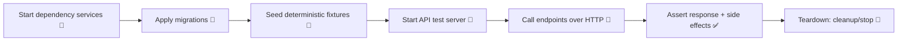

# 🧪 API Integration Tests — `api/src/tests/integration/`


Integration tests verify the **API boundary end-to-end**: spin up a test server + real backing services (usually a DB), call HTTP endpoints, and assert on responses (status, body, headers, auth, validation, and governance behaviors). This matches KFM’s emphasis on “integration tests for API endpoints” using a **test server with a test database**. ✅

> 🔒 **KFM invariant:** the UI must never query the graph directly; all access is mediated by the governed API layer. These tests are the guardrail that keeps that contract honest.

---

## 🎯 What belongs here?

✅ **Integration tests**
- HTTP endpoint behavior (request → routing → service → persistence → response)
- AuthZ/AuthN flows (allowed/denied)
- Validation & error mapping (400/401/403/404/409/422/500)
- Real DB interactions (migrations, constraints, transactions)
- **Governance outputs**: redaction, classification propagation, provenance metadata

❌ **Not here**
- Pure function / utility tests → `api/src/tests/unit/` (or equivalent)
- Browser/UI flows → E2E test suite (Cypress/Playwright/etc.)
- Contract schema validators that don’t require services → unit/contract test folders

---

## 🧭 Folder conventions

A simple, predictable layout keeps CI fast and debugging painless:

```text
api/src/tests/integration/
├── 📄 README.md                 # you are here
├── 📁 helpers/                  # test helpers (clients, auth helpers, seed helpers)
├── 📁 fixtures/                 # deterministic data fixtures
├── 📁 seed/                     # seed scripts (DB + catalogs), if needed
├── 📁 endpoints/                # grouped by route area
│   ├── 📄 health.int.test.*
│   ├── 📄 auth.int.test.*
│   ├── 📄 layers.int.test.*
│   └── 📄 search.int.test.*
└── 📁 __snapshots__/            # optional snapshots (use sparingly)
```

> ✨ Tip: Use a suffix like `*.int.test.ts` / `*.int.spec.ts` / `*.integration.test.py` so CI can include/exclude reliably.

---

## ⚙️ Prereqs

- 🐳 **Docker / Docker Compose** (recommended) for ephemeral dependencies
- 🧰 Your repo’s test runner (commonly **Jest/Vitest** for TS/JS or **pytest** for Python)
- 🗄️ Any required backing services for the API (DB, cache, graph, etc.)

> If your environment uses `.env.test` / `.env.integration`, keep it **non-secret** and deterministic.

---

## 🚀 Quick start (local)

### Option A — Run via repo scripts (preferred)

Use whatever scripts your repo defines (examples below):

```bash
# JS/TS style
npm run test:integration

# Or target only this folder
npm run test:integration -- api/src/tests/integration

# Python style
pytest -m integration api/src/tests/integration
```

### Option B — Bring up dependencies first (common with Docker Compose)

```bash
docker compose up -d db
# optional (depending on your stack)
docker compose up -d redis neo4j
```

Then run your integration tests:

```bash
npm run test:integration
# or
pytest -m integration
```

---

## 🧩 Test lifecycle (what should happen)

Most integration suites follow this sequence:



### 🔁 Determinism rules (non-negotiable)
- ⏱️ Freeze time when timestamps matter (or assert with ranges).
- 🎲 Avoid randomness; if needed, seed it.
- 🧾 Stable fixture IDs (no “createdAt=now” snapshot golden files).
- 🌐 No calls to real external APIs (use stubs/mocks).

---

## 🧷 Environment variables (common patterns)

Your stack may differ; these are typical integration-test knobs:

| Variable | Example | Purpose |
|---|---:|---|
| `NODE_ENV` / `KFM_ENV` | `test` | enable test config paths |
| `DATABASE_URL` | `postgres://...` | integration DB connection |
| `REDIS_URL` | `redis://...` | cache/queue for tests |
| `NEO4J_URI` | `bolt://...` | graph backing service (if applicable) |
| `LOG_LEVEL` | `warn` | keep test logs readable |
| `DISABLE_EXTERNAL_CALLS` | `true` | hard fail on network egress |

> 🧯 Safety: Prefer CI-provisioned credentials (ephemeral containers) over shared dev DBs.

---

## 🌱 Fixtures & seeding

### What “good fixtures” look like ✅
- small (fast), realistic (schema-valid), and **provenance-aware**
- include the metadata fields the API is contractually required to preserve/emit
- don’t rely on global ordering (explicit sort keys)

### Recommended approach
- Keep **seed helpers** in `helpers/` (e.g., `seedDb()`, `seedCatalog()`).
- Keep test datasets in `fixtures/` as **versioned JSON** (or SQL) with stable IDs.
- Reset state between tests using one of:
  - transaction rollback per test (fast)
  - truncate tables + reseed (simple)
  - recreate schema/container per file (slowest but cleanest)

---

## 🧾 KFM-specific assertions (what we must not regress)

Integration tests should protect these platform behaviors:

### 1) 🧩 Contract-first API behavior
- Endpoint inputs/outputs match the API contract (OpenAPI/GraphQL/etc.)
- Breaking changes require explicit versioning & tests that prove compatibility

> 📌 When adding/changing endpoints, start from the API contract extension template:
> `docs/templates/TEMPLATE__API_CONTRACT_EXTENSION.md`

### 2) 🧬 Provenance-first outputs
When returning data derived from cataloged assets, verify the response contains:
- stable identifiers (dataset IDs, item IDs, etc.)
- references/links to STAC/DCAT/PROV where required
- provenance or lineage pointers for derived artifacts

### 3) 🛡️ Redaction & classification propagation
- restricted inputs never yield less-restricted outputs
- redacted fields are absent or generalized (not “blank but still sensitive”)
- audit-style signals (if implemented) are emitted when redaction occurs

### 4) 🚧 API boundary rule
- all graph access is mediated via API services (no direct client shortcuts)

---

## ✍️ Writing a new integration test (checklist)

When you add a new `*.int.test.*`, cover at least:

- [ ] ✅ **Happy path** (200)
- [ ] 🧱 **Validation** (400/422) for malformed input
- [ ] 🔐 **Auth** (401/403) where applicable
- [ ] 🧭 **Not found** (404) for missing resources
- [ ] 🧨 **Conflict** (409) for uniqueness / state conflicts (if relevant)
- [ ] 🧬 **Provenance fields** present and correct (when returning evidence)
- [ ] 🛡️ **Redaction/classification** behavior correct (when relevant)
- [ ] 🔁 **Deterministic** assertions (no flaky ordering/time assumptions)

---

## 🧯 Troubleshooting

### “Connection refused” / service not ready
- Ensure containers are up: `docker compose ps`
- Add/wait for health checks (DB readiness matters more than container “running”)

### “Migrations not applied”
- Confirm migration step runs before tests
- In CI, ensure the migration job runs in the same network/compose project

### “Tests flaky in CI”
- Remove reliance on wall-clock time or random IDs
- Avoid sleep-based waits; poll for readiness instead

---

## 🤝 PR hygiene

Before merging:
- ✅ Integration suite passes locally and in CI
- ✅ Any API change includes **contract updates + integration tests**
- ✅ Fixtures are minimal and deterministic
- ✅ No external network calls
- ✅ Provenance/governance behaviors tested when touched

---

### 🔗 Useful links (repo-relative)
- 📘 Master guide: `docs/MASTER_GUIDE_v13.md`
- 🧩 API contract template: `docs/templates/TEMPLATE__API_CONTRACT_EXTENSION.md`
- ⚖️ Governance: `docs/governance/ROOT_GOVERNANCE.md`

