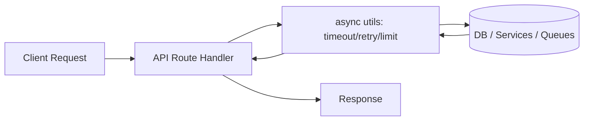

# ⚡ Async Utilities (`api/src/utils/async`)


> 🧩 **Purpose:** A small, dependency-light toolbox of **async/await helpers** used by the API layer to stay fast, safe, and predictable under load (timeouts, retries, concurrency limits, async route wrappers, etc.).

---

## 📚 Table of Contents

- [Why this exists](#-why-this-exists)
- [What belongs here](#-what-belongs-here)
- [Golden rules](#-golden-rules)
- [Common building blocks (recommended contract)](#-common-building-blocks-recommended-contract)
- [Recipes](#-recipes)
- [Pitfalls to avoid](#-pitfalls-to-avoid)
- [Adding a new async util](#-adding-a-new-async-util)
- [Testing notes](#-testing-notes)

---

## 🧠 Why this exists

KFM’s API spends a lot of its time doing **I/O-bound work**:
- talking to databases
- calling other internal services (rendering, ML inference, ingestion)
- publishing/consuming events (queues/streams)
- optionally streaming updates (WebSockets/SSE)

That means most “performance wins” come from **correct async composition**:
- avoid blocking the event loop 🚫
- avoid unbounded fan-out (`Promise.all` on huge lists) 🚫
- add **timeouts + retry/backoff** to external calls ✅
- cap concurrency when hitting fragile dependencies ✅

This folder exists so we solve those problems **once** and reuse the same safe patterns everywhere.

---

## 📦 What belongs here

✅ Put things here when they are:

- **Cross-cutting** async helpers used in multiple API modules
- **Framework-agnostic** (no Express/Fastify/Firebase imports unless it’s a tiny adapter wrapper)
- **Composable** (one responsibility, easy to test)
- **Pure-ish** (minimal side effects; logging hooks injected)

🚫 Don’t put these here:

- Business/domain logic (belongs in domain/use-cases)
- Service-specific clients (belongs in `services/` or adapters)
- Queue worker implementations (belongs in workers/queues)
- “Helpers” that are really application policy (belongs closer to the feature)

> 🧭 Rule of thumb: If removing a helper from this folder would require rewriting multiple feature areas, it’s a good fit here.

---

## 🏅 Golden rules

✅ **Prefer `async/await` + `try/catch`** over deep `.then()` chains.  
✅ **Fail fast** with timeouts when calling networks.  
✅ **Retry only idempotent operations** (or ensure idempotency keys).  
✅ **Limit concurrency** when iterating large collections.  
✅ **Return typed errors** (or standardized error shapes) so callers can decide what to do.

---

## 🧱 Common building blocks (recommended contract)

This README doubles as a **contract** for the kinds of helpers we keep here.  
If the implementation differs, either:
1) update this README to match reality, or  
2) refactor the util to match the contract.

Typical modules in this folder look like:

```text
📁 api/
  📁 src/
    📁 utils/
      📁 async/
        🧾 README.md
        📄 index.ts               # barrel exports (recommended)
        📄 delay.ts               # sleep / delay helpers
        📄 timeout.ts             # withTimeout / AbortSignal patterns
        📄 retry.ts               # retry + exponential backoff + jitter
        📄 limit.ts               # concurrency limiter (p-limit style)
        📄 queue.ts               # tiny in-memory queue (optional; not a broker)
        📄 settle.ts              # safe Promise.allSettled wrappers / result typing
        📄 asyncRoute.ts          # framework adapter: wrap async handlers (optional)
        🧪 *.test.ts              # unit tests
```

### Suggested “core” exports

- `delay(ms, { signal? })`
- `withTimeout(promiseOrFn, ms, { signal?, onTimeout? })`
- `retry(fn, { retries, backoff, jitter, shouldRetry, onRetry })`
- `limit(concurrency)` / `pMap(items, mapper, { concurrency })`
- `toResult(promise)` / `allSettledTyped(promises)`
- `wrapAsync(handler)` *(only if the API framework needs it)*

---

## 🍳 Recipes

### 1) Delay / sleep (with optional cancellation) 💤

```ts
import { delay } from "./delay";

await delay(250); // wait 250ms

// optional AbortSignal support (recommended pattern)
const controller = new AbortController();
const p = delay(10_000, { signal: controller.signal });
controller.abort(); // cancel if needed
await p;
```

---

### 2) Timeouts for external calls ⏱️

```ts
import { withTimeout } from "./timeout";

const user = await withTimeout(() => fetchUser(userId), 2_000);
// or: await withTimeout(fetchUser(userId), 2_000)
```

**Guideline:** anything that hits a network boundary should have a timeout.

---

### 3) Retry with exponential backoff + jitter 🔁

```ts
import { retry } from "./retry";

const res = await retry(
  () => fetchJson("https://internal.service/api"),
  {
    retries: 3,
    // backoff strategy could be internal to retry() or passed as function
    backoffMs: (attempt) => Math.min(250 * 2 ** attempt, 5_000),
    jitter: true,
    shouldRetry: (err) => err.name !== "ValidationError",
    onRetry: (err, meta) => {
      // meta: { attempt, delayMs }
      logger.warn({ err, ...meta }, "Retrying external call");
    },
  }
);
```

**Only retry** operations that are:
- idempotent (GET, safe reads), or
- made idempotent (idempotency key / dedupe token), or
- safe to replay in your domain.

---

### 4) Concurrency-limited mapping (no unbounded fan-out) 🚦

```ts
import { pMap } from "./limit";

const tiles = await pMap(
  tileIds,
  async (id) => renderTile(id),
  { concurrency: 8 }
);
```

**Why:** `Promise.all(tileIds.map(...))` will happily stampede a DB/service.

---

### 5) Safe “run many” with result typing ✅❌

```ts
import { allSettledTyped } from "./settle";

const results = await allSettledTyped([
  fetchA(),
  fetchB(),
  fetchC(),
]);

for (const r of results) {
  if (r.status === "fulfilled") {
    // r.value
  } else {
    // r.reason
  }
}
```

---

### 6) Async route wrapper (framework adapter) 🧷

If your API framework does not automatically catch async errors, use a wrapper:

```ts
import { wrapAsync } from "./asyncRoute";

// Express-style example:
router.get(
  "/health",
  wrapAsync(async (_req, res) => {
    const status = await checkDeps();
    res.json(status);
  })
);
```

> ✅ Keep this wrapper tiny and isolated: it’s an adapter, not a policy engine.

---

## ⚠️ Pitfalls to avoid

### 🚫 `forEach` + `async`
```ts
// ❌ doesn't await correctly
items.forEach(async (x) => {
  await doThing(x);
});
```

Use:
```ts
// ✅ sequential
for (const x of items) await doThing(x);

// ✅ parallel (bounded!)
await pMap(items, doThing, { concurrency: 8 });
```

---

### 🚫 Unbounded `Promise.all` on large lists
```ts
// ❌ can overload DB/services instantly
await Promise.all(bigList.map(callService));
```

Use a limiter (`pMap`, `limit`, batching).

---

### 🚫 Retrying non-idempotent operations blindly
Retries can duplicate writes. If you must retry:
- use idempotency keys
- dedupe at the DB layer
- or retry *only* after verifying safe semantics

---

## 🧰 Adding a new async util

### ✅ Checklist

- [ ] Single responsibility (one job, one file) 🧱
- [ ] No framework imports unless it’s an explicit adapter wrapper
- [ ] Works with plain Promises (`async/await` first)
- [ ] Typed inputs/outputs (avoid `any`)
- [ ] Has unit tests (including edge cases: timeout, cancel, retry stop conditions)
- [ ] Exported via `index.ts` (if you use barrel exports)
- [ ] Documented here with a short recipe/example

### Naming conventions

- `camelCase` for functions (`withTimeout`, `allSettledTyped`)
- `PascalCase` for classes/types (`RetryOptions`, `TimeoutError`)
- Prefer **named exports** over default exports for discoverability

---

## 🧪 Testing notes

- ⏳ **Time-based helpers** (`delay`, `timeout`, `retry`) should be tested with **fake timers** when possible.
- 🎯 Make jitter deterministic in tests (inject a RNG or allow `jitter: false`).
- 🧨 Ensure retries stop:
  - on max attempts
  - on non-retryable errors
  - on cancellation/abort
- 🧷 Validate that wrappers rethrow or forward errors as intended.

---

## 🗺️ (Optional) Flow diagram



---

💡 If you’re unsure whether a helper belongs here: put it near the feature first. Once it’s used in 2–3 places **and** stays generic, promote it into `utils/async`.

