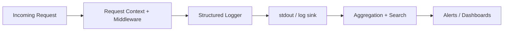

# 🪵 Logging Utilities (`api/src/utils/logging`)


Centralized logging utilities for the **API service** (and any background workers) to ensure:

- ✅ **Consistent log schema** across endpoints + jobs  
- 🔎 **Fast debugging** with request/job correlation IDs  
- 🧾 **Actionable operational telemetry** (health checks, queue watchdogs, slow endpoints/queries)  
- 🧼 **Safe logging** (redaction rules, no secrets/PII-by-default)  

---

## 🧭 Table of contents

- [What this folder is responsible for](#-what-this-folder-is-responsible-for)
- [Golden rules](#-golden-rules)
- [Log schema](#-log-schema)
- [HTTP request logging](#-http-request-logging)
- [Errors, exceptions, and `error_id`](#-errors-exceptions-and-error_id)
- [Background tasks & pipelines](#-background-tasks--pipelines)
- [Monitoring hooks](#-monitoring-hooks)
- [Security & privacy](#-security--privacy)
- [Configuration](#-configuration)
- [Testing patterns](#-testing-patterns)
- [Examples](#-examples)

---

## 🎯 What this folder is responsible for

This module is the **single source of truth** for “how we log” in the API:

- Logger creation (module/service scoped loggers)
- Structured output (JSON in prod; optionally pretty in dev)
- Request/job context propagation (e.g., `request_id`, `job_id`)
- Redaction and “safe fields” policy
- Helpers for standardized events:
  - `request.received` / `request.completed`
  - `task.started` / `task.completed`
  - `error.raised` / `error.handled`
  - `security.*` (auth failures, unusual access patterns)

> [!NOTE]
> If you’re ever tempted to use `print()` / `console.log()` / ad-hoc logging: **don’t**.  
> Route everything through this utility so logs stay searchable and consistent.

---

## 🏆 Golden rules

- **Always log structured data** (fields) *plus* a short message/event name.
- **Every request** should be traceable end-to-end via a `request_id`.
- **Every background job** should be traceable via a `job_id`.
- **Errors must be diagnosable** from logs: include stack traces internally, and include an `error_id` you can share with users.
- **Never log secrets** (tokens, passwords, API keys, session cookies, full auth headers).
- **Be intentional with parameters**: only log safe subsets (and redact aggressively).

---

## 🧱 Log schema

### Required core fields (minimum)

| Field | Type | Required | Notes |
|---|---:|:---:|---|
| `ts` | string | ✅ | ISO timestamp |
| `level` | string | ✅ | `DEBUG/INFO/WARN/ERROR` |
| `service` | string | ✅ | e.g., `api`, `worker`, `tiles` |
| `env` | string | ✅ | `dev/staging/prod` |
| `msg` | string | ✅ | short event/message name |
| `module` | string | ✅ | logical scope (router/service name) |

### Request context fields (HTTP)

| Field | Type | Required | Notes |
|---|---:|:---:|---|
| `request_id` | string | ✅ | generated if missing |
| `method` | string | ✅ | `GET/POST/...` |
| `endpoint` | string | ✅ | normalized route/path |
| `status_code` | number | ✅* | required on completion |
| `duration_ms` | number | ✅* | required on completion |
| `user_id` | string | ⚠️ | only if authenticated (and safe) |
| `params` | object | ⚠️ | **safe subset only** (see redaction) |

### Job context fields (background tasks)

| Field | Type | Required | Notes |
|---|---:|:---:|---|
| `job_id` | string | ✅ | returned to callers / stored |
| `task` | string | ✅ | task name |
| `step` | string | ⚠️ | pipeline stage name |
| `duration_ms` | number | ⚠️ | stage-level or job-level |
| `status` | string | ✅* | `started/completed/failed` |

> [!TIP]
> Keep field names stable. Treat them as an API contract for operations & dashboards.

---

## 🌐 HTTP request logging

### What to log (contract)

For each request, log **at least**:

- `method`
- `endpoint`
- `user_id` (if authenticated and safe)
- `params` (safe subset only)
- `status_code`
- `duration_ms`
- `request_id`

### Recommended event flow

1. `request.received` (optional, can be DEBUG in prod)
2. `request.completed` (INFO)
3. `request.failed` (ERROR, includes `error_id`)

---

## 💥 Errors, exceptions, and `error_id`

### Rules

- **Always log stack traces internally** (so we can debug quickly).
- Return a **non-sensitive** response to clients, but include an `error_id` so support can locate the exact incident.
- Never leak internal exception text, DB details, file paths, or secrets in client responses.

### Pattern (pseudo-code)

```python
# PSEUDO (adapt to the API framework)
try:
    ...
except Exception as err:
    error_id = new_error_id()  # uuid, shortid, etc.
    logger.exception(
        "error.raised",
        error_id=error_id,
        request_id=request_id,
        endpoint=endpoint,
    )
    return {"error": "Internal error", "error_id": error_id}, 500
```

---

## 🧰 Background tasks & pipelines

Long-running jobs (ML training, ingest pipelines, simulations, batch exports) should produce logs that can be read as a story:

### Minimum expectations

- `task.started` + `task.completed`
- Each major step: `step.started` + `step.completed`
- If a step fails: `step.failed` with stack trace
- Include `job_id` everywhere

### Example (structured)

```json
{
  "ts": "2026-01-04T16:42:31.123Z",
  "level": "INFO",
  "service": "worker",
  "env": "prod",
  "module": "pipelines.ingest",
  "msg": "step.started",
  "job_id": "job_01J…",
  "task": "ingest_satellite_scene",
  "step": "ndvi_compute"
}
```

> [!NOTE]
> If a model training **doesn’t converge**, log that explicitly with context (dataset, hyperparams ref, threshold, iteration count, etc.).

---

## 📈 Monitoring hooks

Logging is also how we power monitoring/alerts:

- `/health` endpoint checks (external monitors or uptime services)
- Queue watchdogs (jammed queues, repeated failures, runaway retries)
- Slow endpoint tracking (p95/p99)
- Slow query logs (DB indexes, missing constraints, expensive joins)

### Suggested observability flow (Mermaid)



---

## 🔐 Security & privacy

### Never log these 🚫

- Passwords, reset tokens, session tokens
- API keys / OAuth tokens
- Full `Authorization` headers
- Secrets from env vars
- Raw PII (unless explicitly approved + minimized)

### Security-relevant events to log ✅

- Auth failures (rate-limited)
- Permission denials
- Unusual access patterns (spikes, repeated failures, suspicious endpoints)
- Admin actions (create/delete/role changes)

> [!WARNING]
> Logs are production data. Treat them like sensitive assets:
> - access controlled
> - monitored
> - retained according to policy
> - never copied into insecure places

---

## ⚙️ Configuration

Recommended env vars (names may differ—standardize here and update if needed):

| Variable | Example | Purpose |
|---|---|---|
| `LOG_LEVEL` | `INFO` | Global minimum level |
| `LOG_FORMAT` | `json` / `pretty` | Output format |
| `LOG_SERVICE` | `api` | Service name in logs |
| `LOG_REDACT` | `true` | Enable redaction |
| `LOG_SAMPLE_RATE` | `0.1` | Optional sampling for noisy events |

> [!TIP]
> In containers, prefer logging to `stdout` and let the runtime handle rotation/collection.

---

## 🧪 Testing patterns

### ✅ Preferred

- Inject a logger (or a lightweight logger interface) into services.
- Use an in-memory logger / mock logger in tests.
- Assert on emitted events/fields rather than raw strings.

### 🚫 Avoid

- Hard-coding global loggers deep in domain logic
- Making unit tests depend on log formatting or timestamps

---

## 🧩 Examples

<details>
<summary><strong>Example: request.completed event</strong></summary>

```json
{
  "ts": "2026-01-04T16:42:31.123Z",
  "level": "INFO",
  "service": "api",
  "env": "prod",
  "module": "routes.timeseries",
  "msg": "request.completed",
  "request_id": "req_01J…",
  "method": "GET",
  "endpoint": "/api/field/{field_id}/timeseries",
  "user_id": "usr_01J…",
  "status_code": 200,
  "duration_ms": 143,
  "params": { "var": "ndvi" }
}
```

</details>

<details>
<summary><strong>Example: error.raised event (internal)</strong></summary>

```json
{
  "ts": "2026-01-04T16:43:02.010Z",
  "level": "ERROR",
  "service": "api",
  "env": "prod",
  "module": "routes.export",
  "msg": "error.raised",
  "request_id": "req_01J…",
  "error_id": "err_01J…",
  "endpoint": "/api/export/fielddata.csv",
  "status_code": 500
}
```

</details>

---

## ✅ Definition of done checklist (logging)

- [ ] Every endpoint logs `request.completed` with `duration_ms`
- [ ] Every error path logs `error_id` + stack trace internally
- [ ] Background jobs log `job_id` for all steps
- [ ] Redaction rules cover auth headers, tokens, secrets, and sensitive params
- [ ] `/health` endpoint emits minimal logs (avoid noise)
- [ ] Slow endpoints/queries are discoverable from logs

---

### 🧠 If you only remember one thing…

**Logs are part of the product.**  
They’re how we debug, operate, secure, and improve KFM without guessing.

