# 🔐 Security Utilities (`api/src/utils/security`)


> **KFM security is multi-layered**: application controls + network/infrastructure security + encryption + monitoring/auditing — and it’s an **ongoing process**, not a one-time setup. 🧯

---

## 🎯 Purpose

This folder contains **reusable security building blocks** used by the KFM API layer:
- 🔑 Authentication (token/session helpers)
- 🧑‍⚖️ Authorization (RBAC/ACL checks)
- 🧼 Request hardening (CSRF strategies, input sanitization, rate limiting)
- 🧾 Audit logging (security-relevant event trails)
- 🗝️ Secrets/key handling (server-side secret access patterns)
- 🧊 Crypto wrappers (hashing/encryption helpers — *thin wrappers only*)

**Goal:** make “the secure way” also the **easy** way.

---

## ✅ Golden Rules (read before adding code)

- 🛑 **Don’t roll your own crypto.** Wrap vetted libraries; keep wrappers tiny and testable.
- 🔒 **Never log secrets** (JWTs, refresh tokens, passwords, API keys, encryption keys).
- 🎟️ **Treat tokens like passwords**: short-lived access tokens + carefully scoped refresh flow.
- 🧩 **Keep utilities framework-agnostic**: no Express/Fastify/Flask objects *inside* core utilities.
- 🧠 **Fail closed**: when in doubt, deny access.
- 🧾 **Audit security-sensitive actions** (auth events, data modifications, permission changes).

---

## 🧱 Architecture boundary (Clean Architecture friendly)

Security utilities should be **pure** where possible:
- ✅ parse/verify tokens, evaluate permissions, validate inputs, shape audit events
- ❌ directly reach into DB, HTTP framework objects, or global singletons

**Rule of thumb:**  
Security utilities live in the “inner-ish” part of the API layer.  
Middleware/controllers adapt framework requests into **plain data**, then call these utilities.

```mermaid
flowchart LR
  subgraph Outer[🌐 Framework / Routes / Middleware]
    R[Request]
    MW[Auth Middleware]
  end

  subgraph Sec[🔐 utils/security]
    JWT[JWT verify/sign]
    ACL[Role/ACL checks]
    IN[Input hardening]
    AUD[Audit events]
    SEC[Secrets access]
  end

  subgraph Infra[🗄️ Infrastructure]
    DB[(Database)]
    Vault[(Secrets/Vault)]
    Logs[(Log sink)]
  end

  R --> MW --> JWT --> ACL
  MW --> IN
  ACL -->|allow/deny| MW
  MW --> AUD --> Logs
  SEC --> Vault
  MW --> DB
```



---

## 🗂️ Folder anatomy (suggested)

> Your actual file list may differ — update this README when utilities evolve. ✍️

```text
🛡️ api/src/utils/security/
├─ 🔐 auth/
│  ├─ 🎟️ jwt.ts                 # sign/verify access tokens + helpers
│  ├─ 🔁 refresh.ts             # refresh token rotation patterns (if used)
│  ├─ 🔑 password.ts            # hash/verify + reset-token helpers
│  └─ 🧿 mfa.ts                 # optional MFA helpers (admin/sensitive accounts)
├─ 🧑‍⚖️ access/
│  ├─ 🧭 roles.ts               # role definitions + mapping
│  ├─ 📜 acl.ts                 # permission evaluation + resource scoping
│  └─ 🛑 guards.ts              # reusable allow/deny guard helpers
├─ 🛡️ request/
│  ├─ 🧯 csrf.ts                # CSRF strategy for cookie-based auth (if applicable)
│  ├─ 🚦 rateLimit.ts           # per-IP / per-user rate limiting helpers
│  └─ 🧽 sanitize.ts            # input allowlists, search sanitization, etc.
├─ 🔒 crypto/
│  ├─ 🧬 hash.ts                # safe hashing wrappers (non-password)
│  └─ 🧊 encrypt.ts             # app-level field encryption helper (if required)
├─ 🧾 audit/
│  └─ 🧾 securityEvents.ts      # normalize + emit security event objects
└─ 🗝️ secrets/
   └─ 🧰 getSecret.ts           # server-side secret retrieval (env/vault)
```

---

## 🔑 Authentication & sessions

### Access tokens (JWT)
KFM uses **JWTs** for session management, issued after login over **HTTPS** and containing **user ID + roles**. Access tokens should be **short-lived** (example: 1 hour). 🔐

**Recommended pattern**
- `Authorization: Bearer <access_token>`
- Access token expires quickly.
- Refresh token is long-lived, stored securely, and only sent to the refresh endpoint.

```ts
// (pseudo-TS) verify token → build auth context
const token = extractBearerToken(req.headers.authorization);
const claims = verifyAccessToken(token); // throws Unauthorized on failure

req.auth = {
  userId: claims.sub,
  roles: claims.roles,
  issuedAt: claims.iat,
};
```

### Password security
- Use strong password hashing (e.g., bcrypt/Argon2)
- Enforce password complexity
- Support “forgot password” via **one-time email token**
- Implement **account/IP lockout** after repeated failures
- Optional MFA for admins/sensitive accounts

> 🔥 Tip: Keep password logic out of controllers. Controllers should call `hashPassword()`, `verifyPassword()`, and `issueResetToken()` helpers.

---

## 🧑‍⚖️ Authorization (RBAC/ACL)

Roles in KFM are modeled as **coarse access tiers** (e.g., `farmer`, `researcher`, `admin`) plus a permissions map / ACL rules. 🧩

### Recommended enforcement points
- ✅ At the API boundary (before hitting business logic)
- ✅ At data-access boundaries (queries always filtered by permissions)
- ✅ For sensitive layers/resources (return **403 Forbidden** when unauthorized)

```ts
// (pseudo-TS) role guard
requireRole(req.auth, ["admin", "researcher"]);

// (pseudo-TS) resource scope guard
ensureCanReadLayer(req.auth, layerMeta); // deny if restricted
```

---

## 🧼 Request hardening (input validation, CSRF, rate limiting)

### Input validation & sanitization
Security utilities should centralize:
- allowlisted parsing (IDs, enums, bounded numbers)
- search sanitization (to avoid injection and data leakage)
- output encoding rules (avoid XSS when reflecting user input)

> ✅ Always use parameterized queries / ORM safety features. Never build SQL with string concatenation.

### CSRF
For state-changing endpoints (`POST/PUT/PATCH/DELETE`):
- If your auth uses cookies, add CSRF protection.
- If you are using pure bearer tokens and no cookies are shared, CSRF risk is different — still evaluate based on how the frontend authenticates.

### Rate limiting
Rate-limit endpoints that:
- are heavy (tile rendering, large exports, simulations)
- can enumerate data (search, “list all layers”, user lookup)
- can be abused for scraping

---

## 🧾 Audit logging (security events)

KFM audit trails should capture security-sensitive actions like:
- login / logout
- failed logins / lockouts
- data modification (create/update/delete)
- permission/role changes

**Minimum fields**
- `userId`
- `timestamp`
- `action`
- `resource` (if applicable)
- `ip`, `userAgent` (if collected; consider privacy)

```ts
emitSecurityEvent({
  action: "LOGIN_FAILED",
  userId: maybeUserId,
  at: new Date().toISOString(),
  meta: { ip, userAgent },
});
```

---

## 🗝️ Secrets & key handling

KFM uses external services that require API keys/credentials (e.g., Google Earth Engine, weather services). Keys must be:
- ✅ stored server-side (never shipped to frontend)
- ✅ loaded at runtime via env vars or a vault/secret manager
- ❌ never committed to version control (no secrets in code)

Recommended approach in utilities:
- `getSecret("GEE_API_KEY")` returns a value from env/vault
- utilities should never print secrets, even in debug mode

---

## 🌐 Network & transport security

- 🔒 Use HTTPS/TLS for all external traffic.
- 🔐 Prefer TLS even for internal connections when applicable (DB, inter-service).
- 🧱 Segment networks (DB not publicly accessible; API layer is the gatekeeper).
- 📡 For IoT/sensor signals, use secure protocols (e.g., MQTT over TLS) with device credentials.
- 📁 If file transfer is needed, use SFTP/FTPS/SSH — avoid plain FTP.

---

## 🧯 Operational security & access levels

Operational controls are part of the security story:
- Use least-privilege service accounts
- Restrict server ports (firewalls/security groups)
- Segregate environments: dev/test/prod (sanitized data in dev/test)
- Restrict production access (VPN + key-based SSH; only when needed)
- Monitor logs for anomalies (repeated failed logins, unusual access volume)
- Encrypt backups and store off-site; restrict restore permissions

---

## 🐳 Container hardening (if deploying API via Docker)

When running services in containers, follow these baseline practices:
- keep Docker updated
- use official/trusted base images
- scan images for vulnerabilities
- limit container resources (mitigate DoS blast radius)
- run as non-root
- use secret management (Docker/K8s secrets)
- enable content trust
- run containers read-only when possible
- network segmentation between services
- regular security audits (e.g., Docker Bench)
- enable SELinux/AppArmor where supported
- implement logging/monitoring

---

## ✅ PR checklist (security utils)

Before merging:
- [ ] No secrets in code, logs, tests, or fixtures
- [ ] Unit tests cover allow/deny paths (including edge cases)
- [ ] Errors are safe (no token/secret leakage)
- [ ] Defaults deny access unless explicitly allowed
- [ ] Inputs validated & bounded; search sanitized; no string-built SQL
- [ ] Security events emitted for sensitive actions
- [ ] Docs updated (this README + inline JSDoc/TSDoc)

---

## 🧪 Testing & verification ideas

- 🔁 Token tests: expired tokens, bad signatures, wrong issuer/audience, missing roles
- 🧨 Brute-force tests: lockout triggers, rate limiting behaves under load
- 🧼 Injection/XSS tests: search input sanitization, reflected fields encoded
- 🧾 Audit tests: events emit correct shape, no sensitive data
- 🧱 Permission tests: resource scoping prevents cross-tenant access

---

## 🧑‍🤝‍🧑 Human-centered security & privacy

Security and privacy are not only technical requirements — they protect user autonomy and trust:
- **Security** protects confidentiality, integrity, and availability (CIA).
- **Privacy** supports a person’s right to control access to their personal information and experiences.

Practical implications for this folder:
- minimize data collection (only what you truly need)
- avoid over-logging or storing sensitive identifiers without a reason
- document privacy/security risks and revisit them regularly

---

## 🆘 Where to put what?

- ✅ `utils/security/**` → reusable security primitives & policies
- ✅ `api/middleware/**` (or similar) → framework-specific wiring
- ✅ `repositories/**` → permission-filtered DB queries
- ❌ `utils/security/**` → direct DB calls, HTTP response shaping, UI concerns

---

> If you’re unsure whether a helper belongs here, ask:  
> **“Could two different API frameworks reuse this without changes?”**  
> If yes → it’s a good fit. ✅

