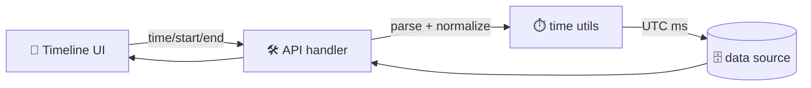

# ⏱️ Time Utilities

📁 **Path:** `api/src/utils/time`

Time is a **first-class feature** in KFM (timeline slider, time-series layers, and time-filtered queries). This folder centralizes the small, boring, *correct* helpers we reuse across the API so we don’t re-invent time parsing and range math in every endpoint.

> [!IMPORTANT]
> **Store + compute in UTC.** Only convert to a local timezone for display.

---

## 🎯 Why this exists

- 🧯 Prevents “off-by-one day” bugs and DST surprises  
- 🧩 Guarantees consistent input/output formats for API endpoints  
- 🧠 Keeps time math out of business logic (services/use cases)  
- 🧪 Makes temporal behavior deterministic and testable (especially in CI)

---

## 🧭 Golden rules

- ✅ **Internal representation:** epoch milliseconds (`number`) **or** ISO-8601 UTC (`...Z`)
- ✅ **Range semantics:** prefer **half-open** intervals `[start, end)` for querying & stepping
- ✅ **Parsing:** accept `unknown`, return validated primitives (or throw a typed error)
- ✅ **Formatting:** emit **canonical** ISO strings (stable for caching, logs, and diffs)
- ✅ **Durations:** keep units explicit (`*Ms`, `*Sec`, `*Min`, `*Hr`, `*Day`)
- ✅ **No magic time zones:** never assume server local time is meaningful

> [!CAUTION]
> Avoid “floating” local datetimes (strings without a timezone). They’re ambiguous during DST transitions.

---

## 🗂️ Folder map

```text
api/
└─ src/
   └─ utils/
      └─ time/                ⏱️
         ├─ README.md         📝  (you are here)
         ├─ index.ts          📦  re-exports (single import surface)
         ├─ parse*            🧩  request/query parsing helpers
         ├─ format*           🧩  stable output formatting helpers
         ├─ range*            🧩  clamp/normalize/step utilities
         └─ clock*            🧩  time source + test doubles
```

> [!TIP]
> Filenames can differ. What matters: **one job per file** + a clean `index` export.

---

## 🧾 Data contracts

### 🏷️ Naming conventions

Use suffixes to make units and semantics painfully obvious:

- `*Ms` = epoch milliseconds (UTC)  
  Examples: `createdAtMs`, `startMs`, `ttlMs`
- `*Iso` = ISO-8601 string  
  Examples: `timeIso`, `startIso`
- `*Date` = date-only string (`YYYY-MM-DD`)  
  Examples: `selectedDate`, `dayDate`

### 📐 Canonical formats

**ISO DateTime (UTC)**  
- Example: `2025-03-01T00:00:00.000Z`  
- Must end in `Z` (UTC)

**ISO Date (date-only)**  
- Example: `2025-03-01`  
- Interpreted as **start-of-day UTC** unless explicitly documented otherwise

---

## ✅ What belongs in this folder

✅ **Belongs here**
- Parsing incoming query params (`time`, `start`, `end`, `step`, `tz`)
- Normalizing and clamping date ranges
- Generating “ticks” / step sequences for timeline-style APIs
- Converting between epoch ms and ISO strings
- Safe helpers for “start/end of day” in UTC
- Monotonic timing helpers for performance measurement (optional)

🚫 **Does not belong here**
- DB queries (repository layer)
- Domain rules (services/use cases)
- UI formatting (frontend concerns), except stable API output formats

---

## 📦 Suggested public surface

Keep the surface area small and obvious. A typical `index.ts` might export:

- `parseInstant(...)` / `tryParseInstant(...)`
- `parseRange(...)` / `tryParseRange(...)`
- `formatIsoUtc(ms)`
- `toEpochMs(input)`
- `startOfDayUtc(msOrIsoDate)`
- `addMs(ms, deltaMs)`
- `clampRange(range, bounds)`
- `makeClock()` + `systemClock` + `frozenClock(...)` (for tests)

> [!NOTE]
> A useful pattern is to expose pairs:
> - `tryX()` → returns `{ ok: true, value } | { ok: false, error }`
> - `xOrThrow()` → throws a typed error for handlers/middleware to map into HTTP errors

---

## 🔌 API patterns

### 🧪 Query param conventions

When an endpoint is time-aware, prefer one of these:

1) **Single instant**
- `?time=2025-03-01T00:00:00Z`
- or `?time=2025-03-01` (date-only)

2) **Range**
- `?start=2025-03-01&end=2025-04-01`
- Treat as `[start, end)` (half-open)

3) **Range + step**
- `?start=2025-03-01&end=2025-06-01&step=1mo`
- Step is validated + normalized (no “magic strings” in services)

### 🧩 Example: parse + normalize at the boundary

```ts
import { parseRangeOrThrow, formatIsoUtc } from "@/utils/time";

const range = parseRangeOrThrow({
  start: req.query.start,
  end: req.query.end,
  // optional: default window if absent
  defaultWindow: "30d",
});

// range.startMs / range.endMs are UTC epoch ms
res.json({
  start: formatIsoUtc(range.startMs),
  end: formatIsoUtc(range.endMs),
});
```

> [!IMPORTANT]
> Parse + validate at the boundary (controllers/handlers), **not** deep inside services.

---

## 🧭 Timeline support

KFM’s timeline UI can be a slider (with tick marks) and sometimes datasets have **irregular instants** (e.g., satellite passes). The API commonly needs to:

- return the list of **available instants** for a dataset
- snap a requested time to the **nearest available** instant
- support stepping forward/back by cadence (daily/weekly/monthly) or by “available only” instants



### 🎯 Example: “snap to available instants”

```ts
import { snapToAvailableInstant } from "@/utils/time";

const requested = parseInstantOrThrow(req.query.time);
const snapped = snapToAvailableInstant(requested, availableInstantsMs);

// Optionally return both for transparency:
res.json({ requestedMs: requested, snappedMs: snapped });
```

---

## 🧪 Edge cases we test

Add unit tests for these (they break systems in production):

- ✅ Leap day (`2024-02-29`)
- ✅ Month boundaries (`Jan 31 + 1mo`)
- ✅ DST transitions (even if we compute in UTC, user input might not be)
- ✅ Range ordering (`start < end`)
- ✅ Empty or missing params (defaults behave as expected)
- ✅ Very large timestamps / far-future / far-past guardrails
- ✅ “Available instants” snapping for irregular datasets

---

## ⚡ Performance notes

- Use UTC epoch ms (`number`) for math (fast + simple).
- When measuring durations, prefer a **monotonic** clock (wall clock can jump).
- Avoid repeatedly parsing the same string inside loops—parse once, pass primitives.

---

## ✅ Contributing checklist

- [ ] New helper is **pure** and single-responsibility 🎯
- [ ] Names include units (`Ms`, `Iso`, `Days`, etc.) 🧾
- [ ] Export is added to `index.ts` 📦
- [ ] Tests include at least one tricky boundary 🧪
- [ ] This README stays accurate 📝

---

## ❓ FAQ

<details>
<summary>Why UTC-only internally?</summary>

UTC eliminates DST ambiguity and makes caching + database queries consistent across environments.

</details>

<details>
<summary>Should we accept epoch seconds?</summary>

Prefer epoch **milliseconds**. If you must accept seconds, convert immediately and name it `*Sec` at the boundary.

</details>

