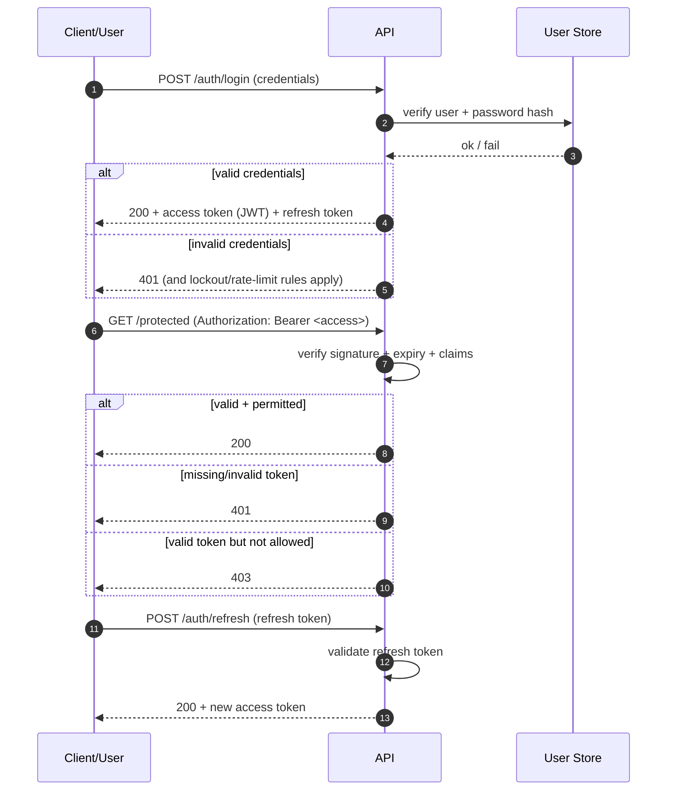

# 🔐 Auth Test Suite (`api/tests/auth`)

<p align="center">
  
  
  
  
</p>

> ✅ This folder is the **security safety net** for authentication + authorization behavior.  
> It exists to prevent regressions where **the wrong user can see the wrong data** or **sensitive actions become exposed**.

---

## 🎯 What this folder covers

Auth in KFM is more than “login works” — it’s **token verification, roles, and operational access levels** enforced consistently.

This test suite should cover:

- **JWT/session auth**: token issuance, signature validation, expiry behavior
- **Headers**: `Authorization: Bearer <token>` handling (missing, malformed, wrong scheme)
- **Password security**: hash verification (e.g., bcrypt/Argon2), reset tokens, complexity rules
- **Role-based access control (RBAC / ACL)**:
  - Farmer/User vs Researcher vs Admin behavior
  - Resource ownership checks (e.g., “my field” vs “someone else’s field”)
- **Operational Access Levels**:
  - “admin-only” endpoints (reload, delete, privileged maintenance actions)
- **Anti-abuse controls**:
  - login rate limiting / lockout logic
  - refresh token handling & invalidation
- **Service-to-service auth** (if applicable):
  - internal service tokens or internal network assumptions

---

## 🚀 Quickstart

> [!NOTE]
> Commands below assume **pytest**. If your repo uses wrappers (`make test`, `poetry run`, `uv run`, etc.), run those instead — but keep this folder runnable directly.

### Run only auth tests

```bash
pytest -q api/tests/auth
```

### Run with verbose output (helpful while developing)

```bash
pytest -svv api/tests/auth
```

### Run a single test file

```bash
pytest -q api/tests/auth/test_login.py
```

### Run a single test by name

```bash
pytest -q api/tests/auth -k "refresh"
```

---

## 🧪 Test tiers (how we keep CI fast + deterministic)

### ✅ Unit tests
- Pure logic: token encode/decode, permission checks, hash verification helpers
- **No DB**, **no network**, **no clocks you don’t control**
- Preferred for most rules

### 🔁 Integration tests
- Hit real HTTP routes with a test client (FastAPI `TestClient`, Flask client, etc.)
- Use a test DB container/fixture if needed
- Must be:
  - **marked**
  - **repeatable**
  - **isolated**

> [!TIP]
> If you follow the “integration marker” pattern, mark integration tests like:
>
> ```python
> import pytest
>
> @pytest.mark.integration
> def test_login_refresh_flow(client, db):
>     ...
> ```
>
> Then run:
>
> ```bash
> pytest -m integration api/tests/auth
> ```

---

## 🗂️ Folder layout (recommended)

```text
📦 api/
 └─ 🧪 tests/
    └─ 🔐 auth/
       ├─ 📄 README.md               ← you are here
       ├─ 🧩 conftest.py             ← shared fixtures (client, users, tokens)
       ├─ 🧪 test_login.py           ← login endpoint behavior
       ├─ 🧪 test_refresh.py         ← refresh token + session lifecycle
       ├─ 🧪 test_authorization.py   ← 401 vs 403, ownership, roles
       ├─ 🧪 test_admin_only.py      ← operational access level gates
       └─ 🧰 fixtures/               ← JSON payloads, test data builders, etc.
```

> [!IMPORTANT]
> Keep fixtures **minimal and explicit**. If a fixture becomes “magic”, auth regressions get harder to reason about.

---

## 🔁 Auth flows we validate (high level)



---

## 🧾 Scenario matrix (what we expect to never regress)

> Use this table as a checklist when adding endpoints or changing claim/role logic.

| Area | Example | Expectation | Why it matters |
|------|---------|-------------|----------------|
| Missing auth header | `GET /api/field/10/timeseries` | `401 Unauthorized` | Protects all private endpoints |
| Invalid/tampered JWT | same | `401 Unauthorized` | Signature validation must hold |
| Expired JWT | same | `401 Unauthorized` | Session expiry must be enforced |
| Valid JWT, wrong owner | user requests another farmer’s field | `403 Forbidden` | Ownership rules prevent leakage |
| Role escalation attempt | Farmer calls admin endpoint | `403 Forbidden` | Prevents privileged abuse |
| Admin-only endpoint | `POST /admin/reload-base-data` | Admin ✅ / non-admin ❌ | Operational access levels must gate |
| Login brute force | repeated wrong creds | lockout/rate-limit triggers | Stops guessing attacks |
| Refresh token replay | reuse old/invalid refresh token | rejected | Session integrity |

> [!TIP]
> Whenever you change an auth rule, add **both**:
> - a **positive path** test (allowed)
> - a **negative path** test (denied)

---

## 🧩 Fixtures & helpers (recommended patterns)

### Token header helper

```python
def auth_header(token: str) -> dict[str, str]:
    return {"Authorization": f"Bearer {token}"}
```

### Role fixtures (example)
- `farmer_user`
- `researcher_user`
- `admin_user`

### Determinism rules ✅
- Token signing secret in tests should be **fixed** (never use prod secrets)
- Freeze time (or inject a clock) for expiry tests
- Do not depend on external IdP availability in unit tests

---

## ⚖️ 401 vs 403 (a small detail that prevents big bugs)

> [!IMPORTANT]
> Getting these wrong creates real security confusion in the UI and can leak information.

- **401 Unauthorized** → “You are not authenticated” (missing/invalid/expired token)
- **403 Forbidden** → “You are authenticated but not permitted” (role/ownership denial)

---

## 🧰 Adding a new auth test (workflow)

1. **Pick the right level**
   - Unit test if you can
   - Integration only when endpoint wiring matters
2. **Name clearly**
   - `test_<action>_<condition>_<expected>()`
3. **Assert the contract**
   - status code
   - response shape
   - claims/roles handling
4. **Assert security posture**
   - ensure restricted data is not present in the payload
5. **Keep it readable**
   - Arrange → Act → Assert (AAA)
   - Minimal fixtures per test

---

## 🐛 Debugging tips

- Print response JSON:
  ```bash
  pytest -svv api/tests/auth -k "authorization"
  ```
- If using FastAPI, log dependency overrides in `conftest.py`
- If using DB-backed fixtures:
  - ensure each test runs in a transaction or resets state
  - avoid order-dependent tests

---

## 🤝 CI expectations (non-negotiables)

- ✅ All auth tests must be **repeatable**, **fast**, and **green**
- 🔒 No real credentials, API keys, or tokens committed (even “temporary”)
- 📜 When auth behavior changes, update:
  - the endpoint contract (OpenAPI/GraphQL) if applicable
  - the tests (this folder)
  - any docs that describe auth flows

---

## 📚 Related project docs (recommended reading)

- `docs/MASTER_GUIDE_v13.md` (repo-wide structure + CI gates)
- `docs/architecture/` (auth architecture decisions / ADRs if present)
- `src/server/contracts/` (API contracts; auth changes should match)

> 🧭 If you can’t find a doc for a security rule, consider that a signal to **create one** (or add an ADR). Security rules shouldn’t live only in code.
