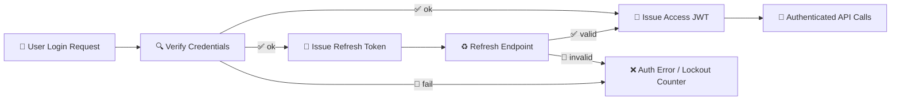

# 🔐 Auth Test Fixtures


This folder contains **static, deterministic fixture payloads** used by authentication/authorization tests (login, token refresh, RBAC, etc.). 🧪  
Keep fixtures **boring, predictable, and safe**.

> [!WARNING]
> **Never** store real credentials, private keys, live API tokens, or personal data in here. Use synthetic emails (e.g., `@example.test`) and placeholder secrets.

---

## 📦 What belongs here

✅ **Good candidates**
- Request payloads (e.g., `login.json`, `refresh.json`)
- Expected API responses (success + error shapes)
- User records / role profiles (admin, researcher, farmer/user)
- Token *claims templates* (recommended) rather than time-sensitive signed strings
- Edge-case inputs (missing fields, bad types, locked account, MFA required, etc.)

❌ **Not for this folder**
- Pytest fixture *functions* (`@pytest.fixture`) → those belong in `conftest.py` (usually `api/tests/auth/conftest.py`)
- Production secrets or real JWTs copied from any environment
- Large data dumps

---

## 🧭 Project alignment

KFM’s security model includes:
- **JWT-based session management** (signed JWT includes user id + roles), with **refresh tokens** to keep sessions alive without re-login. Tokens expire after a time window (example given: ~1 hour). [oai_citation:0‡Kansas Frontier Matrix (KFM) – Comprehensive Technical Documentation.pdf](file-service://file-Bro83fTiCi9UUVVno1fL6L)
- Password hashing via a strong algorithm (e.g., **bcrypt or Argon2**), plus password reset via emailed one-time token flows. [oai_citation:1‡Kansas Frontier Matrix (KFM) – Comprehensive Technical Documentation.pdf](file-service://file-Bro83fTiCi9UUVVno1fL6L)
- **Account lockout** after repeated failures, plus optional **MFA** (OTP via authenticator app or email) for sensitive accounts. [oai_citation:2‡Kansas Frontier Matrix (KFM) – Comprehensive Technical Documentation.pdf](file-service://file-Bro83fTiCi9UUVVno1fL6L)
- **Role/permission-based authorization** (admin/researcher/farmer-user), enforced by the backend on each request; APIs require valid tokens; security actions are audit-logged. [oai_citation:3‡Kansas Frontier Matrix (KFM) – Comprehensive Technical Documentation.pdf](file-service://file-Bro83fTiCi9UUVVno1fL6L)

This fixture set should support those scenarios directly (both ✅ happy paths and 🚨 failure modes). [oai_citation:4‡Kansas Frontier Matrix (KFM) – Comprehensive Technical Documentation.pdf](file-service://file-Bro83fTiCi9UUVVno1fL6L)

---

## 🗂️ Suggested fixture layout

> [!NOTE]
> If this folder is currently flat, that’s fine. Use the structure below as a target as fixtures grow.

```text
📁 api/
  📁 tests/
    📁 auth/
      📁 fixtures/
        📄 README.md  👈 you are here
        📁 requests/
        │  ├─ login.valid.json
        │  ├─ login.invalid_password.json
        │  ├─ refresh.valid.json
        │  └─ mfa.verify.valid.json
        📁 responses/
        │  ├─ login.success.json
        │  ├─ login.locked.json
        │  ├─ token.expired.json
        │  └─ forbidden.rbac.json
        📁 users/
        │  ├─ admin.json
        │  ├─ researcher.json
        │  └─ farmer.json
        📁 tokens/
           ├─ access.claims.admin.json
           ├─ access.claims.researcher.json
           └─ refresh.claims.json
```

KFM’s backend is structured with a clear `tests/` area and separation of responsibilities across layers, which fits well with keeping test data isolated and reusable. [oai_citation:5‡Kansas Frontier Matrix (KFM) – Comprehensive Technical Documentation.pdf](file-service://file-Bro83fTiCi9UUVVno1fL6L)

---

## 🧪 How tests should load fixtures

### Python helper pattern (recommended)
Keep test code clean by centralizing JSON reads:

```python
# api/tests/auth/_fixture_loader.py
from __future__ import annotations

import json
from pathlib import Path
from typing import Any

FIXTURES_DIR = Path(__file__).parent / "fixtures"

def load_json(rel_path: str) -> Any:
    path = FIXTURES_DIR / rel_path
    with path.open("r", encoding="utf-8") as f:
        return json.load(f)
```

Example usage:

```python
def test_login_success(client):
    payload = load_json("requests/login.valid.json")
    resp = client.post("/auth/login", json=payload)
    assert resp.status_code == 200
```

> [!TIP]
> If you use `pytest-flask`, the `client` fixture is provided automatically and looks for an `app` fixture you define. This is a common pattern for API endpoint tests. [oai_citation:6‡clean-architectures-in-python.pdf](file-service://file-1TQxhq5hmghD898tCZcdJu)

---

## 🧩 Fixture contracts

### 👤 `users/*.json`
A user fixture should be enough to:
- authenticate (via password flow),
- authorize (via role/permissions),
- model security state (locked, MFA-enabled, etc.).

Example:
```json
{
  "id": "user_admin_001",
  "email": "admin@example.test",
  "role": "admin",
  "password_hash": "$2b$12$REDACTED_FOR_README_EXAMPLE_ONLY",
  "mfa_enabled": true,
  "locked": false
}
```

> [!IMPORTANT]
> Store **hashed** passwords (bcrypt/Argon2 style) to mirror real behavior, but keep hashes **test-only** and non-sensitive. [oai_citation:7‡Kansas Frontier Matrix (KFM) – Comprehensive Technical Documentation.pdf](file-service://file-Bro83fTiCi9UUVVno1fL6L)

### 🎫 `tokens/*.json` (claims templates > raw tokens)
Prefer storing **claims templates** and signing them during tests with a **test signing key**:
- avoids time-based expiry flakes,
- allows explicit `exp/iat` control,
- keeps secrets out of git.

Example:
```json
{
  "sub": "user_admin_001",
  "roles": ["admin"],
  "scopes": ["*"],
  "aud": "kfm-api",
  "iss": "kfm-test"
}
```

This aligns with KFM’s JWT-based session approach and role-bearing tokens. [oai_citation:8‡Kansas Frontier Matrix (KFM) – Comprehensive Technical Documentation.pdf](file-service://file-Bro83fTiCi9UUVVno1fL6L)

---

## 🧑‍⚖️ RBAC matrix (fixtures should cover)

| Role | Expected access | Common fixture purpose |
|------|------------------|------------------------|
| `admin` | full system control | “can do everything” + audit logging checks |
| `researcher` | broad read access, limited admin operations | “can view most data, cannot manage system/users” |
| `farmer` / `user` | own-field + public data only | “cannot access other users’ private fields” |

These role expectations and permission checks are explicitly described in the KFM security section. [oai_citation:9‡Kansas Frontier Matrix (KFM) – Comprehensive Technical Documentation.pdf](file-service://file-Bro83fTiCi9UUVVno1fL6L)

---

## 🧨 Failure modes to fixture (minimum set)

- 🚫 invalid credentials
- ⏳ expired access token
- 🔁 invalid/expired refresh token
- 🧱 locked account after repeated failures
- 🔐 MFA required (challenge), MFA verified, MFA failed
- 🛑 forbidden due to role mismatch (RBAC)
- 🧾 audit log event emitted for security actions (login/logout/permission changes)

Lockout, MFA, and security-audit logging are part of the security design and should be covered by tests/fixtures. [oai_citation:10‡Kansas Frontier Matrix (KFM) – Comprehensive Technical Documentation.pdf](file-service://file-Bro83fTiCi9UUVVno1fL6L) [oai_citation:11‡Kansas Frontier Matrix (KFM) – Comprehensive Technical Documentation.pdf](file-service://file-Bro83fTiCi9UUVVno1fL6L)

---

## 🧠 Testing philosophy for auth (keep it debuggable)

Auth flows can span UI → API → DB → hashing → token issuing. If a single test covers all of that, failures become hard to diagnose. Prefer smaller, focused tests and mock/externalize what you’re not actively validating. [oai_citation:12‡clean-architectures-in-python.pdf](file-service://file-1TQxhq5hmghD898tCZcdJu)

Also: keep outputs deterministic whenever possible (avoid “now()”-based snapshots, random token ids without seeds, etc.). [oai_citation:13‡Scientific Method _ Research _ Master Coder Protocol Documentation.pdf](file-service://file-HTpax4QbDgguDwxwwyiS32)

---

## 🧾 Naming rules (simple + searchable)

- ✅ `kebab.or.dot` is fine, but be consistent (recommend: **dot sections + snake_case**)
- ✅ use **intent + state**:
  - `login.valid.json`
  - `login.missing_password.json`
  - `token.expired.json`
  - `rbac.forbidden.researcher_writes_admin.json`
- ✅ include the *why* in filename when it matters:
  - `refresh.denied.reuse_detected.json`

---

## ➕ Adding a new fixture checklist

- [ ] Uses `@example.test`-style emails (no real domains)
- [ ] No secrets, no real JWTs copied from anywhere
- [ ] Data is minimal but complete (only what the test needs)
- [ ] File name explains scenario + outcome
- [ ] Includes at least one negative case variant if adding a new feature path
- [ ] Deterministic: no timestamps unless pinned, no random IDs unless seeded [oai_citation:14‡Scientific Method _ Research _ Master Coder Protocol Documentation.pdf](file-service://file-HTpax4QbDgguDwxwwyiS32)
- [ ] If it’s security-sensitive (login/logout/permission changes), consider verifying an audit event fixture too [oai_citation:15‡Kansas Frontier Matrix (KFM) – Comprehensive Technical Documentation.pdf](file-service://file-Bro83fTiCi9UUVVno1fL6L)

---

## 🔁 Auth flow sketch



JWT + refresh flow is part of KFM’s intended session management model. [oai_citation:16‡Kansas Frontier Matrix (KFM) – Comprehensive Technical Documentation.pdf](file-service://file-Bro83fTiCi9UUVVno1fL6L)

---

## 📚 References used for alignment (project docs)

- KFM Security Systems & Protocols (JWT + refresh, hashing, lockout, MFA, RBAC, audit logging). [oai_citation:17‡Kansas Frontier Matrix (KFM) – Comprehensive Technical Documentation.pdf](file-service://file-Bro83fTiCi9UUVVno1fL6L)
- KFM layered structure includes a `tests/` area and emphasizes decoupled layers exchanging simple data structures. [oai_citation:18‡Kansas Frontier Matrix (KFM) – Comprehensive Technical Documentation.pdf](file-service://file-Bro83fTiCi9UUVVno1fL6L) [oai_citation:19‡Kansas Frontier Matrix (KFM) – Comprehensive Technical Documentation.pdf](file-service://file-Bro83fTiCi9UUVVno1fL6L)
- Testing discipline: keep tests focused; don’t turn every check into a mega integration test; keep determinism where possible. [oai_citation:20‡clean-architectures-in-python.pdf](file-service://file-1TQxhq5hmghD898tCZcdJu) [oai_citation:21‡Scientific Method _ Research _ Master Coder Protocol Documentation.pdf](file-service://file-HTpax4QbDgguDwxwwyiS32)
