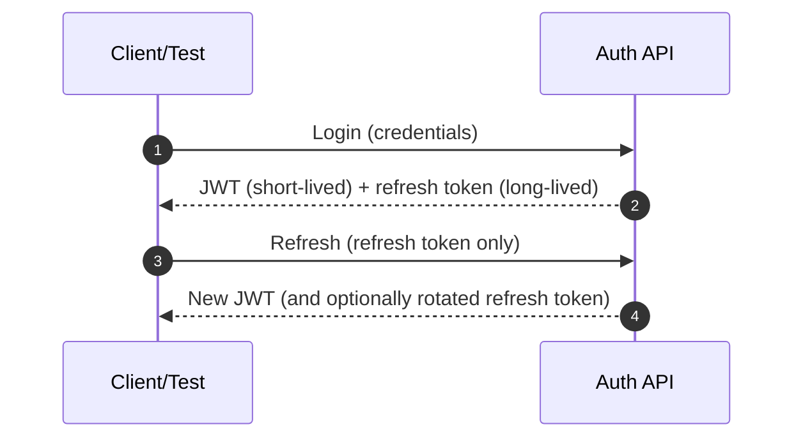

# 🔐 Auth Request Fixtures (API Tests)


📍 **Location:** `api/tests/auth/fixtures/requests/`  
🎯 **Purpose:** reusable **request payload fixtures** for authentication-related API tests (happy paths + negative/edge cases).

---

## 🧭 Why this folder exists

KFM is **contract-first**: schemas and API contracts are treated as first-class repo artifacts, and changes are expected to trigger compatibility checks. These request fixtures are a practical way to keep auth tests aligned to that contract and to make scenarios reproducible across runs. :contentReference[oaicite:0]{index=0}

KFM’s CI philosophy includes **API contract tests** (known inputs → expected responses), meaning fixtures like these are a key building block for predictable, repeatable tests. :contentReference[oaicite:1]{index=1}

---

## 🗂️ What belongs here (and what doesn’t)

### ✅ Belongs here
- JSON bodies (or request “envelopes”) used by tests to call auth endpoints:
  - Login / sign-in
  - Token refresh
  - Password reset request + confirm
  - MFA challenge (if enabled)
  - Validation/error cases (missing fields, malformed data, etc.)

KFM’s auth design explicitly includes JWT-based sessions, refresh token flows, password reset via one-time token, account lockout protections, and optional MFA for sensitive accounts. :contentReference[oaicite:2]{index=2}

### ❌ Does *not* belong here
- Real tokens, API keys, passwords, or production-like secrets  
- Real user PII (real emails, phone numbers, names, addresses)
- Response fixtures (put those in the sibling `responses/` folder *if your test suite uses one*)

> 🛡️ Reminder: KFM’s pipeline includes **secret scanning** and **PII/sensitive data checks** in CI—fixtures must stay clean or merges will get blocked. :contentReference[oaicite:3]{index=3}

---

## 📦 Recommended directory layout

> This is the **recommended** layout to keep fixtures discoverable. If the repo already uses a different pattern, keep consistency with the existing loader/utilities.

```text
📁 api/tests/auth/fixtures/requests/
├── 📄 README.md
├── 📁 login/
│   ├── ✅ valid.json
│   ├── ❌ invalid_password.json
│   ├── ❌ missing_username.json
│   └── ❌ missing_password.json
├── 📁 refresh/
│   ├── ✅ valid.json
│   └── ❌ invalid_refresh_token.json
├── 📁 password_reset/
│   ├── ✅ request_valid.json
│   ├── ✅ confirm_valid.json
│   ├── ❌ request_unknown_email.json
│   └── ❌ confirm_bad_token.json
└── 📁 mfa/  (optional)
    ├── ✅ valid_otp.json
    └── ❌ invalid_otp.json
```

---

## 🧾 Fixture format

### Option A: **Body-only JSON** (simplest ✅)
Use this when your test client already knows the endpoint/method and only needs a request body.

Example (login):

```json
{
  "username": "test.user@example.com",
  "password": "CorrectHorseBatteryStaple!"
}
```

### Option B: **Request “envelope” JSON** (more explicit)
Use this only if your fixture loader expects it.

```json
{
  "method": "POST",
  "path": "/auth/login",
  "json": {
    "username": "test.user@example.com",
    "password": "CorrectHorseBatteryStaple!"
  }
}
```

---

## 🧩 Auth flows these fixtures should support

KFM’s documented auth/security system includes:
- **JWT session management**
- **Refresh token mechanism** (long-lived refresh token used only at the refresh endpoint)
- **Password reset** via email + **one-time token**
- **Account lockout** after repeated failures
- Optional **MFA/OTP** for privileged accounts :contentReference[oaicite:4]{index=4}

### 🔁 Flow sketch



---

## 🧪 Example fixtures (copy/paste templates)

> Use **non-real** values. Keep them obviously synthetic.

### 1) Login — valid (`login/valid.json`)
```json
{
  "username": "test.user@example.com",
  "password": "CorrectHorseBatteryStaple!"
}
```

### 2) Login — missing password (`login/missing_password.json`)
```json
{
  "username": "test.user@example.com"
}
```

### 3) Refresh — valid (`refresh/valid.json`)
```json
{
  "refresh_token": "REFRESH_TOKEN_PLACEHOLDER"
}
```

### 4) Password reset request — valid (`password_reset/request_valid.json`)
```json
{
  "email": "test.user@example.com"
}
```

### 5) Password reset confirm — valid (`password_reset/confirm_valid.json`)
```json
{
  "reset_token": "RESET_TOKEN_PLACEHOLDER",
  "new_password": "NewCorrectHorseBatteryStaple!"
}
```

### 6) MFA — valid OTP (`mfa/valid_otp.json`)
```json
{
  "otp": "123456"
}
```

---

## 🧰 Using fixtures in tests (Python example)

> This example is intentionally generic. Adapt to your current test harness (`pytest`, `httpx`, FastAPI `TestClient`, etc.).

```python
import json
from pathlib import Path

FIXTURES_DIR = Path(__file__).resolve().parent / "fixtures" / "requests"

def load_request_fixture(*parts: str) -> dict:
    path = FIXTURES_DIR.joinpath(*parts)
    return json.loads(path.read_text(encoding="utf-8"))

def test_login_valid(client):
    payload = load_request_fixture("login", "valid.json")
    resp = client.post("/auth/login", json=payload)
    assert resp.status_code == 200
    # assert token shape, roles, expiry, etc.
```

---

## ✅ Naming conventions

Pick **one** convention and stick to it:

### Convention 1: Folder-per-flow (recommended)
- `login/valid.json`
- `login/missing_password.json`
- `refresh/invalid_refresh_token.json`

### Convention 2: Flat files with prefixes
- `login__valid.json`
- `login__missing_password.json`
- `refresh__invalid_refresh_token.json`

**Scenario keywords** (use consistently):
- `valid`, `invalid`, `missing_<field>`, `bad_format`, `unknown_email`, `bad_token`, `locked_out`, `rate_limited`

---

## 🛡️ Security & governance rules for fixtures

- **Never** commit real secrets (tokens, passwords, API keys).  
- Use placeholders like:
  - `JWT_PLACEHOLDER`
  - `REFRESH_TOKEN_PLACEHOLDER`
  - `RESET_TOKEN_PLACEHOLDER`
- Use clearly fake emails: `test.user@example.com`
- Keep data minimal + purpose-built (don’t “dump” full objects)

CI includes automated scans for secrets and PII/sensitive data—treat fixtures as “public” repo content. :contentReference[oaicite:5]{index=5}

---

## ➕ Adding a new fixture checklist

- [ ] Matches the current **API contract** (OpenAPI/Schema) for that endpoint :contentReference[oaicite:6]{index=6}
- [ ] Minimal fields only (tests should prove behavior, not carry excess noise)
- [ ] Deterministic values (stable + repeatable)
- [ ] No secrets / no real PII :contentReference[oaicite:7]{index=7}
- [ ] Has a corresponding test (or is referenced by an existing parameterized test)
- [ ] Negative-case fixtures clearly named (`missing_password`, `bad_token`, etc.)

---

## 📚 References (project docs)

- KFM auth includes JWT sessions, refresh token mechanism, password reset via one-time token, lockout controls, and optional MFA. :contentReference[oaicite:8]{index=8}
- KFM documentation emphasizes contract-first development and CI-backed API contract tests. :contentReference[oaicite:9]{index=9}:contentReference[oaicite:10]{index=10}
- KFM repo governance includes automated scanning for secrets and PII/sensitive content. :contentReference[oaicite:11]{index=11}

