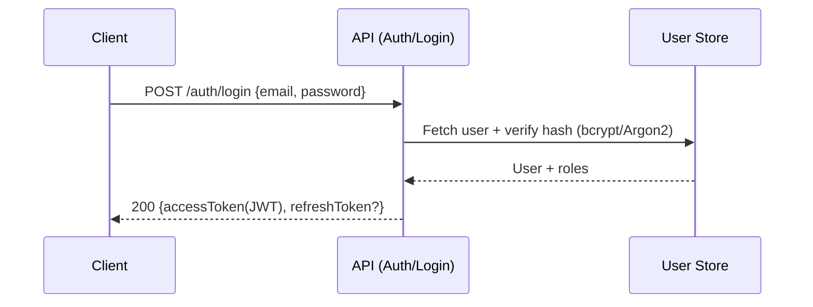

# 🔐 Login Request Fixtures


Request-body fixtures for **login/authentication** tests live in this folder. These files let tests stay **readable, repeatable, and contract-aligned** without re-creating payloads inline. 🧪

---

## 📘 Overview

### 🎯 Purpose
- Provide **canonical login request payloads** used across unit/integration tests.
- Keep payloads **stable** so test intent is obvious (e.g., “missing password”, “invalid email format”).
- Support **contract-first** development: fixtures should mirror the login endpoint’s request schema.

### ✅ Scope
| In scope ✅ | Out of scope ❌ |
|---|---|
| JSON request bodies for `POST /auth/login` (or equivalent route) | Response bodies (tokens, user objects) |
| Happy-path + validation + security edge cases | Production secrets / real credentials |
| MFA-related request variants (if implemented) | SSO/OAuth redirects (handled elsewhere) |

### 👥 Audience
- Backend/API devs implementing auth flows 🔧
- Test authors writing regression suites 🧪
- Reviewers verifying security behaviors 🔍

### 📚 Definitions
- **Fixture**: A versioned test artifact (usually JSON) that represents a scenario.
- **Contract-first**: The API schema/contract is the source of truth; fixtures conform to it.
- **JWT**: JSON Web Token used for authenticated requests after login.
- **MFA**: Multi-factor authentication (optional for privileged accounts).

---

## 🗂️ Folder Layout

Example layout (actual files may vary):

```text
📦 api/src/auth/tests/fixtures/requests/login/
├── README.md
├── valid.json
├── invalid-password.json
├── missing-email.json
├── missing-password.json
└── invalid-email-format.json
```

---

## 🧾 Login Request Contract

> 🧠 Keep this section aligned with the **actual** login request schema in your API contract (OpenAPI/JSON Schema). If the contract changes, update fixtures in the same PR.

### ✅ Expected shape (typical)

```json
{
  "email": "user@example.com",
  "password": "correct-horse-battery-staple",
  "mfaCode": "123456"
}
```

### Field rules (recommended defaults)
| Field | Required | Type | Notes |
|---|---:|---|---|
| `email` | ✅ | string | Prefer `example.com` domains; avoid real emails. |
| `password` | ✅ | string | Use synthetic values; never real passwords. |
| `mfaCode` | ⛔ | string | Only include if MFA is implemented/required for scenario. |

> If your implementation uses `username` instead of `email`, mirror your real contract (don’t invent fields in fixtures).

---

## 🧩 Fixture Catalog

Use **kebab-case** filenames and keep them scenario-focused:

| Scenario | Filename | Notes |
|---|---|---|
| Valid login | `valid.json` | Minimal required fields for success |
| Wrong password | `invalid-password.json` | Should return 401/403 depending on policy |
| Missing email | `missing-email.json` | Should return 400 (validation) |
| Missing password | `missing-password.json` | Should return 400 (validation) |
| Invalid email format | `invalid-email-format.json` | Should return 400 (validation) |
| MFA required | `mfa-required.json` | Include `mfaCode` only if needed |
| Brute-force pattern (optional) | `many-failed-attempts.json` | Useful for lockout/rate-limit tests (be careful with test isolation) |

---

## 🧪 Using These Fixtures in Tests

### Node/Jest/Vitest-style (example)

```ts
import request from "supertest";
import app from "../../../app";

import validLogin from "./valid.json";

it("logs in with valid credentials", async () => {
  const res = await request(app)
    .post("/auth/login")
    .send(validLogin)
    .expect(200);

  expect(res.body).toHaveProperty("accessToken");
});
```

<details>
  <summary>🐍 Python/pytest-style (example)</summary>

```python
import json
from pathlib import Path

def load_fixture(name: str) -> dict:
    p = Path(__file__).parent / name
    return json.loads(p.read_text())

def test_login_success(client):
    payload = load_fixture("valid.json")
    r = client.post("/auth/login", json=payload)
    assert r.status_code == 200
    assert "accessToken" in r.json()
```
</details>

---

## ➕ Adding a New Fixture

1. **Start from the smallest payload** that demonstrates the scenario.
2. Name it with **kebab-case** and a clear intent:
   - ✅ `invalid-email-format.json`
   - ✅ `missing-password.json`
   - ❌ `test1.json`, `bad.json`
3. Keep values **synthetic** (no real emails, no real passwords, no copied prod payloads).
4. Add/adjust tests to reference the new fixture.
5. Ensure fixtures remain **schema-valid** (unless the fixture is *intentionally* invalid).

---

## 🔒 Security & Privacy Notes

- ✅ Use **fake identities** only (e.g., `user@example.com`).
- ✅ Prefer **deterministic** credentials tied to seeded test users.
- ❌ Never store secrets, real passwords, refresh tokens, or production JWTs in fixtures.
- 🧯 If testing lockout/rate-limits, isolate state (reset between tests) to avoid flaky suites.

---

## 🔁 Login Flow Reference

<details>
  <summary>📌 Sequence (JWT + refresh token pattern)</summary>


</details>

---

## ✅ Definition of Done (for this folder)

- [x] README explains purpose + naming + usage
- [ ] All fixtures are named consistently (kebab-case)
- [ ] Fixtures contain only synthetic data (no secrets)
- [ ] Fixtures match the login request contract (except intentional-invalid cases)
- [ ] Tests reference fixtures (no duplicated inline payloads)
- [ ] Markdown renders cleanly in GitHub (headings, tables, code blocks)

---

