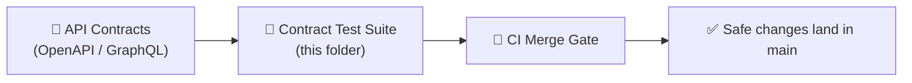

# 🧪📜 API Contract Tests


> ✅ This folder is the **provider-side safety net** for KFM’s *contract-first* API boundary.  
> If you change the API behavior, these tests should tell you whether you’ve preserved the contract — or introduced a breaking change.

---

## 🧭 What “contract tests” mean in KFM

Contract tests verify that a **running API** still matches the **published contract artifacts** (OpenAPI and/or GraphQL schema) and key behavioral guarantees:
- ✅ response shapes (fields, types, required/optional)
- ✅ status codes & error envelopes
- ✅ backwards-compatibility for stable endpoints
- ✅ redaction / authorization invariants at the boundary (no accidental leakage)

**Rule of thumb:** if a client relies on it, and it’s in the contract (or effectively treated as such), it belongs here.

---

## 🧱 How this fits the pipeline

KFM is organized around “boundary artifacts” and stable subsystem contracts. Contract tests are the API boundary’s enforcement layer.



---

## 📦 Where the API contracts live

Contracts are treated as **first-class repo artifacts** (contract-first). Typical homes:

- ✅ `src/server/contracts/` — OpenAPI YAML / GraphQL SDL (preferred canonical location)
- 🟡 `api/contracts/` or `api/spec/` — acceptable if this service is structured that way

> If you’re adding/changing endpoints, update the **contract artifact first**, then update/extend these tests.

---

## 🧪 What belongs here (and what does not)

### ✅ Belongs in `api/tests/contract/`
- Schema conformance checks (OpenAPI/GraphQL)
- Example-based verification (“known input → known output”)
- Compatibility checks for stable versions (`/v1/...`, persisted GraphQL fields)
- Error-contract checks:
  - 400 validation errors
  - 401/403 auth failures
  - 404 not found
  - 409 conflict / 422 domain rules (if used)

### 🚫 Does **not** belong here
- Pure unit tests (put in `api/tests/unit/`)
- Deep integration or data correctness tests (put in `api/tests/integration/`)
- UI flow tests (Cypress/Selenium live elsewhere)

---

## ⚡ Quick start (local)

### 1) Start the API (test or dev mode)
Use whatever this repo supports:
- 🐳 Docker Compose (common for KFM local stacks)
- 🐍 Direct run (FastAPI/uvicorn, etc.)
- 🧩 Test harness that runs the API with mocked/fixture data

### 2) Point tests at the running service
Set a base URL (name it to match your test harness):

```bash
export KFM_API_BASE_URL="http://localhost:8000"
```

### 3) Run contract tests

<details>
<summary><strong>🐍 Python / pytest style (common for FastAPI stacks)</strong></summary>

```bash
pytest api/tests/contract -q
# or, if markers are used:
pytest -m contract -q
```
</details>

<details>
<summary><strong>🟩 Node / Jest style (if this API is Node-based)</strong></summary>

```bash
npm run test:contract
# or
pnpm test:contract
```
</details>

<details>
<summary><strong>🐳 Containerized contract test run</strong></summary>

```bash
docker compose up --build api
docker compose run --rm api-tests-contract
```
</details>

> 💡 Tip: Contract tests should be able to run against **mocked/fixture data** so results are deterministic and repeatable.

---

## 🗂️ Suggested layout (keep it boring & predictable)

```text
📦 api/
└─ 🧪 tests/
   └─ 📜 contract/
      ├─ 📘 README.md                    ┃ this file
      ├─ ⚙️ config/                      ┃ base URL, auth helpers, toggles
      ├─ 🧩 fixtures/                    ┃ deterministic test data
      ├─ 📜 openapi/                     ┃ OpenAPI-driven tests (schema + examples)
      ├─ 🧬 graphql/                     ┃ GraphQL contract tests (queries + snapshots)
      ├─ 🧪 cases/                       ┃ endpoint-by-endpoint cases
      └─ 🛠️ helpers/                     ┃ shared clients, matchers, validators
```

> Your repo may not have all these folders yet — the goal is clarity, not ceremony.

---

## ✍️ Adding a new contract test (the “safe change” recipe)

### Step 0 — Decide: is this a **breaking change**?
Breaking changes require a version strategy (e.g., `/v2`), not a stealth edit.  
If you must break, create a **new versioned route** or negotiation plan and keep v1 stable.

### Step 1 — Update the contract artifact
- Update OpenAPI YAML or GraphQL schema first
- Add examples (preferred) and document new fields/behavior

### Step 2 — Add/extend tests in this folder
A good contract test typically asserts:
- status code
- response schema
- stable semantics (e.g., pagination fields, sort guarantees, error envelope)
- redaction/auth invariants when applicable

### Step 3 — Add fixtures (deterministic!)
- Prefer a small “fixture dataset” with known IDs and predictable outputs
- Avoid timestamps, random UUIDs, “latest record”, or flaky external dependencies

### Step 4 — Run locally + ensure CI parity
- If it only passes locally but fails in CI, you probably relied on an unstated dependency.

---

## 🧬 Patterns we encourage

### ✅ Given / When / Then structure
- **Given**: known fixture state
- **When**: request to API
- **Then**: stable outputs + schema conformance

### ✅ Validate the error envelope
Clients depend on consistent error formats. Test at least:
- missing/invalid parameter
- unauthorized
- forbidden
- not found

### ✅ Test “contractually significant” headers
If clients rely on them:
- pagination headers
- caching headers
- content-type / versioning headers

---

## 🛡️ Redaction & governance invariants (API boundary)

KFM’s API layer is responsible for enforcing policy at the boundary (not the UI).
Contract tests should include at least one “guardrail” test per sensitive surface:
- anonymization/redaction is applied when required
- privileged fields appear only for authorized roles
- “public” responses never contain restricted coordinates/identifiers

---

## ✅ PR checklist (keep merges green)

- [ ] Contract artifact updated first (OpenAPI/GraphQL)
- [ ] Contract tests updated/added for new behavior
- [ ] No breaking changes to existing versions **unless** a version bump strategy is implemented
- [ ] Fixtures are deterministic (no time/race/external calls)
- [ ] Tests run locally against a clean environment (docker/test stack)
- [ ] CI contract stage passes (tests + schema lint)

---

## 🧯 Troubleshooting

<details>
<summary><strong>❌ “Connection refused” / “Base URL not set”</strong></summary>

- Ensure API is running
- Confirm `KFM_API_BASE_URL` matches the API port
- If using Docker, ensure you’re using the right hostname (`localhost` vs service name)
</details>

<details>
<summary><strong>❌ “Schema mismatch” after an endpoint change</strong></summary>

- Confirm you updated the contract artifact (OpenAPI/GraphQL)
- If the change is breaking, implement versioning instead of mutating stable behavior
- Update tests only if the new behavior is intentionally contract-backed
</details>

<details>
<summary><strong>❌ “Flaky” tests</strong></summary>

- Remove reliance on current time / latest records
- Use fixtures with stable IDs
- Ensure deterministic sorting and stable pagination
</details>

---

## 🔗 Related docs (in-repo)

- 📘 Master Guide / contract-first principles: `docs/MASTER_GUIDE_v13.md`
- 🧩 API contract extension template: `docs/templates/TEMPLATE__API_CONTRACT_EXTENSION.md`
- 🧱 Architecture + canonical homes: `docs/architecture/`

---
