# ✅ GET `/v1/layers` — Happy Path (Contract Case)


> 🗺️ **Goal:** verify the **Layer Discovery** endpoint returns a **valid, non-empty, contract-compliant** set of map layers for the UI/clients (✅ “happy path”).

---

## 📌 Why this test exists

KFM’s frontend relies on a **discoverable “layer registry”** to populate map toggles, legends, and timeline controls (especially for time-indexed layers like NDVI/soil moisture/rainfall).  
This case ensures `/v1/layers` is:

- ✅ **reachable** (200 OK)
- ✅ **well-formed JSON**
- ✅ **contract compliant** (OpenAPI governs the shape)
- ✅ **provenance-aware** (layers must be traceable to catalog/source metadata)
- ✅ **safe to expose** (no sensitive fields leak; redactions applied when required)

---

## 🌐 Endpoint under test

| Item | Value |
|------|-------|
| Method | `GET` |
| Path | `/v1/layers` |
| Expected | `200 OK` |
| Response Content-Type | `application/json` |
| Auth | *Environment-dependent* (see below) |

---

## 🔐 Auth expectations

This is a **happy path** case, meaning:

- If your environment requires auth, the request must include a valid `Authorization: Bearer <token>`.
- If your environment is configured for public discovery, auth may be omitted.

> 🧠 Tip: if you get `401/403`, it’s not a “contract mismatch” — it’s usually missing/invalid auth config for the test runner.

---

## 📥 Request (example)

```bash
curl -sS \
  -H "Accept: application/json" \
  -H "Authorization: Bearer $KFM_TOKEN" \
  "$KFM_BASE_URL/v1/layers"
```

---

## 📤 Expected response contract (high level)

The **authoritative shape** is defined in the OpenAPI contract (see `src/server/contracts/` per project doc standards).  
This test case focuses on “happy path invariants” that should remain stable across implementations.

### ✅ Required invariants (what we assert)

- ✅ HTTP status is **200**
- ✅ Response is valid JSON
- ✅ Response contains a **non-empty** collection of layers
- ✅ Each layer has:
  - a **stable identifier** (`id`/`slug`/`key`-style field)
  - a **human title** (for UI toggles)
  - **spatial extent** metadata (bbox/extent)
  - **provenance/source** metadata (catalog/source reference)
- ✅ Ordering is **not** relied upon (clients/tests should treat list order as non-semantic)

---

## 🧾 Example payload shape (illustrative)

> ⚠️ This is *not* a canonical schema dump. It’s a **developer-friendly illustration** of the kinds of fields expected from KFM’s catalog-driven “layer registry”.

<details>
<summary>📦 Click to expand example JSON</summary>

```json
{
  "layers": [
    {
      "id": "ks_hillshade",
      "title": "Kansas Hillshade",
      "description": "Terrain hillshade for context and relief.",
      "kind": "raster",
      "extent": {
        "bbox": [-102.051744, 36.993016, -94.588413, 40.003166],
        "temporal": null
      },
      "provenance": {
        "source": "data/sources/ks_hillshade.json",
        "catalog": "data/stac/…",
        "license": "…",
        "attribution": "…"
      },
      "assets": {
        "tiles": {
          "href": "https://…/tiles/{z}/{x}/{y}.png"
        }
      },
      "tags": ["basemap", "terrain"]
    }
  ]
}
```

</details>

---

## 🧱 Fixtures and data dependencies

This contract case is designed to pass in environments where **catalog seed data** is present.

### Expected seed sources (typical)
- `data/sources/*.json` (source/provenance definitions)
- `data/stac/…` (STAC-like catalog/index for spatial + temporal discovery)

> ✅ If the layer registry is catalog-driven, make sure at least **one** baseline layer exists (e.g., a hillshade / boundaries / reference layer) so “non-empty list” is deterministic.

---

## 🧪 How to run (typical workflows)

Because contract runners differ by stack, use whichever entrypoint your repo provides, and **filter to this case folder**:

### Option A: Run full contract suite
```bash
# Example (adapt to your runner)
make test-contract
```

### Option B: Run only this case
```bash
# Example (adapt to your runner)
make test-contract CASE=GET__v1_layers__happy_path
```

### Option C: Direct runner execution
```bash
# Example (adapt to your runner)
./scripts/test-contract api/tests/contract/cases/GET__v1_layers__happy_path
```

---

## 🧯 Troubleshooting

| Symptom | Likely cause | Fix |
|--------|--------------|-----|
| `401 Unauthorized` / `403 Forbidden` | Auth required | Provide a valid token / configure test runner auth |
| `404 Not Found` | Wrong base URL or route not mounted | Verify the service version and routing config |
| `200 OK` but empty list | No seed catalog loaded | Seed `data/sources/` + `data/stac/` (or configure fixture loader) |
| JSON schema mismatch | Implementation drift vs OpenAPI | Update **contract first**, then implementation, then tests |
| Flaky results | Non-deterministic ordering | Sort layers by stable id in implementation OR ignore ordering in assertions |

---

## 🔄 Change management rules (contract-first)

When `/v1/layers` behavior changes:

1. 🧾 **Update OpenAPI** under `src/server/contracts/`
2. 🧱 Implement changes in the API service
3. ✅ Update/extend contract cases (including this one)
4. 🛡️ If fields are sensitive, add/update **redaction rules** (and add a dedicated security/negative case)

> 🧩 This aligns with the project’s “define the contract first” workflow for new/changed endpoints.

---

## 🔗 Related references

- 📘 **Kansas Frontier Matrix (KFM) – Comprehensive Technical Documentation** (API layer, REST design, geospatial serving patterns)
- 🗺️ **Kansas-Frontier-Matrix — Open-Source Geospatial Historical Mapping Hub Design** (STAC-like catalog + provenance-driven layers)
- 🧭 **MARKDOWN_GUIDE_v13** (contract-first + governance conventions)

---

## 🧠 Mini architecture sketch

```mermaid
sequenceDiagram
  autonumber
  participant UI as 🧑‍💻 Client/UI
  participant API as 🧩 KFM API (/v1)
  participant CAT as 🗂️ Catalog (STAC-like / sources)
  UI->>API: GET /v1/layers
  API->>CAT: Load/Query layer registry + metadata
  CAT-->>API: Layer list (bbox/time/provenance)
  API-->>UI: 200 JSON (contract-compliant)
```



---

## ✅ Definition of done (for this case)

- [ ] `/v1/layers` returns `200`
- [ ] JSON parses successfully
- [ ] Non-empty layer collection
- [ ] Each layer includes **stable id**, **title**, **extent**, **provenance/source**
- [ ] No sensitive fields leaked (if environment requires redaction)
- [ ] Matches OpenAPI contract

---

